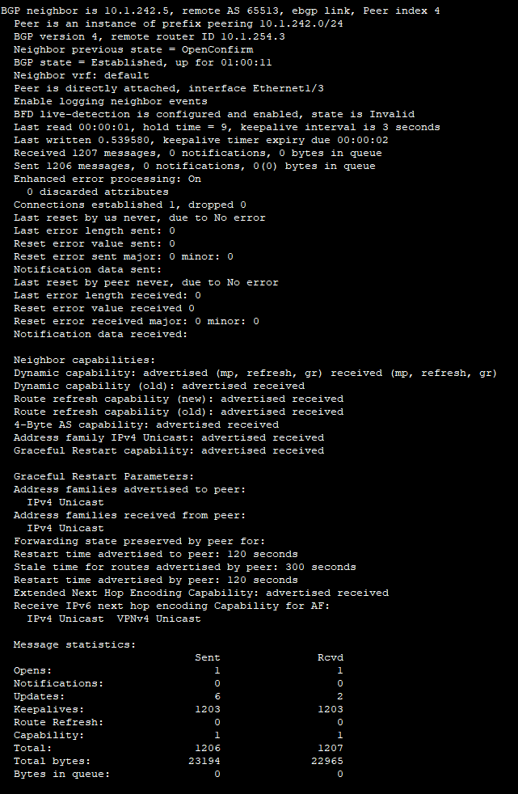
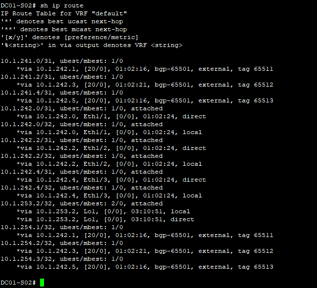

## **Underlay. BGP.**

### **Цель:**

 1) Настроить BGP для Underlay сети.
  
### **План:**
    
 1) Настроить eBGP в Underlay сети для IP-связности между всеми сетевыми устройствами;
 2) Зафиксировать в документации: адресное пространство, схему сети, конфигурацию устройств;
 3) Убедиться в наличии IP-связности между устройствами в BGP-домене.

 ### **Ход работы.**

1) **На устройствах выполнены следующие настройки:**
    * p2p-адресация;
    * loopback1 интерфейсы;
    * протокол BGP;
    * протокол BFD (из-за ограничений виртуализации сессии BFD не поднимаются).

2) **Документация.**

 **Адресное пространство:**

|    IP-подсеть     |      IP-адрес     |      Коммутатор     |     Интерфейс      |     Назначение     |
|:-----------------:|:-----------------:|:-------------------:|:------------------:|:------------------:|
| **10.1.241.0/31** |         -         |          -          |          -         |         P2P        |
|                   |    10.1.241.0     |      DC01-S01       |        E1/1        |          -         |
|                   |    10.1.241.1     |      DC01-L01       |        E1/7        |          -         |
| **10.1.241.2/31** |         -         |          -          |          -         |         P2P        |
|                   |    10.1.241.2     |      DC01-S01       |        E1/2        |          -         |
|                   |    10.1.241.3     |      DC01-L02       |        E1/7        |          -         |
| **10.1.241.4/31** |         -         |          -          |          -         |         P2P        |
|                   |    10.1.241.4     |      DC01-S01       |        E1/3        |          -         |
|                   |    10.1.241.5     |      DC01-L03       |        E1/7        |          -         |
| **10.1.242.0/31** |         -         |          -          |          -         |         P2P        |
|                   |    10.1.242.0     |      DC01-S02       |        E1/1        |          -         |
|                   |    10.1.242.1     |      DC01-L01       |        E1/8        |          -         |
| **10.1.242.2/31** |         -         |          -          |          -         |         P2P        |
|                   |    10.1.242.2     |      DC01-S02       |        E1/2        |          -         |
|                   |    10.1.242.3     |      DC01-L02       |        E1/8        |          -         |
| **10.1.242.4/31** |         -         |          -          |          -         |         P2P        |
|                   |    10.1.242.4     |      DC01-S02       |        E1/3        |          -         |
|                   |    10.1.242.5     |      DC01-L03       |        E1/8        |          -         |
| **10.1.253.1/32** |         -         |          -          |         -          |       Loopback     |
|                   |    10.1.253.1     |      DC01-S01       |        Lo1         |          -         |
| **10.1.253.2/32** |         -         |          -          |         -          |       Loopback     |
|                   |    10.1.253.2     |      DC01-S02       |        Lo1         |          -         |
| **10.1.254.1/32** |         -         |          -          |         -          |       Loopback     |
|                   |    10.1.254.1     |      DC01-L01       |        Lo1         |          -         |
| **10.1.254.2/32** |         -         |          -          |         -          |       Loopback     |
|                   |    10.1.254.2     |      DC01-L02       |        Lo1         |          -         |
| **10.1.254.3/32** |         -         |          -          |         -          |       Loopback     |
|                   |    10.1.254.3     |      DC01-L03       |        Lo1         |          -         |

**Номера автономных систем:**

|     Коммутатор     |         ASN        |
|:------------------:|:------------------:|
|      DC01-S01      |        65501       |
|      DC01-S02      |        65501       |
|      DC01-L01      |        65511       |
|      DC01-L02      |        65512       |
|      DC01-L03      |        65513       |

**Схема сети:**

**Конфигурация устройств:**

* [DC01-L01](attach/DC01-L01.conf)
* [DC01-L02](attach/DC01-L02.conf)
* [DC01-L03](attach/DC01-L03.conf)
* [DC01-S01](attach/DC01-S01.conf)
* [DC01-S02](attach/DC01-S02.conf)

3) **Проверка IP-связности между устройствами:**

 - проверка состояния BGP-соседства на DC01-L01, базы данных BGP, таблицы маршрутизации и запуск пинга на loopback-адреса других коммутаторов:

    
    
    
    
    

 - проверка состояния BGP-соседства на DC01-L02, базы данных BGP, таблицы маршрутизации и запуск пинга на loopback-адреса других коммутаторов:

    
    
    
    
    

 - проверка состояния BGP-соседства на DC01-L03, базы данных BGP, таблицы маршрутизации и запуск пинга на loopback-адреса других коммутаторов:

    
    
    
    
    

 - проверка состояния BGP-соседства на DC01-S01, базы данных BGP, таблицы маршрутизации и запуск пинга на loopback-адреса leaf-коммутаторов:

    
    
    
    
    
    

 - проверка состояния BGP-соседства на DC01-S02, базы данных BGP, таблицы маршрутизации и запуск пинга на loopback-адреса leaf-коммутаторов:

    
    
    
    
    
    

