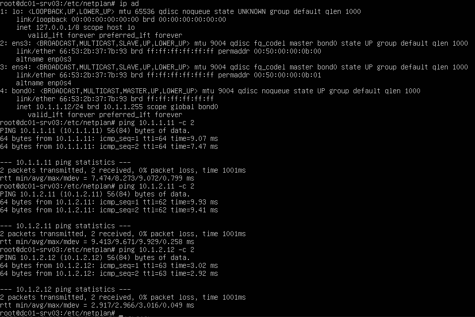

## **VXLAN. Multihoming.**

### **Цель:**

 1) Настроить отказоустойчивое подключение клиентов с использованием EVPN Multihoming.

 ### **План:**

1) Подключить двух клиентов двумя линками к различным Leaf.
2) Настроить агрегированный канал со стороны клиентов.
3) Настроить multihoming для работы в Overlay сети между двумя Leaf'ами (vPC).
4) Зафиксировать в документации - план работы, адресное пространство, схему сети, конфигурацию устройств.
5) Протестировать отказоустойчивость - убедиться, что связнность не теряется при отключении одного из линков.

### **Ход работы.**

1) **На устройствах выполнены следующие настройки:**
    
    - Spines:
        * p2p-адресация;
        * loopback1 интерфейсы;
        * протокол IS-IS (из настроек убран BFD, т.к. с ним IS-IS не поднимается из-за ограничения виртуализации);
        * протокол iBGP (Route Reflector);
        * протокол BFD (из-за ограничений виртуализации сессии BFD не поднимаются).
    
    - Leafs 1-4:
        * p2p-адресация;
        * loopback1 интерфейсы;
        * loopback2 интерфейсы;
        * протокол IS-IS (из настроек убран BFD, т.к. с ним IS-IS не поднимается из-за ограничения виртуализации);
        * протокол iBGP;
        * протокол BFD (из-за ограничений виртуализации сессии BFD не поднимаются);
        * VLAN;
        * L2VNI;
        * VRF;
        * SVI;
        * L3VNI;
        * Anycast Gateway;
    
    - Leafs 3-4:
        * secondary IP на loopback2;
        * vPC;
        * port-channel'ы в сторону серверов.

    - Servers:
        * агрегирование сетевых интерфейсов;
        * IP-адрес/маска;
        * шлюз по-умолчанию.

2) **Документация.**

 **Адресное пространство:**
|    IP-подсеть      |      IP-адрес     |      Устройство     |     Интерфейс      |     Назначение     |     VLAN      |     VNI     |
|:------------------:|:-----------------:|:-------------------:|:------------------:|:------------------:|:-------------:|:-----------:|
| **10.1.241.0/31**  |         -         |          -          |          -         |         P2P        |       -       |      -      |
|                    |    10.1.241.0     |      DC01-S01       |        E1/1        |          -         |       -       |      -      |
|                    |    10.1.241.1     |      DC01-L01       |        E1/7        |          -         |       -       |      -      |
| **10.1.241.2/31**  |         -         |          -          |          -         |         P2P        |       -       |      -      |
|                    |    10.1.241.2     |      DC01-S01       |        E1/2        |          -         |       -       |      -      |
|                    |    10.1.241.3     |      DC01-L02       |        E1/7        |          -         |       -       |      -      |
| **10.1.241.4/31**  |         -         |          -          |          -         |         P2P        |       -       |      -      |
|                    |    10.1.241.4     |      DC01-S01       |        E1/3        |          -         |       -       |      -      |
|                    |    10.1.241.5     |      DC01-L03       |        E1/7        |          -         |       -       |      -      |
| **10.1.241.6/31**  |         -         |          -          |          -         |         P2P        |       -       |      -      |
|                    |    10.1.241.6     |      DC01-S01       |        E1/4        |          -         |       -       |      -      |
|                    |    10.1.241.7     |      DC01-L04       |        E1/7        |          -         |       -       |      -      |
| **10.1.242.0/31**  |         -         |          -          |          -         |         P2P        |       -       |      -      |
|                    |    10.1.242.0     |      DC01-S02       |        E1/1        |          -         |       -       |      -      |
|                    |    10.1.242.1     |      DC01-L01       |        E1/8        |          -         |       -       |      -      |
| **10.1.242.2/31**  |         -         |          -          |          -         |         P2P        |       -       |      -      |
|                    |    10.1.242.2     |      DC01-S02       |        E1/2        |          -         |       -       |      -      |
|                    |    10.1.242.3     |      DC01-L02       |        E1/8        |          -         |       -       |      -      |
| **10.1.242.4/31**  |         -         |          -          |          -         |         P2P        |       -       |      -      |
|                    |    10.1.242.4     |      DC01-S02       |        E1/3        |          -         |       -       |      -      |
|                    |    10.1.242.5     |      DC01-L03       |        E1/8        |          -         |       -       |      -      |
| **10.1.242.6/31**  |         -         |          -          |          -         |         P2P        |       -       |      -      |
|                    |    10.1.242.6     |      DC01-S02       |        E1/4        |          -         |       -       |      -      |
|                    |    10.1.242.7     |      DC01-L04       |        E1/8        |          -         |       -       |      -      |
| **10.1.253.1/32**  |         -         |          -          |         -          |       Loopback     |       -       |      -      |
|                    |    10.1.253.1     |      DC01-S01       |        Lo1         |          -         |       -       |      -      |
| **10.1.253.2/32**  |         -         |          -          |         -          |       Loopback     |       -       |      -      |
|                    |    10.1.253.2     |      DC01-S02       |        Lo1         |          -         |       -       |      -      |
| **10.1.254.1/32**  |         -         |          -          |         -          |       Loopback     |       -       |      -      |
|                    |    10.1.254.1     |      DC01-L01       |        Lo1         |          -         |       -       |      -      |
| **10.1.254.2/32**  |         -         |          -          |         -          |       Loopback     |       -       |      -      |
|                    |    10.1.254.2     |      DC01-L02       |        Lo1         |          -         |       -       |      -      |
| **10.1.254.3/32**  |         -         |          -          |         -          |       Loopback     |       -       |      -      |
|                    |    10.1.254.3     |      DC01-L03       |        Lo1         |          -         |       -       |      -      |
| **10.1.254.4/32**  |         -         |          -          |         -          |       Loopback     |       -       |      -      |
|                    |    10.1.254.4     |      DC01-L04       |        Lo1         |          -         |       -       |      -      |
| **10.1.255.1/32**  |         -         |          -          |         -          |       Loopback     |       -       |      -      |
|                    |    10.1.255.1     |      DC01-L01       |        Lo2         |          -         |       -       |      -      |
| **10.1.255.2/32**  |         -         |          -          |         -          |       Loopback     |       -       |      -      |
|                    |    10.1.255.2     |      DC01-L02       |        Lo2         |          -         |       -       |      -      |
| **10.1.255.3/32**  |         -         |          -          |         -          |       Loopback     |       -       |      -      |
|                    |    10.1.255.3     |      DC01-L03       |        Lo2         |          -         |       -       |      -      |
| **10.1.255.4/32**  |         -         |          -          |         -          |       Loopback     |       -       |      -      |
|                    |    10.1.255.4     |      DC01-L04       |        Lo2         |          -         |       -       |      -      |
| **10.1.255.134/32**|         -         |          -          |         -          | Loopback secondary |       -       |      -      |
|                    |   10.1.255.134    |    DC01-L03-04      |        Lo2         |          -         |       -       |      -      |
|**192.168.255.0/24**|         -         |          -          |         -          |     Keep-Alive     |       -       |      -      |
|                    |   192.168.255.3   |      DC01-L03       |       E1/10        |          -         |       -       |      -      |
|                    |   192.168.255.4   |      DC01-L04       |       E1/10        |          -         |       -       |      -      |
|          -         |         -         |          -          |         -          |          -         |       -       |      -      |
|          -         |         -         |    DC01-L01-L04     |         -          |        L3VNI       |      100      |   5550100   |
|          -         |         -         |          -          |         -          |          -         |       -       |      -      |
|  **10.1.1.0/24**   |         -         |          -          |         -          |       Network      |      101      |   5550101   |
|                    |    10.1.1.1       |    DC01-L01-L04     |      Vlan101       |       Gateway      |       -       |      -      |
|                    |    10.1.1.11      |     DC01-SRV01      |      e0(ens3)      |          -         |       -       |      -      |
|                    |    10.1.1.12      |     DC01-SRV03      |    e0-e1(bond0)    |          -         |       -       |      -      |
|  **10.1.2.0/24**   |         -         |          -          |         -          |       Network      |      102      |   5550102   |
|                    |    10.1.2.1       |    DC01-L01-L04     |      Vlan102       |       Gateway      |       -       |      -      |
|                    |    10.1.2.11      |     DC01-SRV02      |      e0(ens3)      |          -         |       -       |      -      |
|                    |    10.1.2.12      |     DC01-SRV04      |    e0-e1(bond0)    |          -         |       -       |      -      |

**Схема сети:**

**Конфигурация устройств:**

* [DC01-L01](attach/DC01-L01.conf)
* [DC01-L02](attach/DC01-L02.conf)
* [DC01-L03](attach/DC01-L03.conf)
* [DC01-L04](attach/DC01-L04.conf)
* [DC01-S01](attach/DC01-S01.conf)
* [DC01-S02](attach/DC01-S02.conf)
    

3) **Проверка состояний коммутаторов:**

    - DC01-L01:

        
        
    - DC01-L02:

        
        
    - DC01-L03:

        

    - DC01-L04:

        
    
    - DC01-S01:

        
        

    - DC01-S02:

        
        

4) **Проверка L3-связности между серверами:**

     -  SRV01:

    

    -  SRV02:

    

    -  SRV03:

    

    -  SRV04:

    

5) **Проверка L3-связности между серверами при обрыве линка (выключение интерфейсов происходит на стороне сервера):**

    * DC01-SRV03:
 
        -- запуск ping'а с DC01-SRV01 на DC01-SRV03 с последующим выключением интерфейса ens3 на DC01-SRV03:

    

        -- MAC-таблицы на DC01-L03 и DC01-L04 до и после выключения интерфейса, а также состояние vPC после выключения интерфейса:

    

    

    * DC01-SRV04:
 
        - запуск ping'а с DC01-SRV01 на DC01-SRV04 с последующим выключением интерфейса ens4 на DC01-SRV04:

    

        - MAC-таблицы на DC01-L03 и DC01-L04 до и после выключения интерфейса, а также состояние vPC после выключения интерфейса:

    

    

    
