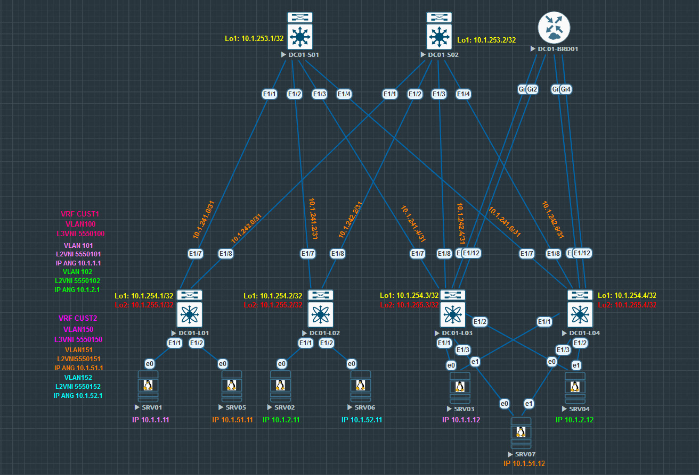
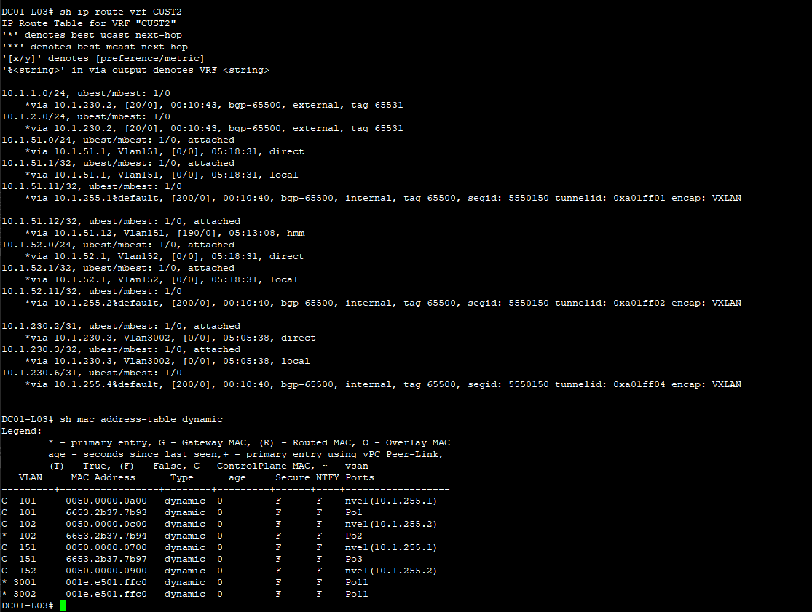
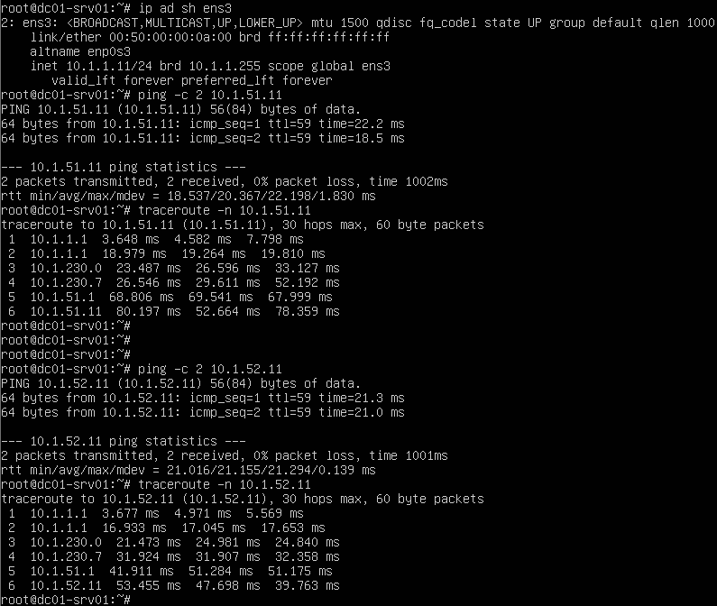

## **VxLAN. Routing.**

### **Цель:**

Реализовать маршрутизацию между "клиентами" через EVPN route-type 5.

 ### **План:**

1) Разместите двух-трёх "клиентов" в разных VRF в рамках одной фабрики.
2) Настроить маршрутизацию между клиентами через внешнее устройство.
3) Зафиксировать в документации - план работы, адресное пространство, схему сети, настройки сетевого оборудования.

### **Ход работы.**

1) **На устройствах выполнены следующие настройки:**
    
    - Spines:
        * p2p-адресация;
        * loopback1 интерфейсы;
        * протокол IS-IS (из настроек убран BFD, т.к. с ним IS-IS не поднимается из-за ограничения виртуализации);
        * протокол iBGP (Route Reflector);
        * протокол BFD (из-за ограничений виртуализации сессии BFD не поднимаются).
    
    - Leafs 1-4:
        * p2p-адресация;
        * loopback1 интерфейсы;
        * loopback2 интерфейсы;
        * протокол IS-IS (из настроек убран BFD, т.к. с ним IS-IS не поднимается из-за ограничения виртуализации);
        * протокол iBGP;
        * протокол BFD (из-за ограничений виртуализации сессии BFD не поднимаются);
        * VLAN;
        * L2VNI;
        * VRF;
        * SVI;
        * L3VNI;
        * Anycast Gateway.
            
    - Leafs 3-4:
        * ESI LAG;
        * port-channel'ы в сторону серверов и пограничного маршрутизатора;
        * протокол eBGP.

    - Border Router:
        * p2p-адресация;
        * loopback интерфейс;
        * port-channel'ы в сторону 3 и 4 leaf'ов;
        * протокол eBGP.

    - Servers (3, 4, 7):
        * агрегирование сетевых интерфейсов;
        * IP-адрес/маска;
        * шлюз по-умолчанию.

2) **Документация.**

 **Адресное пространство:**
|    IP-подсеть      |      IP-адрес     |      Устройство     |     Интерфейс      |     Назначение     |     VLAN      |     VNI     |     VRF     |
|:------------------:|:-----------------:|:-------------------:|:------------------:|:------------------:|:-------------:|:-----------:|:-----------:|
| **10.1.230.0/31**  |         -         |          -          |         -          |         P2P        |       -       |      -      |      -      |
|                    |    10.1.230.0     |     DC01-BDR01      |      Po1.3001      |          -         |     3001      |      -      |      -      |
|                    |    10.1.230.1     |      DC01-L03       |      Vlan3001      |          -         |     3001      |      -      |    CUST1    |
| **10.1.230.2/31**  |         -         |          -          |         -          |         P2P        |       -       |      -      |      -      |
|                    |    10.1.230.2     |     DC01-BDR01      |      Po1.3002      |          -         |     3002      |      -      |      -      |
|                    |    10.1.230.3     |      DC01-L03       |      Vlan3002      |          -         |     3002      |      -      |    CUST1    |
| **10.1.230.4/31**  |         -         |          -          |         -          |         P2P        |       -       |      -      |      -      |
|                    |    10.1.230.4     |     DC01-BDR01      |      Po1.3003      |          -         |     3003      |      -      |      -      |
|                    |    10.1.230.5     |      DC01-L04       |      Vlan3003      |          -         |     3003      |      -      |    CUST2    |
| **10.1.230.6/31**  |         -         |          -          |         -          |         P2P        |       -       |      -      |      -      |
|                    |    10.1.230.6     |     DC01-BDR01      |      Po1.3004      |          -         |     3004      |      -      |      -      |
|                    |    10.1.230.7     |      DC01-L04       |      Vlan3004      |          -         |     3004      |      -      |    CUST2    |
| **10.1.241.0/31**  |         -         |          -          |          -         |         P2P        |       -       |      -      |      -      |
|                    |    10.1.241.0     |      DC01-S01       |        E1/1        |          -         |       -       |      -      |      -      |
|                    |    10.1.241.1     |      DC01-L01       |        E1/7        |          -         |       -       |      -      |      -      |
| **10.1.241.2/31**  |         -         |          -          |          -         |         P2P        |       -       |      -      |      -      |
|                    |    10.1.241.2     |      DC01-S01       |        E1/2        |          -         |       -       |      -      |      -      |
|                    |    10.1.241.3     |      DC01-L02       |        E1/7        |          -         |       -       |      -      |      -      |
| **10.1.241.4/31**  |         -         |          -          |          -         |         P2P        |       -       |      -      |      -      |
|                    |    10.1.241.4     |      DC01-S01       |        E1/3        |          -         |       -       |      -      |      -      |
|                    |    10.1.241.5     |      DC01-L03       |        E1/7        |          -         |       -       |      -      |      -      |
| **10.1.241.6/31**  |         -         |          -          |          -         |         P2P        |       -       |      -      |      -      |
|                    |    10.1.241.6     |      DC01-S01       |        E1/4        |          -         |       -       |      -      |      -      |
|                    |    10.1.241.7     |      DC01-L04       |        E1/7        |          -         |       -       |      -      |      -      |
| **10.1.242.0/31**  |         -         |          -          |          -         |         P2P        |       -       |      -      |      -      |
|                    |    10.1.242.0     |      DC01-S02       |        E1/1        |          -         |       -       |      -      |      -      |
|                    |    10.1.242.1     |      DC01-L01       |        E1/8        |          -         |       -       |      -      |      -      |
| **10.1.242.2/31**  |         -         |          -          |          -         |         P2P        |       -       |      -      |      -      |
|                    |    10.1.242.2     |      DC01-S02       |        E1/2        |          -         |       -       |      -      |      -      |
|                    |    10.1.242.3     |      DC01-L02       |        E1/8        |          -         |       -       |      -      |      -      |
| **10.1.242.4/31**  |         -         |          -          |          -         |         P2P        |       -       |      -      |      -      |
|                    |    10.1.242.4     |      DC01-S02       |        E1/3        |          -         |       -       |      -      |      -      |
|                    |    10.1.242.5     |      DC01-L03       |        E1/8        |          -         |       -       |      -      |      -      |
| **10.1.242.6/31**  |         -         |          -          |          -         |         P2P        |       -       |      -      |      -      |
|                    |    10.1.242.6     |      DC01-S02       |        E1/4        |          -         |       -       |      -      |      -      |
|                    |    10.1.242.7     |      DC01-L04       |        E1/8        |          -         |       -       |      -      |      -      |
| **10.1.251.1/32**  |         -         |          -          |         -          |       Loopback     |       -       |      -      |      -      |
|                    |    10.1.251.1     |     DC01-BRD01      |        Lo0         |          -         |       -       |      -      |      -      |
| **10.1.253.1/32**  |         -         |          -          |         -          |       Loopback     |       -       |      -      |      -      |
|                    |    10.1.253.1     |      DC01-S01       |        Lo1         |          -         |       -       |      -      |      -      |
| **10.1.253.2/32**  |         -         |          -          |         -          |       Loopback     |       -       |      -      |      -      |
|                    |    10.1.253.2     |      DC01-S02       |        Lo1         |          -         |       -       |      -      |      -      |
| **10.1.254.1/32**  |         -         |          -          |         -          |       Loopback     |       -       |      -      |      -      |
|                    |    10.1.254.1     |      DC01-L01       |        Lo1         |          -         |       -       |      -      |      -      |
| **10.1.254.2/32**  |         -         |          -          |         -          |       Loopback     |       -       |      -      |      -      |
|                    |    10.1.254.2     |      DC01-L02       |        Lo1         |          -         |       -       |      -      |      -      |
| **10.1.254.3/32**  |         -         |          -          |         -          |       Loopback     |       -       |      -      |      -      |
|                    |    10.1.254.3     |      DC01-L03       |        Lo1         |          -         |       -       |      -      |      -      |
| **10.1.254.4/32**  |         -         |          -          |         -          |       Loopback     |       -       |      -      |      -      |
|                    |    10.1.254.4     |      DC01-L04       |        Lo1         |          -         |       -       |      -      |      -      |
| **10.1.255.1/32**  |         -         |          -          |         -          |       Loopback     |       -       |      -      |      -      |
|                    |    10.1.255.1     |      DC01-L01       |        Lo2         |          -         |       -       |      -      |      -      |
| **10.1.255.2/32**  |         -         |          -          |         -          |       Loopback     |       -       |      -      |      -      |
|                    |    10.1.255.2     |      DC01-L02       |        Lo2         |          -         |       -       |      -      |      -      |
| **10.1.255.3/32**  |         -         |          -          |         -          |       Loopback     |       -       |      -      |      -      |
|                    |    10.1.255.3     |      DC01-L03       |        Lo2         |          -         |       -       |      -      |      -      |
| **10.1.255.4/32**  |         -         |          -          |         -          |       Loopback     |       -       |      -      |      -      |
|                    |    10.1.255.4     |      DC01-L04       |        Lo2         |          -         |       -       |      -      |      -      |
|          -         |         -         |          -          |         -          |          -         |       -       |      -      |      -      |
|          -         |         -         |    DC01-L01-L04     |         -          |        L3VNI       |      100      |   5550100   |    CUST1    |
|          -         |         -         |          -          |         -          |          -         |       -       |      -      |      -      |
|          -         |         -         |          -          |         -          |          -         |       -       |      -      |      -      |
|          -         |         -         |    DC01-L01-L04     |         -          |        L3VNI       |      150      |   5550150   |    CUST2    |
|          -         |         -         |          -          |         -          |          -         |       -       |      -      |
|  **10.1.1.0/24**   |         -         |          -          |         -          |       Network      |      101      |   5550101   |      -      |
|                    |    10.1.1.1       |    DC01-L01-L04     |      Vlan101       |       Gateway      |       -       |      -      |    CUST1    |
|                    |    10.1.1.11      |     DC01-SRV01      |      e0(ens3)      |          -         |       -       |      -      |      -      |
|                    |    10.1.1.12      |     DC01-SRV03      |    e0-e1(bond0)    |          -         |       -       |      -      |      -      |
|  **10.1.2.0/24**   |         -         |          -          |         -          |       Network      |      102      |   5550102   |      -      |
|                    |    10.1.2.1       |    DC01-L01-L04     |      Vlan102       |       Gateway      |       -       |      -      |    CUST1    |
|                    |    10.1.2.11      |     DC01-SRV02      |      e0(ens3)      |          -         |       -       |      -      |      -      |
|                    |    10.1.2.12      |     DC01-SRV04      |    e0-e1(bond0)    |          -         |       -       |      -      |      -      |
| **10.1.51.0/24**   |         -         |          -          |         -          |       Network      |      151      |   5550151   |      -      |
|                    |    10.1.51.1      |    DC01-L01-L04     |      Vlan151       |       Gateway      |       -       |      -      |    CUST2    |
|                    |    10.1.51.11     |     DC01-SRV05      |      e0(ens3)      |          -         |       -       |      -      |      -      |
|                    |    10.1.51.12     |     DC01-SRV07      |    e0-e1(bond0)    |          -         |       -       |      -      |      -      |
| **10.1.52.0/24**   |         -         |          -          |         -          |       Network      |      152      |   5550152   |      -      |
|                    |    10.1.52.1      |    DC01-L01-L04     |      Vlan152       |       Gateway      |       -       |      -      |    CUST2    |
|                    |    10.1.52.12     |     DC01-SRV06      |      e0(ens3)      |          -         |       -       |      -      |      -      |

**Схема сети:**

**Конфигурация устройств:**

* [DC01-L01](attach/DC01-L01.conf)
* [DC01-L02](attach/DC01-L02.conf)
* [DC01-L03](attach/DC01-L03.conf)
* [DC01-L04](attach/DC01-L04.conf)
* [DC01-S01](attach/DC01-S01.conf)
* [DC01-S02](attach/DC01-S02.conf)
* [DC01-BRD01](attach/DC01-BRD01.conf)

3) **Проверка состояний коммутаторов и маршрутизатора.**

    - **DC01-L01:**

        
        
        
    - **DC01-L02:**

        
        

    - **DC01-L03:**

        
        

    - **DC01-L04:**

        
        
    
    - **DC01-BRD01:**

        
      

4) **Проверка L3-связности между серверами в разных VRF.**
    
    -  **SRV01:**
    
        
    
    -  **SRV07:**
    
        
       