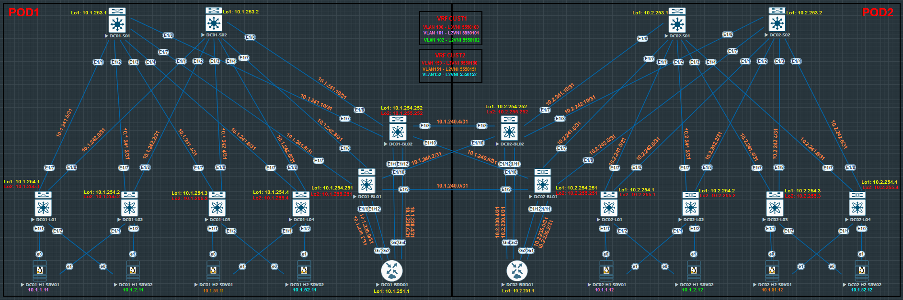

# Проектная работа
## Тема: "Построение фабрики VXLAN/EVPN для двух POD с использованием технологии Multi-Pod"

### **Цель:**

 - реализовать территориально распределённую сетевую инфраструктуру двух смежных холдингов в рамках двух ЦОД;
 - обеспеченить возможность миграции серверов как внутри, так и между локациями, без необходимости переконфигурирования сетевого стека;
 - обеспечить горизонтальное масштабирование сетевой инфраструктуры;
 - обеспечить отказоустойчое подключений серверов;
 - реализовать возможность маршрутизации между холдингами (для перимера взяты дае подсети для каждого).

### **План:**

 - разработка решения для построения отказоустойчивой и масштабируемой сетевой инфраструктуры;
 - проектирование адресного пространства Underlay и Overlay сетей;
 - построение топологии;
 - настройка коммутаторов и маршрутизаторов POD1;
 - настройка серверов POD1;
 - настройка коммутаторов и маршрутизаторов POD2;
 - настройка серверов POD2;
 - проверка работоспособности и отказоустойчивости топологии.

### **Ход работы.**

1) **На устройствах выполнены следующие настройки (POD1-2):**
    
    - **Spines:**
        * p2p-адресация;
        * loopback1 -интерфейсы;
        * протокол IS-IS (из настроек убран BFD, т.к. с ним IS-IS не поднимается из-за ограничения виртуализации);
        * протокол iBGP (Route Reflector);
        * протокол BFD (из-за ограничений виртуализации сессии BFD не поднимаются).
    
    - **Leafs:**
        * p2p-адресация;
        * loopback1 интерфейсы;
        * loopback2 интерфейсы;
        * протокол IS-IS (из настроек убран BFD, т.к. с ним IS-IS не поднимается из-за ограничения виртуализации);
        * протокол iBGP;
        * протокол BFD (из-за ограничений виртуализации сессии BFD не поднимаются);
        * VLAN;
        * L2VNI;
        * VRF;
        * SVI;
        * L3VNI;
        * Anycast Gateway;
        * ESI LAG.
            
    - **Border Leafs** (для связи между POD'ами):
        * p2p-адресация;
        * loopback1 интерфейсы;
        * loopback2 интерфейсы;
        * протокол IS-IS (из настроек убран BFD, т.к. с ним IS-IS не поднимается из-за ограничения виртуализации);
        * протокол iBGP (Route Reflector);
        * протокол BFD (из-за ограничений виртуализации сессии BFD не поднимаются);
        * VLAN;
        * L2VNI;
        * VRF;
        * SVI;
        * L3VNI;
        * Anycast Gateway;
        * port-channel'ы в сторону пограничных маршрутизаторов;
        * протокол eBGP.

    - **Border Routers** (для маршрутизации между VRF'ами):
        * p2p-адресация;
        * loopback интерфейс;
        * port-channel'ы в сторону border leaf'ов;
        * протокол eBGP.

    - **Servers:**
        * агрегирование сетевых интерфейсов;
        * IP-адрес/маска;
        * шлюз по-умолчанию. 

2) **Адресное пространство.**

<details>
<summary>POD1</summary>
                                                                       
|    IP-подсеть      |      IP-адрес     |      Устройство     |     Интерфейс      |     Назначение     |     VLAN      |     VNI     |     VRF     |
|:------------------:|:-----------------:|:-------------------:|:------------------:|:------------------:|:-------------:|:-----------:|:-----------:|
| **10.1.230.0/31**  |         -         |          -          |         -          |         P2P        |       -       |      -      |      -      |
|                    |    10.1.230.0     |     DC01-BDR01      |      Po1.3001      |          -         |     3001      |      -      |      -      |
|                    |    10.1.230.1     |     DC01-BL01       |      Vlan3001      |          -         |     3001      |      -      |    CUST1    |
| **10.1.230.2/31**  |         -         |          -          |         -          |         P2P        |       -       |      -      |      -      |
|                    |    10.1.230.2     |     DC01-BDR01      |      Po1.3002      |          -         |     3002      |      -      |      -      |
|                    |    10.1.230.3     |     DC01-BL01       |      Vlan3002      |          -         |     3002      |      -      |    CUST1    |
| **10.1.230.4/31**  |         -         |          -          |         -          |         P2P        |       -       |      -      |      -      |
|                    |    10.1.230.4     |     DC01-BDR01      |      Po1.3003      |          -         |     3003      |      -      |      -      |
|                    |    10.1.230.5     |     DC01-BL02       |      Vlan3003      |          -         |     3003      |      -      |    CUST2    |
| **10.1.230.6/31**  |         -         |          -          |         -          |         P2P        |       -       |      -      |      -      |
|                    |    10.1.230.6     |     DC01-BDR01      |      Po1.3004      |          -         |     3004      |      -      |      -      |
|                    |    10.1.230.7     |     DC01-BL02       |      Vlan3004      |          -         |     3004      |      -      |    CUST2    |
| **10.1.240.0/31**  |         -         |          -          |         -          |         P2P        |       -       |      -      |      -      |
|                    |    10.1.240.0     |     DC01-BL01       |        E1/9        |          -         |       -       |      -      |      -      |
|                    |    10.1.240.1     |     DC02-BL01       |        E1/9        |          -         |       -       |      -      |      -      |
| **10.1.240.2/31**  |         -         |          -          |         -          |         P2P        |       -       |      -      |      -      |
|                    |    10.1.240.2     |     DC01-BL01       |        E1/10       |          -         |       -       |      -      |      -      |
|                    |    10.1.240.3     |     DC02-BL02       |        E1/10       |          -         |       -       |      -      |      -      |
| **10.1.240.4/31**  |         -         |          -          |         -          |         P2P        |       -       |      -      |      -      |
|                    |    10.1.240.4     |     DC01-BL02       |        E1/9        |          -         |       -       |      -      |      -      |
|                    |    10.1.240.5     |     DC02-BL02       |        E1/9        |          -         |       -       |      -      |      -      |
| **10.1.240.6/31**  |         -         |          -          |         -          |         P2P        |       -       |      -      |      -      |
|                    |    10.1.240.6     |     DC01-BL02       |        E1/10       |          -         |       -       |      -      |      -      |
|                    |    10.1.240.7     |     DC02-BL01       |        E1/10       |          -         |       -       |      -      |      -      |
| **10.1.241.0/31**  |         -         |          -          |          -         |         P2P        |       -       |      -      |      -      |
|                    |    10.1.241.0     |      DC01-S01       |        E1/1        |          -         |       -       |      -      |      -      |
|                    |    10.1.241.1     |      DC01-L01       |        E1/7        |          -         |       -       |      -      |      -      |
| **10.1.241.2/31**  |         -         |          -          |          -         |         P2P        |       -       |      -      |      -      |
|                    |    10.1.241.2     |      DC01-S01       |        E1/2        |          -         |       -       |      -      |      -      |
|                    |    10.1.241.3     |      DC01-L02       |        E1/7        |          -         |       -       |      -      |      -      |
| **10.1.241.4/31**  |         -         |          -          |          -         |         P2P        |       -       |      -      |      -      |
|                    |    10.1.241.4     |      DC01-S01       |        E1/3        |          -         |       -       |      -      |      -      |
|                    |    10.1.241.5     |      DC01-L03       |        E1/7        |          -         |       -       |      -      |      -      |
| **10.1.241.6/31**  |         -         |          -          |          -         |         P2P        |       -       |      -      |      -      |
|                    |    10.1.241.6     |      DC01-S01       |        E1/4        |          -         |       -       |      -      |      -      |
|                    |    10.1.241.7     |      DC01-L04       |        E1/7        |          -         |       -       |      -      |      -      |
| **10.1.241.8/31**  |         -         |          -          |          -         |         P2P        |       -       |      -      |      -      |
|                    |    10.1.241.8     |      DC01-S01       |        E1/7        |          -         |       -       |      -      |      -      |
|                    |    10.1.241.9     |      DC01-BL01      |        E1/7        |          -         |       -       |      -      |      -      |
| **10.1.241.10/31** |         -         |          -          |          -         |         P2P        |       -       |      -      |      -      |
|                    |    10.1.241.10    |      DC01-S01       |        E1/8        |          -         |       -       |      -      |      -      |
|                    |    10.1.241.11    |      DC01-BL02      |        E1/7        |          -         |       -       |      -      |      -      |
| **10.1.242.0/31**  |         -         |          -          |          -         |         P2P        |       -       |      -      |      -      |
|                    |    10.1.242.0     |      DC01-S02       |        E1/1        |          -         |       -       |      -      |      -      |
|                    |    10.1.242.1     |      DC01-L01       |        E1/8        |          -         |       -       |      -      |      -      |
| **10.1.242.2/31**  |         -         |          -          |          -         |         P2P        |       -       |      -      |      -      |
|                    |    10.1.242.2     |      DC01-S02       |        E1/2        |          -         |       -       |      -      |      -      |
|                    |    10.1.242.3     |      DC01-L02       |        E1/8        |          -         |       -       |      -      |      -      |
| **10.1.242.4/31**  |         -         |          -          |          -         |         P2P        |       -       |      -      |      -      |
|                    |    10.1.242.4     |      DC01-S02       |        E1/3        |          -         |       -       |      -      |      -      |
|                    |    10.1.242.5     |      DC01-L03       |        E1/8        |          -         |       -       |      -      |      -      |
| **10.1.242.6/31**  |         -         |          -          |          -         |         P2P        |       -       |      -      |      -      |
|                    |    10.1.242.6     |      DC01-S02       |        E1/4        |          -         |       -       |      -      |      -      |
|                    |    10.1.242.7     |      DC01-L04       |        E1/8        |          -         |       -       |      -      |      -      |
| **10.1.242.8/31**  |         -         |          -          |          -         |         P2P        |       -       |      -      |      -      |
|                    |    10.1.242.8     |      DC01-S02       |        E1/7        |          -         |       -       |      -      |      -      |
|                    |    10.1.242.9     |      DC01-BL01      |        E1/8        |          -         |       -       |      -      |      -      |
| **10.1.242.10/31** |         -         |          -          |          -         |         P2P        |       -       |      -      |      -      |
|                    |    10.1.242.10    |      DC01-S02       |        E1/8        |          -         |       -       |      -      |      -      |
|                    |    10.1.242.11    |      DC01-BL02      |        E1/8        |          -         |       -       |      -      |      -      |
| **10.1.251.1/32**  |         -         |          -          |         -          |       Loopback     |       -       |      -      |      -      |
|                    |    10.1.251.1     |     DC01-BRD01      |        Lo0         |          -         |       -       |      -      |      -      |
| **10.1.253.1/32**  |         -         |          -          |         -          |       Loopback     |       -       |      -      |      -      |
|                    |    10.1.253.1     |      DC01-S01       |        Lo1         |          -         |       -       |      -      |      -      |
| **10.1.253.2/32**  |         -         |          -          |         -          |       Loopback     |       -       |      -      |      -      |
|                    |    10.1.253.2     |      DC01-S02       |        Lo1         |          -         |       -       |      -      |      -      |
| **10.1.254.1/32**  |         -         |          -          |         -          |       Loopback     |       -       |      -      |      -      |
|                    |    10.1.254.1     |      DC01-L01       |        Lo1         |          -         |       -       |      -      |      -      |
| **10.1.254.2/32**  |         -         |          -          |         -          |       Loopback     |       -       |      -      |      -      |
|                    |    10.1.254.2     |      DC01-L02       |        Lo1         |          -         |       -       |      -      |      -      |
| **10.1.254.3/32**  |         -         |          -          |         -          |       Loopback     |       -       |      -      |      -      |
|                    |    10.1.254.3     |      DC01-L03       |        Lo1         |          -         |       -       |      -      |      -      |
| **10.1.254.4/32**  |         -         |          -          |         -          |       Loopback     |       -       |      -      |      -      |
|                    |    10.1.254.4     |      DC01-L04       |        Lo1         |          -         |       -       |      -      |      -      |
| **10.1.254.251/32**|         -         |          -          |         -          |       Loopback     |       -       |      -      |      -      |
|                    |    10.1.254.251   |      DC01-BL01      |        Lo1         |          -         |       -       |      -      |      -      |
| **10.1.254.252/32**|         -         |          -          |         -          |       Loopback     |       -       |      -      |      -      |
|                    |    10.1.254.252   |      DC01-BL02      |        Lo1         |          -         |       -       |      -      |      -      |
| **10.1.255.1/32**  |         -         |          -          |         -          |       Loopback     |       -       |      -      |      -      |
|                    |    10.1.255.1     |      DC01-L01       |        Lo2         |          -         |       -       |      -      |      -      |
| **10.1.255.2/32**  |         -         |          -          |         -          |       Loopback     |       -       |      -      |      -      |
|                    |    10.1.255.2     |      DC01-L02       |        Lo2         |          -         |       -       |      -      |      -      |
| **10.1.255.3/32**  |         -         |          -          |         -          |       Loopback     |       -       |      -      |      -      |
|                    |    10.1.255.3     |      DC01-L03       |        Lo2         |          -         |       -       |      -      |      -      |
| **10.1.255.4/32**  |         -         |          -          |         -          |       Loopback     |       -       |      -      |      -      |
|                    |    10.1.255.4     |      DC01-L04       |        Lo2         |          -         |       -       |      -      |      -      |
| **10.1.255.251/32**|         -         |          -          |         -          |       Loopback     |       -       |      -      |      -      |
|                    |    10.1.255.251   |      DC01-BL01      |        Lo2         |          -         |       -       |      -      |      -      |
| **10.1.255.252/32**|         -         |          -          |         -          |       Loopback     |       -       |      -      |      -      |
|                    |    10.1.255.252   |      DC01-BL02      |        Lo2         |          -         |       -       |      -      |      -      |
|          -         |         -         |          -          |         -          |          -         |       -       |      -      |      -      |
|          -         |         -         | DC01-L01-04,BL01-02 |         -          |        L3VNI       |      100      |   5550100   |    CUST1    |
|          -         |         -         |          -          |         -          |          -         |       -       |      -      |      -      |
|          -         |         -         |          -          |         -          |          -         |       -       |      -      |      -      |
|          -         |         -         | DC01-L01-04,BL01-02 |         -          |        L3VNI       |      150      |   5550150   |    CUST2    |
|          -         |         -         |          -          |         -          |          -         |       -       |      -      |
|  **10.1.1.0/24**   |         -         |          -          |         -          |       Network      |      101      |   5550101   |      -      |
|                    |    10.1.1.1       | DC01-L01-04,BL01-02 |      Vlan101       |       Gateway      |       -       |      -      |    CUST1    |
|                    |    10.1.1.11      |    DC01-H1-SRV01    |    e0-e1(bond0)    |          -         |       -       |      -      |      -      |
|  **10.1.2.0/24**   |         -         |          -          |         -          |       Network      |      102      |   5550102   |      -      |
|                    |    10.1.2.1       | DC01-L01-04,BL01-02 |      Vlan102       |       Gateway      |       -       |      -      |    CUST1    |
|                    |    10.1.2.11      |    DC01-H1-SRV02    |    e0-e1(bond0)    |          -         |       -       |      -      |      -      |
| **10.1.51.0/24**   |         -         |          -          |         -          |       Network      |      151      |   5550151   |      -      |
|                    |    10.1.51.1      | DC01-L01-04,BL01-02 |      Vlan151       |       Gateway      |       -       |      -      |    CUST2    |
|                    |    10.1.51.11     |    DC01-H2-SRV01    |    e0-e1(bond0)    |          -         |       -       |      -      |      -      |
| **10.1.52.0/24**   |         -         |          -          |         -          |       Network      |      152      |   5550152   |      -      |
|                    |    10.1.52.1      | DC01-L01-04,BL01-02 |      Vlan152       |       Gateway      |       -       |      -      |    CUST2    |
|                    |    10.1.52.11     |    DC01-H2-SRV02    |    e0-e1(bond0)    |          -         |       -       |      -      |      -      |

</details>

<details>
<summary>POD2</summary>
                                                                       
|    IP-подсеть      |      IP-адрес     |      Устройство     |     Интерфейс      |     Назначение     |     VLAN      |     VNI     |     VRF     |
|:------------------:|:-----------------:|:-------------------:|:------------------:|:------------------:|:-------------:|:-----------:|:-----------:|
| **10.2.230.0/31**  |         -         |          -          |         -          |         P2P        |       -       |      -      |      -      |
|                    |    10.2.230.0     |     DC02-BDR01      |      Po1.3005      |          -         |     3005      |      -      |      -      |
|                    |    10.2.230.1     |     DC02-BL01       |      Vlan3005      |          -         |     3005      |      -      |    CUST1    |
| **10.2.230.2/31**  |         -         |          -          |         -          |         P2P        |       -       |      -      |      -      |
|                    |    10.2.230.2     |     DC02-BDR01      |      Po1.3006      |          -         |     3006      |      -      |      -      |
|                    |    10.2.230.3     |     DC02-BL01       |      Vlan3006      |          -         |     3006      |      -      |    CUST1    |
| **10.2.230.4/31**  |         -         |          -          |         -          |         P2P        |       -       |      -      |      -      |
|                    |    10.2.230.4     |     DC02-BDR01      |      Po1.3007      |          -         |     3007      |      -      |      -      |
|                    |    10.2.230.5     |     DC02-BL02       |      Vlan3007      |          -         |     3007      |      -      |    CUST2    |
| **10.2.230.6/31**  |         -         |          -          |         -          |         P2P        |       -       |      -      |      -      |
|                    |    10.2.230.6     |     DC02-BDR01      |      Po1.3008      |          -         |     3008      |      -      |      -      |
|                    |    10.2.230.7     |     DC02-BL02       |      Vlan3008      |          -         |     3008      |      -      |    CUST2    |
| **10.1.240.0/31**  |         -         |          -          |         -          |         P2P        |       -       |      -      |      -      |
|                    |    10.1.240.0     |     DC01-BL01       |        E1/9        |          -         |       -       |      -      |      -      |
|                    |    10.1.240.1     |     DC02-BL01       |        E1/9        |          -         |       -       |      -      |      -      |
| **10.1.240.2/31**  |         -         |          -          |         -          |         P2P        |       -       |      -      |      -      |
|                    |    10.1.240.2     |     DC01-BL01       |        E1/10       |          -         |       -       |      -      |      -      |
|                    |    10.1.240.3     |     DC02-BL02       |        E1/10       |          -         |       -       |      -      |      -      |
| **10.1.240.4/31**  |         -         |          -          |         -          |         P2P        |       -       |      -      |      -      |
|                    |    10.1.240.4     |     DC01-BL02       |        E1/9        |          -         |       -       |      -      |      -      |
|                    |    10.1.240.5     |     DC02-BL02       |        E1/9        |          -         |       -       |      -      |      -      |
| **10.1.240.6/31**  |         -         |          -          |         -          |         P2P        |       -       |      -      |      -      |
|                    |    10.1.240.6     |     DC01-BL02       |        E1/10       |          -         |       -       |      -      |      -      |
|                    |    10.1.240.7     |     DC02-BL01       |        E1/10       |          -         |       -       |      -      |      -      |
| **10.2.241.0/31**  |         -         |          -          |          -         |         P2P        |       -       |      -      |      -      |
|                    |    10.2.241.0     |      DC02-S01       |        E1/1        |          -         |       -       |      -      |      -      |
|                    |    10.2.241.1     |      DC02-L01       |        E1/7        |          -         |       -       |      -      |      -      |
| **10.2.241.2/31**  |         -         |          -          |          -         |         P2P        |       -       |      -      |      -      |
|                    |    10.2.241.2     |      DC02-S01       |        E1/2        |          -         |       -       |      -      |      -      |
|                    |    10.2.241.3     |      DC02-L02       |        E1/7        |          -         |       -       |      -      |      -      |
| **10.2.241.4/31**  |         -         |          -          |          -         |         P2P        |       -       |      -      |      -      |
|                    |    10.2.241.4     |      DC02-S01       |        E1/3        |          -         |       -       |      -      |      -      |
|                    |    10.2.241.5     |      DC02-L03       |        E1/7        |          -         |       -       |      -      |      -      |
| **10.2.241.6/31**  |         -         |          -          |          -         |         P2P        |       -       |      -      |      -      |
|                    |    10.2.241.6     |      DC02-S01       |        E1/4        |          -         |       -       |      -      |      -      |
|                    |    10.2.241.7     |      DC02-L04       |        E1/7        |          -         |       -       |      -      |      -      |
| **10.2.241.8/31**  |         -         |          -          |          -         |         P2P        |       -       |      -      |      -      |
|                    |    10.2.241.8     |      DC02-S01       |        E1/7        |          -         |       -       |      -      |      -      |
|                    |    10.2.241.9     |      DC02-BL01      |        E1/7        |          -         |       -       |      -      |      -      |
| **10.2.241.10/31** |         -         |          -          |          -         |         P2P        |       -       |      -      |      -      |
|                    |    10.2.241.10    |      DC02-S01       |        E1/8        |          -         |       -       |      -      |      -      |
|                    |    10.2.241.11    |      DC02-BL02      |        E1/7        |          -         |       -       |      -      |      -      |
| **10.2.242.0/31**  |         -         |          -          |          -         |         P2P        |       -       |      -      |      -      |
|                    |    10.2.242.0     |      DC02-S02       |        E1/1        |          -         |       -       |      -      |      -      |
|                    |    10.2.242.1     |      DC02-L01       |        E1/8        |          -         |       -       |      -      |      -      |
| **10.2.242.2/31**  |         -         |          -          |          -         |         P2P        |       -       |      -      |      -      |
|                    |    10.2.242.2     |      DC02-S02       |        E1/2        |          -         |       -       |      -      |      -      |
|                    |    10.2.242.3     |      DC02-L02       |        E1/8        |          -         |       -       |      -      |      -      |
| **10.2.242.4/31**  |         -         |          -          |          -         |         P2P        |       -       |      -      |      -      |
|                    |    10.2.242.4     |      DC02-S02       |        E1/3        |          -         |       -       |      -      |      -      |
|                    |    10.2.242.5     |      DC02-L03       |        E1/8        |          -         |       -       |      -      |      -      |
| **10.2.242.6/31**  |         -         |          -          |          -         |         P2P        |       -       |      -      |      -      |
|                    |    10.2.242.6     |      DC02-S02       |        E1/4        |          -         |       -       |      -      |      -      |
|                    |    10.2.242.7     |      DC02-L04       |        E1/8        |          -         |       -       |      -      |      -      |
| **10.2.242.8/31**  |         -         |          -          |          -         |         P2P        |       -       |      -      |      -      |
|                    |    10.2.242.8     |      DC02-S02       |        E1/7        |          -         |       -       |      -      |      -      |
|                    |    10.2.242.9     |      DC02-BL01      |        E1/8        |          -         |       -       |      -      |      -      |
| **10.2.242.10/31** |         -         |          -          |          -         |         P2P        |       -       |      -      |      -      |
|                    |    10.2.242.10    |      DC02-S02       |        E1/8        |          -         |       -       |      -      |      -      |
|                    |    10.2.242.11    |      DC02-BL02      |        E1/8        |          -         |       -       |      -      |      -      |
| **10.2.251.1/32**  |         -         |          -          |         -          |       Loopback     |       -       |      -      |      -      |
|                    |    10.2.251.1     |     DC02-BRD01      |        Lo0         |          -         |       -       |      -      |      -      |
| **10.2.253.1/32**  |         -         |          -          |         -          |       Loopback     |       -       |      -      |      -      |
|                    |    10.2.253.1     |      DC02-S01       |        Lo1         |          -         |       -       |      -      |      -      |
| **10.2.253.2/32**  |         -         |          -          |         -          |       Loopback     |       -       |      -      |      -      |
|                    |    10.2.253.2     |      DC02-S02       |        Lo1         |          -         |       -       |      -      |      -      |
| **10.2.254.1/32**  |         -         |          -          |         -          |       Loopback     |       -       |      -      |      -      |
|                    |    10.2.254.1     |      DC02-L01       |        Lo1         |          -         |       -       |      -      |      -      |
| **10.2.254.2/32**  |         -         |          -          |         -          |       Loopback     |       -       |      -      |      -      |
|                    |    10.2.254.2     |      DC02-L02       |        Lo1         |          -         |       -       |      -      |      -      |
| **10.2.254.3/32**  |         -         |          -          |         -          |       Loopback     |       -       |      -      |      -      |
|                    |    10.2.254.3     |      DC02-L03       |        Lo1         |          -         |       -       |      -      |      -      |
| **10.2.254.4/32**  |         -         |          -          |         -          |       Loopback     |       -       |      -      |      -      |
|                    |    10.2.254.4     |      DC02-L04       |        Lo1         |          -         |       -       |      -      |      -      |
| **10.2.254.251/32**|         -         |          -          |         -          |       Loopback     |       -       |      -      |      -      |
|                    |    10.2.254.251   |      DC02-BL01      |        Lo1         |          -         |       -       |      -      |      -      |
| **10.2.254.252/32**|         -         |          -          |         -          |       Loopback     |       -       |      -      |      -      |
|                    |    10.2.254.252   |      DC02-BL02      |        Lo1         |          -         |       -       |      -      |      -      |
| **10.2.255.1/32**  |         -         |          -          |         -          |       Loopback     |       -       |      -      |      -      |
|                    |    10.2.255.1     |      DC02-L01       |        Lo2         |          -         |       -       |      -      |      -      |
| **10.2.255.2/32**  |         -         |          -          |         -          |       Loopback     |       -       |      -      |      -      |
|                    |    10.2.255.2     |      DC02-L02       |        Lo2         |          -         |       -       |      -      |      -      |
| **10.2.255.3/32**  |         -         |          -          |         -          |       Loopback     |       -       |      -      |      -      |
|                    |    10.2.255.3     |      DC02-L03       |        Lo2         |          -         |       -       |      -      |      -      |
| **10.2.255.4/32**  |         -         |          -          |         -          |       Loopback     |       -       |      -      |      -      |
|                    |    10.2.255.4     |      DC02-L04       |        Lo2         |          -         |       -       |      -      |      -      |
| **10.2.255.251/32**|         -         |          -          |         -          |       Loopback     |       -       |      -      |      -      |
|                    |    10.2.255.251   |      DC02-BL01      |        Lo2         |          -         |       -       |      -      |      -      |
| **10.2.255.252/32**|         -         |          -          |         -          |       Loopback     |       -       |      -      |      -      |
|                    |    10.2.255.252   |      DC02-BL02      |        Lo2         |          -         |       -       |      -      |      -      |
|          -         |         -         |          -          |         -          |          -         |       -       |      -      |      -      |
|          -         |         -         | DC02-L01-04,BL01-02 |         -          |        L3VNI       |      100      |   5550100   |    CUST1    |
|          -         |         -         |          -          |         -          |          -         |       -       |      -      |      -      |
|          -         |         -         |          -          |         -          |          -         |       -       |      -      |      -      |
|          -         |         -         | DC02-L01-04,BL01-02 |         -          |        L3VNI       |      150      |   5550150   |    CUST2    |
|          -         |         -         |          -          |         -          |          -         |       -       |      -      |
|  **10.1.1.0/24**   |         -         |          -          |         -          |       Network      |      101      |   5550101   |      -      |
|                    |    10.1.1.1       | DC02-L01-04,BL01-02 |      Vlan101       |       Gateway      |       -       |      -      |    CUST1    |
|                    |    10.1.1.12      |    DC02H1-SRV01     |    e0-e1(bond0)    |          -         |       -       |      -      |      -      |
|  **10.1.2.0/24**   |         -         |          -          |         -          |       Network      |      102      |   5550102   |      -      |
|                    |    10.1.2.1       | DC02-L01-04,BL01-02 |      Vlan102       |       Gateway      |       -       |      -      |    CUST1    |
|                    |    10.1.2.12      |    DC02-H1-SRV02    |    e0-e1(bond0)    |          -         |       -       |      -      |      -      |
| **10.1.51.0/24**   |         -         |          -          |         -          |       Network      |      151      |   5550151   |      -      |
|                    |    10.1.51.1      | DC02-L01-04,BL01-02 |      Vlan151       |       Gateway      |       -       |      -      |    CUST2    |
|                    |    10.1.51.12     |    DC02-H2-SRV01    |    e0-e1(bond0)    |          -         |       -       |      -      |      -      |
| **10.1.52.0/24**   |         -         |          -          |         -          |       Network      |      152      |   5550152   |      -      |
|                    |    10.1.52.1      | DC02-L01-04,BL01-02 |      Vlan152       |       Gateway      |       -       |      -      |    CUST2    |
|                    |    10.1.52.12     |    DC02-H2-SRV02    |    e0-e1(bond0)    |          -         |       -       |      -      |      -      |

</details>

3) **Топология сети:**



4) **Конфигурация устройств:**

|               **POD1**                |                **POD2**               |
|:-------------------------------------:|:-------------------------------------:|
| [DC01-L01](configs/DC01-L01.conf)     | [DC02-L01](configs/DC02-L01.conf)     |
| [DC01-L02](configs/DC01-L02.conf)     | [DC02-L02](configs/DC02-L02.conf)     |
| [DC01-L03](configs/DC01-L03.conf)     | [DC02-L03](configs/DC02-L03.conf)     | 
| [DC01-L04](configs/DC01-L04.conf )    | [DC02-L04](configs/DC02-L04.conf)     |
| [DC01-BL01](configs/DC01-BL01.conf)   | [DC02-BL01](configs/DC02-BL01.conf)   | 
| [DC01-BL02](configs/DC01-BL02.conf)   | [DC02-BL02](configs/DC02-BL02.conf)   | 
| [DC01-S01](configs/DC01-S01.conf)     | [DC02-S01](configs/DC02-S01.conf)     |
| [DC01-S02](configs/DC01-S02.conf)     | [DC02-S02](configs/DC02-S02.conf)     |
| [DC01-BRD01](configs/DC01-BRD01.conf) | [DC02-BRD01](configs/DC02-BRD01.conf) |

5) **Проверка состояний устройств.**

**POD1:**

<details>
<summary>DC01-L01</summary>

```

DC01-L01# sh isis adjacency
IS-IS process: 1 VRF: default
IS-IS adjacency database:
Legend: '!': No AF level connectivity in given topology
System ID       SNPA            Level  State  Hold Time  Interface
DC01-S01        N/A             1      UP     00:00:27   Ethernet1/7
DC01-S02        N/A             1      UP     00:00:24   Ethernet1/8

DC01-L01# sh bgp l2vpn evpn summary
BGP summary information for VRF default, address family L2VPN EVPN
BGP router identifier 10.1.255.1, local AS number 65500
BGP table version is 2490, L2VPN EVPN config peers 2, capable peers 2
300 network entries and 580 paths using 83280 bytes of memory
BGP attribute entries [328/56416], BGP AS path entries [2/20]
BGP community entries [0/0], BGP clusterlist entries [22/152]

Neighbor        V    AS MsgRcvd MsgSent   TblVer  InQ OutQ Up/Down  State/PfxRcd
10.1.253.1      4 65500   49402   48508     2490    0    0    1d16h 182
10.1.253.2      4 65500   49412   48498     2490    0    0    1d16h 182
DC01-L01# sh nve peers
Interface Peer-IP                                 State LearnType Uptime   Router-Mac
--------- --------------------------------------  ----- --------- -------- -----------------
nve1      10.1.255.2                              Up    CP        1d16h    5002.0000.1b08
nve1      10.1.255.3                              Up    CP        1d16h    5003.0000.1b08
nve1      10.1.255.4                              Up    CP        1d16h    5006.0000.1b08
nve1      10.1.255.251                            Up    CP        1d16h    500f.0000.1b08
nve1      10.1.255.252                            Up    CP        1d16h    5010.0000.1b08
nve1      10.2.255.1                              Up    CP        1d16h    5012.0000.1b08
nve1      10.2.255.2                              Up    CP        1d16h    5013.0000.1b08
nve1      10.2.255.3                              Up    CP        1d16h    5014.0000.1b08
nve1      10.2.255.4                              Up    CP        1d16h    5015.0000.1b08
nve1      10.2.255.251                            Up    CP        1d16h    5016.0000.1b08
nve1      10.2.255.252                            Up    CP        1d16h    5017.0000.1b08

DC01-L01# sh l2route mac-ip all
Flags -(Rmac):Router MAC (Stt):Static (L):Local (R):Remote (V):vPC link
(Dup):Duplicate (Spl):Split (Rcv):Recv(D):Del Pending (S):Stale (C):Clear
(Ps):Peer Sync (Ro):Re-Originated (Orp):Orphan
Topology    Mac Address    Host IP                                 Prod   Flags         Seq No     Next-Hops
----------- -------------- --------------------------------------- ------ ---------- ---------- ---------------------------------------
101         6653.2b37.1101 10.1.1.11                               HMM    RO,           1         Local
101         6653.2b37.1101 10.1.1.11                               BGP    PS,           1         10.1.255.2 (Label: 5550101)
101         6653.2b37.1201 10.1.1.12                               BGP    --            0         10.2.255.1 (Label: 5550101)
                                            10.2.255.2 (Label: 5550101)
102         6653.2b37.1102 10.1.2.11                               HMM    L,            1         Local
102         6653.2b37.1202 10.1.2.12                               BGP    --            0         10.2.255.1 (Label: 5550102)
                                            10.2.255.2 (Label: 5550102)
151         6653.2b37.1103 10.1.51.11                              BGP    --            1         10.1.255.3 (Label: 5550151)
                                            10.1.255.4 (Label: 5550151)
151         6653.2b37.1203 10.1.51.12                              BGP    --            0         10.2.255.3 (Label: 5550151)
                                            10.2.255.4 (Label: 5550151)
152         6653.2b37.1104 10.1.52.11                              BGP    --            1         10.1.255.3 (Label: 5550152)
                                            10.1.255.4 (Label: 5550152)
152         6653.2b37.1204 10.1.52.12                              BGP    --            1         10.2.255.3 (Label: 5550152)
                                            10.2.255.4 (Label: 5550152)
DC01-L01# sh ip route vrf CUST1
IP Route Table for VRF "CUST1"
'*' denotes best ucast next-hop
'**' denotes best mcast next-hop
'[x/y]' denotes [preference/metric]
'%<string>' in via output denotes VRF <string>

10.1.1.0/24, ubest/mbest: 1/0, attached
    *via 10.1.1.1, Vlan101, [0/0], 1d21h, direct
10.1.1.1/32, ubest/mbest: 1/0, attached
    *via 10.1.1.1, Vlan101, [0/0], 1d21h, local
10.1.1.11/32, ubest/mbest: 1/0, attached
    *via 10.1.1.11, Vlan101, [190/0], 01:09:27, hmm
10.1.1.12/32, ubest/mbest: 1/0
    *via 10.2.255.1%default, [200/0], 00:55:28, bgp-65500, internal, tag 65500, segid: 5550100 tunnelid: 0xa02ff01 encap: VXLAN

10.1.2.0/24, ubest/mbest: 1/0, attached
    *via 10.1.2.1, Vlan102, [0/0], 1d21h, direct
10.1.2.1/32, ubest/mbest: 1/0, attached
    *via 10.1.2.1, Vlan102, [0/0], 1d21h, local
10.1.2.11/32, ubest/mbest: 1/0, attached
    *via 10.1.2.11, Vlan102, [190/0], 01:16:13, hmm
10.1.2.12/32, ubest/mbest: 1/0
    *via 10.2.255.1%default, [200/0], 00:20:29, bgp-65500, internal, tag 65500, segid: 5550100 tunnelid: 0xa02ff01 encap: VXLAN

10.1.51.0/24, ubest/mbest: 1/0
    *via 10.1.255.251%default, [200/0], 17:15:51, bgp-65500, internal, tag 65531, segid: 5550100 tunnelid: 0xa01fffb encap: VXLAN

10.1.52.0/24, ubest/mbest: 1/0
    *via 10.1.255.251%default, [200/0], 17:15:51, bgp-65500, internal, tag 65531, segid: 5550100 tunnelid: 0xa01fffb encap: VXLAN

10.1.230.0/31, ubest/mbest: 1/0
    *via 10.1.255.251%default, [200/0], 17:16:11, bgp-65500, internal, tag 65500, segid: 5550100 tunnelid: 0xa01fffb encap: VXLAN

10.1.230.4/31, ubest/mbest: 1/0
    *via 10.1.255.252%default, [200/0], 17:16:11, bgp-65500, internal, tag 65500, segid: 5550100 tunnelid: 0xa01fffc encap: VXLAN

10.2.230.0/31, ubest/mbest: 1/0
    *via 10.2.255.251%default, [200/0], 1d16h, bgp-65500, internal, tag 65500, segid: 5550100 tunnelid: 0xa02fffb encap: VXLAN

10.2.230.4/31, ubest/mbest: 1/0
    *via 10.2.255.252%default, [200/0], 08:56:08, bgp-65500, internal, tag 65500, segid: 5550100 tunnelid: 0xa02fffc encap: VXLAN


DC01-L01# sh ip route vrf CUST2
IP Route Table for VRF "CUST2"
'*' denotes best ucast next-hop
'**' denotes best mcast next-hop
'[x/y]' denotes [preference/metric]
'%<string>' in via output denotes VRF <string>

10.1.1.0/24, ubest/mbest: 1/0
    *via 10.1.255.251%default, [200/0], 17:15:54, bgp-65500, internal, tag 65531, segid: 5550150 tunnelid: 0xa01fffb encap: VXLAN

10.1.2.0/24, ubest/mbest: 1/0
    *via 10.1.255.251%default, [200/0], 17:15:54, bgp-65500, internal, tag 65531, segid: 5550150 tunnelid: 0xa01fffb encap: VXLAN

10.1.51.0/24, ubest/mbest: 1/0, attached
    *via 10.1.51.1, Vlan151, [0/0], 1d21h, direct
10.1.51.1/32, ubest/mbest: 1/0, attached
    *via 10.1.51.1, Vlan151, [0/0], 1d21h, local
10.1.51.11/32, ubest/mbest: 1/0
    *via 10.1.255.3%default, [200/0], 01:14:19, bgp-65500, internal, tag 65500, segid: 5550150 tunnelid: 0xa01ff03 encap: VXLAN

10.1.51.12/32, ubest/mbest: 1/0
    *via 10.2.255.3%default, [200/0], 00:16:23, bgp-65500, internal, tag 65500, segid: 5550150 tunnelid: 0xa02ff03 encap: VXLAN

10.1.52.0/24, ubest/mbest: 1/0, attached
    *via 10.1.52.1, Vlan152, [0/0], 1d21h, direct
10.1.52.1/32, ubest/mbest: 1/0, attached
    *via 10.1.52.1, Vlan152, [0/0], 1d21h, local
10.1.52.11/32, ubest/mbest: 1/0
    *via 10.1.255.3%default, [200/0], 01:07:32, bgp-65500, internal, tag 65500, segid: 5550150 tunnelid: 0xa01ff03 encap: VXLAN

10.1.52.12/32, ubest/mbest: 1/0
    *via 10.2.255.3%default, [200/0], 00:14:01, bgp-65500, internal, tag 65500, segid: 5550150 tunnelid: 0xa02ff03 encap: VXLAN

10.1.230.2/31, ubest/mbest: 1/0
    *via 10.1.255.251%default, [200/0], 17:16:14, bgp-65500, internal, tag 65500, segid: 5550150 tunnelid: 0xa01fffb encap: VXLAN

10.1.230.6/31, ubest/mbest: 1/0
    *via 10.1.255.252%default, [200/0], 17:16:14, bgp-65500, internal, tag 65500, segid: 5550150 tunnelid: 0xa01fffc encap: VXLAN

10.2.230.2/31, ubest/mbest: 1/0
    *via 10.2.255.251%default, [200/0], 1d16h, bgp-65500, internal, tag 65500, segid: 5550150 tunnelid: 0xa02fffb encap: VXLAN

10.2.230.6/31, ubest/mbest: 1/0
    *via 10.2.255.252%default, [200/0], 08:56:11, bgp-65500, internal, tag 65500, segid: 5550150 tunnelid: 0xa02fffc encap: VXLAN


DC01-L01#

```

</details>

<details>
<summary>DC01-L02</summary>

```

DC01-L02# sh isis adjacency
IS-IS process: 1 VRF: default
IS-IS adjacency database:
Legend: '!': No AF level connectivity in given topology
System ID       SNPA            Level  State  Hold Time  Interface
DC01-S01        N/A             1      UP     00:00:29   Ethernet1/7
DC01-S02        N/A             1      UP     00:00:30   Ethernet1/8

DC01-L02# sh bgp l2vpn evpn summary
BGP summary information for VRF default, address family L2VPN EVPN
BGP router identifier 10.1.255.2, local AS number 65500
BGP table version is 2440, L2VPN EVPN config peers 2, capable peers 2
301 network entries and 582 paths using 83524 bytes of memory
BGP attribute entries [330/56760], BGP AS path entries [2/20]
BGP community entries [0/0], BGP clusterlist entries [22/152]

Neighbor        V    AS MsgRcvd MsgSent   TblVer  InQ OutQ Up/Down  State/PfxRcd
10.1.253.1      4 65500   49496   48606     2440    0    0    1d16h 183
10.1.253.2      4 65500   49515   48607     2440    0    0    1d16h 183
DC01-L02# sh nve peers
Interface Peer-IP                                 State LearnType Uptime   Router-Mac
--------- --------------------------------------  ----- --------- -------- -----------------
nve1      10.1.255.1                              Up    CP        1d16h    5001.0000.1b08
nve1      10.1.255.3                              Up    CP        1d16h    5003.0000.1b08
nve1      10.1.255.4                              Up    CP        1d16h    5006.0000.1b08
nve1      10.1.255.251                            Up    CP        1d16h    500f.0000.1b08
nve1      10.1.255.252                            Up    CP        1d16h    5010.0000.1b08
nve1      10.2.255.1                              Up    CP        1d16h    5012.0000.1b08
nve1      10.2.255.2                              Up    CP        1d16h    5013.0000.1b08
nve1      10.2.255.3                              Up    CP        1d16h    5014.0000.1b08
nve1      10.2.255.4                              Up    CP        1d16h    5015.0000.1b08
nve1      10.2.255.251                            Up    CP        1d16h    5016.0000.1b08
nve1      10.2.255.252                            Up    CP        1d16h    5017.0000.1b08

DC01-L02# sh l2route mac-ip all
Flags -(Rmac):Router MAC (Stt):Static (L):Local (R):Remote (V):vPC link
(Dup):Duplicate (Spl):Split (Rcv):Recv(D):Del Pending (S):Stale (C):Clear
(Ps):Peer Sync (Ro):Re-Originated (Orp):Orphan
Topology    Mac Address    Host IP                                 Prod   Flags         Seq No     Next-Hops
----------- -------------- --------------------------------------- ------ ---------- ---------- ---------------------------------------
101         6653.2b37.1101 10.1.1.11                               HMM    L,            1         Local
101         6653.2b37.1201 10.1.1.12                               BGP    --            0         10.2.255.1 (Label: 5550101)
                                            10.2.255.2 (Label: 5550101)
102         6653.2b37.1102 10.1.2.11                               HMM    RO,           1         Local
102         6653.2b37.1102 10.1.2.11                               BGP    PS,           1         10.1.255.1 (Label: 5550102)
102         6653.2b37.1202 10.1.2.12                               BGP    --            0         10.2.255.1 (Label: 5550102)
                                            10.2.255.2 (Label: 5550102)
151         6653.2b37.1103 10.1.51.11                              BGP    --            1         10.1.255.3 (Label: 5550151)
                                            10.1.255.4 (Label: 5550151)
151         6653.2b37.1203 10.1.51.12                              BGP    --            0         10.2.255.3 (Label: 5550151)
                                            10.2.255.4 (Label: 5550151)
152         6653.2b37.1104 10.1.52.11                              BGP    --            1         10.1.255.3 (Label: 5550152)
                                            10.1.255.4 (Label: 5550152)
152         6653.2b37.1204 10.1.52.12                              BGP    --            1         10.2.255.3 (Label: 5550152)
                                            10.2.255.4 (Label: 5550152)
DC01-L02# sh ip route vrf CUST1
IP Route Table for VRF "CUST1"
'*' denotes best ucast next-hop
'**' denotes best mcast next-hop
'[x/y]' denotes [preference/metric]
'%<string>' in via output denotes VRF <string>

10.1.1.0/24, ubest/mbest: 1/0, attached
    *via 10.1.1.1, Vlan101, [0/0], 1d21h, direct
10.1.1.1/32, ubest/mbest: 1/0, attached
    *via 10.1.1.1, Vlan101, [0/0], 1d21h, local
10.1.1.11/32, ubest/mbest: 1/0, attached
    *via 10.1.1.11, Vlan101, [190/0], 01:15:54, hmm
10.1.1.12/32, ubest/mbest: 1/0
    *via 10.2.255.1%default, [200/0], 01:01:55, bgp-65500, internal, tag 65500, segid: 5550100 tunnelid: 0xa02ff01 encap: VXLAN

10.1.2.0/24, ubest/mbest: 1/0, attached
    *via 10.1.2.1, Vlan102, [0/0], 1d21h, direct
10.1.2.1/32, ubest/mbest: 1/0, attached
    *via 10.1.2.1, Vlan102, [0/0], 1d21h, local
10.1.2.11/32, ubest/mbest: 1/0, attached
    *via 10.1.2.11, Vlan102, [190/0], 01:22:39, hmm
10.1.2.12/32, ubest/mbest: 1/0
    *via 10.2.255.1%default, [200/0], 00:26:56, bgp-65500, internal, tag 65500, segid: 5550100 tunnelid: 0xa02ff01 encap: VXLAN

10.1.51.0/24, ubest/mbest: 1/0
    *via 10.1.255.251%default, [200/0], 17:22:18, bgp-65500, internal, tag 65531, segid: 5550100 tunnelid: 0xa01fffb encap: VXLAN

10.1.52.0/24, ubest/mbest: 1/0
    *via 10.1.255.251%default, [200/0], 17:22:18, bgp-65500, internal, tag 65531, segid: 5550100 tunnelid: 0xa01fffb encap: VXLAN

10.1.230.0/31, ubest/mbest: 1/0
    *via 10.1.255.251%default, [200/0], 17:22:38, bgp-65500, internal, tag 65500, segid: 5550100 tunnelid: 0xa01fffb encap: VXLAN

10.1.230.4/31, ubest/mbest: 1/0
    *via 10.1.255.252%default, [200/0], 17:22:38, bgp-65500, internal, tag 65500, segid: 5550100 tunnelid: 0xa01fffc encap: VXLAN

10.2.230.0/31, ubest/mbest: 1/0
    *via 10.2.255.251%default, [200/0], 1d16h, bgp-65500, internal, tag 65500, segid: 5550100 tunnelid: 0xa02fffb encap: VXLAN

10.2.230.4/31, ubest/mbest: 1/0
    *via 10.2.255.252%default, [200/0], 09:02:35, bgp-65500, internal, tag 65500, segid: 5550100 tunnelid: 0xa02fffc encap: VXLAN


DC01-L02# sh ip route vrf CUST2
IP Route Table for VRF "CUST2"
'*' denotes best ucast next-hop
'**' denotes best mcast next-hop
'[x/y]' denotes [preference/metric]
'%<string>' in via output denotes VRF <string>

10.1.1.0/24, ubest/mbest: 1/0
    *via 10.1.255.251%default, [200/0], 17:22:21, bgp-65500, internal, tag 65531, segid: 5550150 tunnelid: 0xa01fffb encap: VXLAN

10.1.2.0/24, ubest/mbest: 1/0
    *via 10.1.255.251%default, [200/0], 17:22:21, bgp-65500, internal, tag 65531, segid: 5550150 tunnelid: 0xa01fffb encap: VXLAN

10.1.51.0/24, ubest/mbest: 1/0, attached
    *via 10.1.51.1, Vlan151, [0/0], 1d21h, direct
10.1.51.1/32, ubest/mbest: 1/0, attached
    *via 10.1.51.1, Vlan151, [0/0], 1d21h, local
10.1.51.11/32, ubest/mbest: 1/0
    *via 10.1.255.3%default, [200/0], 01:20:46, bgp-65500, internal, tag 65500, segid: 5550150 tunnelid: 0xa01ff03 encap: VXLAN

10.1.51.12/32, ubest/mbest: 1/0
    *via 10.2.255.3%default, [200/0], 00:22:50, bgp-65500, internal, tag 65500, segid: 5550150 tunnelid: 0xa02ff03 encap: VXLAN

10.1.52.0/24, ubest/mbest: 1/0, attached
    *via 10.1.52.1, Vlan152, [0/0], 1d21h, direct
10.1.52.1/32, ubest/mbest: 1/0, attached
    *via 10.1.52.1, Vlan152, [0/0], 1d21h, local
10.1.52.11/32, ubest/mbest: 1/0
    *via 10.1.255.3%default, [200/0], 01:13:58, bgp-65500, internal, tag 65500, segid: 5550150 tunnelid: 0xa01ff03 encap: VXLAN

10.1.52.12/32, ubest/mbest: 1/0
    *via 10.2.255.3%default, [200/0], 00:20:28, bgp-65500, internal, tag 65500, segid: 5550150 tunnelid: 0xa02ff03 encap: VXLAN

10.1.230.2/31, ubest/mbest: 1/0
    *via 10.1.255.251%default, [200/0], 17:22:41, bgp-65500, internal, tag 65500, segid: 5550150 tunnelid: 0xa01fffb encap: VXLAN

10.1.230.6/31, ubest/mbest: 1/0
    *via 10.1.255.252%default, [200/0], 17:22:41, bgp-65500, internal, tag 65500, segid: 5550150 tunnelid: 0xa01fffc encap: VXLAN

10.2.230.2/31, ubest/mbest: 1/0
    *via 10.2.255.251%default, [200/0], 1d16h, bgp-65500, internal, tag 65500, segid: 5550150 tunnelid: 0xa02fffb encap: VXLAN

10.2.230.6/31, ubest/mbest: 1/0
    *via 10.2.255.252%default, [200/0], 09:02:38, bgp-65500, internal, tag 65500, segid: 5550150 tunnelid: 0xa02fffc encap: VXLAN


DC01-L02#

```

</details>

<details>
<summary>DC01-L03</summary>

```

DC01-L03# sh isis adjacency
IS-IS process: 1 VRF: default
IS-IS adjacency database:
Legend: '!': No AF level connectivity in given topology
System ID       SNPA            Level  State  Hold Time  Interface
DC01-S01        N/A             1      UP     00:00:26   Ethernet1/7
DC01-S02        N/A             1      UP     00:00:27   Ethernet1/8

DC01-L03# sh bgp l2vpn evpn summary
BGP summary information for VRF default, address family L2VPN EVPN
BGP router identifier 10.1.255.3, local AS number 65500
BGP table version is 2413, L2VPN EVPN config peers 2, capable peers 2
301 network entries and 582 paths using 83524 bytes of memory
BGP attribute entries [330/56760], BGP AS path entries [2/20]
BGP community entries [0/0], BGP clusterlist entries [22/152]

Neighbor        V    AS MsgRcvd MsgSent   TblVer  InQ OutQ Up/Down  State/PfxRcd
10.1.253.1      4 65500   49737   48818     2413    0    0    1d16h 183
10.1.253.2      4 65500   49746   48808     2413    0    0    1d16h 183
DC01-L03# sh nve peers
Interface Peer-IP                                 State LearnType Uptime   Router-Mac
--------- --------------------------------------  ----- --------- -------- -----------------
nve1      10.1.255.1                              Up    CP        1d16h    5001.0000.1b08
nve1      10.1.255.2                              Up    CP        1d16h    5002.0000.1b08
nve1      10.1.255.4                              Up    CP        1d16h    5006.0000.1b08
nve1      10.1.255.251                            Up    CP        1d16h    500f.0000.1b08
nve1      10.1.255.252                            Up    CP        1d16h    5010.0000.1b08
nve1      10.2.255.1                              Up    CP        1d16h    5012.0000.1b08
nve1      10.2.255.2                              Up    CP        1d16h    5013.0000.1b08
nve1      10.2.255.3                              Up    CP        1d16h    5014.0000.1b08
nve1      10.2.255.4                              Up    CP        1d16h    5015.0000.1b08
nve1      10.2.255.251                            Up    CP        1d16h    5016.0000.1b08
nve1      10.2.255.252                            Up    CP        1d16h    5017.0000.1b08

DC01-L03# sh l2route mac-ip all
Flags -(Rmac):Router MAC (Stt):Static (L):Local (R):Remote (V):vPC link
(Dup):Duplicate (Spl):Split (Rcv):Recv(D):Del Pending (S):Stale (C):Clear
(Ps):Peer Sync (Ro):Re-Originated (Orp):Orphan
Topology    Mac Address    Host IP                                 Prod   Flags         Seq No     Next-Hops
----------- -------------- --------------------------------------- ------ ---------- ---------- ---------------------------------------
101         6653.2b37.1101 10.1.1.11                               BGP    --            1         10.1.255.1 (Label: 5550101)
                                            10.1.255.2 (Label: 5550101)
101         6653.2b37.1201 10.1.1.12                               BGP    --            0         10.2.255.1 (Label: 5550101)
                                            10.2.255.2 (Label: 5550101)
102         6653.2b37.1102 10.1.2.11                               BGP    --            1         10.1.255.1 (Label: 5550102)
                                            10.1.255.2 (Label: 5550102)
102         6653.2b37.1202 10.1.2.12                               BGP    --            0         10.2.255.1 (Label: 5550102)
                                            10.2.255.2 (Label: 5550102)
151         6653.2b37.1103 10.1.51.11                              HMM    RO,           1         Local
151         6653.2b37.1103 10.1.51.11                              BGP    PS,           1         10.1.255.4 (Label: 5550151)
151         6653.2b37.1203 10.1.51.12                              BGP    --            0         10.2.255.3 (Label: 5550151)
                                            10.2.255.4 (Label: 5550151)
152         6653.2b37.1104 10.1.52.11                              HMM    L,            1         Local
152         6653.2b37.1204 10.1.52.12                              BGP    --            1         10.2.255.3 (Label: 5550152)
                                            10.2.255.4 (Label: 5550152)
DC01-L03# sh ip route vrf CUST1
IP Route Table for VRF "CUST1"
'*' denotes best ucast next-hop
'**' denotes best mcast next-hop
'[x/y]' denotes [preference/metric]
'%<string>' in via output denotes VRF <string>

10.1.1.0/24, ubest/mbest: 1/0, attached
    *via 10.1.1.1, Vlan101, [0/0], 1d21h, direct
10.1.1.1/32, ubest/mbest: 1/0, attached
    *via 10.1.1.1, Vlan101, [0/0], 1d21h, local
10.1.1.11/32, ubest/mbest: 1/0
    *via 10.1.255.1%default, [200/0], 01:24:47, bgp-65500, internal, tag 65500, segid: 5550100 tunnelid: 0xa01ff01 encap: VXLAN

10.1.1.12/32, ubest/mbest: 1/0
    *via 10.2.255.1%default, [200/0], 01:10:48, bgp-65500, internal, tag 65500, segid: 5550100 tunnelid: 0xa02ff01 encap: VXLAN

10.1.2.0/24, ubest/mbest: 1/0, attached
    *via 10.1.2.1, Vlan102, [0/0], 1d21h, direct
10.1.2.1/32, ubest/mbest: 1/0, attached
    *via 10.1.2.1, Vlan102, [0/0], 1d21h, local
10.1.2.11/32, ubest/mbest: 1/0
    *via 10.1.255.1%default, [200/0], 01:31:33, bgp-65500, internal, tag 65500, segid: 5550100 tunnelid: 0xa01ff01 encap: VXLAN

10.1.2.12/32, ubest/mbest: 1/0
    *via 10.2.255.1%default, [200/0], 00:35:49, bgp-65500, internal, tag 65500, segid: 5550100 tunnelid: 0xa02ff01 encap: VXLAN

10.1.51.0/24, ubest/mbest: 1/0
    *via 10.1.255.251%default, [200/0], 17:31:11, bgp-65500, internal, tag 65531, segid: 5550100 tunnelid: 0xa01fffb encap: VXLAN

10.1.52.0/24, ubest/mbest: 1/0
    *via 10.1.255.251%default, [200/0], 17:31:11, bgp-65500, internal, tag 65531, segid: 5550100 tunnelid: 0xa01fffb encap: VXLAN

10.1.230.0/31, ubest/mbest: 1/0
    *via 10.1.255.251%default, [200/0], 17:31:31, bgp-65500, internal, tag 65500, segid: 5550100 tunnelid: 0xa01fffb encap: VXLAN

10.1.230.4/31, ubest/mbest: 1/0
    *via 10.1.255.252%default, [200/0], 17:31:31, bgp-65500, internal, tag 65500, segid: 5550100 tunnelid: 0xa01fffc encap: VXLAN

10.2.230.0/31, ubest/mbest: 1/0
    *via 10.2.255.251%default, [200/0], 1d16h, bgp-65500, internal, tag 65500, segid: 5550100 tunnelid: 0xa02fffb encap: VXLAN

10.2.230.4/31, ubest/mbest: 1/0
    *via 10.2.255.252%default, [200/0], 09:11:28, bgp-65500, internal, tag 65500, segid: 5550100 tunnelid: 0xa02fffc encap: VXLAN


DC01-L03# sh ip route vrf CUST2
IP Route Table for VRF "CUST2"
'*' denotes best ucast next-hop
'**' denotes best mcast next-hop
'[x/y]' denotes [preference/metric]
'%<string>' in via output denotes VRF <string>

10.1.1.0/24, ubest/mbest: 1/0
    *via 10.1.255.251%default, [200/0], 17:31:14, bgp-65500, internal, tag 65531, segid: 5550150 tunnelid: 0xa01fffb encap: VXLAN

10.1.2.0/24, ubest/mbest: 1/0
    *via 10.1.255.251%default, [200/0], 17:31:14, bgp-65500, internal, tag 65531, segid: 5550150 tunnelid: 0xa01fffb encap: VXLAN

10.1.51.0/24, ubest/mbest: 1/0, attached
    *via 10.1.51.1, Vlan151, [0/0], 1d21h, direct
10.1.51.1/32, ubest/mbest: 1/0, attached
    *via 10.1.51.1, Vlan151, [0/0], 1d21h, local
10.1.51.11/32, ubest/mbest: 1/0, attached
    *via 10.1.51.11, Vlan151, [190/0], 01:29:38, hmm
10.1.51.12/32, ubest/mbest: 1/0
    *via 10.2.255.3%default, [200/0], 00:31:43, bgp-65500, internal, tag 65500, segid: 5550150 tunnelid: 0xa02ff03 encap: VXLAN

10.1.52.0/24, ubest/mbest: 1/0, attached
    *via 10.1.52.1, Vlan152, [0/0], 1d21h, direct
10.1.52.1/32, ubest/mbest: 1/0, attached
    *via 10.1.52.1, Vlan152, [0/0], 1d21h, local
10.1.52.11/32, ubest/mbest: 1/0, attached
    *via 10.1.52.11, Vlan152, [190/0], 01:22:52, hmm
10.1.52.12/32, ubest/mbest: 1/0
    *via 10.2.255.3%default, [200/0], 00:29:21, bgp-65500, internal, tag 65500, segid: 5550150 tunnelid: 0xa02ff03 encap: VXLAN

10.1.230.2/31, ubest/mbest: 1/0
    *via 10.1.255.251%default, [200/0], 17:31:34, bgp-65500, internal, tag 65500, segid: 5550150 tunnelid: 0xa01fffb encap: VXLAN

10.1.230.6/31, ubest/mbest: 1/0
    *via 10.1.255.252%default, [200/0], 17:31:34, bgp-65500, internal, tag 65500, segid: 5550150 tunnelid: 0xa01fffc encap: VXLAN

10.2.230.2/31, ubest/mbest: 1/0
    *via 10.2.255.251%default, [200/0], 1d16h, bgp-65500, internal, tag 65500, segid: 5550150 tunnelid: 0xa02fffb encap: VXLAN

10.2.230.6/31, ubest/mbest: 1/0
    *via 10.2.255.252%default, [200/0], 09:11:31, bgp-65500, internal, tag 65500, segid: 5550150 tunnelid: 0xa02fffc encap: VXLAN


DC01-L03#

```

</details>

<details>
<summary>DC01-L04</summary>

```

DC01-L04# sh isis adjacency
IS-IS process: 1 VRF: default
IS-IS adjacency database:
Legend: '!': No AF level connectivity in given topology
System ID       SNPA            Level  State  Hold Time  Interface
DC01-S01        N/A             1      UP     00:00:28   Ethernet1/7
DC01-S02        N/A             1      UP     00:00:25   Ethernet1/8

DC01-L04# sh bgp l2vpn evpn summary
BGP summary information for VRF default, address family L2VPN EVPN
BGP router identifier 10.1.255.4, local AS number 65500
BGP table version is 2480, L2VPN EVPN config peers 2, capable peers 2
300 network entries and 580 paths using 83280 bytes of memory
BGP attribute entries [328/56416], BGP AS path entries [2/20]
BGP community entries [0/0], BGP clusterlist entries [22/152]

Neighbor        V    AS MsgRcvd MsgSent   TblVer  InQ OutQ Up/Down  State/PfxRcd
10.1.253.1      4 65500   49770   48844     2480    0    0    1d16h 182
10.1.253.2      4 65500   49775   48834     2480    0    0    1d16h 182
DC01-L04# sh nve peers
Interface Peer-IP                                 State LearnType Uptime   Router-Mac
--------- --------------------------------------  ----- --------- -------- -----------------
nve1      10.1.255.1                              Up    CP        1d16h    5001.0000.1b08
nve1      10.1.255.2                              Up    CP        1d16h    5002.0000.1b08
nve1      10.1.255.3                              Up    CP        1d16h    5003.0000.1b08
nve1      10.1.255.251                            Up    CP        1d16h    500f.0000.1b08
nve1      10.1.255.252                            Up    CP        1d16h    5010.0000.1b08
nve1      10.2.255.1                              Up    CP        1d16h    5012.0000.1b08
nve1      10.2.255.2                              Up    CP        1d16h    5013.0000.1b08
nve1      10.2.255.3                              Up    CP        1d16h    5014.0000.1b08
nve1      10.2.255.4                              Up    CP        1d16h    5015.0000.1b08
nve1      10.2.255.251                            Up    CP        1d16h    5016.0000.1b08
nve1      10.2.255.252                            Up    CP        1d16h    5017.0000.1b08

DC01-L04# sh l2route mac-ip all
Flags -(Rmac):Router MAC (Stt):Static (L):Local (R):Remote (V):vPC link
(Dup):Duplicate (Spl):Split (Rcv):Recv(D):Del Pending (S):Stale (C):Clear
(Ps):Peer Sync (Ro):Re-Originated (Orp):Orphan
Topology    Mac Address    Host IP                                 Prod   Flags         Seq No     Next-Hops
----------- -------------- --------------------------------------- ------ ---------- ---------- ---------------------------------------
101         6653.2b37.1101 10.1.1.11                               BGP    --            1         10.1.255.1 (Label: 5550101)
                                            10.1.255.2 (Label: 5550101)
101         6653.2b37.1201 10.1.1.12                               BGP    --            0         10.2.255.1 (Label: 5550101)
                                            10.2.255.2 (Label: 5550101)
102         6653.2b37.1102 10.1.2.11                               BGP    --            1         10.1.255.1 (Label: 5550102)
                                            10.1.255.2 (Label: 5550102)
102         6653.2b37.1202 10.1.2.12                               BGP    --            0         10.2.255.1 (Label: 5550102)
                                            10.2.255.2 (Label: 5550102)
151         6653.2b37.1103 10.1.51.11                              HMM    L,            1         Local
151         6653.2b37.1203 10.1.51.12                              BGP    --            0         10.2.255.3 (Label: 5550151)
                                            10.2.255.4 (Label: 5550151)
152         6653.2b37.1104 10.1.52.11                              HMM    RO,           1         Local
152         6653.2b37.1104 10.1.52.11                              BGP    PS,           1         10.1.255.3 (Label: 5550152)
152         6653.2b37.1204 10.1.52.12                              BGP    --            1         10.2.255.3 (Label: 5550152)
                                            10.2.255.4 (Label: 5550152)
DC01-L04# sh ip route vrf CUST1
IP Route Table for VRF "CUST1"
'*' denotes best ucast next-hop
'**' denotes best mcast next-hop
'[x/y]' denotes [preference/metric]
'%<string>' in via output denotes VRF <string>

10.1.1.0/24, ubest/mbest: 1/0, attached
    *via 10.1.1.1, Vlan101, [0/0], 1d21h, direct
10.1.1.1/32, ubest/mbest: 1/0, attached
    *via 10.1.1.1, Vlan101, [0/0], 1d21h, local
10.1.1.11/32, ubest/mbest: 1/0
    *via 10.1.255.1%default, [200/0], 01:26:11, bgp-65500, internal, tag 65500, segid: 5550100 tunnelid: 0xa01ff01 encap: VXLAN

10.1.1.12/32, ubest/mbest: 1/0
    *via 10.2.255.1%default, [200/0], 01:12:12, bgp-65500, internal, tag 65500, segid: 5550100 tunnelid: 0xa02ff01 encap: VXLAN

10.1.2.0/24, ubest/mbest: 1/0, attached
    *via 10.1.2.1, Vlan102, [0/0], 1d21h, direct
10.1.2.1/32, ubest/mbest: 1/0, attached
    *via 10.1.2.1, Vlan102, [0/0], 1d21h, local
10.1.2.11/32, ubest/mbest: 1/0
    *via 10.1.255.1%default, [200/0], 01:32:57, bgp-65500, internal, tag 65500, segid: 5550100 tunnelid: 0xa01ff01 encap: VXLAN

10.1.2.12/32, ubest/mbest: 1/0
    *via 10.2.255.1%default, [200/0], 00:37:12, bgp-65500, internal, tag 65500, segid: 5550100 tunnelid: 0xa02ff01 encap: VXLAN

10.1.51.0/24, ubest/mbest: 1/0
    *via 10.1.255.251%default, [200/0], 17:32:35, bgp-65500, internal, tag 65531, segid: 5550100 tunnelid: 0xa01fffb encap: VXLAN

10.1.52.0/24, ubest/mbest: 1/0
    *via 10.1.255.251%default, [200/0], 17:32:35, bgp-65500, internal, tag 65531, segid: 5550100 tunnelid: 0xa01fffb encap: VXLAN

10.1.230.0/31, ubest/mbest: 1/0
    *via 10.1.255.251%default, [200/0], 17:32:55, bgp-65500, internal, tag 65500, segid: 5550100 tunnelid: 0xa01fffb encap: VXLAN

10.1.230.4/31, ubest/mbest: 1/0
    *via 10.1.255.252%default, [200/0], 17:32:55, bgp-65500, internal, tag 65500, segid: 5550100 tunnelid: 0xa01fffc encap: VXLAN

10.2.230.0/31, ubest/mbest: 1/0
    *via 10.2.255.251%default, [200/0], 1d16h, bgp-65500, internal, tag 65500, segid: 5550100 tunnelid: 0xa02fffb encap: VXLAN

10.2.230.4/31, ubest/mbest: 1/0
    *via 10.2.255.252%default, [200/0], 09:12:51, bgp-65500, internal, tag 65500, segid: 5550100 tunnelid: 0xa02fffc encap: VXLAN


DC01-L04# sh ip route vrf CUST2
IP Route Table for VRF "CUST2"
'*' denotes best ucast next-hop
'**' denotes best mcast next-hop
'[x/y]' denotes [preference/metric]
'%<string>' in via output denotes VRF <string>

10.1.1.0/24, ubest/mbest: 1/0
    *via 10.1.255.251%default, [200/0], 17:32:37, bgp-65500, internal, tag 65531, segid: 5550150 tunnelid: 0xa01fffb encap: VXLAN

10.1.2.0/24, ubest/mbest: 1/0
    *via 10.1.255.251%default, [200/0], 17:32:37, bgp-65500, internal, tag 65531, segid: 5550150 tunnelid: 0xa01fffb encap: VXLAN

10.1.51.0/24, ubest/mbest: 1/0, attached
    *via 10.1.51.1, Vlan151, [0/0], 1d21h, direct
10.1.51.1/32, ubest/mbest: 1/0, attached
    *via 10.1.51.1, Vlan151, [0/0], 1d21h, local
10.1.51.11/32, ubest/mbest: 1/0, attached
    *via 10.1.51.11, Vlan151, [190/0], 01:31:02, hmm
10.1.51.12/32, ubest/mbest: 1/0
    *via 10.2.255.3%default, [200/0], 00:33:06, bgp-65500, internal, tag 65500, segid: 5550150 tunnelid: 0xa02ff03 encap: VXLAN

10.1.52.0/24, ubest/mbest: 1/0, attached
    *via 10.1.52.1, Vlan152, [0/0], 1d21h, direct
10.1.52.1/32, ubest/mbest: 1/0, attached
    *via 10.1.52.1, Vlan152, [0/0], 1d21h, local
10.1.52.11/32, ubest/mbest: 1/0, attached
    *via 10.1.52.11, Vlan152, [190/0], 01:24:14, hmm
10.1.52.12/32, ubest/mbest: 1/0
    *via 10.2.255.3%default, [200/0], 00:30:44, bgp-65500, internal, tag 65500, segid: 5550150 tunnelid: 0xa02ff03 encap: VXLAN

10.1.230.2/31, ubest/mbest: 1/0
    *via 10.1.255.251%default, [200/0], 17:32:57, bgp-65500, internal, tag 65500, segid: 5550150 tunnelid: 0xa01fffb encap: VXLAN

10.1.230.6/31, ubest/mbest: 1/0
    *via 10.1.255.252%default, [200/0], 17:32:57, bgp-65500, internal, tag 65500, segid: 5550150 tunnelid: 0xa01fffc encap: VXLAN

10.2.230.2/31, ubest/mbest: 1/0
    *via 10.2.255.251%default, [200/0], 1d16h, bgp-65500, internal, tag 65500, segid: 5550150 tunnelid: 0xa02fffb encap: VXLAN

10.2.230.6/31, ubest/mbest: 1/0
    *via 10.2.255.252%default, [200/0], 09:12:53, bgp-65500, internal, tag 65500, segid: 5550150 tunnelid: 0xa02fffc encap: VXLAN


DC01-L04#

```

</details>

<details>
<summary>DC01-BL01</summary>

```

DC01-BL01# sh isis adjacency
IS-IS process: 1 VRF: default
IS-IS adjacency database:
Legend: '!': No AF level connectivity in given topology
System ID       SNPA            Level  State  Hold Time  Interface
DC01-S01        N/A             1      UP     00:00:23   Ethernet1/7
DC01-S02        N/A             1      UP     00:00:28   Ethernet1/8
DC02-BL01       N/A             1      UP     00:00:23   Ethernet1/9
DC02-BL02       N/A             1      UP     00:00:30   Ethernet1/10

DC01-BL01# sh bgp l2vpn evpn summary
BGP summary information for VRF default, address family L2VPN EVPN
BGP router identifier 10.1.255.251, local AS number 65500
BGP table version is 2818, L2VPN EVPN config peers 6, capable peers 6
311 network entries and 897 paths using 122324 bytes of memory
BGP attribute entries [543/93396], BGP AS path entries [2/20]
BGP community entries [0/0], BGP clusterlist entries [34/200]

Neighbor        V    AS MsgRcvd MsgSent   TblVer  InQ OutQ Up/Down  State/PfxRcd
10.1.253.1      4 65500   49079   48944     2818    0    0    1d16h 78
10.1.253.2      4 65500   49074   48930     2818    0    0    1d16h 78
10.2.253.1      4 65500   49012   48931     2818    0    0    1d16h 79
10.2.253.2      4 65500   49020   48918     2818    0    0    1d16h 79
10.2.255.251    4 65500   49461   48931     2818    0    0    1d16h 185
10.2.255.252    4 65500   49458   48906     2818    0    0    1d16h 185
DC01-BL01# sh nve peers
Interface Peer-IP                                 State LearnType Uptime   Router-Mac
--------- --------------------------------------  ----- --------- -------- -----------------
nve1      10.1.255.1                              Up    CP        1d16h    5001.0000.1b08
nve1      10.1.255.2                              Up    CP        1d16h    5002.0000.1b08
nve1      10.1.255.3                              Up    CP        1d16h    5003.0000.1b08
nve1      10.1.255.4                              Up    CP        1d16h    5006.0000.1b08
nve1      10.1.255.252                            Up    CP        1d16h    5010.0000.1b08
nve1      10.2.255.1                              Up    CP        1d16h    5012.0000.1b08
nve1      10.2.255.2                              Up    CP        1d16h    5013.0000.1b08
nve1      10.2.255.3                              Up    CP        1d16h    5014.0000.1b08
nve1      10.2.255.4                              Up    CP        1d16h    5015.0000.1b08
nve1      10.2.255.251                            Up    CP        1d16h    5016.0000.1b08
nve1      10.2.255.252                            Up    CP        1d16h    5017.0000.1b08

DC01-BL01# sh l2route mac-ip all
Flags -(Rmac):Router MAC (Stt):Static (L):Local (R):Remote (V):vPC link
(Dup):Duplicate (Spl):Split (Rcv):Recv(D):Del Pending (S):Stale (C):Clear
(Ps):Peer Sync (Ro):Re-Originated (Orp):Orphan
Topology    Mac Address    Host IP                                 Prod   Flags         Seq No     Next-Hops
----------- -------------- --------------------------------------- ------ ---------- ---------- ---------------------------------------
101         6653.2b37.1101 10.1.1.11                               BGP    --            1         10.1.255.1 (Label: 5550101)
                                            10.1.255.2 (Label: 5550101)
101         6653.2b37.1201 10.1.1.12                               BGP    --            0         10.2.255.1 (Label: 5550101)
                                            10.2.255.2 (Label: 5550101)
102         6653.2b37.1102 10.1.2.11                               BGP    --            1         10.1.255.1 (Label: 5550102)
                                            10.1.255.2 (Label: 5550102)
102         6653.2b37.1202 10.1.2.12                               BGP    --            0         10.2.255.1 (Label: 5550102)
                                            10.2.255.2 (Label: 5550102)
151         6653.2b37.1103 10.1.51.11                              BGP    --            1         10.1.255.3 (Label: 5550151)
                                            10.1.255.4 (Label: 5550151)
151         6653.2b37.1203 10.1.51.12                              BGP    --            0         10.2.255.3 (Label: 5550151)
                                            10.2.255.4 (Label: 5550151)
152         6653.2b37.1104 10.1.52.11                              BGP    --            1         10.1.255.3 (Label: 5550152)
                                            10.1.255.4 (Label: 5550152)
152         6653.2b37.1204 10.1.52.12                              BGP    --            1         10.2.255.3 (Label: 5550152)
                                            10.2.255.4 (Label: 5550152)
DC01-BL01# sh ip route vrf CUST1
IP Route Table for VRF "CUST1"
'*' denotes best ucast next-hop
'**' denotes best mcast next-hop
'[x/y]' denotes [preference/metric]
'%<string>' in via output denotes VRF <string>

10.1.1.0/24, ubest/mbest: 1/0, attached
    *via 10.1.1.1, Vlan101, [0/0], 1d22h, direct
10.1.1.1/32, ubest/mbest: 1/0, attached
    *via 10.1.1.1, Vlan101, [0/0], 1d22h, local
10.1.1.11/32, ubest/mbest: 1/0
    *via 10.1.255.1%default, [200/0], 01:31:26, bgp-65500, internal, tag 65500, segid: 5550100 tunnelid: 0xa01ff01 encap: VXLAN

10.1.1.12/32, ubest/mbest: 1/0
    *via 10.2.255.1%default, [200/0], 01:17:28, bgp-65500, internal, tag 65500, segid: 5550100 tunnelid: 0xa02ff01 encap: VXLAN

10.1.2.0/24, ubest/mbest: 1/0, attached
    *via 10.1.2.1, Vlan102, [0/0], 1d22h, direct
10.1.2.1/32, ubest/mbest: 1/0, attached
    *via 10.1.2.1, Vlan102, [0/0], 1d22h, local
10.1.2.11/32, ubest/mbest: 1/0
    *via 10.1.255.1%default, [200/0], 01:38:13, bgp-65500, internal, tag 65500, segid: 5550100 tunnelid: 0xa01ff01 encap: VXLAN

10.1.2.12/32, ubest/mbest: 1/0
    *via 10.2.255.1%default, [200/0], 00:42:28, bgp-65500, internal, tag 65500, segid: 5550100 tunnelid: 0xa02ff01 encap: VXLAN

10.1.51.0/24, ubest/mbest: 1/0
    *via 10.1.230.0, [20/0], 17:37:50, bgp-65500, external, tag 65531
10.1.52.0/24, ubest/mbest: 1/0
    *via 10.1.230.0, [20/0], 17:37:50, bgp-65500, external, tag 65531
10.1.230.0/31, ubest/mbest: 1/0, attached
    *via 10.1.230.1, Vlan3001, [0/0], 17:38:10, direct
10.1.230.1/32, ubest/mbest: 1/0, attached
    *via 10.1.230.1, Vlan3001, [0/0], 17:38:10, local
10.1.230.4/31, ubest/mbest: 1/0
    *via 10.1.255.252%default, [200/0], 17:38:10, bgp-65500, internal, tag 65500, segid: 5550100 tunnelid: 0xa01fffc encap: VXLAN

10.2.230.0/31, ubest/mbest: 1/0
    *via 10.2.255.251%default, [200/0], 1d16h, bgp-65500, internal, tag 65500, segid: 5550100 tunnelid: 0xa02fffb encap: VXLAN

10.2.230.4/31, ubest/mbest: 1/0
    *via 10.2.255.252%default, [200/0], 09:18:07, bgp-65500, internal, tag 65500, segid: 5550100 tunnelid: 0xa02fffc encap: VXLAN


DC01-BL01# sh ip route vrf CUST2
IP Route Table for VRF "CUST2"
'*' denotes best ucast next-hop
'**' denotes best mcast next-hop
'[x/y]' denotes [preference/metric]
'%<string>' in via output denotes VRF <string>

10.1.1.0/24, ubest/mbest: 1/0
    *via 10.1.230.2, [20/0], 17:37:52, bgp-65500, external, tag 65531
10.1.2.0/24, ubest/mbest: 1/0
    *via 10.1.230.2, [20/0], 17:37:52, bgp-65500, external, tag 65531
10.1.51.0/24, ubest/mbest: 1/0, attached
    *via 10.1.51.1, Vlan151, [0/0], 1d22h, direct
10.1.51.1/32, ubest/mbest: 1/0, attached
    *via 10.1.51.1, Vlan151, [0/0], 1d22h, local
10.1.51.11/32, ubest/mbest: 1/0
    *via 10.1.255.3%default, [200/0], 01:36:17, bgp-65500, internal, tag 65500, segid: 5550150 tunnelid: 0xa01ff03 encap: VXLAN

10.1.51.12/32, ubest/mbest: 1/0
    *via 10.2.255.3%default, [200/0], 00:38:21, bgp-65500, internal, tag 65500, segid: 5550150 tunnelid: 0xa02ff03 encap: VXLAN

10.1.52.0/24, ubest/mbest: 1/0, attached
    *via 10.1.52.1, Vlan152, [0/0], 1d22h, direct
10.1.52.1/32, ubest/mbest: 1/0, attached
    *via 10.1.52.1, Vlan152, [0/0], 1d22h, local
10.1.52.11/32, ubest/mbest: 1/0
    *via 10.1.255.3%default, [200/0], 01:29:30, bgp-65500, internal, tag 65500, segid: 5550150 tunnelid: 0xa01ff03 encap: VXLAN

10.1.52.12/32, ubest/mbest: 1/0
    *via 10.2.255.3%default, [200/0], 00:36:00, bgp-65500, internal, tag 65500, segid: 5550150 tunnelid: 0xa02ff03 encap: VXLAN

10.1.230.2/31, ubest/mbest: 1/0, attached
    *via 10.1.230.3, Vlan3002, [0/0], 17:38:12, direct
10.1.230.3/32, ubest/mbest: 1/0, attached
    *via 10.1.230.3, Vlan3002, [0/0], 17:38:12, local
10.1.230.6/31, ubest/mbest: 1/0
    *via 10.1.255.252%default, [200/0], 17:38:12, bgp-65500, internal, tag 65500, segid: 5550150 tunnelid: 0xa01fffc encap: VXLAN

10.2.230.2/31, ubest/mbest: 1/0
    *via 10.2.255.251%default, [200/0], 1d16h, bgp-65500, internal, tag 65500, segid: 5550150 tunnelid: 0xa02fffb encap: VXLAN

10.2.230.6/31, ubest/mbest: 1/0
    *via 10.2.255.252%default, [200/0], 09:18:09, bgp-65500, internal, tag 65500, segid: 5550150 tunnelid: 0xa02fffc encap: VXLAN


DC01-BL01# sh bgp l2vpn evpn
BGP routing table information for VRF default, address family L2VPN EVPN
BGP table version is 2818, Local Router ID is 10.1.255.251
Status: s-suppressed, x-deleted, S-stale, d-dampened, h-history, *-valid, >-best
Path type: i-internal, e-external, c-confed, l-local, a-aggregate, r-redist, I-injected
Origin codes: i - IGP, e - EGP, ? - incomplete, | - multipath, & - backup, 2 - best2

   Network            Next Hop            Metric     LocPrf     Weight Path
Route Distinguisher: 10.1.255.1:3
* i[5]:[0]:[0]:[24]:[10.1.1.0]/224
                      10.1.255.1               0        100          0 ?
* i                   10.1.255.1               0        100          0 ?
* i                   10.1.255.1               0        100          0 ?
*>i                   10.1.255.1               0        100          0 ?
* i[5]:[0]:[0]:[24]:[10.1.2.0]/224
                      10.1.255.1               0        100          0 ?
* i                   10.1.255.1               0        100          0 ?
* i                   10.1.255.1               0        100          0 ?
*>i                   10.1.255.1               0        100          0 ?
* i[5]:[0]:[0]:[32]:[10.1.1.11]/224
                      10.1.255.1               0        100          0 ?
* i                   10.1.255.1               0        100          0 ?
* i                   10.1.255.1               0        100          0 ?
*>i                   10.1.255.1               0        100          0 ?
* i[5]:[0]:[0]:[32]:[10.1.2.11]/224
                      10.1.255.1               0        100          0 ?
* i                   10.1.255.1               0        100          0 ?
* i                   10.1.255.1               0        100          0 ?
*>i                   10.1.255.1               0        100          0 ?

Route Distinguisher: 10.1.255.1:4
* i[5]:[0]:[0]:[24]:[10.1.51.0]/224
                      10.1.255.1               0        100          0 ?
* i                   10.1.255.1               0        100          0 ?
* i                   10.1.255.1               0        100          0 ?
*>i                   10.1.255.1               0        100          0 ?
* i[5]:[0]:[0]:[24]:[10.1.52.0]/224
                      10.1.255.1               0        100          0 ?
* i                   10.1.255.1               0        100          0 ?
* i                   10.1.255.1               0        100          0 ?
*>i                   10.1.255.1               0        100          0 ?

Route Distinguisher: 10.1.255.1:21681
* i[1]:[0300.0011.1100.1200.0001]:[0xffffffff]/152
                      10.1.255.1                        100          0 i
* i                   10.1.255.1                        100          0 i
* i                   10.1.255.1                        100          0 i
*>i                   10.1.255.1                        100          0 i
* i[1]:[0300.0011.1100.1200.0002]:[0xffffffff]/152
                      10.1.255.1                        100          0 i
* i                   10.1.255.1                        100          0 i
* i                   10.1.255.1                        100          0 i
*>i                   10.1.255.1                        100          0 i

Route Distinguisher: 10.1.255.1:27000
* i[4]:[0300.0011.1100.1200.0001]:[32]:[10.1.255.1]/136
                      10.1.255.1                        100          0 i
* i                   10.1.255.1                        100          0 i
* i                   10.1.255.1                        100          0 i
*>i                   10.1.255.1                        100          0 i

Route Distinguisher: 10.1.255.1:27001
* i[4]:[0300.0011.1100.1200.0002]:[32]:[10.1.255.1]/136
                      10.1.255.1                        100          0 i
* i                   10.1.255.1                        100          0 i
* i                   10.1.255.1                        100          0 i
*>i                   10.1.255.1                        100          0 i

Route Distinguisher: 10.1.255.1:32868
*>i[1]:[0300.0011.1100.1200.0001]:[0x0]/152
                      10.1.255.1                        100          0 i
* i                   10.1.255.1                        100          0 i
* i                   10.1.255.1                        100          0 i
* i                   10.1.255.1                        100          0 i
* i[2]:[0]:[0]:[48]:[6653.2b37.1101]:[0]:[0.0.0.0]/216
                      10.1.255.1                        100          0 i
* i                   10.1.255.1                        100          0 i
* i                   10.1.255.1                        100          0 i
*>i                   10.1.255.1                        100          0 i
* i[2]:[0]:[0]:[48]:[6653.2b37.1101]:[32]:[10.1.1.11]/272
                      10.1.255.1                        100          0 i
* i                   10.1.255.1                        100          0 i
* i                   10.1.255.1                        100          0 i
*>i                   10.1.255.1                        100          0 i
* i[3]:[0]:[32]:[10.1.255.1]/88
                      10.1.255.1                        100          0 i
* i                   10.1.255.1                        100          0 i
* i                   10.1.255.1                        100          0 i
*>i                   10.1.255.1                        100          0 i

Route Distinguisher: 10.1.255.1:32869
* i[1]:[0300.0011.1100.1200.0002]:[0x0]/152
                      10.1.255.1                        100          0 i
* i                   10.1.255.1                        100          0 i
* i                   10.1.255.1                        100          0 i
*>i                   10.1.255.1                        100          0 i
* i[2]:[0]:[0]:[48]:[6653.2b37.1102]:[0]:[0.0.0.0]/216
                      10.1.255.1                        100          0 i
* i                   10.1.255.1                        100          0 i
*>i                   10.1.255.1                        100          0 i
* i                   10.1.255.1                        100          0 i
* i[2]:[0]:[0]:[48]:[6653.2b37.1102]:[32]:[10.1.2.11]/272
                      10.1.255.1                        100          0 i
* i                   10.1.255.1                        100          0 i
* i                   10.1.255.1                        100          0 i
*>i                   10.1.255.1                        100          0 i
* i[3]:[0]:[32]:[10.1.255.1]/88
                      10.1.255.1                        100          0 i
* i                   10.1.255.1                        100          0 i
* i                   10.1.255.1                        100          0 i
*>i                   10.1.255.1                        100          0 i

Route Distinguisher: 10.1.255.1:32918
* i[3]:[0]:[32]:[10.1.255.1]/88
                      10.1.255.1                        100          0 i
* i                   10.1.255.1                        100          0 i
* i                   10.1.255.1                        100          0 i
*>i                   10.1.255.1                        100          0 i

Route Distinguisher: 10.1.255.1:32919
* i[3]:[0]:[32]:[10.1.255.1]/88
                      10.1.255.1                        100          0 i
* i                   10.1.255.1                        100          0 i
* i                   10.1.255.1                        100          0 i
*>i                   10.1.255.1                        100          0 i

Route Distinguisher: 10.1.255.2:3
* i[5]:[0]:[0]:[24]:[10.1.1.0]/224
                      10.1.255.2               0        100          0 ?
* i                   10.1.255.2               0        100          0 ?
* i                   10.1.255.2               0        100          0 ?
*>i                   10.1.255.2               0        100          0 ?
* i[5]:[0]:[0]:[24]:[10.1.2.0]/224
                      10.1.255.2               0        100          0 ?
* i                   10.1.255.2               0        100          0 ?
* i                   10.1.255.2               0        100          0 ?
*>i                   10.1.255.2               0        100          0 ?
* i[5]:[0]:[0]:[32]:[10.1.1.11]/224
                      10.1.255.2               0        100          0 ?
* i                   10.1.255.2               0        100          0 ?
*>i                   10.1.255.2               0        100          0 ?
* i                   10.1.255.2               0        100          0 ?
* i[5]:[0]:[0]:[32]:[10.1.2.11]/224
                      10.1.255.2               0        100          0 ?
* i                   10.1.255.2               0        100          0 ?
* i                   10.1.255.2               0        100          0 ?
*>i                   10.1.255.2               0        100          0 ?

Route Distinguisher: 10.1.255.2:4
* i[5]:[0]:[0]:[24]:[10.1.51.0]/224
                      10.1.255.2               0        100          0 ?
* i                   10.1.255.2               0        100          0 ?
* i                   10.1.255.2               0        100          0 ?
*>i                   10.1.255.2               0        100          0 ?
* i[5]:[0]:[0]:[24]:[10.1.52.0]/224
                      10.1.255.2               0        100          0 ?
* i                   10.1.255.2               0        100          0 ?
* i                   10.1.255.2               0        100          0 ?
*>i                   10.1.255.2               0        100          0 ?

Route Distinguisher: 10.1.255.2:21681
*>i[1]:[0300.0011.1100.1200.0001]:[0xffffffff]/152
                      10.1.255.2                        100          0 i
* i                   10.1.255.2                        100          0 i
* i                   10.1.255.2                        100          0 i
* i                   10.1.255.2                        100          0 i
* i[1]:[0300.0011.1100.1200.0002]:[0xffffffff]/152
                      10.1.255.2                        100          0 i
* i                   10.1.255.2                        100          0 i
* i                   10.1.255.2                        100          0 i
*>i                   10.1.255.2                        100          0 i

Route Distinguisher: 10.1.255.2:27000
* i[4]:[0300.0011.1100.1200.0001]:[32]:[10.1.255.2]/136
                      10.1.255.2                        100          0 i
* i                   10.1.255.2                        100          0 i
*>i                   10.1.255.2                        100          0 i
* i                   10.1.255.2                        100          0 i

Route Distinguisher: 10.1.255.2:27001
* i[4]:[0300.0011.1100.1200.0002]:[32]:[10.1.255.2]/136
                      10.1.255.2                        100          0 i
* i                   10.1.255.2                        100          0 i
* i                   10.1.255.2                        100          0 i
*>i                   10.1.255.2                        100          0 i

Route Distinguisher: 10.1.255.2:32868
*>i[1]:[0300.0011.1100.1200.0001]:[0x0]/152
                      10.1.255.2                        100          0 i
* i                   10.1.255.2                        100          0 i
* i                   10.1.255.2                        100          0 i
* i                   10.1.255.2                        100          0 i
* i[2]:[0]:[0]:[48]:[6653.2b37.1101]:[0]:[0.0.0.0]/216
                      10.1.255.2                        100          0 i
* i                   10.1.255.2                        100          0 i
* i                   10.1.255.2                        100          0 i
*>i                   10.1.255.2                        100          0 i
* i[2]:[0]:[0]:[48]:[6653.2b37.1101]:[32]:[10.1.1.11]/272
                      10.1.255.2                        100          0 i
* i                   10.1.255.2                        100          0 i
* i                   10.1.255.2                        100          0 i
*>i                   10.1.255.2                        100          0 i
* i[3]:[0]:[32]:[10.1.255.2]/88
                      10.1.255.2                        100          0 i
* i                   10.1.255.2                        100          0 i
* i                   10.1.255.2                        100          0 i
*>i                   10.1.255.2                        100          0 i

Route Distinguisher: 10.1.255.2:32869
* i[1]:[0300.0011.1100.1200.0002]:[0x0]/152
                      10.1.255.2                        100          0 i
* i                   10.1.255.2                        100          0 i
* i                   10.1.255.2                        100          0 i
*>i                   10.1.255.2                        100          0 i
* i[2]:[0]:[0]:[48]:[6653.2b37.1102]:[32]:[10.1.2.11]/272
                      10.1.255.2                        100          0 i
* i                   10.1.255.2                        100          0 i
* i                   10.1.255.2                        100          0 i
*>i                   10.1.255.2                        100          0 i
* i[3]:[0]:[32]:[10.1.255.2]/88
                      10.1.255.2                        100          0 i
* i                   10.1.255.2                        100          0 i
* i                   10.1.255.2                        100          0 i
*>i                   10.1.255.2                        100          0 i

Route Distinguisher: 10.1.255.2:32918
* i[3]:[0]:[32]:[10.1.255.2]/88
                      10.1.255.2                        100          0 i
* i                   10.1.255.2                        100          0 i
* i                   10.1.255.2                        100          0 i
*>i                   10.1.255.2                        100          0 i

Route Distinguisher: 10.1.255.2:32919
* i[3]:[0]:[32]:[10.1.255.2]/88
                      10.1.255.2                        100          0 i
* i                   10.1.255.2                        100          0 i
* i                   10.1.255.2                        100          0 i
*>i                   10.1.255.2                        100          0 i

Route Distinguisher: 10.1.255.3:3
* i[5]:[0]:[0]:[24]:[10.1.1.0]/224
                      10.1.255.3               0        100          0 ?
* i                   10.1.255.3               0        100          0 ?
* i                   10.1.255.3               0        100          0 ?
*>i                   10.1.255.3               0        100          0 ?
* i[5]:[0]:[0]:[24]:[10.1.2.0]/224
                      10.1.255.3               0        100          0 ?
* i                   10.1.255.3               0        100          0 ?
* i                   10.1.255.3               0        100          0 ?
*>i                   10.1.255.3               0        100          0 ?

Route Distinguisher: 10.1.255.3:4
* i[5]:[0]:[0]:[24]:[10.1.51.0]/224
                      10.1.255.3               0        100          0 ?
* i                   10.1.255.3               0        100          0 ?
* i                   10.1.255.3               0        100          0 ?
*>i                   10.1.255.3               0        100          0 ?
* i[5]:[0]:[0]:[24]:[10.1.52.0]/224
                      10.1.255.3               0        100          0 ?
* i                   10.1.255.3               0        100          0 ?
* i                   10.1.255.3               0        100          0 ?
*>i                   10.1.255.3               0        100          0 ?
* i[5]:[0]:[0]:[32]:[10.1.51.11]/224
                      10.1.255.3               0        100          0 ?
* i                   10.1.255.3               0        100          0 ?
*>i                   10.1.255.3               0        100          0 ?
* i                   10.1.255.3               0        100          0 ?
* i[5]:[0]:[0]:[32]:[10.1.52.11]/224
                      10.1.255.3               0        100          0 ?
* i                   10.1.255.3               0        100          0 ?
* i                   10.1.255.3               0        100          0 ?
*>i                   10.1.255.3               0        100          0 ?

Route Distinguisher: 10.1.255.3:21681
* i[1]:[0300.0011.1100.3400.0001]:[0xffffffff]/152
                      10.1.255.3                        100          0 i
* i                   10.1.255.3                        100          0 i
* i                   10.1.255.3                        100          0 i
*>i                   10.1.255.3                        100          0 i
* i[1]:[0300.0011.1100.3400.0002]:[0xffffffff]/152
                      10.1.255.3                        100          0 i
* i                   10.1.255.3                        100          0 i
* i                   10.1.255.3                        100          0 i
*>i                   10.1.255.3                        100          0 i

Route Distinguisher: 10.1.255.3:27000
* i[4]:[0300.0011.1100.3400.0001]:[32]:[10.1.255.3]/136
                      10.1.255.3                        100          0 i
* i                   10.1.255.3                        100          0 i
* i                   10.1.255.3                        100          0 i
*>i                   10.1.255.3                        100          0 i

Route Distinguisher: 10.1.255.3:27001
* i[4]:[0300.0011.1100.3400.0002]:[32]:[10.1.255.3]/136
                      10.1.255.3                        100          0 i
* i                   10.1.255.3                        100          0 i
*>i                   10.1.255.3                        100          0 i
* i                   10.1.255.3                        100          0 i

Route Distinguisher: 10.1.255.3:32868
* i[3]:[0]:[32]:[10.1.255.3]/88
                      10.1.255.3                        100          0 i
* i                   10.1.255.3                        100          0 i
* i                   10.1.255.3                        100          0 i
*>i                   10.1.255.3                        100          0 i

Route Distinguisher: 10.1.255.3:32869
* i[3]:[0]:[32]:[10.1.255.3]/88
                      10.1.255.3                        100          0 i
* i                   10.1.255.3                        100          0 i
* i                   10.1.255.3                        100          0 i
*>i                   10.1.255.3                        100          0 i

Route Distinguisher: 10.1.255.3:32918
* i[1]:[0300.0011.1100.3400.0001]:[0x0]/152
                      10.1.255.3                        100          0 i
* i                   10.1.255.3                        100          0 i
* i                   10.1.255.3                        100          0 i
*>i                   10.1.255.3                        100          0 i
* i[2]:[0]:[0]:[48]:[6653.2b37.1103]:[32]:[10.1.51.11]/272
                      10.1.255.3                        100          0 i
* i                   10.1.255.3                        100          0 i
*>i                   10.1.255.3                        100          0 i
* i                   10.1.255.3                        100          0 i
* i[3]:[0]:[32]:[10.1.255.3]/88
                      10.1.255.3                        100          0 i
* i                   10.1.255.3                        100          0 i
* i                   10.1.255.3                        100          0 i
*>i                   10.1.255.3                        100          0 i

Route Distinguisher: 10.1.255.3:32919
* i[1]:[0300.0011.1100.3400.0002]:[0x0]/152
                      10.1.255.3                        100          0 i
* i                   10.1.255.3                        100          0 i
* i                   10.1.255.3                        100          0 i
*>i                   10.1.255.3                        100          0 i
* i[2]:[0]:[0]:[48]:[6653.2b37.1104]:[0]:[0.0.0.0]/216
                      10.1.255.3                        100          0 i
* i                   10.1.255.3                        100          0 i
*>i                   10.1.255.3                        100          0 i
* i                   10.1.255.3                        100          0 i
* i[2]:[0]:[0]:[48]:[6653.2b37.1104]:[32]:[10.1.52.11]/272
                      10.1.255.3                        100          0 i
* i                   10.1.255.3                        100          0 i
* i                   10.1.255.3                        100          0 i
*>i                   10.1.255.3                        100          0 i
* i[3]:[0]:[32]:[10.1.255.3]/88
                      10.1.255.3                        100          0 i
* i                   10.1.255.3                        100          0 i
* i                   10.1.255.3                        100          0 i
*>i                   10.1.255.3                        100          0 i

Route Distinguisher: 10.1.255.4:3
* i[5]:[0]:[0]:[24]:[10.1.1.0]/224
                      10.1.255.4               0        100          0 ?
* i                   10.1.255.4               0        100          0 ?
* i                   10.1.255.4               0        100          0 ?
*>i                   10.1.255.4               0        100          0 ?
* i[5]:[0]:[0]:[24]:[10.1.2.0]/224
                      10.1.255.4               0        100          0 ?
* i                   10.1.255.4               0        100          0 ?
* i                   10.1.255.4               0        100          0 ?
*>i                   10.1.255.4               0        100          0 ?

Route Distinguisher: 10.1.255.4:4
* i[5]:[0]:[0]:[24]:[10.1.51.0]/224
                      10.1.255.4               0        100          0 ?
* i                   10.1.255.4               0        100          0 ?
* i                   10.1.255.4               0        100          0 ?
*>i                   10.1.255.4               0        100          0 ?
* i[5]:[0]:[0]:[24]:[10.1.52.0]/224
                      10.1.255.4               0        100          0 ?
* i                   10.1.255.4               0        100          0 ?
* i                   10.1.255.4               0        100          0 ?
*>i                   10.1.255.4               0        100          0 ?
* i[5]:[0]:[0]:[32]:[10.1.51.11]/224
                      10.1.255.4               0        100          0 ?
* i                   10.1.255.4               0        100          0 ?
* i                   10.1.255.4               0        100          0 ?
*>i                   10.1.255.4               0        100          0 ?
* i[5]:[0]:[0]:[32]:[10.1.52.11]/224
                      10.1.255.4               0        100          0 ?
* i                   10.1.255.4               0        100          0 ?
*>i                   10.1.255.4               0        100          0 ?
* i                   10.1.255.4               0        100          0 ?

Route Distinguisher: 10.1.255.4:21681
* i[1]:[0300.0011.1100.3400.0001]:[0xffffffff]/152
                      10.1.255.4                        100          0 i
* i                   10.1.255.4                        100          0 i
* i                   10.1.255.4                        100          0 i
*>i                   10.1.255.4                        100          0 i
* i[1]:[0300.0011.1100.3400.0002]:[0xffffffff]/152
                      10.1.255.4                        100          0 i
* i                   10.1.255.4                        100          0 i
* i                   10.1.255.4                        100          0 i
*>i                   10.1.255.4                        100          0 i

Route Distinguisher: 10.1.255.4:27000
* i[4]:[0300.0011.1100.3400.0001]:[32]:[10.1.255.4]/136
                      10.1.255.4                        100          0 i
* i                   10.1.255.4                        100          0 i
* i                   10.1.255.4                        100          0 i
*>i                   10.1.255.4                        100          0 i

Route Distinguisher: 10.1.255.4:27001
* i[4]:[0300.0011.1100.3400.0002]:[32]:[10.1.255.4]/136
                      10.1.255.4                        100          0 i
* i                   10.1.255.4                        100          0 i
* i                   10.1.255.4                        100          0 i
*>i                   10.1.255.4                        100          0 i

Route Distinguisher: 10.1.255.4:32868
* i[3]:[0]:[32]:[10.1.255.4]/88
                      10.1.255.4                        100          0 i
* i                   10.1.255.4                        100          0 i
* i                   10.1.255.4                        100          0 i
*>i                   10.1.255.4                        100          0 i

Route Distinguisher: 10.1.255.4:32869
* i[3]:[0]:[32]:[10.1.255.4]/88
                      10.1.255.4                        100          0 i
* i                   10.1.255.4                        100          0 i
* i                   10.1.255.4                        100          0 i
*>i                   10.1.255.4                        100          0 i

Route Distinguisher: 10.1.255.4:32918
* i[1]:[0300.0011.1100.3400.0001]:[0x0]/152
                      10.1.255.4                        100          0 i
* i                   10.1.255.4                        100          0 i
* i                   10.1.255.4                        100          0 i
*>i                   10.1.255.4                        100          0 i
* i[2]:[0]:[0]:[48]:[6653.2b37.1103]:[0]:[0.0.0.0]/216
                      10.1.255.4                        100          0 i
* i                   10.1.255.4                        100          0 i
*>i                   10.1.255.4                        100          0 i
* i                   10.1.255.4                        100          0 i
* i[2]:[0]:[0]:[48]:[6653.2b37.1103]:[32]:[10.1.51.11]/272
                      10.1.255.4                        100          0 i
* i                   10.1.255.4                        100          0 i
* i                   10.1.255.4                        100          0 i
*>i                   10.1.255.4                        100          0 i
* i[3]:[0]:[32]:[10.1.255.4]/88
                      10.1.255.4                        100          0 i
* i                   10.1.255.4                        100          0 i
* i                   10.1.255.4                        100          0 i
*>i                   10.1.255.4                        100          0 i

Route Distinguisher: 10.1.255.4:32919
* i[1]:[0300.0011.1100.3400.0002]:[0x0]/152
                      10.1.255.4                        100          0 i
* i                   10.1.255.4                        100          0 i
* i                   10.1.255.4                        100          0 i
*>i                   10.1.255.4                        100          0 i
* i[2]:[0]:[0]:[48]:[6653.2b37.1104]:[0]:[0.0.0.0]/216
                      10.1.255.4                        100          0 i
* i                   10.1.255.4                        100          0 i
* i                   10.1.255.4                        100          0 i
*>i                   10.1.255.4                        100          0 i
* i[2]:[0]:[0]:[48]:[6653.2b37.1104]:[32]:[10.1.52.11]/272
                      10.1.255.4                        100          0 i
*>i                   10.1.255.4                        100          0 i
* i                   10.1.255.4                        100          0 i
* i                   10.1.255.4                        100          0 i
* i[3]:[0]:[32]:[10.1.255.4]/88
                      10.1.255.4                        100          0 i
* i                   10.1.255.4                        100          0 i
* i                   10.1.255.4                        100          0 i
*>i                   10.1.255.4                        100          0 i

Route Distinguisher: 10.1.255.251:32868    (L2VNI 5550101)
*|i[1]:[0300.0011.1100.1200.0001]:[0x0]/152
                      10.1.255.2                        100          0 i
*>i                   10.1.255.1                        100          0 i
*|i[1]:[0300.0022.2200.1200.0001]:[0x0]/152
                      10.2.255.2                        100          0 i
*>i                   10.2.255.1                        100          0 i
*>i[2]:[0]:[0]:[48]:[6653.2b37.1101]:[0]:[0.0.0.0]/216
                      10.1.255.1                        100          0 i
*|i                   10.1.255.2                        100          0 i
*>i[2]:[0]:[0]:[48]:[6653.2b37.1201]:[0]:[0.0.0.0]/216
                      10.2.255.1                        100          0 i
*|i                   10.2.255.2                        100          0 i
*>i[2]:[0]:[0]:[48]:[6653.2b37.1101]:[32]:[10.1.1.11]/272
                      10.1.255.1                        100          0 i
*|i                   10.1.255.2                        100          0 i
*>i[2]:[0]:[0]:[48]:[6653.2b37.1201]:[32]:[10.1.1.12]/272
                      10.2.255.1                        100          0 i
*|i                   10.2.255.2                        100          0 i
*>i[3]:[0]:[32]:[10.1.255.1]/88
                      10.1.255.1                        100          0 i
*>i[3]:[0]:[32]:[10.1.255.2]/88
                      10.1.255.2                        100          0 i
*>i[3]:[0]:[32]:[10.1.255.3]/88
                      10.1.255.3                        100          0 i
*>i[3]:[0]:[32]:[10.1.255.4]/88
                      10.1.255.4                        100          0 i
*>l[3]:[0]:[32]:[10.1.255.251]/88
                      10.1.255.251                      100      32768 i
*>i[3]:[0]:[32]:[10.1.255.252]/88
                      10.1.255.252                      100          0 i
*>i[3]:[0]:[32]:[10.2.255.1]/88
                      10.2.255.1                        100          0 i
*>i[3]:[0]:[32]:[10.2.255.2]/88
                      10.2.255.2                        100          0 i
*>i[3]:[0]:[32]:[10.2.255.3]/88
                      10.2.255.3                        100          0 i
*>i[3]:[0]:[32]:[10.2.255.4]/88
                      10.2.255.4                        100          0 i
*>i[3]:[0]:[32]:[10.2.255.251]/88
                      10.2.255.251                      100          0 i
*>i[3]:[0]:[32]:[10.2.255.252]/88
                      10.2.255.252                      100          0 i

Route Distinguisher: 10.1.255.251:32869    (L2VNI 5550102)
*|i[1]:[0300.0011.1100.1200.0002]:[0x0]/152
                      10.1.255.2                        100          0 i
*>i                   10.1.255.1                        100          0 i
*>i[1]:[0300.0022.2200.1200.0002]:[0x0]/152
                      10.2.255.1                        100          0 i
*|i                   10.2.255.2                        100          0 i
*>i[2]:[0]:[0]:[48]:[6653.2b37.1102]:[0]:[0.0.0.0]/216
                      10.1.255.1                        100          0 i
*>i[2]:[0]:[0]:[48]:[6653.2b37.1202]:[0]:[0.0.0.0]/216
                      10.2.255.1                        100          0 i
*|i[2]:[0]:[0]:[48]:[6653.2b37.1102]:[32]:[10.1.2.11]/272
                      10.1.255.2                        100          0 i
*>i                   10.1.255.1                        100          0 i
*|i[2]:[0]:[0]:[48]:[6653.2b37.1202]:[32]:[10.1.2.12]/272
                      10.2.255.2                        100          0 i
*>i                   10.2.255.1                        100          0 i
*>i[3]:[0]:[32]:[10.1.255.1]/88
                      10.1.255.1                        100          0 i
*>i[3]:[0]:[32]:[10.1.255.2]/88
                      10.1.255.2                        100          0 i
*>i[3]:[0]:[32]:[10.1.255.3]/88
                      10.1.255.3                        100          0 i
*>i[3]:[0]:[32]:[10.1.255.4]/88
                      10.1.255.4                        100          0 i
*>l[3]:[0]:[32]:[10.1.255.251]/88
                      10.1.255.251                      100      32768 i
*>i[3]:[0]:[32]:[10.1.255.252]/88
                      10.1.255.252                      100          0 i
*>i[3]:[0]:[32]:[10.2.255.1]/88
                      10.2.255.1                        100          0 i
*>i[3]:[0]:[32]:[10.2.255.2]/88
                      10.2.255.2                        100          0 i
*>i[3]:[0]:[32]:[10.2.255.3]/88
                      10.2.255.3                        100          0 i
*>i[3]:[0]:[32]:[10.2.255.4]/88
                      10.2.255.4                        100          0 i
*>i[3]:[0]:[32]:[10.2.255.251]/88
                      10.2.255.251                      100          0 i
*>i[3]:[0]:[32]:[10.2.255.252]/88
                      10.2.255.252                      100          0 i

Route Distinguisher: 10.1.255.251:32918    (L2VNI 5550151)
*|i[1]:[0300.0011.1100.3400.0001]:[0x0]/152
                      10.1.255.4                        100          0 i
*>i                   10.1.255.3                        100          0 i
*|i[1]:[0300.0022.2200.3400.0001]:[0x0]/152
                      10.2.255.4                        100          0 i
*>i                   10.2.255.3                        100          0 i
*>i[2]:[0]:[0]:[48]:[6653.2b37.1103]:[0]:[0.0.0.0]/216
                      10.1.255.4                        100          0 i
*>i[2]:[0]:[0]:[48]:[6653.2b37.1203]:[0]:[0.0.0.0]/216
                      10.2.255.3                        100          0 i
*|i                   10.2.255.4                        100          0 i
*>i[2]:[0]:[0]:[48]:[6653.2b37.1103]:[32]:[10.1.51.11]/272
                      10.1.255.3                        100          0 i
*|i                   10.1.255.4                        100          0 i
*>i[2]:[0]:[0]:[48]:[6653.2b37.1203]:[32]:[10.1.51.12]/272
                      10.2.255.3                        100          0 i
*|i                   10.2.255.4                        100          0 i
*>i[3]:[0]:[32]:[10.1.255.1]/88
                      10.1.255.1                        100          0 i
*>i[3]:[0]:[32]:[10.1.255.2]/88
                      10.1.255.2                        100          0 i
*>i[3]:[0]:[32]:[10.1.255.3]/88
                      10.1.255.3                        100          0 i
*>i[3]:[0]:[32]:[10.1.255.4]/88
                      10.1.255.4                        100          0 i
*>l[3]:[0]:[32]:[10.1.255.251]/88
                      10.1.255.251                      100      32768 i
*>i[3]:[0]:[32]:[10.1.255.252]/88
                      10.1.255.252                      100          0 i
*>i[3]:[0]:[32]:[10.2.255.1]/88
                      10.2.255.1                        100          0 i
*>i[3]:[0]:[32]:[10.2.255.2]/88
                      10.2.255.2                        100          0 i
*>i[3]:[0]:[32]:[10.2.255.3]/88
                      10.2.255.3                        100          0 i
*>i[3]:[0]:[32]:[10.2.255.4]/88
                      10.2.255.4                        100          0 i
*>i[3]:[0]:[32]:[10.2.255.251]/88
                      10.2.255.251                      100          0 i
*>i[3]:[0]:[32]:[10.2.255.252]/88
                      10.2.255.252                      100          0 i

Route Distinguisher: 10.1.255.251:32919    (L2VNI 5550152)
*>i[1]:[0300.0011.1100.3400.0002]:[0x0]/152
                      10.1.255.3                        100          0 i
*|i                   10.1.255.4                        100          0 i
*|i[1]:[0300.0022.2200.3400.0002]:[0x0]/152
                      10.2.255.4                        100          0 i
*>i                   10.2.255.3                        100          0 i
*|i[2]:[0]:[0]:[48]:[6653.2b37.1104]:[0]:[0.0.0.0]/216
                      10.1.255.4                        100          0 i
*>i                   10.1.255.3                        100          0 i
*>i[2]:[0]:[0]:[48]:[6653.2b37.1204]:[0]:[0.0.0.0]/216
                      10.2.255.3                        100          0 i
*|i                   10.2.255.4                        100          0 i
*|i[2]:[0]:[0]:[48]:[6653.2b37.1104]:[32]:[10.1.52.11]/272
                      10.1.255.4                        100          0 i
*>i                   10.1.255.3                        100          0 i
*|i[2]:[0]:[0]:[48]:[6653.2b37.1204]:[32]:[10.1.52.12]/272
                      10.2.255.4                        100          0 i
*>i                   10.2.255.3                        100          0 i
*>i[3]:[0]:[32]:[10.1.255.1]/88
                      10.1.255.1                        100          0 i
*>i[3]:[0]:[32]:[10.1.255.2]/88
                      10.1.255.2                        100          0 i
*>i[3]:[0]:[32]:[10.1.255.3]/88
                      10.1.255.3                        100          0 i
*>i[3]:[0]:[32]:[10.1.255.4]/88
                      10.1.255.4                        100          0 i
*>l[3]:[0]:[32]:[10.1.255.251]/88
                      10.1.255.251                      100      32768 i
*>i[3]:[0]:[32]:[10.1.255.252]/88
                      10.1.255.252                      100          0 i
*>i[3]:[0]:[32]:[10.2.255.1]/88
                      10.2.255.1                        100          0 i
*>i[3]:[0]:[32]:[10.2.255.2]/88
                      10.2.255.2                        100          0 i
*>i[3]:[0]:[32]:[10.2.255.3]/88
                      10.2.255.3                        100          0 i
*>i[3]:[0]:[32]:[10.2.255.4]/88
                      10.2.255.4                        100          0 i
*>i[3]:[0]:[32]:[10.2.255.251]/88
                      10.2.255.251                      100          0 i
*>i[3]:[0]:[32]:[10.2.255.252]/88
                      10.2.255.252                      100          0 i

Route Distinguisher: 10.1.255.251:65534    (L2VNI 0)
*|i[1]:[0300.0011.1100.1200.0001]:[0xffffffff]/152
                      10.1.255.2                        100          0 i
*>i                   10.1.255.1                        100          0 i
*|i[1]:[0300.0011.1100.1200.0002]:[0xffffffff]/152
                      10.1.255.2                        100          0 i
*>i                   10.1.255.1                        100          0 i
*|i[1]:[0300.0011.1100.3400.0001]:[0xffffffff]/152
                      10.1.255.4                        100          0 i
*>i                   10.1.255.3                        100          0 i
*>i[1]:[0300.0011.1100.3400.0002]:[0xffffffff]/152
                      10.1.255.3                        100          0 i
*|i                   10.1.255.4                        100          0 i
*|i[1]:[0300.0022.2200.1200.0001]:[0xffffffff]/152
                      10.2.255.2                        100          0 i
*>i                   10.2.255.1                        100          0 i
*>i[1]:[0300.0022.2200.1200.0002]:[0xffffffff]/152
                      10.2.255.1                        100          0 i
*|i                   10.2.255.2                        100          0 i
*|i[1]:[0300.0022.2200.3400.0001]:[0xffffffff]/152
                      10.2.255.4                        100          0 i
*>i                   10.2.255.3                        100          0 i
*|i[1]:[0300.0022.2200.3400.0002]:[0xffffffff]/152
                      10.2.255.4                        100          0 i
*>i                   10.2.255.3                        100          0 i

Route Distinguisher: 10.1.255.252:3
*>i[5]:[0]:[0]:[24]:[10.1.1.0]/224
                      10.1.255.252             0        100          0 ?
* i                   10.1.255.252             0        100          0 ?
*>i[5]:[0]:[0]:[24]:[10.1.2.0]/224
                      10.1.255.252             0        100          0 ?
* i                   10.1.255.252             0        100          0 ?
* i[5]:[0]:[0]:[24]:[10.1.51.0]/224
                      10.1.255.252                      100          0 65531 65531 ?
*>i                   10.1.255.252                      100          0 65531 65531 ?
* i[5]:[0]:[0]:[24]:[10.1.52.0]/224
                      10.1.255.252                      100          0 65531 65531 ?
*>i                   10.1.255.252                      100          0 65531 65531 ?
*>i[5]:[0]:[0]:[31]:[10.1.230.4]/224
                      10.1.255.252             0        100          0 ?
* i                   10.1.255.252             0        100          0 ?

Route Distinguisher: 10.1.255.252:4
* i[5]:[0]:[0]:[24]:[10.1.1.0]/224
                      10.1.255.252                      100          0 65531 65531 ?
*>i                   10.1.255.252                      100          0 65531 65531 ?
* i[5]:[0]:[0]:[24]:[10.1.2.0]/224
                      10.1.255.252                      100          0 65531 65531 ?
*>i                   10.1.255.252                      100          0 65531 65531 ?
*>i[5]:[0]:[0]:[24]:[10.1.51.0]/224
                      10.1.255.252             0        100          0 ?
* i                   10.1.255.252             0        100          0 ?
*>i[5]:[0]:[0]:[24]:[10.1.52.0]/224
                      10.1.255.252             0        100          0 ?
* i                   10.1.255.252             0        100          0 ?
*>i[5]:[0]:[0]:[31]:[10.1.230.6]/224
                      10.1.255.252             0        100          0 ?
* i                   10.1.255.252             0        100          0 ?

Route Distinguisher: 10.1.255.252:32868
*>i[3]:[0]:[32]:[10.1.255.252]/88
                      10.1.255.252                      100          0 i
* i                   10.1.255.252                      100          0 i

Route Distinguisher: 10.1.255.252:32869
*>i[3]:[0]:[32]:[10.1.255.252]/88
                      10.1.255.252                      100          0 i
* i                   10.1.255.252                      100          0 i

Route Distinguisher: 10.1.255.252:32918
*>i[3]:[0]:[32]:[10.1.255.252]/88
                      10.1.255.252                      100          0 i
* i                   10.1.255.252                      100          0 i

Route Distinguisher: 10.1.255.252:32919
*>i[3]:[0]:[32]:[10.1.255.252]/88
                      10.1.255.252                      100          0 i
* i                   10.1.255.252                      100          0 i

Route Distinguisher: 10.2.255.1:3
*>i[5]:[0]:[0]:[24]:[10.1.1.0]/224
                      10.2.255.1               0        100          0 ?
* i                   10.2.255.1               0        100          0 ?
* i                   10.2.255.1               0        100          0 ?
* i                   10.2.255.1               0        100          0 ?
*>i[5]:[0]:[0]:[24]:[10.1.2.0]/224
                      10.2.255.1               0        100          0 ?
* i                   10.2.255.1               0        100          0 ?
* i                   10.2.255.1               0        100          0 ?
* i                   10.2.255.1               0        100          0 ?
* i[5]:[0]:[0]:[32]:[10.1.1.12]/224
                      10.2.255.1               0        100          0 ?
* i                   10.2.255.1               0        100          0 ?
* i                   10.2.255.1               0        100          0 ?
*>i                   10.2.255.1               0        100          0 ?
* i[5]:[0]:[0]:[32]:[10.1.2.12]/224
                      10.2.255.1               0        100          0 ?
*>i                   10.2.255.1               0        100          0 ?
* i                   10.2.255.1               0        100          0 ?
* i                   10.2.255.1               0        100          0 ?

Route Distinguisher: 10.2.255.1:4
*>i[5]:[0]:[0]:[24]:[10.1.51.0]/224
                      10.2.255.1               0        100          0 ?
* i                   10.2.255.1               0        100          0 ?
* i                   10.2.255.1               0        100          0 ?
* i                   10.2.255.1               0        100          0 ?
*>i[5]:[0]:[0]:[24]:[10.1.52.0]/224
                      10.2.255.1               0        100          0 ?
* i                   10.2.255.1               0        100          0 ?
* i                   10.2.255.1               0        100          0 ?
* i                   10.2.255.1               0        100          0 ?

Route Distinguisher: 10.2.255.1:21681
* i[1]:[0300.0022.2200.1200.0001]:[0xffffffff]/152
                      10.2.255.1                        100          0 i
* i                   10.2.255.1                        100          0 i
* i                   10.2.255.1                        100          0 i
*>i                   10.2.255.1                        100          0 i
*>i[1]:[0300.0022.2200.1200.0002]:[0xffffffff]/152
                      10.2.255.1                        100          0 i
* i                   10.2.255.1                        100          0 i
* i                   10.2.255.1                        100          0 i
* i                   10.2.255.1                        100          0 i

Route Distinguisher: 10.2.255.1:27000
* i[4]:[0300.0022.2200.1200.0001]:[32]:[10.2.255.1]/136
                      10.2.255.1                        100          0 i
* i                   10.2.255.1                        100          0 i
* i                   10.2.255.1                        100          0 i
*>i                   10.2.255.1                        100          0 i

Route Distinguisher: 10.2.255.1:27001
* i[4]:[0300.0022.2200.1200.0002]:[32]:[10.2.255.1]/136
                      10.2.255.1                        100          0 i
* i                   10.2.255.1                        100          0 i
* i                   10.2.255.1                        100          0 i
*>i                   10.2.255.1                        100          0 i

Route Distinguisher: 10.2.255.1:32868
* i[1]:[0300.0022.2200.1200.0001]:[0x0]/152
                      10.2.255.1                        100          0 i
* i                   10.2.255.1                        100          0 i
* i                   10.2.255.1                        100          0 i
*>i                   10.2.255.1                        100          0 i
* i[2]:[0]:[0]:[48]:[6653.2b37.1201]:[0]:[0.0.0.0]/216
                      10.2.255.1                        100          0 i
* i                   10.2.255.1                        100          0 i
* i                   10.2.255.1                        100          0 i
*>i                   10.2.255.1                        100          0 i
*>i[2]:[0]:[0]:[48]:[6653.2b37.1201]:[32]:[10.1.1.12]/272
                      10.2.255.1                        100          0 i
* i                   10.2.255.1                        100          0 i
* i                   10.2.255.1                        100          0 i
* i                   10.2.255.1                        100          0 i
*>i[3]:[0]:[32]:[10.2.255.1]/88
                      10.2.255.1                        100          0 i
* i                   10.2.255.1                        100          0 i
* i                   10.2.255.1                        100          0 i
* i                   10.2.255.1                        100          0 i

Route Distinguisher: 10.2.255.1:32869
*>i[1]:[0300.0022.2200.1200.0002]:[0x0]/152
                      10.2.255.1                        100          0 i
* i                   10.2.255.1                        100          0 i
* i                   10.2.255.1                        100          0 i
* i                   10.2.255.1                        100          0 i
* i[2]:[0]:[0]:[48]:[6653.2b37.1202]:[0]:[0.0.0.0]/216
                      10.2.255.1                        100          0 i
*>i                   10.2.255.1                        100          0 i
* i                   10.2.255.1                        100          0 i
* i                   10.2.255.1                        100          0 i
* i[2]:[0]:[0]:[48]:[6653.2b37.1202]:[32]:[10.1.2.12]/272
                      10.2.255.1                        100          0 i
* i                   10.2.255.1                        100          0 i
* i                   10.2.255.1                        100          0 i
*>i                   10.2.255.1                        100          0 i
*>i[3]:[0]:[32]:[10.2.255.1]/88
                      10.2.255.1                        100          0 i
* i                   10.2.255.1                        100          0 i
* i                   10.2.255.1                        100          0 i
* i                   10.2.255.1                        100          0 i

Route Distinguisher: 10.2.255.1:32918
*>i[3]:[0]:[32]:[10.2.255.1]/88
                      10.2.255.1                        100          0 i
* i                   10.2.255.1                        100          0 i
* i                   10.2.255.1                        100          0 i
* i                   10.2.255.1                        100          0 i

Route Distinguisher: 10.2.255.1:32919
*>i[3]:[0]:[32]:[10.2.255.1]/88
                      10.2.255.1                        100          0 i
* i                   10.2.255.1                        100          0 i
* i                   10.2.255.1                        100          0 i
* i                   10.2.255.1                        100          0 i

Route Distinguisher: 10.2.255.2:3
*>i[5]:[0]:[0]:[24]:[10.1.1.0]/224
                      10.2.255.2               0        100          0 ?
* i                   10.2.255.2               0        100          0 ?
* i                   10.2.255.2               0        100          0 ?
* i                   10.2.255.2               0        100          0 ?
*>i[5]:[0]:[0]:[24]:[10.1.2.0]/224
                      10.2.255.2               0        100          0 ?
* i                   10.2.255.2               0        100          0 ?
* i                   10.2.255.2               0        100          0 ?
* i                   10.2.255.2               0        100          0 ?
* i[5]:[0]:[0]:[32]:[10.1.1.12]/224
                      10.2.255.2               0        100          0 ?
* i                   10.2.255.2               0        100          0 ?
* i                   10.2.255.2               0        100          0 ?
*>i                   10.2.255.2               0        100          0 ?
* i[5]:[0]:[0]:[32]:[10.1.2.12]/224
                      10.2.255.2               0        100          0 ?
* i                   10.2.255.2               0        100          0 ?
* i                   10.2.255.2               0        100          0 ?
*>i                   10.2.255.2               0        100          0 ?

Route Distinguisher: 10.2.255.2:4
*>i[5]:[0]:[0]:[24]:[10.1.51.0]/224
                      10.2.255.2               0        100          0 ?
* i                   10.2.255.2               0        100          0 ?
* i                   10.2.255.2               0        100          0 ?
* i                   10.2.255.2               0        100          0 ?
*>i[5]:[0]:[0]:[24]:[10.1.52.0]/224
                      10.2.255.2               0        100          0 ?
* i                   10.2.255.2               0        100          0 ?
* i                   10.2.255.2               0        100          0 ?
* i                   10.2.255.2               0        100          0 ?

Route Distinguisher: 10.2.255.2:21681
* i[1]:[0300.0022.2200.1200.0001]:[0xffffffff]/152
                      10.2.255.2                        100          0 i
* i                   10.2.255.2                        100          0 i
* i                   10.2.255.2                        100          0 i
*>i                   10.2.255.2                        100          0 i
*>i[1]:[0300.0022.2200.1200.0002]:[0xffffffff]/152
                      10.2.255.2                        100          0 i
* i                   10.2.255.2                        100          0 i
* i                   10.2.255.2                        100          0 i
* i                   10.2.255.2                        100          0 i

Route Distinguisher: 10.2.255.2:27000
*>i[4]:[0300.0022.2200.1200.0001]:[32]:[10.2.255.2]/136
                      10.2.255.2                        100          0 i
* i                   10.2.255.2                        100          0 i
* i                   10.2.255.2                        100          0 i
* i                   10.2.255.2                        100          0 i

Route Distinguisher: 10.2.255.2:27001
* i[4]:[0300.0022.2200.1200.0002]:[32]:[10.2.255.2]/136
                      10.2.255.2                        100          0 i
* i                   10.2.255.2                        100          0 i
*>i                   10.2.255.2                        100          0 i
* i                   10.2.255.2                        100          0 i

Route Distinguisher: 10.2.255.2:32868
* i[1]:[0300.0022.2200.1200.0001]:[0x0]/152
                      10.2.255.2                        100          0 i
* i                   10.2.255.2                        100          0 i
*>i                   10.2.255.2                        100          0 i
* i                   10.2.255.2                        100          0 i
* i[2]:[0]:[0]:[48]:[6653.2b37.1201]:[0]:[0.0.0.0]/216
                      10.2.255.2                        100          0 i
* i                   10.2.255.2                        100          0 i
* i                   10.2.255.2                        100          0 i
*>i                   10.2.255.2                        100          0 i
*>i[2]:[0]:[0]:[48]:[6653.2b37.1201]:[32]:[10.1.1.12]/272
                      10.2.255.2                        100          0 i
* i                   10.2.255.2                        100          0 i
* i                   10.2.255.2                        100          0 i
* i                   10.2.255.2                        100          0 i
*>i[3]:[0]:[32]:[10.2.255.2]/88
                      10.2.255.2                        100          0 i
* i                   10.2.255.2                        100          0 i
* i                   10.2.255.2                        100          0 i
* i                   10.2.255.2                        100          0 i

Route Distinguisher: 10.2.255.2:32869
* i[1]:[0300.0022.2200.1200.0002]:[0x0]/152
                      10.2.255.2                        100          0 i
* i                   10.2.255.2                        100          0 i
* i                   10.2.255.2                        100          0 i
*>i                   10.2.255.2                        100          0 i
* i[2]:[0]:[0]:[48]:[6653.2b37.1202]:[32]:[10.1.2.12]/272
                      10.2.255.2                        100          0 i
* i                   10.2.255.2                        100          0 i
* i                   10.2.255.2                        100          0 i
*>i                   10.2.255.2                        100          0 i
*>i[3]:[0]:[32]:[10.2.255.2]/88
                      10.2.255.2                        100          0 i
* i                   10.2.255.2                        100          0 i
* i                   10.2.255.2                        100          0 i
* i                   10.2.255.2                        100          0 i

Route Distinguisher: 10.2.255.2:32918
*>i[3]:[0]:[32]:[10.2.255.2]/88
                      10.2.255.2                        100          0 i
* i                   10.2.255.2                        100          0 i
* i                   10.2.255.2                        100          0 i
* i                   10.2.255.2                        100          0 i

Route Distinguisher: 10.2.255.2:32919
*>i[3]:[0]:[32]:[10.2.255.2]/88
                      10.2.255.2                        100          0 i
* i                   10.2.255.2                        100          0 i
* i                   10.2.255.2                        100          0 i
* i                   10.2.255.2                        100          0 i

Route Distinguisher: 10.2.255.3:3
* i[5]:[0]:[0]:[24]:[10.1.1.0]/224
                      10.2.255.3               0        100          0 ?
* i                   10.2.255.3               0        100          0 ?
* i                   10.2.255.3               0        100          0 ?
*>i                   10.2.255.3               0        100          0 ?
* i[5]:[0]:[0]:[24]:[10.1.2.0]/224
                      10.2.255.3               0        100          0 ?
* i                   10.2.255.3               0        100          0 ?
* i                   10.2.255.3               0        100          0 ?
*>i                   10.2.255.3               0        100          0 ?

Route Distinguisher: 10.2.255.3:4
* i[5]:[0]:[0]:[24]:[10.1.51.0]/224
                      10.2.255.3               0        100          0 ?
* i                   10.2.255.3               0        100          0 ?
* i                   10.2.255.3               0        100          0 ?
*>i                   10.2.255.3               0        100          0 ?
* i[5]:[0]:[0]:[24]:[10.1.52.0]/224
                      10.2.255.3               0        100          0 ?
* i                   10.2.255.3               0        100          0 ?
* i                   10.2.255.3               0        100          0 ?
*>i                   10.2.255.3               0        100          0 ?
* i[5]:[0]:[0]:[32]:[10.1.51.12]/224
                      10.2.255.3               0        100          0 ?
* i                   10.2.255.3               0        100          0 ?
* i                   10.2.255.3               0        100          0 ?
*>i                   10.2.255.3               0        100          0 ?
* i[5]:[0]:[0]:[32]:[10.1.52.12]/224
                      10.2.255.3               0        100          0 ?
* i                   10.2.255.3               0        100          0 ?
* i                   10.2.255.3               0        100          0 ?
*>i                   10.2.255.3               0        100          0 ?

Route Distinguisher: 10.2.255.3:21681
* i[1]:[0300.0022.2200.3400.0001]:[0xffffffff]/152
                      10.2.255.3                        100          0 i
* i                   10.2.255.3                        100          0 i
* i                   10.2.255.3                        100          0 i
*>i                   10.2.255.3                        100          0 i
* i[1]:[0300.0022.2200.3400.0002]:[0xffffffff]/152
                      10.2.255.3                        100          0 i
* i                   10.2.255.3                        100          0 i
*>i                   10.2.255.3                        100          0 i
* i                   10.2.255.3                        100          0 i

Route Distinguisher: 10.2.255.3:27000
* i[4]:[0300.0022.2200.3400.0001]:[32]:[10.2.255.3]/136
                      10.2.255.3                        100          0 i
*>i                   10.2.255.3                        100          0 i
* i                   10.2.255.3                        100          0 i
* i                   10.2.255.3                        100          0 i

Route Distinguisher: 10.2.255.3:27001
* i[4]:[0300.0022.2200.3400.0002]:[32]:[10.2.255.3]/136
                      10.2.255.3                        100          0 i
* i                   10.2.255.3                        100          0 i
*>i                   10.2.255.3                        100          0 i
* i                   10.2.255.3                        100          0 i

Route Distinguisher: 10.2.255.3:32868
* i[3]:[0]:[32]:[10.2.255.3]/88
                      10.2.255.3                        100          0 i
* i                   10.2.255.3                        100          0 i
* i                   10.2.255.3                        100          0 i
*>i                   10.2.255.3                        100          0 i

Route Distinguisher: 10.2.255.3:32869
* i[3]:[0]:[32]:[10.2.255.3]/88
                      10.2.255.3                        100          0 i
* i                   10.2.255.3                        100          0 i
* i                   10.2.255.3                        100          0 i
*>i                   10.2.255.3                        100          0 i

Route Distinguisher: 10.2.255.3:32918
* i[1]:[0300.0022.2200.3400.0001]:[0x0]/152
                      10.2.255.3                        100          0 i
* i                   10.2.255.3                        100          0 i
* i                   10.2.255.3                        100          0 i
*>i                   10.2.255.3                        100          0 i
* i[2]:[0]:[0]:[48]:[6653.2b37.1203]:[0]:[0.0.0.0]/216
                      10.2.255.3                        100          0 i
* i                   10.2.255.3                        100          0 i
* i                   10.2.255.3                        100          0 i
*>i                   10.2.255.3                        100          0 i
* i[2]:[0]:[0]:[48]:[6653.2b37.1203]:[32]:[10.1.51.12]/272
                      10.2.255.3                        100          0 i
* i                   10.2.255.3                        100          0 i
*>i                   10.2.255.3                        100          0 i
* i                   10.2.255.3                        100          0 i
* i[3]:[0]:[32]:[10.2.255.3]/88
                      10.2.255.3                        100          0 i
* i                   10.2.255.3                        100          0 i
* i                   10.2.255.3                        100          0 i
*>i                   10.2.255.3                        100          0 i

Route Distinguisher: 10.2.255.3:32919
* i[1]:[0300.0022.2200.3400.0002]:[0x0]/152
                      10.2.255.3                        100          0 i
* i                   10.2.255.3                        100          0 i
*>i                   10.2.255.3                        100          0 i
* i                   10.2.255.3                        100          0 i
* i[2]:[0]:[0]:[48]:[6653.2b37.1204]:[0]:[0.0.0.0]/216
                      10.2.255.3                        100          0 i
*>i                   10.2.255.3                        100          0 i
* i                   10.2.255.3                        100          0 i
* i                   10.2.255.3                        100          0 i
* i[2]:[0]:[0]:[48]:[6653.2b37.1204]:[32]:[10.1.52.12]/272
                      10.2.255.3                        100          0 i
* i                   10.2.255.3                        100          0 i
* i                   10.2.255.3                        100          0 i
*>i                   10.2.255.3                        100          0 i
* i[3]:[0]:[32]:[10.2.255.3]/88
                      10.2.255.3                        100          0 i
* i                   10.2.255.3                        100          0 i
* i                   10.2.255.3                        100          0 i
*>i                   10.2.255.3                        100          0 i

Route Distinguisher: 10.2.255.4:3
* i[5]:[0]:[0]:[24]:[10.1.1.0]/224
                      10.2.255.4               0        100          0 ?
* i                   10.2.255.4               0        100          0 ?
* i                   10.2.255.4               0        100          0 ?
*>i                   10.2.255.4               0        100          0 ?
* i[5]:[0]:[0]:[24]:[10.1.2.0]/224
                      10.2.255.4               0        100          0 ?
* i                   10.2.255.4               0        100          0 ?
* i                   10.2.255.4               0        100          0 ?
*>i                   10.2.255.4               0        100          0 ?

Route Distinguisher: 10.2.255.4:4
* i[5]:[0]:[0]:[24]:[10.1.51.0]/224
                      10.2.255.4               0        100          0 ?
* i                   10.2.255.4               0        100          0 ?
* i                   10.2.255.4               0        100          0 ?
*>i                   10.2.255.4               0        100          0 ?
* i[5]:[0]:[0]:[24]:[10.1.52.0]/224
                      10.2.255.4               0        100          0 ?
* i                   10.2.255.4               0        100          0 ?
* i                   10.2.255.4               0        100          0 ?
*>i                   10.2.255.4               0        100          0 ?
* i[5]:[0]:[0]:[32]:[10.1.51.12]/224
                      10.2.255.4               0        100          0 ?
* i                   10.2.255.4               0        100          0 ?
* i                   10.2.255.4               0        100          0 ?
*>i                   10.2.255.4               0        100          0 ?
* i[5]:[0]:[0]:[32]:[10.1.52.12]/224
                      10.2.255.4               0        100          0 ?
* i                   10.2.255.4               0        100          0 ?
* i                   10.2.255.4               0        100          0 ?
*>i                   10.2.255.4               0        100          0 ?

Route Distinguisher: 10.2.255.4:21681
* i[1]:[0300.0022.2200.3400.0001]:[0xffffffff]/152
                      10.2.255.4                        100          0 i
* i                   10.2.255.4                        100          0 i
* i                   10.2.255.4                        100          0 i
*>i                   10.2.255.4                        100          0 i
* i[1]:[0300.0022.2200.3400.0002]:[0xffffffff]/152
                      10.2.255.4                        100          0 i
* i                   10.2.255.4                        100          0 i
* i                   10.2.255.4                        100          0 i
*>i                   10.2.255.4                        100          0 i

Route Distinguisher: 10.2.255.4:27000
* i[4]:[0300.0022.2200.3400.0001]:[32]:[10.2.255.4]/136
                      10.2.255.4                        100          0 i
* i                   10.2.255.4                        100          0 i
* i                   10.2.255.4                        100          0 i
*>i                   10.2.255.4                        100          0 i

Route Distinguisher: 10.2.255.4:27001
*>i[4]:[0300.0022.2200.3400.0002]:[32]:[10.2.255.4]/136
                      10.2.255.4                        100          0 i
* i                   10.2.255.4                        100          0 i
* i                   10.2.255.4                        100          0 i
* i                   10.2.255.4                        100          0 i

Route Distinguisher: 10.2.255.4:32868
* i[3]:[0]:[32]:[10.2.255.4]/88
                      10.2.255.4                        100          0 i
* i                   10.2.255.4                        100          0 i
* i                   10.2.255.4                        100          0 i
*>i                   10.2.255.4                        100          0 i

Route Distinguisher: 10.2.255.4:32869
* i[3]:[0]:[32]:[10.2.255.4]/88
                      10.2.255.4                        100          0 i
* i                   10.2.255.4                        100          0 i
* i                   10.2.255.4                        100          0 i
*>i                   10.2.255.4                        100          0 i

Route Distinguisher: 10.2.255.4:32918
* i[1]:[0300.0022.2200.3400.0001]:[0x0]/152
                      10.2.255.4                        100          0 i
* i                   10.2.255.4                        100          0 i
* i                   10.2.255.4                        100          0 i
*>i                   10.2.255.4                        100          0 i
* i[2]:[0]:[0]:[48]:[6653.2b37.1203]:[0]:[0.0.0.0]/216
                      10.2.255.4                        100          0 i
* i                   10.2.255.4                        100          0 i
*>i                   10.2.255.4                        100          0 i
* i                   10.2.255.4                        100          0 i
* i[2]:[0]:[0]:[48]:[6653.2b37.1203]:[32]:[10.1.51.12]/272
                      10.2.255.4                        100          0 i
* i                   10.2.255.4                        100          0 i
* i                   10.2.255.4                        100          0 i
*>i                   10.2.255.4                        100          0 i
* i[3]:[0]:[32]:[10.2.255.4]/88
                      10.2.255.4                        100          0 i
* i                   10.2.255.4                        100          0 i
* i                   10.2.255.4                        100          0 i
*>i                   10.2.255.4                        100          0 i

Route Distinguisher: 10.2.255.4:32919
* i[1]:[0300.0022.2200.3400.0002]:[0x0]/152
                      10.2.255.4                        100          0 i
* i                   10.2.255.4                        100          0 i
* i                   10.2.255.4                        100          0 i
*>i                   10.2.255.4                        100          0 i
* i[2]:[0]:[0]:[48]:[6653.2b37.1204]:[0]:[0.0.0.0]/216
                      10.2.255.4                        100          0 i
*>i                   10.2.255.4                        100          0 i
* i                   10.2.255.4                        100          0 i
* i                   10.2.255.4                        100          0 i
* i[2]:[0]:[0]:[48]:[6653.2b37.1204]:[32]:[10.1.52.12]/272
                      10.2.255.4                        100          0 i
* i                   10.2.255.4                        100          0 i
*>i                   10.2.255.4                        100          0 i
* i                   10.2.255.4                        100          0 i
* i[3]:[0]:[32]:[10.2.255.4]/88
                      10.2.255.4                        100          0 i
* i                   10.2.255.4                        100          0 i
* i                   10.2.255.4                        100          0 i
*>i                   10.2.255.4                        100          0 i

Route Distinguisher: 10.2.255.251:3
*>i[5]:[0]:[0]:[24]:[10.1.1.0]/224
                      10.2.255.251             0        100          0 ?
*>i[5]:[0]:[0]:[24]:[10.1.2.0]/224
                      10.2.255.251             0        100          0 ?
*>i[5]:[0]:[0]:[24]:[10.1.51.0]/224
                      10.2.255.251                      100          0 65532 65532 ?
*>i[5]:[0]:[0]:[24]:[10.1.52.0]/224
                      10.2.255.251                      100          0 65532 65532 ?
*>i[5]:[0]:[0]:[31]:[10.2.230.0]/224
                      10.2.255.251             0        100          0 ?

Route Distinguisher: 10.2.255.251:4
*>i[5]:[0]:[0]:[24]:[10.1.1.0]/224
                      10.2.255.251                      100          0 65532 65532 ?
*>i[5]:[0]:[0]:[24]:[10.1.2.0]/224
                      10.2.255.251                      100          0 65532 65532 ?
*>i[5]:[0]:[0]:[24]:[10.1.51.0]/224
                      10.2.255.251             0        100          0 ?
*>i[5]:[0]:[0]:[24]:[10.1.52.0]/224
                      10.2.255.251             0        100          0 ?
*>i[5]:[0]:[0]:[31]:[10.2.230.2]/224
                      10.2.255.251             0        100          0 ?

Route Distinguisher: 10.2.255.251:32868
*>i[3]:[0]:[32]:[10.2.255.251]/88
                      10.2.255.251                      100          0 i

Route Distinguisher: 10.2.255.251:32869
*>i[3]:[0]:[32]:[10.2.255.251]/88
                      10.2.255.251                      100          0 i

Route Distinguisher: 10.2.255.251:32918
*>i[3]:[0]:[32]:[10.2.255.251]/88
                      10.2.255.251                      100          0 i

Route Distinguisher: 10.2.255.251:32919
*>i[3]:[0]:[32]:[10.2.255.251]/88
                      10.2.255.251                      100          0 i

Route Distinguisher: 10.2.255.252:3
*>i[5]:[0]:[0]:[24]:[10.1.1.0]/224
                      10.2.255.252             0        100          0 ?
*>i[5]:[0]:[0]:[24]:[10.1.2.0]/224
                      10.2.255.252             0        100          0 ?
*>i[5]:[0]:[0]:[24]:[10.1.51.0]/224
                      10.2.255.252                      100          0 65532 65532 ?
*>i[5]:[0]:[0]:[24]:[10.1.52.0]/224
                      10.2.255.252                      100          0 65532 65532 ?
*>i[5]:[0]:[0]:[31]:[10.2.230.4]/224
                      10.2.255.252             0        100          0 ?

Route Distinguisher: 10.2.255.252:4
*>i[5]:[0]:[0]:[24]:[10.1.1.0]/224
                      10.2.255.252                      100          0 65532 65532 ?
*>i[5]:[0]:[0]:[24]:[10.1.2.0]/224
                      10.2.255.252                      100          0 65532 65532 ?
*>i[5]:[0]:[0]:[24]:[10.1.51.0]/224
                      10.2.255.252             0        100          0 ?
*>i[5]:[0]:[0]:[24]:[10.1.52.0]/224
                      10.2.255.252             0        100          0 ?
*>i[5]:[0]:[0]:[31]:[10.2.230.6]/224
                      10.2.255.252             0        100          0 ?

Route Distinguisher: 10.2.255.252:32868
*>i[3]:[0]:[32]:[10.2.255.252]/88
                      10.2.255.252                      100          0 i

Route Distinguisher: 10.2.255.252:32869
*>i[3]:[0]:[32]:[10.2.255.252]/88
                      10.2.255.252                      100          0 i

Route Distinguisher: 10.2.255.252:32918
*>i[3]:[0]:[32]:[10.2.255.252]/88
                      10.2.255.252                      100          0 i

Route Distinguisher: 10.2.255.252:32919
*>i[3]:[0]:[32]:[10.2.255.252]/88
                      10.2.255.252                      100          0 i

Route Distinguisher: 10.1.255.251:3    (L3VNI 5550100)
*>i[2]:[0]:[0]:[48]:[6653.2b37.1101]:[32]:[10.1.1.11]/272
                      10.1.255.1                        100          0 i
*|i                   10.1.255.2                        100          0 i
*|i[2]:[0]:[0]:[48]:[6653.2b37.1102]:[32]:[10.1.2.11]/272
                      10.1.255.2                        100          0 i
*>i                   10.1.255.1                        100          0 i
*>i[2]:[0]:[0]:[48]:[6653.2b37.1201]:[32]:[10.1.1.12]/272
                      10.2.255.1                        100          0 i
*|i                   10.2.255.2                        100          0 i
*|i[2]:[0]:[0]:[48]:[6653.2b37.1202]:[32]:[10.1.2.12]/272
                      10.2.255.2                        100          0 i
*>i                   10.2.255.1                        100          0 i
* i[5]:[0]:[0]:[24]:[10.1.1.0]/224
                      10.2.255.3               0        100          0 ?
* i                   10.2.255.2               0        100          0 ?
* i                   10.2.255.1               0        100          0 ?
* i                   10.1.255.252             0        100          0 ?
* i                   10.2.255.252             0        100          0 ?
* i                   10.2.255.251             0        100          0 ?
* i                   10.2.255.4               0        100          0 ?
* i                   10.1.255.2               0        100          0 ?
* i                   10.1.255.4               0        100          0 ?
* i                   10.1.255.3               0        100          0 ?
* i                   10.1.255.1               0        100          0 ?
*>l                   10.1.255.251             0        100      32768 ?
* i[5]:[0]:[0]:[24]:[10.1.2.0]/224
                      10.2.255.3               0        100          0 ?
* i                   10.2.255.2               0        100          0 ?
* i                   10.2.255.1               0        100          0 ?
* i                   10.1.255.252             0        100          0 ?
* i                   10.2.255.252             0        100          0 ?
* i                   10.2.255.251             0        100          0 ?
* i                   10.2.255.4               0        100          0 ?
* i                   10.1.255.2               0        100          0 ?
* i                   10.1.255.4               0        100          0 ?
* i                   10.1.255.3               0        100          0 ?
* i                   10.1.255.1               0        100          0 ?
*>l                   10.1.255.251             0        100      32768 ?
* i[5]:[0]:[0]:[24]:[10.1.51.0]/224
                      10.2.255.252                      100          0 65532 65532 ?
* i                   10.2.255.251                      100          0 65532 65532 ?
* i                   10.1.255.252                      100          0 65531 65531 ?
*>l                   10.1.255.251                                   0 65531 65531 ?
* i[5]:[0]:[0]:[24]:[10.1.52.0]/224
                      10.2.255.252                      100          0 65532 65532 ?
* i                   10.2.255.251                      100          0 65532 65532 ?
* i                   10.1.255.252                      100          0 65531 65531 ?
*>l                   10.1.255.251                                   0 65531 65531 ?
*>l[5]:[0]:[0]:[31]:[10.1.230.0]/224
                      10.1.255.251             0        100      32768 ?
*>i[5]:[0]:[0]:[31]:[10.1.230.4]/224
                      10.1.255.252             0        100          0 ?
*>i[5]:[0]:[0]:[31]:[10.2.230.0]/224
                      10.2.255.251             0        100          0 ?
*>i[5]:[0]:[0]:[31]:[10.2.230.4]/224
                      10.2.255.252             0        100          0 ?
*>i[5]:[0]:[0]:[32]:[10.1.1.11]/224
                      10.1.255.1               0        100          0 ?
*|i                   10.1.255.2               0        100          0 ?
*>i[5]:[0]:[0]:[32]:[10.1.1.12]/224
                      10.2.255.1               0        100          0 ?
*|i                   10.2.255.2               0        100          0 ?
*|i[5]:[0]:[0]:[32]:[10.1.2.11]/224
                      10.1.255.2               0        100          0 ?
*>i                   10.1.255.1               0        100          0 ?
*|i[5]:[0]:[0]:[32]:[10.1.2.12]/224
                      10.2.255.2               0        100          0 ?
*>i                   10.2.255.1               0        100          0 ?

Route Distinguisher: 10.1.255.251:4    (L3VNI 5550150)
*>i[2]:[0]:[0]:[48]:[6653.2b37.1103]:[32]:[10.1.51.11]/272
                      10.1.255.3                        100          0 i
*|i                   10.1.255.4                        100          0 i
*|i[2]:[0]:[0]:[48]:[6653.2b37.1104]:[32]:[10.1.52.11]/272
                      10.1.255.4                        100          0 i
*>i                   10.1.255.3                        100          0 i
*>i[2]:[0]:[0]:[48]:[6653.2b37.1203]:[32]:[10.1.51.12]/272
                      10.2.255.3                        100          0 i
*|i                   10.2.255.4                        100          0 i
*|i[2]:[0]:[0]:[48]:[6653.2b37.1204]:[32]:[10.1.52.12]/272
                      10.2.255.4                        100          0 i
*>i                   10.2.255.3                        100          0 i
* i[5]:[0]:[0]:[24]:[10.1.1.0]/224
                      10.2.255.252                      100          0 65532 65532 ?
* i                   10.2.255.251                      100          0 65532 65532 ?
* i                   10.1.255.252                      100          0 65531 65531 ?
*>l                   10.1.255.251                                   0 65531 65531 ?
* i[5]:[0]:[0]:[24]:[10.1.2.0]/224
                      10.2.255.252                      100          0 65532 65532 ?
* i                   10.2.255.251                      100          0 65532 65532 ?
* i                   10.1.255.252                      100          0 65531 65531 ?
*>l                   10.1.255.251                                   0 65531 65531 ?
* i[5]:[0]:[0]:[24]:[10.1.51.0]/224
                      10.2.255.3               0        100          0 ?
* i                   10.2.255.2               0        100          0 ?
* i                   10.2.255.1               0        100          0 ?
* i                   10.1.255.252             0        100          0 ?
* i                   10.2.255.252             0        100          0 ?
* i                   10.2.255.251             0        100          0 ?
* i                   10.2.255.4               0        100          0 ?
* i                   10.1.255.2               0        100          0 ?
* i                   10.1.255.4               0        100          0 ?
* i                   10.1.255.3               0        100          0 ?
* i                   10.1.255.1               0        100          0 ?
*>l                   10.1.255.251             0        100      32768 ?
* i[5]:[0]:[0]:[24]:[10.1.52.0]/224
                      10.2.255.3               0        100          0 ?
* i                   10.2.255.2               0        100          0 ?
* i                   10.2.255.1               0        100          0 ?
* i                   10.1.255.252             0        100          0 ?
* i                   10.2.255.252             0        100          0 ?
* i                   10.2.255.251             0        100          0 ?
* i                   10.2.255.4               0        100          0 ?
* i                   10.1.255.2               0        100          0 ?
* i                   10.1.255.4               0        100          0 ?
* i                   10.1.255.3               0        100          0 ?
* i                   10.1.255.1               0        100          0 ?
*>l                   10.1.255.251             0        100      32768 ?
*>l[5]:[0]:[0]:[31]:[10.1.230.2]/224
                      10.1.255.251             0        100      32768 ?
*>i[5]:[0]:[0]:[31]:[10.1.230.6]/224
                      10.1.255.252             0        100          0 ?
*>i[5]:[0]:[0]:[31]:[10.2.230.2]/224
                      10.2.255.251             0        100          0 ?
*>i[5]:[0]:[0]:[31]:[10.2.230.6]/224
                      10.2.255.252             0        100          0 ?
*>i[5]:[0]:[0]:[32]:[10.1.51.11]/224
                      10.1.255.3               0        100          0 ?
*|i                   10.1.255.4               0        100          0 ?
*>i[5]:[0]:[0]:[32]:[10.1.51.12]/224
                      10.2.255.3               0        100          0 ?
*|i                   10.2.255.4               0        100          0 ?
*|i[5]:[0]:[0]:[32]:[10.1.52.11]/224
                      10.1.255.4               0        100          0 ?
*>i                   10.1.255.3               0        100          0 ?
*|i[5]:[0]:[0]:[32]:[10.1.52.12]/224
                      10.2.255.4               0        100          0 ?
*>i                   10.2.255.3               0        100          0 ?

DC01-BL01#


```

</details>

<details>
<summary>DC01-BL02</summary>

```

DC01-BL02# sh isis adjacency
IS-IS process: 1 VRF: default
IS-IS adjacency database:
Legend: '!': No AF level connectivity in given topology
System ID       SNPA            Level  State  Hold Time  Interface
DC01-S01        N/A             1      UP     00:00:25   Ethernet1/7
DC01-S02        N/A             1      UP     00:00:24   Ethernet1/8
DC02-BL02       N/A             1      UP     00:00:25   Ethernet1/9
DC02-BL01       N/A             1      UP     00:00:26   Ethernet1/10

DC01-BL02# sh bgp l2vpn evpn summary
BGP summary information for VRF default, address family L2VPN EVPN
BGP router identifier 10.1.255.252, local AS number 65500
BGP table version is 2976, L2VPN EVPN config peers 6, capable peers 6
311 network entries and 925 paths using 125684 bytes of memory
BGP attribute entries [559/96148], BGP AS path entries [2/20]
BGP community entries [0/0], BGP clusterlist entries [36/216]

Neighbor        V    AS MsgRcvd MsgSent   TblVer  InQ OutQ Up/Down  State/PfxRcd
10.1.253.1      4 65500   49137   48997     2976    0    0    1d16h 78
10.1.253.2      4 65500   49134   48981     2976    0    0    1d16h 78
10.2.253.1      4 65500   49069   48997     2976    0    0    1d16h 79
10.2.253.2      4 65500   49077   48967     2976    0    0    1d16h 79
10.2.255.251    4 65500   49568   48992     2976    0    0    1d16h 199
10.2.255.252    4 65500   49556   48972     2976    0    0    1d16h 199
DC01-BL02# sh nve peers
Interface Peer-IP                                 State LearnType Uptime   Router-Mac
--------- --------------------------------------  ----- --------- -------- -----------------
nve1      10.1.255.1                              Up    CP        1d16h    5001.0000.1b08
nve1      10.1.255.2                              Up    CP        1d16h    5002.0000.1b08
nve1      10.1.255.3                              Up    CP        1d16h    5003.0000.1b08
nve1      10.1.255.4                              Up    CP        1d16h    5006.0000.1b08
nve1      10.1.255.251                            Up    CP        1d16h    500f.0000.1b08
nve1      10.2.255.1                              Up    CP        1d16h    5012.0000.1b08
nve1      10.2.255.2                              Up    CP        1d16h    5013.0000.1b08
nve1      10.2.255.3                              Up    CP        1d16h    5014.0000.1b08
nve1      10.2.255.4                              Up    CP        1d16h    5015.0000.1b08
nve1      10.2.255.251                            Up    CP        1d16h    5016.0000.1b08
nve1      10.2.255.252                            Up    CP        1d16h    5017.0000.1b08

DC01-BL02# sh l2route mac-ip all
Flags -(Rmac):Router MAC (Stt):Static (L):Local (R):Remote (V):vPC link
(Dup):Duplicate (Spl):Split (Rcv):Recv(D):Del Pending (S):Stale (C):Clear
(Ps):Peer Sync (Ro):Re-Originated (Orp):Orphan
Topology    Mac Address    Host IP                                 Prod   Flags         Seq No     Next-Hops
----------- -------------- --------------------------------------- ------ ---------- ---------- ---------------------------------------
101         6653.2b37.1101 10.1.1.11                               BGP    --            1         10.1.255.1 (Label: 5550101)
                                            10.1.255.2 (Label: 5550101)
101         6653.2b37.1201 10.1.1.12                               BGP    --            0         10.2.255.1 (Label: 5550101)
                                            10.2.255.2 (Label: 5550101)
102         6653.2b37.1102 10.1.2.11                               BGP    --            1         10.1.255.1 (Label: 5550102)
                                            10.1.255.2 (Label: 5550102)
102         6653.2b37.1202 10.1.2.12                               BGP    --            0         10.2.255.1 (Label: 5550102)
                                            10.2.255.2 (Label: 5550102)
151         6653.2b37.1103 10.1.51.11                              BGP    --            1         10.1.255.3 (Label: 5550151)
                                            10.1.255.4 (Label: 5550151)
151         6653.2b37.1203 10.1.51.12                              BGP    --            0         10.2.255.3 (Label: 5550151)
                                            10.2.255.4 (Label: 5550151)
152         6653.2b37.1104 10.1.52.11                              BGP    --            1         10.1.255.3 (Label: 5550152)
                                            10.1.255.4 (Label: 5550152)
152         6653.2b37.1204 10.1.52.12                              BGP    --            1         10.2.255.3 (Label: 5550152)
                                            10.2.255.4 (Label: 5550152)
DC01-BL02# sh ip route vrf CUST1
IP Route Table for VRF "CUST1"
'*' denotes best ucast next-hop
'**' denotes best mcast next-hop
'[x/y]' denotes [preference/metric]
'%<string>' in via output denotes VRF <string>

10.1.1.0/24, ubest/mbest: 1/0, attached
    *via 10.1.1.1, Vlan101, [0/0], 1d22h, direct
10.1.1.1/32, ubest/mbest: 1/0, attached
    *via 10.1.1.1, Vlan101, [0/0], 1d22h, local
10.1.1.11/32, ubest/mbest: 1/0
    *via 10.1.255.1%default, [200/0], 01:34:52, bgp-65500, internal, tag 65500, segid: 5550100 tunnelid: 0xa01ff01 encap: VXLAN

10.1.1.12/32, ubest/mbest: 1/0
    *via 10.2.255.1%default, [200/0], 01:20:53, bgp-65500, internal, tag 65500, segid: 5550100 tunnelid: 0xa02ff01 encap: VXLAN

10.1.2.0/24, ubest/mbest: 1/0, attached
    *via 10.1.2.1, Vlan102, [0/0], 1d22h, direct
10.1.2.1/32, ubest/mbest: 1/0, attached
    *via 10.1.2.1, Vlan102, [0/0], 1d22h, local
10.1.2.11/32, ubest/mbest: 1/0
    *via 10.1.255.1%default, [200/0], 01:41:38, bgp-65500, internal, tag 65500, segid: 5550100 tunnelid: 0xa01ff01 encap: VXLAN

10.1.2.12/32, ubest/mbest: 1/0
    *via 10.2.255.1%default, [200/0], 00:45:54, bgp-65500, internal, tag 65500, segid: 5550100 tunnelid: 0xa02ff01 encap: VXLAN

10.1.51.0/24, ubest/mbest: 1/0
    *via 10.1.230.4, [20/0], 17:41:16, bgp-65500, external, tag 65531
10.1.52.0/24, ubest/mbest: 1/0
    *via 10.1.230.4, [20/0], 17:41:16, bgp-65500, external, tag 65531
10.1.230.0/31, ubest/mbest: 1/0
    *via 10.1.255.251%default, [200/0], 17:41:36, bgp-65500, internal, tag 65500, segid: 5550100 tunnelid: 0xa01fffb encap: VXLAN

10.1.230.4/31, ubest/mbest: 1/0, attached
    *via 10.1.230.5, Vlan3003, [0/0], 17:41:36, direct
10.1.230.5/32, ubest/mbest: 1/0, attached
    *via 10.1.230.5, Vlan3003, [0/0], 17:41:36, local
10.2.230.0/31, ubest/mbest: 1/0
    *via 10.2.255.251%default, [200/0], 1d16h, bgp-65500, internal, tag 65500, segid: 5550100 tunnelid: 0xa02fffb encap: VXLAN

10.2.230.4/31, ubest/mbest: 1/0
    *via 10.2.255.252%default, [200/0], 09:21:33, bgp-65500, internal, tag 65500, segid: 5550100 tunnelid: 0xa02fffc encap: VXLAN


DC01-BL02# sh ip route vrf CUST2
IP Route Table for VRF "CUST2"
'*' denotes best ucast next-hop
'**' denotes best mcast next-hop
'[x/y]' denotes [preference/metric]
'%<string>' in via output denotes VRF <string>

10.1.1.0/24, ubest/mbest: 1/0
    *via 10.1.230.6, [20/0], 17:41:18, bgp-65500, external, tag 65531
10.1.2.0/24, ubest/mbest: 1/0
    *via 10.1.230.6, [20/0], 17:41:18, bgp-65500, external, tag 65531
10.1.51.0/24, ubest/mbest: 1/0, attached
    *via 10.1.51.1, Vlan151, [0/0], 1d22h, direct
10.1.51.1/32, ubest/mbest: 1/0, attached
    *via 10.1.51.1, Vlan151, [0/0], 1d22h, local
10.1.51.11/32, ubest/mbest: 1/0
    *via 10.1.255.3%default, [200/0], 01:39:43, bgp-65500, internal, tag 65500, segid: 5550150 tunnelid: 0xa01ff03 encap: VXLAN

10.1.51.12/32, ubest/mbest: 1/0
    *via 10.2.255.3%default, [200/0], 00:41:47, bgp-65500, internal, tag 65500, segid: 5550150 tunnelid: 0xa02ff03 encap: VXLAN

10.1.52.0/24, ubest/mbest: 1/0, attached
    *via 10.1.52.1, Vlan152, [0/0], 1d22h, direct
10.1.52.1/32, ubest/mbest: 1/0, attached
    *via 10.1.52.1, Vlan152, [0/0], 1d22h, local
10.1.52.11/32, ubest/mbest: 1/0
    *via 10.1.255.3%default, [200/0], 01:32:56, bgp-65500, internal, tag 65500, segid: 5550150 tunnelid: 0xa01ff03 encap: VXLAN

10.1.52.12/32, ubest/mbest: 1/0
    *via 10.2.255.3%default, [200/0], 00:39:25, bgp-65500, internal, tag 65500, segid: 5550150 tunnelid: 0xa02ff03 encap: VXLAN

10.1.230.2/31, ubest/mbest: 1/0
    *via 10.1.255.251%default, [200/0], 17:41:38, bgp-65500, internal, tag 65500, segid: 5550150 tunnelid: 0xa01fffb encap: VXLAN

10.1.230.6/31, ubest/mbest: 1/0, attached
    *via 10.1.230.7, Vlan3004, [0/0], 17:41:38, direct
10.1.230.7/32, ubest/mbest: 1/0, attached
    *via 10.1.230.7, Vlan3004, [0/0], 17:41:38, local
10.2.230.2/31, ubest/mbest: 1/0
    *via 10.2.255.251%default, [200/0], 1d16h, bgp-65500, internal, tag 65500, segid: 5550150 tunnelid: 0xa02fffb encap: VXLAN

10.2.230.6/31, ubest/mbest: 1/0
    *via 10.2.255.252%default, [200/0], 09:21:35, bgp-65500, internal, tag 65500, segid: 5550150 tunnelid: 0xa02fffc encap: VXLAN


DC01-BL02# sh bgp l2vpn evpn
BGP routing table information for VRF default, address family L2VPN EVPN
BGP table version is 2976, Local Router ID is 10.1.255.252
Status: s-suppressed, x-deleted, S-stale, d-dampened, h-history, *-valid, >-best
Path type: i-internal, e-external, c-confed, l-local, a-aggregate, r-redist, I-injected
Origin codes: i - IGP, e - EGP, ? - incomplete, | - multipath, & - backup, 2 - best2

   Network            Next Hop            Metric     LocPrf     Weight Path
Route Distinguisher: 10.1.255.1:3
* i[5]:[0]:[0]:[24]:[10.1.1.0]/224
                      10.1.255.1               0        100          0 ?
* i                   10.1.255.1               0        100          0 ?
*>i                   10.1.255.1               0        100          0 ?
* i                   10.1.255.1               0        100          0 ?
* i[5]:[0]:[0]:[24]:[10.1.2.0]/224
                      10.1.255.1               0        100          0 ?
* i                   10.1.255.1               0        100          0 ?
*>i                   10.1.255.1               0        100          0 ?
* i                   10.1.255.1               0        100          0 ?
* i[5]:[0]:[0]:[32]:[10.1.1.11]/224
                      10.1.255.1               0        100          0 ?
* i                   10.1.255.1               0        100          0 ?
* i                   10.1.255.1               0        100          0 ?
*>i                   10.1.255.1               0        100          0 ?
* i[5]:[0]:[0]:[32]:[10.1.2.11]/224
                      10.1.255.1               0        100          0 ?
* i                   10.1.255.1               0        100          0 ?
* i                   10.1.255.1               0        100          0 ?
*>i                   10.1.255.1               0        100          0 ?

Route Distinguisher: 10.1.255.1:4
* i[5]:[0]:[0]:[24]:[10.1.51.0]/224
                      10.1.255.1               0        100          0 ?
* i                   10.1.255.1               0        100          0 ?
*>i                   10.1.255.1               0        100          0 ?
* i                   10.1.255.1               0        100          0 ?
* i[5]:[0]:[0]:[24]:[10.1.52.0]/224
                      10.1.255.1               0        100          0 ?
* i                   10.1.255.1               0        100          0 ?
*>i                   10.1.255.1               0        100          0 ?
* i                   10.1.255.1               0        100          0 ?

Route Distinguisher: 10.1.255.1:21681
* i[1]:[0300.0011.1100.1200.0001]:[0xffffffff]/152
                      10.1.255.1                        100          0 i
* i                   10.1.255.1                        100          0 i
* i                   10.1.255.1                        100          0 i
*>i                   10.1.255.1                        100          0 i
* i[1]:[0300.0011.1100.1200.0002]:[0xffffffff]/152
                      10.1.255.1                        100          0 i
* i                   10.1.255.1                        100          0 i
* i                   10.1.255.1                        100          0 i
*>i                   10.1.255.1                        100          0 i

Route Distinguisher: 10.1.255.1:27000
* i[4]:[0300.0011.1100.1200.0001]:[32]:[10.1.255.1]/136
                      10.1.255.1                        100          0 i
* i                   10.1.255.1                        100          0 i
* i                   10.1.255.1                        100          0 i
*>i                   10.1.255.1                        100          0 i

Route Distinguisher: 10.1.255.1:27001
* i[4]:[0300.0011.1100.1200.0002]:[32]:[10.1.255.1]/136
                      10.1.255.1                        100          0 i
* i                   10.1.255.1                        100          0 i
* i                   10.1.255.1                        100          0 i
*>i                   10.1.255.1                        100          0 i

Route Distinguisher: 10.1.255.1:32868
*>i[1]:[0300.0011.1100.1200.0001]:[0x0]/152
                      10.1.255.1                        100          0 i
* i                   10.1.255.1                        100          0 i
* i                   10.1.255.1                        100          0 i
* i                   10.1.255.1                        100          0 i
* i[2]:[0]:[0]:[48]:[6653.2b37.1101]:[0]:[0.0.0.0]/216
                      10.1.255.1                        100          0 i
* i                   10.1.255.1                        100          0 i
* i                   10.1.255.1                        100          0 i
*>i                   10.1.255.1                        100          0 i
* i[2]:[0]:[0]:[48]:[6653.2b37.1101]:[32]:[10.1.1.11]/272
                      10.1.255.1                        100          0 i
* i                   10.1.255.1                        100          0 i
* i                   10.1.255.1                        100          0 i
*>i                   10.1.255.1                        100          0 i
* i[3]:[0]:[32]:[10.1.255.1]/88
                      10.1.255.1                        100          0 i
* i                   10.1.255.1                        100          0 i
*>i                   10.1.255.1                        100          0 i
* i                   10.1.255.1                        100          0 i

Route Distinguisher: 10.1.255.1:32869
* i[1]:[0300.0011.1100.1200.0002]:[0x0]/152
                      10.1.255.1                        100          0 i
* i                   10.1.255.1                        100          0 i
* i                   10.1.255.1                        100          0 i
*>i                   10.1.255.1                        100          0 i
* i[2]:[0]:[0]:[48]:[6653.2b37.1102]:[0]:[0.0.0.0]/216
                      10.1.255.1                        100          0 i
* i                   10.1.255.1                        100          0 i
*>i                   10.1.255.1                        100          0 i
* i                   10.1.255.1                        100          0 i
* i[2]:[0]:[0]:[48]:[6653.2b37.1102]:[32]:[10.1.2.11]/272
                      10.1.255.1                        100          0 i
* i                   10.1.255.1                        100          0 i
* i                   10.1.255.1                        100          0 i
*>i                   10.1.255.1                        100          0 i
* i[3]:[0]:[32]:[10.1.255.1]/88
                      10.1.255.1                        100          0 i
* i                   10.1.255.1                        100          0 i
*>i                   10.1.255.1                        100          0 i
* i                   10.1.255.1                        100          0 i

Route Distinguisher: 10.1.255.1:32918
* i[3]:[0]:[32]:[10.1.255.1]/88
                      10.1.255.1                        100          0 i
* i                   10.1.255.1                        100          0 i
*>i                   10.1.255.1                        100          0 i
* i                   10.1.255.1                        100          0 i

Route Distinguisher: 10.1.255.1:32919
* i[3]:[0]:[32]:[10.1.255.1]/88
                      10.1.255.1                        100          0 i
* i                   10.1.255.1                        100          0 i
*>i                   10.1.255.1                        100          0 i
* i                   10.1.255.1                        100          0 i

Route Distinguisher: 10.1.255.2:3
* i[5]:[0]:[0]:[24]:[10.1.1.0]/224
                      10.1.255.2               0        100          0 ?
* i                   10.1.255.2               0        100          0 ?
*>i                   10.1.255.2               0        100          0 ?
* i                   10.1.255.2               0        100          0 ?
* i[5]:[0]:[0]:[24]:[10.1.2.0]/224
                      10.1.255.2               0        100          0 ?
* i                   10.1.255.2               0        100          0 ?
*>i                   10.1.255.2               0        100          0 ?
* i                   10.1.255.2               0        100          0 ?
* i[5]:[0]:[0]:[32]:[10.1.1.11]/224
                      10.1.255.2               0        100          0 ?
* i                   10.1.255.2               0        100          0 ?
*>i                   10.1.255.2               0        100          0 ?
* i                   10.1.255.2               0        100          0 ?
* i[5]:[0]:[0]:[32]:[10.1.2.11]/224
                      10.1.255.2               0        100          0 ?
* i                   10.1.255.2               0        100          0 ?
* i                   10.1.255.2               0        100          0 ?
*>i                   10.1.255.2               0        100          0 ?

Route Distinguisher: 10.1.255.2:4
* i[5]:[0]:[0]:[24]:[10.1.51.0]/224
                      10.1.255.2               0        100          0 ?
* i                   10.1.255.2               0        100          0 ?
*>i                   10.1.255.2               0        100          0 ?
* i                   10.1.255.2               0        100          0 ?
* i[5]:[0]:[0]:[24]:[10.1.52.0]/224
                      10.1.255.2               0        100          0 ?
* i                   10.1.255.2               0        100          0 ?
*>i                   10.1.255.2               0        100          0 ?
* i                   10.1.255.2               0        100          0 ?

Route Distinguisher: 10.1.255.2:21681
*>i[1]:[0300.0011.1100.1200.0001]:[0xffffffff]/152
                      10.1.255.2                        100          0 i
* i                   10.1.255.2                        100          0 i
* i                   10.1.255.2                        100          0 i
* i                   10.1.255.2                        100          0 i
* i[1]:[0300.0011.1100.1200.0002]:[0xffffffff]/152
                      10.1.255.2                        100          0 i
* i                   10.1.255.2                        100          0 i
*>i                   10.1.255.2                        100          0 i
* i                   10.1.255.2                        100          0 i

Route Distinguisher: 10.1.255.2:27000
* i[4]:[0300.0011.1100.1200.0001]:[32]:[10.1.255.2]/136
                      10.1.255.2                        100          0 i
* i                   10.1.255.2                        100          0 i
*>i                   10.1.255.2                        100          0 i
* i                   10.1.255.2                        100          0 i

Route Distinguisher: 10.1.255.2:27001
* i[4]:[0300.0011.1100.1200.0002]:[32]:[10.1.255.2]/136
                      10.1.255.2                        100          0 i
* i                   10.1.255.2                        100          0 i
* i                   10.1.255.2                        100          0 i
*>i                   10.1.255.2                        100          0 i

Route Distinguisher: 10.1.255.2:32868
*>i[1]:[0300.0011.1100.1200.0001]:[0x0]/152
                      10.1.255.2                        100          0 i
* i                   10.1.255.2                        100          0 i
* i                   10.1.255.2                        100          0 i
* i                   10.1.255.2                        100          0 i
* i[2]:[0]:[0]:[48]:[6653.2b37.1101]:[0]:[0.0.0.0]/216
                      10.1.255.2                        100          0 i
* i                   10.1.255.2                        100          0 i
* i                   10.1.255.2                        100          0 i
*>i                   10.1.255.2                        100          0 i
* i[2]:[0]:[0]:[48]:[6653.2b37.1101]:[32]:[10.1.1.11]/272
                      10.1.255.2                        100          0 i
* i                   10.1.255.2                        100          0 i
* i                   10.1.255.2                        100          0 i
*>i                   10.1.255.2                        100          0 i
* i[3]:[0]:[32]:[10.1.255.2]/88
                      10.1.255.2                        100          0 i
* i                   10.1.255.2                        100          0 i
*>i                   10.1.255.2                        100          0 i
* i                   10.1.255.2                        100          0 i

Route Distinguisher: 10.1.255.2:32869
* i[1]:[0300.0011.1100.1200.0002]:[0x0]/152
                      10.1.255.2                        100          0 i
* i                   10.1.255.2                        100          0 i
*>i                   10.1.255.2                        100          0 i
* i                   10.1.255.2                        100          0 i
* i[2]:[0]:[0]:[48]:[6653.2b37.1102]:[32]:[10.1.2.11]/272
                      10.1.255.2                        100          0 i
* i                   10.1.255.2                        100          0 i
*>i                   10.1.255.2                        100          0 i
* i                   10.1.255.2                        100          0 i
* i[3]:[0]:[32]:[10.1.255.2]/88
                      10.1.255.2                        100          0 i
* i                   10.1.255.2                        100          0 i
*>i                   10.1.255.2                        100          0 i
* i                   10.1.255.2                        100          0 i

Route Distinguisher: 10.1.255.2:32918
* i[3]:[0]:[32]:[10.1.255.2]/88
                      10.1.255.2                        100          0 i
* i                   10.1.255.2                        100          0 i
*>i                   10.1.255.2                        100          0 i
* i                   10.1.255.2                        100          0 i

Route Distinguisher: 10.1.255.2:32919
* i[3]:[0]:[32]:[10.1.255.2]/88
                      10.1.255.2                        100          0 i
* i                   10.1.255.2                        100          0 i
*>i                   10.1.255.2                        100          0 i
* i                   10.1.255.2                        100          0 i

Route Distinguisher: 10.1.255.3:3
* i[5]:[0]:[0]:[24]:[10.1.1.0]/224
                      10.1.255.3               0        100          0 ?
* i                   10.1.255.3               0        100          0 ?
*>i                   10.1.255.3               0        100          0 ?
* i                   10.1.255.3               0        100          0 ?
* i[5]:[0]:[0]:[24]:[10.1.2.0]/224
                      10.1.255.3               0        100          0 ?
* i                   10.1.255.3               0        100          0 ?
*>i                   10.1.255.3               0        100          0 ?
* i                   10.1.255.3               0        100          0 ?

Route Distinguisher: 10.1.255.3:4
* i[5]:[0]:[0]:[24]:[10.1.51.0]/224
                      10.1.255.3               0        100          0 ?
* i                   10.1.255.3               0        100          0 ?
*>i                   10.1.255.3               0        100          0 ?
* i                   10.1.255.3               0        100          0 ?
* i[5]:[0]:[0]:[24]:[10.1.52.0]/224
                      10.1.255.3               0        100          0 ?
* i                   10.1.255.3               0        100          0 ?
*>i                   10.1.255.3               0        100          0 ?
* i                   10.1.255.3               0        100          0 ?
* i[5]:[0]:[0]:[32]:[10.1.51.11]/224
                      10.1.255.3               0        100          0 ?
* i                   10.1.255.3               0        100          0 ?
*>i                   10.1.255.3               0        100          0 ?
* i                   10.1.255.3               0        100          0 ?
* i[5]:[0]:[0]:[32]:[10.1.52.11]/224
                      10.1.255.3               0        100          0 ?
* i                   10.1.255.3               0        100          0 ?
* i                   10.1.255.3               0        100          0 ?
*>i                   10.1.255.3               0        100          0 ?

Route Distinguisher: 10.1.255.3:21681
* i[1]:[0300.0011.1100.3400.0001]:[0xffffffff]/152
                      10.1.255.3                        100          0 i
* i                   10.1.255.3                        100          0 i
* i                   10.1.255.3                        100          0 i
*>i                   10.1.255.3                        100          0 i
* i[1]:[0300.0011.1100.3400.0002]:[0xffffffff]/152
                      10.1.255.3                        100          0 i
* i                   10.1.255.3                        100          0 i
* i                   10.1.255.3                        100          0 i
*>i                   10.1.255.3                        100          0 i

Route Distinguisher: 10.1.255.3:27000
* i[4]:[0300.0011.1100.3400.0001]:[32]:[10.1.255.3]/136
                      10.1.255.3                        100          0 i
* i                   10.1.255.3                        100          0 i
* i                   10.1.255.3                        100          0 i
*>i                   10.1.255.3                        100          0 i

Route Distinguisher: 10.1.255.3:27001
* i[4]:[0300.0011.1100.3400.0002]:[32]:[10.1.255.3]/136
                      10.1.255.3                        100          0 i
* i                   10.1.255.3                        100          0 i
* i                   10.1.255.3                        100          0 i
*>i                   10.1.255.3                        100          0 i

Route Distinguisher: 10.1.255.3:32868
* i[3]:[0]:[32]:[10.1.255.3]/88
                      10.1.255.3                        100          0 i
* i                   10.1.255.3                        100          0 i
*>i                   10.1.255.3                        100          0 i
* i                   10.1.255.3                        100          0 i

Route Distinguisher: 10.1.255.3:32869
* i[3]:[0]:[32]:[10.1.255.3]/88
                      10.1.255.3                        100          0 i
* i                   10.1.255.3                        100          0 i
*>i                   10.1.255.3                        100          0 i
* i                   10.1.255.3                        100          0 i

Route Distinguisher: 10.1.255.3:32918
* i[1]:[0300.0011.1100.3400.0001]:[0x0]/152
                      10.1.255.3                        100          0 i
* i                   10.1.255.3                        100          0 i
* i                   10.1.255.3                        100          0 i
*>i                   10.1.255.3                        100          0 i
* i[2]:[0]:[0]:[48]:[6653.2b37.1103]:[32]:[10.1.51.11]/272
                      10.1.255.3                        100          0 i
* i                   10.1.255.3                        100          0 i
* i                   10.1.255.3                        100          0 i
*>i                   10.1.255.3                        100          0 i
* i[3]:[0]:[32]:[10.1.255.3]/88
                      10.1.255.3                        100          0 i
* i                   10.1.255.3                        100          0 i
*>i                   10.1.255.3                        100          0 i
* i                   10.1.255.3                        100          0 i

Route Distinguisher: 10.1.255.3:32919
* i[1]:[0300.0011.1100.3400.0002]:[0x0]/152
                      10.1.255.3                        100          0 i
* i                   10.1.255.3                        100          0 i
* i                   10.1.255.3                        100          0 i
*>i                   10.1.255.3                        100          0 i
* i[2]:[0]:[0]:[48]:[6653.2b37.1104]:[0]:[0.0.0.0]/216
                      10.1.255.3                        100          0 i
* i                   10.1.255.3                        100          0 i
*>i                   10.1.255.3                        100          0 i
* i                   10.1.255.3                        100          0 i
* i[2]:[0]:[0]:[48]:[6653.2b37.1104]:[32]:[10.1.52.11]/272
                      10.1.255.3                        100          0 i
* i                   10.1.255.3                        100          0 i
* i                   10.1.255.3                        100          0 i
*>i                   10.1.255.3                        100          0 i
* i[3]:[0]:[32]:[10.1.255.3]/88
                      10.1.255.3                        100          0 i
* i                   10.1.255.3                        100          0 i
*>i                   10.1.255.3                        100          0 i
* i                   10.1.255.3                        100          0 i

Route Distinguisher: 10.1.255.4:3
* i[5]:[0]:[0]:[24]:[10.1.1.0]/224
                      10.1.255.4               0        100          0 ?
* i                   10.1.255.4               0        100          0 ?
*>i                   10.1.255.4               0        100          0 ?
* i                   10.1.255.4               0        100          0 ?
* i[5]:[0]:[0]:[24]:[10.1.2.0]/224
                      10.1.255.4               0        100          0 ?
* i                   10.1.255.4               0        100          0 ?
*>i                   10.1.255.4               0        100          0 ?
* i                   10.1.255.4               0        100          0 ?

Route Distinguisher: 10.1.255.4:4
* i[5]:[0]:[0]:[24]:[10.1.51.0]/224
                      10.1.255.4               0        100          0 ?
* i                   10.1.255.4               0        100          0 ?
*>i                   10.1.255.4               0        100          0 ?
* i                   10.1.255.4               0        100          0 ?
* i[5]:[0]:[0]:[24]:[10.1.52.0]/224
                      10.1.255.4               0        100          0 ?
* i                   10.1.255.4               0        100          0 ?
*>i                   10.1.255.4               0        100          0 ?
* i                   10.1.255.4               0        100          0 ?
* i[5]:[0]:[0]:[32]:[10.1.51.11]/224
                      10.1.255.4               0        100          0 ?
* i                   10.1.255.4               0        100          0 ?
* i                   10.1.255.4               0        100          0 ?
*>i                   10.1.255.4               0        100          0 ?
* i[5]:[0]:[0]:[32]:[10.1.52.11]/224
                      10.1.255.4               0        100          0 ?
* i                   10.1.255.4               0        100          0 ?
*>i                   10.1.255.4               0        100          0 ?
* i                   10.1.255.4               0        100          0 ?

Route Distinguisher: 10.1.255.4:21681
* i[1]:[0300.0011.1100.3400.0001]:[0xffffffff]/152
                      10.1.255.4                        100          0 i
* i                   10.1.255.4                        100          0 i
* i                   10.1.255.4                        100          0 i
*>i                   10.1.255.4                        100          0 i
* i[1]:[0300.0011.1100.3400.0002]:[0xffffffff]/152
                      10.1.255.4                        100          0 i
* i                   10.1.255.4                        100          0 i
* i                   10.1.255.4                        100          0 i
*>i                   10.1.255.4                        100          0 i

Route Distinguisher: 10.1.255.4:27000
* i[4]:[0300.0011.1100.3400.0001]:[32]:[10.1.255.4]/136
                      10.1.255.4                        100          0 i
* i                   10.1.255.4                        100          0 i
* i                   10.1.255.4                        100          0 i
*>i                   10.1.255.4                        100          0 i

Route Distinguisher: 10.1.255.4:27001
* i[4]:[0300.0011.1100.3400.0002]:[32]:[10.1.255.4]/136
                      10.1.255.4                        100          0 i
* i                   10.1.255.4                        100          0 i
*>i                   10.1.255.4                        100          0 i
* i                   10.1.255.4                        100          0 i

Route Distinguisher: 10.1.255.4:32868
* i[3]:[0]:[32]:[10.1.255.4]/88
                      10.1.255.4                        100          0 i
* i                   10.1.255.4                        100          0 i
*>i                   10.1.255.4                        100          0 i
* i                   10.1.255.4                        100          0 i

Route Distinguisher: 10.1.255.4:32869
* i[3]:[0]:[32]:[10.1.255.4]/88
                      10.1.255.4                        100          0 i
* i                   10.1.255.4                        100          0 i
*>i                   10.1.255.4                        100          0 i
* i                   10.1.255.4                        100          0 i

Route Distinguisher: 10.1.255.4:32918
* i[1]:[0300.0011.1100.3400.0001]:[0x0]/152
                      10.1.255.4                        100          0 i
* i                   10.1.255.4                        100          0 i
* i                   10.1.255.4                        100          0 i
*>i                   10.1.255.4                        100          0 i
* i[2]:[0]:[0]:[48]:[6653.2b37.1103]:[0]:[0.0.0.0]/216
                      10.1.255.4                        100          0 i
* i                   10.1.255.4                        100          0 i
* i                   10.1.255.4                        100          0 i
*>i                   10.1.255.4                        100          0 i
* i[2]:[0]:[0]:[48]:[6653.2b37.1103]:[32]:[10.1.51.11]/272
                      10.1.255.4                        100          0 i
* i                   10.1.255.4                        100          0 i
* i                   10.1.255.4                        100          0 i
*>i                   10.1.255.4                        100          0 i
* i[3]:[0]:[32]:[10.1.255.4]/88
                      10.1.255.4                        100          0 i
* i                   10.1.255.4                        100          0 i
*>i                   10.1.255.4                        100          0 i
* i                   10.1.255.4                        100          0 i

Route Distinguisher: 10.1.255.4:32919
* i[1]:[0300.0011.1100.3400.0002]:[0x0]/152
                      10.1.255.4                        100          0 i
* i                   10.1.255.4                        100          0 i
* i                   10.1.255.4                        100          0 i
*>i                   10.1.255.4                        100          0 i
* i[2]:[0]:[0]:[48]:[6653.2b37.1104]:[0]:[0.0.0.0]/216
                      10.1.255.4                        100          0 i
* i                   10.1.255.4                        100          0 i
*>i                   10.1.255.4                        100          0 i
* i                   10.1.255.4                        100          0 i
* i[2]:[0]:[0]:[48]:[6653.2b37.1104]:[32]:[10.1.52.11]/272
                      10.1.255.4                        100          0 i
* i                   10.1.255.4                        100          0 i
*>i                   10.1.255.4                        100          0 i
* i                   10.1.255.4                        100          0 i
* i[3]:[0]:[32]:[10.1.255.4]/88
                      10.1.255.4                        100          0 i
* i                   10.1.255.4                        100          0 i
*>i                   10.1.255.4                        100          0 i
* i                   10.1.255.4                        100          0 i

Route Distinguisher: 10.1.255.251:3
*>i[5]:[0]:[0]:[24]:[10.1.1.0]/224
                      10.1.255.251             0        100          0 ?
* i                   10.1.255.251             0        100          0 ?
*>i[5]:[0]:[0]:[24]:[10.1.2.0]/224
                      10.1.255.251             0        100          0 ?
* i                   10.1.255.251             0        100          0 ?
* i[5]:[0]:[0]:[24]:[10.1.51.0]/224
                      10.1.255.251                      100          0 65531 65531 ?
*>i                   10.1.255.251                      100          0 65531 65531 ?
* i[5]:[0]:[0]:[24]:[10.1.52.0]/224
                      10.1.255.251                      100          0 65531 65531 ?
*>i                   10.1.255.251                      100          0 65531 65531 ?
*>i[5]:[0]:[0]:[31]:[10.1.230.0]/224
                      10.1.255.251             0        100          0 ?
* i                   10.1.255.251             0        100          0 ?

Route Distinguisher: 10.1.255.251:4
* i[5]:[0]:[0]:[24]:[10.1.1.0]/224
                      10.1.255.251                      100          0 65531 65531 ?
*>i                   10.1.255.251                      100          0 65531 65531 ?
* i[5]:[0]:[0]:[24]:[10.1.2.0]/224
                      10.1.255.251                      100          0 65531 65531 ?
*>i                   10.1.255.251                      100          0 65531 65531 ?
*>i[5]:[0]:[0]:[24]:[10.1.51.0]/224
                      10.1.255.251             0        100          0 ?
* i                   10.1.255.251             0        100          0 ?
*>i[5]:[0]:[0]:[24]:[10.1.52.0]/224
                      10.1.255.251             0        100          0 ?
* i                   10.1.255.251             0        100          0 ?
*>i[5]:[0]:[0]:[31]:[10.1.230.2]/224
                      10.1.255.251             0        100          0 ?
* i                   10.1.255.251             0        100          0 ?

Route Distinguisher: 10.1.255.251:32868
*>i[3]:[0]:[32]:[10.1.255.251]/88
                      10.1.255.251                      100          0 i
* i                   10.1.255.251                      100          0 i

Route Distinguisher: 10.1.255.251:32869
*>i[3]:[0]:[32]:[10.1.255.251]/88
                      10.1.255.251                      100          0 i
* i                   10.1.255.251                      100          0 i

Route Distinguisher: 10.1.255.251:32918
*>i[3]:[0]:[32]:[10.1.255.251]/88
                      10.1.255.251                      100          0 i
* i                   10.1.255.251                      100          0 i

Route Distinguisher: 10.1.255.251:32919
*>i[3]:[0]:[32]:[10.1.255.251]/88
                      10.1.255.251                      100          0 i
* i                   10.1.255.251                      100          0 i

Route Distinguisher: 10.1.255.252:32868    (L2VNI 5550101)
*|i[1]:[0300.0011.1100.1200.0001]:[0x0]/152
                      10.1.255.2                        100          0 i
*>i                   10.1.255.1                        100          0 i
*|i[1]:[0300.0022.2200.1200.0001]:[0x0]/152
                      10.2.255.2                        100          0 i
*>i                   10.2.255.1                        100          0 i
*>i[2]:[0]:[0]:[48]:[6653.2b37.1101]:[0]:[0.0.0.0]/216
                      10.1.255.1                        100          0 i
*|i                   10.1.255.2                        100          0 i
*>i[2]:[0]:[0]:[48]:[6653.2b37.1201]:[0]:[0.0.0.0]/216
                      10.2.255.1                        100          0 i
*|i                   10.2.255.2                        100          0 i
*>i[2]:[0]:[0]:[48]:[6653.2b37.1101]:[32]:[10.1.1.11]/272
                      10.1.255.1                        100          0 i
*|i                   10.1.255.2                        100          0 i
*>i[2]:[0]:[0]:[48]:[6653.2b37.1201]:[32]:[10.1.1.12]/272
                      10.2.255.1                        100          0 i
*|i                   10.2.255.2                        100          0 i
*>i[3]:[0]:[32]:[10.1.255.1]/88
                      10.1.255.1                        100          0 i
*>i[3]:[0]:[32]:[10.1.255.2]/88
                      10.1.255.2                        100          0 i
*>i[3]:[0]:[32]:[10.1.255.3]/88
                      10.1.255.3                        100          0 i
*>i[3]:[0]:[32]:[10.1.255.4]/88
                      10.1.255.4                        100          0 i
*>i[3]:[0]:[32]:[10.1.255.251]/88
                      10.1.255.251                      100          0 i
*>l[3]:[0]:[32]:[10.1.255.252]/88
                      10.1.255.252                      100      32768 i
*>i[3]:[0]:[32]:[10.2.255.1]/88
                      10.2.255.1                        100          0 i
*>i[3]:[0]:[32]:[10.2.255.2]/88
                      10.2.255.2                        100          0 i
*>i[3]:[0]:[32]:[10.2.255.3]/88
                      10.2.255.3                        100          0 i
*>i[3]:[0]:[32]:[10.2.255.4]/88
                      10.2.255.4                        100          0 i
*>i[3]:[0]:[32]:[10.2.255.251]/88
                      10.2.255.251                      100          0 i
*>i[3]:[0]:[32]:[10.2.255.252]/88
                      10.2.255.252                      100          0 i

Route Distinguisher: 10.1.255.252:32869    (L2VNI 5550102)
*|i[1]:[0300.0011.1100.1200.0002]:[0x0]/152
                      10.1.255.2                        100          0 i
*>i                   10.1.255.1                        100          0 i
*>i[1]:[0300.0022.2200.1200.0002]:[0x0]/152
                      10.2.255.1                        100          0 i
*|i                   10.2.255.2                        100          0 i
*>i[2]:[0]:[0]:[48]:[6653.2b37.1102]:[0]:[0.0.0.0]/216
                      10.1.255.1                        100          0 i
*>i[2]:[0]:[0]:[48]:[6653.2b37.1202]:[0]:[0.0.0.0]/216
                      10.2.255.1                        100          0 i
*|i[2]:[0]:[0]:[48]:[6653.2b37.1102]:[32]:[10.1.2.11]/272
                      10.1.255.2                        100          0 i
*>i                   10.1.255.1                        100          0 i
*|i[2]:[0]:[0]:[48]:[6653.2b37.1202]:[32]:[10.1.2.12]/272
                      10.2.255.2                        100          0 i
*>i                   10.2.255.1                        100          0 i
*>i[3]:[0]:[32]:[10.1.255.1]/88
                      10.1.255.1                        100          0 i
*>i[3]:[0]:[32]:[10.1.255.2]/88
                      10.1.255.2                        100          0 i
*>i[3]:[0]:[32]:[10.1.255.3]/88
                      10.1.255.3                        100          0 i
*>i[3]:[0]:[32]:[10.1.255.4]/88
                      10.1.255.4                        100          0 i
*>i[3]:[0]:[32]:[10.1.255.251]/88
                      10.1.255.251                      100          0 i
*>l[3]:[0]:[32]:[10.1.255.252]/88
                      10.1.255.252                      100      32768 i
*>i[3]:[0]:[32]:[10.2.255.1]/88
                      10.2.255.1                        100          0 i
*>i[3]:[0]:[32]:[10.2.255.2]/88
                      10.2.255.2                        100          0 i
*>i[3]:[0]:[32]:[10.2.255.3]/88
                      10.2.255.3                        100          0 i
*>i[3]:[0]:[32]:[10.2.255.4]/88
                      10.2.255.4                        100          0 i
*>i[3]:[0]:[32]:[10.2.255.251]/88
                      10.2.255.251                      100          0 i
*>i[3]:[0]:[32]:[10.2.255.252]/88
                      10.2.255.252                      100          0 i

Route Distinguisher: 10.1.255.252:32918    (L2VNI 5550151)
*|i[1]:[0300.0011.1100.3400.0001]:[0x0]/152
                      10.1.255.4                        100          0 i
*>i                   10.1.255.3                        100          0 i
*|i[1]:[0300.0022.2200.3400.0001]:[0x0]/152
                      10.2.255.4                        100          0 i
*>i                   10.2.255.3                        100          0 i
*>i[2]:[0]:[0]:[48]:[6653.2b37.1103]:[0]:[0.0.0.0]/216
                      10.1.255.4                        100          0 i
*>i[2]:[0]:[0]:[48]:[6653.2b37.1203]:[0]:[0.0.0.0]/216
                      10.2.255.3                        100          0 i
*|i                   10.2.255.4                        100          0 i
*>i[2]:[0]:[0]:[48]:[6653.2b37.1103]:[32]:[10.1.51.11]/272
                      10.1.255.3                        100          0 i
*|i                   10.1.255.4                        100          0 i
*>i[2]:[0]:[0]:[48]:[6653.2b37.1203]:[32]:[10.1.51.12]/272
                      10.2.255.3                        100          0 i
*|i                   10.2.255.4                        100          0 i
*>i[3]:[0]:[32]:[10.1.255.1]/88
                      10.1.255.1                        100          0 i
*>i[3]:[0]:[32]:[10.1.255.2]/88
                      10.1.255.2                        100          0 i
*>i[3]:[0]:[32]:[10.1.255.3]/88
                      10.1.255.3                        100          0 i
*>i[3]:[0]:[32]:[10.1.255.4]/88
                      10.1.255.4                        100          0 i
*>i[3]:[0]:[32]:[10.1.255.251]/88
                      10.1.255.251                      100          0 i
*>l[3]:[0]:[32]:[10.1.255.252]/88
                      10.1.255.252                      100      32768 i
*>i[3]:[0]:[32]:[10.2.255.1]/88
                      10.2.255.1                        100          0 i
*>i[3]:[0]:[32]:[10.2.255.2]/88
                      10.2.255.2                        100          0 i
*>i[3]:[0]:[32]:[10.2.255.3]/88
                      10.2.255.3                        100          0 i
*>i[3]:[0]:[32]:[10.2.255.4]/88
                      10.2.255.4                        100          0 i
*>i[3]:[0]:[32]:[10.2.255.251]/88
                      10.2.255.251                      100          0 i
*>i[3]:[0]:[32]:[10.2.255.252]/88
                      10.2.255.252                      100          0 i

Route Distinguisher: 10.1.255.252:32919    (L2VNI 5550152)
*>i[1]:[0300.0011.1100.3400.0002]:[0x0]/152
                      10.1.255.3                        100          0 i
*|i                   10.1.255.4                        100          0 i
*|i[1]:[0300.0022.2200.3400.0002]:[0x0]/152
                      10.2.255.4                        100          0 i
*>i                   10.2.255.3                        100          0 i
*|i[2]:[0]:[0]:[48]:[6653.2b37.1104]:[0]:[0.0.0.0]/216
                      10.1.255.4                        100          0 i
*>i                   10.1.255.3                        100          0 i
*>i[2]:[0]:[0]:[48]:[6653.2b37.1204]:[0]:[0.0.0.0]/216
                      10.2.255.3                        100          0 i
*|i                   10.2.255.4                        100          0 i
*|i[2]:[0]:[0]:[48]:[6653.2b37.1104]:[32]:[10.1.52.11]/272
                      10.1.255.4                        100          0 i
*>i                   10.1.255.3                        100          0 i
*|i[2]:[0]:[0]:[48]:[6653.2b37.1204]:[32]:[10.1.52.12]/272
                      10.2.255.4                        100          0 i
*>i                   10.2.255.3                        100          0 i
*>i[3]:[0]:[32]:[10.1.255.1]/88
                      10.1.255.1                        100          0 i
*>i[3]:[0]:[32]:[10.1.255.2]/88
                      10.1.255.2                        100          0 i
*>i[3]:[0]:[32]:[10.1.255.3]/88
                      10.1.255.3                        100          0 i
*>i[3]:[0]:[32]:[10.1.255.4]/88
                      10.1.255.4                        100          0 i
*>i[3]:[0]:[32]:[10.1.255.251]/88
                      10.1.255.251                      100          0 i
*>l[3]:[0]:[32]:[10.1.255.252]/88
                      10.1.255.252                      100      32768 i
*>i[3]:[0]:[32]:[10.2.255.1]/88
                      10.2.255.1                        100          0 i
*>i[3]:[0]:[32]:[10.2.255.2]/88
                      10.2.255.2                        100          0 i
*>i[3]:[0]:[32]:[10.2.255.3]/88
                      10.2.255.3                        100          0 i
*>i[3]:[0]:[32]:[10.2.255.4]/88
                      10.2.255.4                        100          0 i
*>i[3]:[0]:[32]:[10.2.255.251]/88
                      10.2.255.251                      100          0 i
*>i[3]:[0]:[32]:[10.2.255.252]/88
                      10.2.255.252                      100          0 i

Route Distinguisher: 10.1.255.252:65534    (L2VNI 0)
*|i[1]:[0300.0011.1100.1200.0001]:[0xffffffff]/152
                      10.1.255.2                        100          0 i
*>i                   10.1.255.1                        100          0 i
*|i[1]:[0300.0011.1100.1200.0002]:[0xffffffff]/152
                      10.1.255.2                        100          0 i
*>i                   10.1.255.1                        100          0 i
*|i[1]:[0300.0011.1100.3400.0001]:[0xffffffff]/152
                      10.1.255.4                        100          0 i
*>i                   10.1.255.3                        100          0 i
*>i[1]:[0300.0011.1100.3400.0002]:[0xffffffff]/152
                      10.1.255.3                        100          0 i
*|i                   10.1.255.4                        100          0 i
*>i[1]:[0300.0022.2200.1200.0001]:[0xffffffff]/152
                      10.2.255.1                        100          0 i
*|i                   10.2.255.2                        100          0 i
*>i[1]:[0300.0022.2200.1200.0002]:[0xffffffff]/152
                      10.2.255.1                        100          0 i
*|i                   10.2.255.2                        100          0 i
*|i[1]:[0300.0022.2200.3400.0001]:[0xffffffff]/152
                      10.2.255.4                        100          0 i
*>i                   10.2.255.3                        100          0 i
*|i[1]:[0300.0022.2200.3400.0002]:[0xffffffff]/152
                      10.2.255.4                        100          0 i
*>i                   10.2.255.3                        100          0 i

Route Distinguisher: 10.2.255.1:3
*>i[5]:[0]:[0]:[24]:[10.1.1.0]/224
                      10.2.255.1               0        100          0 ?
* i                   10.2.255.1               0        100          0 ?
* i                   10.2.255.1               0        100          0 ?
* i                   10.2.255.1               0        100          0 ?
*>i[5]:[0]:[0]:[24]:[10.1.2.0]/224
                      10.2.255.1               0        100          0 ?
* i                   10.2.255.1               0        100          0 ?
* i                   10.2.255.1               0        100          0 ?
* i                   10.2.255.1               0        100          0 ?
* i[5]:[0]:[0]:[32]:[10.1.1.12]/224
                      10.2.255.1               0        100          0 ?
* i                   10.2.255.1               0        100          0 ?
* i                   10.2.255.1               0        100          0 ?
*>i                   10.2.255.1               0        100          0 ?
* i[5]:[0]:[0]:[32]:[10.1.2.12]/224
                      10.2.255.1               0        100          0 ?
* i                   10.2.255.1               0        100          0 ?
*>i                   10.2.255.1               0        100          0 ?
* i                   10.2.255.1               0        100          0 ?

Route Distinguisher: 10.2.255.1:4
*>i[5]:[0]:[0]:[24]:[10.1.51.0]/224
                      10.2.255.1               0        100          0 ?
* i                   10.2.255.1               0        100          0 ?
* i                   10.2.255.1               0        100          0 ?
* i                   10.2.255.1               0        100          0 ?
*>i[5]:[0]:[0]:[24]:[10.1.52.0]/224
                      10.2.255.1               0        100          0 ?
* i                   10.2.255.1               0        100          0 ?
* i                   10.2.255.1               0        100          0 ?
* i                   10.2.255.1               0        100          0 ?

Route Distinguisher: 10.2.255.1:21681
* i[1]:[0300.0022.2200.1200.0001]:[0xffffffff]/152
                      10.2.255.1                        100          0 i
*>i                   10.2.255.1                        100          0 i
* i                   10.2.255.1                        100          0 i
* i                   10.2.255.1                        100          0 i
*>i[1]:[0300.0022.2200.1200.0002]:[0xffffffff]/152
                      10.2.255.1                        100          0 i
* i                   10.2.255.1                        100          0 i
* i                   10.2.255.1                        100          0 i
* i                   10.2.255.1                        100          0 i

Route Distinguisher: 10.2.255.1:27000
* i[4]:[0300.0022.2200.1200.0001]:[32]:[10.2.255.1]/136
                      10.2.255.1                        100          0 i
* i                   10.2.255.1                        100          0 i
*>i                   10.2.255.1                        100          0 i
* i                   10.2.255.1                        100          0 i

Route Distinguisher: 10.2.255.1:27001
* i[4]:[0300.0022.2200.1200.0002]:[32]:[10.2.255.1]/136
                      10.2.255.1                        100          0 i
* i                   10.2.255.1                        100          0 i
*>i                   10.2.255.1                        100          0 i
* i                   10.2.255.1                        100          0 i

Route Distinguisher: 10.2.255.1:32868
* i[1]:[0300.0022.2200.1200.0001]:[0x0]/152
                      10.2.255.1                        100          0 i
*>i                   10.2.255.1                        100          0 i
* i                   10.2.255.1                        100          0 i
* i                   10.2.255.1                        100          0 i
* i[2]:[0]:[0]:[48]:[6653.2b37.1201]:[0]:[0.0.0.0]/216
                      10.2.255.1                        100          0 i
* i                   10.2.255.1                        100          0 i
* i                   10.2.255.1                        100          0 i
*>i                   10.2.255.1                        100          0 i
* i[2]:[0]:[0]:[48]:[6653.2b37.1201]:[32]:[10.1.1.12]/272
                      10.2.255.1                        100          0 i
* i                   10.2.255.1                        100          0 i
*>i                   10.2.255.1                        100          0 i
* i                   10.2.255.1                        100          0 i
*>i[3]:[0]:[32]:[10.2.255.1]/88
                      10.2.255.1                        100          0 i
* i                   10.2.255.1                        100          0 i
* i                   10.2.255.1                        100          0 i
* i                   10.2.255.1                        100          0 i

Route Distinguisher: 10.2.255.1:32869
*>i[1]:[0300.0022.2200.1200.0002]:[0x0]/152
                      10.2.255.1                        100          0 i
* i                   10.2.255.1                        100          0 i
* i                   10.2.255.1                        100          0 i
* i                   10.2.255.1                        100          0 i
* i[2]:[0]:[0]:[48]:[6653.2b37.1202]:[0]:[0.0.0.0]/216
                      10.2.255.1                        100          0 i
* i                   10.2.255.1                        100          0 i
*>i                   10.2.255.1                        100          0 i
* i                   10.2.255.1                        100          0 i
* i[2]:[0]:[0]:[48]:[6653.2b37.1202]:[32]:[10.1.2.12]/272
                      10.2.255.1                        100          0 i
* i                   10.2.255.1                        100          0 i
*>i                   10.2.255.1                        100          0 i
* i                   10.2.255.1                        100          0 i
*>i[3]:[0]:[32]:[10.2.255.1]/88
                      10.2.255.1                        100          0 i
* i                   10.2.255.1                        100          0 i
* i                   10.2.255.1                        100          0 i
* i                   10.2.255.1                        100          0 i

Route Distinguisher: 10.2.255.1:32918
*>i[3]:[0]:[32]:[10.2.255.1]/88
                      10.2.255.1                        100          0 i
* i                   10.2.255.1                        100          0 i
* i                   10.2.255.1                        100          0 i
* i                   10.2.255.1                        100          0 i

Route Distinguisher: 10.2.255.1:32919
*>i[3]:[0]:[32]:[10.2.255.1]/88
                      10.2.255.1                        100          0 i
* i                   10.2.255.1                        100          0 i
* i                   10.2.255.1                        100          0 i
* i                   10.2.255.1                        100          0 i

Route Distinguisher: 10.2.255.2:3
*>i[5]:[0]:[0]:[24]:[10.1.1.0]/224
                      10.2.255.2               0        100          0 ?
* i                   10.2.255.2               0        100          0 ?
* i                   10.2.255.2               0        100          0 ?
* i                   10.2.255.2               0        100          0 ?
*>i[5]:[0]:[0]:[24]:[10.1.2.0]/224
                      10.2.255.2               0        100          0 ?
* i                   10.2.255.2               0        100          0 ?
* i                   10.2.255.2               0        100          0 ?
* i                   10.2.255.2               0        100          0 ?
* i[5]:[0]:[0]:[32]:[10.1.1.12]/224
                      10.2.255.2               0        100          0 ?
* i                   10.2.255.2               0        100          0 ?
*>i                   10.2.255.2               0        100          0 ?
* i                   10.2.255.2               0        100          0 ?
* i[5]:[0]:[0]:[32]:[10.1.2.12]/224
                      10.2.255.2               0        100          0 ?
* i                   10.2.255.2               0        100          0 ?
*>i                   10.2.255.2               0        100          0 ?
* i                   10.2.255.2               0        100          0 ?

Route Distinguisher: 10.2.255.2:4
*>i[5]:[0]:[0]:[24]:[10.1.51.0]/224
                      10.2.255.2               0        100          0 ?
* i                   10.2.255.2               0        100          0 ?
* i                   10.2.255.2               0        100          0 ?
* i                   10.2.255.2               0        100          0 ?
*>i[5]:[0]:[0]:[24]:[10.1.52.0]/224
                      10.2.255.2               0        100          0 ?
* i                   10.2.255.2               0        100          0 ?
* i                   10.2.255.2               0        100          0 ?
* i                   10.2.255.2               0        100          0 ?

Route Distinguisher: 10.2.255.2:21681
* i[1]:[0300.0022.2200.1200.0001]:[0xffffffff]/152
                      10.2.255.2                        100          0 i
*>i                   10.2.255.2                        100          0 i
* i                   10.2.255.2                        100          0 i
* i                   10.2.255.2                        100          0 i
*>i[1]:[0300.0022.2200.1200.0002]:[0xffffffff]/152
                      10.2.255.2                        100          0 i
* i                   10.2.255.2                        100          0 i
* i                   10.2.255.2                        100          0 i
* i                   10.2.255.2                        100          0 i

Route Distinguisher: 10.2.255.2:27000
* i[4]:[0300.0022.2200.1200.0001]:[32]:[10.2.255.2]/136
                      10.2.255.2                        100          0 i
* i                   10.2.255.2                        100          0 i
* i                   10.2.255.2                        100          0 i
*>i                   10.2.255.2                        100          0 i

Route Distinguisher: 10.2.255.2:27001
* i[4]:[0300.0022.2200.1200.0002]:[32]:[10.2.255.2]/136
                      10.2.255.2                        100          0 i
* i                   10.2.255.2                        100          0 i
* i                   10.2.255.2                        100          0 i
*>i                   10.2.255.2                        100          0 i

Route Distinguisher: 10.2.255.2:32868
* i[1]:[0300.0022.2200.1200.0001]:[0x0]/152
                      10.2.255.2                        100          0 i
* i                   10.2.255.2                        100          0 i
* i                   10.2.255.2                        100          0 i
*>i                   10.2.255.2                        100          0 i
* i[2]:[0]:[0]:[48]:[6653.2b37.1201]:[0]:[0.0.0.0]/216
                      10.2.255.2                        100          0 i
* i                   10.2.255.2                        100          0 i
* i                   10.2.255.2                        100          0 i
*>i                   10.2.255.2                        100          0 i
*>i[2]:[0]:[0]:[48]:[6653.2b37.1201]:[32]:[10.1.1.12]/272
                      10.2.255.2                        100          0 i
* i                   10.2.255.2                        100          0 i
* i                   10.2.255.2                        100          0 i
* i                   10.2.255.2                        100          0 i
*>i[3]:[0]:[32]:[10.2.255.2]/88
                      10.2.255.2                        100          0 i
* i                   10.2.255.2                        100          0 i
* i                   10.2.255.2                        100          0 i
* i                   10.2.255.2                        100          0 i

Route Distinguisher: 10.2.255.2:32869
* i[1]:[0300.0022.2200.1200.0002]:[0x0]/152
                      10.2.255.2                        100          0 i
* i                   10.2.255.2                        100          0 i
*>i                   10.2.255.2                        100          0 i
* i                   10.2.255.2                        100          0 i
* i[2]:[0]:[0]:[48]:[6653.2b37.1202]:[32]:[10.1.2.12]/272
                      10.2.255.2                        100          0 i
* i                   10.2.255.2                        100          0 i
*>i                   10.2.255.2                        100          0 i
* i                   10.2.255.2                        100          0 i
*>i[3]:[0]:[32]:[10.2.255.2]/88
                      10.2.255.2                        100          0 i
* i                   10.2.255.2                        100          0 i
* i                   10.2.255.2                        100          0 i
* i                   10.2.255.2                        100          0 i

Route Distinguisher: 10.2.255.2:32918
*>i[3]:[0]:[32]:[10.2.255.2]/88
                      10.2.255.2                        100          0 i
* i                   10.2.255.2                        100          0 i
* i                   10.2.255.2                        100          0 i
* i                   10.2.255.2                        100          0 i

Route Distinguisher: 10.2.255.2:32919
*>i[3]:[0]:[32]:[10.2.255.2]/88
                      10.2.255.2                        100          0 i
* i                   10.2.255.2                        100          0 i
* i                   10.2.255.2                        100          0 i
* i                   10.2.255.2                        100          0 i

Route Distinguisher: 10.2.255.3:3
* i[5]:[0]:[0]:[24]:[10.1.1.0]/224
                      10.2.255.3               0        100          0 ?
* i                   10.2.255.3               0        100          0 ?
* i                   10.2.255.3               0        100          0 ?
*>i                   10.2.255.3               0        100          0 ?
* i[5]:[0]:[0]:[24]:[10.1.2.0]/224
                      10.2.255.3               0        100          0 ?
* i                   10.2.255.3               0        100          0 ?
* i                   10.2.255.3               0        100          0 ?
*>i                   10.2.255.3               0        100          0 ?

Route Distinguisher: 10.2.255.3:4
* i[5]:[0]:[0]:[24]:[10.1.51.0]/224
                      10.2.255.3               0        100          0 ?
* i                   10.2.255.3               0        100          0 ?
* i                   10.2.255.3               0        100          0 ?
*>i                   10.2.255.3               0        100          0 ?
* i[5]:[0]:[0]:[24]:[10.1.52.0]/224
                      10.2.255.3               0        100          0 ?
* i                   10.2.255.3               0        100          0 ?
* i                   10.2.255.3               0        100          0 ?
*>i                   10.2.255.3               0        100          0 ?
* i[5]:[0]:[0]:[32]:[10.1.51.12]/224
                      10.2.255.3               0        100          0 ?
* i                   10.2.255.3               0        100          0 ?
* i                   10.2.255.3               0        100          0 ?
*>i                   10.2.255.3               0        100          0 ?
* i[5]:[0]:[0]:[32]:[10.1.52.12]/224
                      10.2.255.3               0        100          0 ?
* i                   10.2.255.3               0        100          0 ?
* i                   10.2.255.3               0        100          0 ?
*>i                   10.2.255.3               0        100          0 ?

Route Distinguisher: 10.2.255.3:21681
* i[1]:[0300.0022.2200.3400.0001]:[0xffffffff]/152
                      10.2.255.3                        100          0 i
* i                   10.2.255.3                        100          0 i
* i                   10.2.255.3                        100          0 i
*>i                   10.2.255.3                        100          0 i
* i[1]:[0300.0022.2200.3400.0002]:[0xffffffff]/152
                      10.2.255.3                        100          0 i
* i                   10.2.255.3                        100          0 i
* i                   10.2.255.3                        100          0 i
*>i                   10.2.255.3                        100          0 i

Route Distinguisher: 10.2.255.3:27000
*>i[4]:[0300.0022.2200.3400.0001]:[32]:[10.2.255.3]/136
                      10.2.255.3                        100          0 i
* i                   10.2.255.3                        100          0 i
* i                   10.2.255.3                        100          0 i
* i                   10.2.255.3                        100          0 i

Route Distinguisher: 10.2.255.3:27001
* i[4]:[0300.0022.2200.3400.0002]:[32]:[10.2.255.3]/136
                      10.2.255.3                        100          0 i
*>i                   10.2.255.3                        100          0 i
* i                   10.2.255.3                        100          0 i
* i                   10.2.255.3                        100          0 i

Route Distinguisher: 10.2.255.3:32868
* i[3]:[0]:[32]:[10.2.255.3]/88
                      10.2.255.3                        100          0 i
* i                   10.2.255.3                        100          0 i
* i                   10.2.255.3                        100          0 i
*>i                   10.2.255.3                        100          0 i

Route Distinguisher: 10.2.255.3:32869
* i[3]:[0]:[32]:[10.2.255.3]/88
                      10.2.255.3                        100          0 i
* i                   10.2.255.3                        100          0 i
* i                   10.2.255.3                        100          0 i
*>i                   10.2.255.3                        100          0 i

Route Distinguisher: 10.2.255.3:32918
* i[1]:[0300.0022.2200.3400.0001]:[0x0]/152
                      10.2.255.3                        100          0 i
* i                   10.2.255.3                        100          0 i
* i                   10.2.255.3                        100          0 i
*>i                   10.2.255.3                        100          0 i
* i[2]:[0]:[0]:[48]:[6653.2b37.1203]:[0]:[0.0.0.0]/216
                      10.2.255.3                        100          0 i
* i                   10.2.255.3                        100          0 i
* i                   10.2.255.3                        100          0 i
*>i                   10.2.255.3                        100          0 i
* i[2]:[0]:[0]:[48]:[6653.2b37.1203]:[32]:[10.1.51.12]/272
                      10.2.255.3                        100          0 i
* i                   10.2.255.3                        100          0 i
* i                   10.2.255.3                        100          0 i
*>i                   10.2.255.3                        100          0 i
* i[3]:[0]:[32]:[10.2.255.3]/88
                      10.2.255.3                        100          0 i
* i                   10.2.255.3                        100          0 i
* i                   10.2.255.3                        100          0 i
*>i                   10.2.255.3                        100          0 i

Route Distinguisher: 10.2.255.3:32919
* i[1]:[0300.0022.2200.3400.0002]:[0x0]/152
                      10.2.255.3                        100          0 i
* i                   10.2.255.3                        100          0 i
* i                   10.2.255.3                        100          0 i
*>i                   10.2.255.3                        100          0 i
* i[2]:[0]:[0]:[48]:[6653.2b37.1204]:[0]:[0.0.0.0]/216
                      10.2.255.3                        100          0 i
* i                   10.2.255.3                        100          0 i
* i                   10.2.255.3                        100          0 i
*>i                   10.2.255.3                        100          0 i
* i[2]:[0]:[0]:[48]:[6653.2b37.1204]:[32]:[10.1.52.12]/272
                      10.2.255.3                        100          0 i
* i                   10.2.255.3                        100          0 i
*>i                   10.2.255.3                        100          0 i
* i                   10.2.255.3                        100          0 i
* i[3]:[0]:[32]:[10.2.255.3]/88
                      10.2.255.3                        100          0 i
* i                   10.2.255.3                        100          0 i
* i                   10.2.255.3                        100          0 i
*>i                   10.2.255.3                        100          0 i

Route Distinguisher: 10.2.255.4:3
* i[5]:[0]:[0]:[24]:[10.1.1.0]/224
                      10.2.255.4               0        100          0 ?
* i                   10.2.255.4               0        100          0 ?
* i                   10.2.255.4               0        100          0 ?
*>i                   10.2.255.4               0        100          0 ?
* i[5]:[0]:[0]:[24]:[10.1.2.0]/224
                      10.2.255.4               0        100          0 ?
* i                   10.2.255.4               0        100          0 ?
* i                   10.2.255.4               0        100          0 ?
*>i                   10.2.255.4               0        100          0 ?

Route Distinguisher: 10.2.255.4:4
* i[5]:[0]:[0]:[24]:[10.1.51.0]/224
                      10.2.255.4               0        100          0 ?
* i                   10.2.255.4               0        100          0 ?
* i                   10.2.255.4               0        100          0 ?
*>i                   10.2.255.4               0        100          0 ?
* i[5]:[0]:[0]:[24]:[10.1.52.0]/224
                      10.2.255.4               0        100          0 ?
* i                   10.2.255.4               0        100          0 ?
* i                   10.2.255.4               0        100          0 ?
*>i                   10.2.255.4               0        100          0 ?
* i[5]:[0]:[0]:[32]:[10.1.51.12]/224
                      10.2.255.4               0        100          0 ?
* i                   10.2.255.4               0        100          0 ?
* i                   10.2.255.4               0        100          0 ?
*>i                   10.2.255.4               0        100          0 ?
* i[5]:[0]:[0]:[32]:[10.1.52.12]/224
                      10.2.255.4               0        100          0 ?
*>i                   10.2.255.4               0        100          0 ?
* i                   10.2.255.4               0        100          0 ?
* i                   10.2.255.4               0        100          0 ?

Route Distinguisher: 10.2.255.4:21681
* i[1]:[0300.0022.2200.3400.0001]:[0xffffffff]/152
                      10.2.255.4                        100          0 i
* i                   10.2.255.4                        100          0 i
* i                   10.2.255.4                        100          0 i
*>i                   10.2.255.4                        100          0 i
* i[1]:[0300.0022.2200.3400.0002]:[0xffffffff]/152
                      10.2.255.4                        100          0 i
* i                   10.2.255.4                        100          0 i
* i                   10.2.255.4                        100          0 i
*>i                   10.2.255.4                        100          0 i

Route Distinguisher: 10.2.255.4:27000
* i[4]:[0300.0022.2200.3400.0001]:[32]:[10.2.255.4]/136
                      10.2.255.4                        100          0 i
*>i                   10.2.255.4                        100          0 i
* i                   10.2.255.4                        100          0 i
* i                   10.2.255.4                        100          0 i

Route Distinguisher: 10.2.255.4:27001
*>i[4]:[0300.0022.2200.3400.0002]:[32]:[10.2.255.4]/136
                      10.2.255.4                        100          0 i
* i                   10.2.255.4                        100          0 i
* i                   10.2.255.4                        100          0 i
* i                   10.2.255.4                        100          0 i

Route Distinguisher: 10.2.255.4:32868
*>i[3]:[0]:[32]:[10.2.255.4]/88
                      10.2.255.4                        100          0 i
* i                   10.2.255.4                        100          0 i
* i                   10.2.255.4                        100          0 i
* i                   10.2.255.4                        100          0 i

Route Distinguisher: 10.2.255.4:32869
*>i[3]:[0]:[32]:[10.2.255.4]/88
                      10.2.255.4                        100          0 i
* i                   10.2.255.4                        100          0 i
* i                   10.2.255.4                        100          0 i
* i                   10.2.255.4                        100          0 i

Route Distinguisher: 10.2.255.4:32918
* i[1]:[0300.0022.2200.3400.0001]:[0x0]/152
                      10.2.255.4                        100          0 i
* i                   10.2.255.4                        100          0 i
* i                   10.2.255.4                        100          0 i
*>i                   10.2.255.4                        100          0 i
*>i[2]:[0]:[0]:[48]:[6653.2b37.1203]:[0]:[0.0.0.0]/216
                      10.2.255.4                        100          0 i
* i                   10.2.255.4                        100          0 i
* i                   10.2.255.4                        100          0 i
* i                   10.2.255.4                        100          0 i
* i[2]:[0]:[0]:[48]:[6653.2b37.1203]:[32]:[10.1.51.12]/272
                      10.2.255.4                        100          0 i
* i                   10.2.255.4                        100          0 i
* i                   10.2.255.4                        100          0 i
*>i                   10.2.255.4                        100          0 i
*>i[3]:[0]:[32]:[10.2.255.4]/88
                      10.2.255.4                        100          0 i
* i                   10.2.255.4                        100          0 i
* i                   10.2.255.4                        100          0 i
* i                   10.2.255.4                        100          0 i

Route Distinguisher: 10.2.255.4:32919
* i[1]:[0300.0022.2200.3400.0002]:[0x0]/152
                      10.2.255.4                        100          0 i
* i                   10.2.255.4                        100          0 i
* i                   10.2.255.4                        100          0 i
*>i                   10.2.255.4                        100          0 i
* i[2]:[0]:[0]:[48]:[6653.2b37.1204]:[0]:[0.0.0.0]/216
                      10.2.255.4                        100          0 i
*>i                   10.2.255.4                        100          0 i
* i                   10.2.255.4                        100          0 i
* i                   10.2.255.4                        100          0 i
* i[2]:[0]:[0]:[48]:[6653.2b37.1204]:[32]:[10.1.52.12]/272
                      10.2.255.4                        100          0 i
* i                   10.2.255.4                        100          0 i
* i                   10.2.255.4                        100          0 i
*>i                   10.2.255.4                        100          0 i
*>i[3]:[0]:[32]:[10.2.255.4]/88
                      10.2.255.4                        100          0 i
* i                   10.2.255.4                        100          0 i
* i                   10.2.255.4                        100          0 i
* i                   10.2.255.4                        100          0 i

Route Distinguisher: 10.2.255.251:3
*>i[5]:[0]:[0]:[24]:[10.1.1.0]/224
                      10.2.255.251             0        100          0 ?
* i                   10.2.255.251             0        100          0 ?
*>i[5]:[0]:[0]:[24]:[10.1.2.0]/224
                      10.2.255.251             0        100          0 ?
* i                   10.2.255.251             0        100          0 ?
*>i[5]:[0]:[0]:[24]:[10.1.51.0]/224
                      10.2.255.251                      100          0 65532 65532 ?
* i                   10.2.255.251                      100          0 65532 65532 ?
*>i[5]:[0]:[0]:[24]:[10.1.52.0]/224
                      10.2.255.251                      100          0 65532 65532 ?
* i                   10.2.255.251                      100          0 65532 65532 ?
*>i[5]:[0]:[0]:[31]:[10.2.230.0]/224
                      10.2.255.251             0        100          0 ?
* i                   10.2.255.251             0        100          0 ?

Route Distinguisher: 10.2.255.251:4
* i[5]:[0]:[0]:[24]:[10.1.1.0]/224
                      10.2.255.251                      100          0 65532 65532 ?
*>i                   10.2.255.251                      100          0 65532 65532 ?
* i[5]:[0]:[0]:[24]:[10.1.2.0]/224
                      10.2.255.251                      100          0 65532 65532 ?
*>i                   10.2.255.251                      100          0 65532 65532 ?
*>i[5]:[0]:[0]:[24]:[10.1.51.0]/224
                      10.2.255.251             0        100          0 ?
* i                   10.2.255.251             0        100          0 ?
*>i[5]:[0]:[0]:[24]:[10.1.52.0]/224
                      10.2.255.251             0        100          0 ?
* i                   10.2.255.251             0        100          0 ?
*>i[5]:[0]:[0]:[31]:[10.2.230.2]/224
                      10.2.255.251             0        100          0 ?
* i                   10.2.255.251             0        100          0 ?

Route Distinguisher: 10.2.255.251:32868
*>i[3]:[0]:[32]:[10.2.255.251]/88
                      10.2.255.251                      100          0 i
* i                   10.2.255.251                      100          0 i

Route Distinguisher: 10.2.255.251:32869
*>i[3]:[0]:[32]:[10.2.255.251]/88
                      10.2.255.251                      100          0 i
* i                   10.2.255.251                      100          0 i

Route Distinguisher: 10.2.255.251:32918
*>i[3]:[0]:[32]:[10.2.255.251]/88
                      10.2.255.251                      100          0 i
* i                   10.2.255.251                      100          0 i

Route Distinguisher: 10.2.255.251:32919
*>i[3]:[0]:[32]:[10.2.255.251]/88
                      10.2.255.251                      100          0 i
* i                   10.2.255.251                      100          0 i

Route Distinguisher: 10.2.255.252:3
* i[5]:[0]:[0]:[24]:[10.1.1.0]/224
                      10.2.255.252             0        100          0 ?
*>i                   10.2.255.252             0        100          0 ?
* i[5]:[0]:[0]:[24]:[10.1.2.0]/224
                      10.2.255.252             0        100          0 ?
*>i                   10.2.255.252             0        100          0 ?
* i[5]:[0]:[0]:[24]:[10.1.51.0]/224
                      10.2.255.252                      100          0 65532 65532 ?
*>i                   10.2.255.252                      100          0 65532 65532 ?
* i[5]:[0]:[0]:[24]:[10.1.52.0]/224
                      10.2.255.252                      100          0 65532 65532 ?
*>i                   10.2.255.252                      100          0 65532 65532 ?
* i[5]:[0]:[0]:[31]:[10.2.230.4]/224
                      10.2.255.252             0        100          0 ?
*>i                   10.2.255.252             0        100          0 ?

Route Distinguisher: 10.2.255.252:4
* i[5]:[0]:[0]:[24]:[10.1.1.0]/224
                      10.2.255.252                      100          0 65532 65532 ?
*>i                   10.2.255.252                      100          0 65532 65532 ?
* i[5]:[0]:[0]:[24]:[10.1.2.0]/224
                      10.2.255.252                      100          0 65532 65532 ?
*>i                   10.2.255.252                      100          0 65532 65532 ?
* i[5]:[0]:[0]:[24]:[10.1.51.0]/224
                      10.2.255.252             0        100          0 ?
*>i                   10.2.255.252             0        100          0 ?
* i[5]:[0]:[0]:[24]:[10.1.52.0]/224
                      10.2.255.252             0        100          0 ?
*>i                   10.2.255.252             0        100          0 ?
* i[5]:[0]:[0]:[31]:[10.2.230.6]/224
                      10.2.255.252             0        100          0 ?
*>i                   10.2.255.252             0        100          0 ?

Route Distinguisher: 10.2.255.252:32868
* i[3]:[0]:[32]:[10.2.255.252]/88
                      10.2.255.252                      100          0 i
*>i                   10.2.255.252                      100          0 i

Route Distinguisher: 10.2.255.252:32869
* i[3]:[0]:[32]:[10.2.255.252]/88
                      10.2.255.252                      100          0 i
*>i                   10.2.255.252                      100          0 i

Route Distinguisher: 10.2.255.252:32918
* i[3]:[0]:[32]:[10.2.255.252]/88
                      10.2.255.252                      100          0 i
*>i                   10.2.255.252                      100          0 i

Route Distinguisher: 10.2.255.252:32919
* i[3]:[0]:[32]:[10.2.255.252]/88
                      10.2.255.252                      100          0 i
*>i                   10.2.255.252                      100          0 i

Route Distinguisher: 10.1.255.252:3    (L3VNI 5550100)
*>i[2]:[0]:[0]:[48]:[6653.2b37.1101]:[32]:[10.1.1.11]/272
                      10.1.255.1                        100          0 i
*|i                   10.1.255.2                        100          0 i
*|i[2]:[0]:[0]:[48]:[6653.2b37.1102]:[32]:[10.1.2.11]/272
                      10.1.255.2                        100          0 i
*>i                   10.1.255.1                        100          0 i
*>i[2]:[0]:[0]:[48]:[6653.2b37.1201]:[32]:[10.1.1.12]/272
                      10.2.255.1                        100          0 i
*|i                   10.2.255.2                        100          0 i
*|i[2]:[0]:[0]:[48]:[6653.2b37.1202]:[32]:[10.1.2.12]/272
                      10.2.255.2                        100          0 i
*>i                   10.2.255.1                        100          0 i
* i[5]:[0]:[0]:[24]:[10.1.1.0]/224
                      10.2.255.3               0        100          0 ?
* i                   10.2.255.2               0        100          0 ?
* i                   10.2.255.1               0        100          0 ?
* i                   10.2.255.4               0        100          0 ?
* i                   10.1.255.251             0        100          0 ?
* i                   10.2.255.251             0        100          0 ?
* i                   10.2.255.252             0        100          0 ?
* i                   10.1.255.2               0        100          0 ?
* i                   10.1.255.4               0        100          0 ?
* i                   10.1.255.3               0        100          0 ?
* i                   10.1.255.1               0        100          0 ?
*>l                   10.1.255.252             0        100      32768 ?
* i[5]:[0]:[0]:[24]:[10.1.2.0]/224
                      10.2.255.3               0        100          0 ?
* i                   10.2.255.2               0        100          0 ?
* i                   10.2.255.1               0        100          0 ?
* i                   10.2.255.4               0        100          0 ?
* i                   10.1.255.251             0        100          0 ?
* i                   10.2.255.251             0        100          0 ?
* i                   10.2.255.252             0        100          0 ?
* i                   10.1.255.2               0        100          0 ?
* i                   10.1.255.4               0        100          0 ?
* i                   10.1.255.3               0        100          0 ?
* i                   10.1.255.1               0        100          0 ?
*>l                   10.1.255.252             0        100      32768 ?
* i[5]:[0]:[0]:[24]:[10.1.51.0]/224
                      10.2.255.252                      100          0 65532 65532 ?
* i                   10.2.255.251                      100          0 65532 65532 ?
* i                   10.1.255.251                      100          0 65531 65531 ?
*>l                   10.1.255.252                                   0 65531 65531 ?
* i[5]:[0]:[0]:[24]:[10.1.52.0]/224
                      10.2.255.252                      100          0 65532 65532 ?
* i                   10.2.255.251                      100          0 65532 65532 ?
* i                   10.1.255.251                      100          0 65531 65531 ?
*>l                   10.1.255.252                                   0 65531 65531 ?
*>i[5]:[0]:[0]:[31]:[10.1.230.0]/224
                      10.1.255.251             0        100          0 ?
*>l[5]:[0]:[0]:[31]:[10.1.230.4]/224
                      10.1.255.252             0        100      32768 ?
*>i[5]:[0]:[0]:[31]:[10.2.230.0]/224
                      10.2.255.251             0        100          0 ?
*>i[5]:[0]:[0]:[31]:[10.2.230.4]/224
                      10.2.255.252             0        100          0 ?
*>i[5]:[0]:[0]:[32]:[10.1.1.11]/224
                      10.1.255.1               0        100          0 ?
*|i                   10.1.255.2               0        100          0 ?
*>i[5]:[0]:[0]:[32]:[10.1.1.12]/224
                      10.2.255.1               0        100          0 ?
*|i                   10.2.255.2               0        100          0 ?
*|i[5]:[0]:[0]:[32]:[10.1.2.11]/224
                      10.1.255.2               0        100          0 ?
*>i                   10.1.255.1               0        100          0 ?
*|i[5]:[0]:[0]:[32]:[10.1.2.12]/224
                      10.2.255.2               0        100          0 ?
*>i                   10.2.255.1               0        100          0 ?

Route Distinguisher: 10.1.255.252:4    (L3VNI 5550150)
*>i[2]:[0]:[0]:[48]:[6653.2b37.1103]:[32]:[10.1.51.11]/272
                      10.1.255.3                        100          0 i
*|i                   10.1.255.4                        100          0 i
*|i[2]:[0]:[0]:[48]:[6653.2b37.1104]:[32]:[10.1.52.11]/272
                      10.1.255.4                        100          0 i
*>i                   10.1.255.3                        100          0 i
*>i[2]:[0]:[0]:[48]:[6653.2b37.1203]:[32]:[10.1.51.12]/272
                      10.2.255.3                        100          0 i
*|i                   10.2.255.4                        100          0 i
*|i[2]:[0]:[0]:[48]:[6653.2b37.1204]:[32]:[10.1.52.12]/272
                      10.2.255.4                        100          0 i
*>i                   10.2.255.3                        100          0 i
* i[5]:[0]:[0]:[24]:[10.1.1.0]/224
                      10.2.255.252                      100          0 65532 65532 ?
* i                   10.2.255.251                      100          0 65532 65532 ?
* i                   10.1.255.251                      100          0 65531 65531 ?
*>l                   10.1.255.252                                   0 65531 65531 ?
* i[5]:[0]:[0]:[24]:[10.1.2.0]/224
                      10.2.255.252                      100          0 65532 65532 ?
* i                   10.2.255.251                      100          0 65532 65532 ?
* i                   10.1.255.251                      100          0 65531 65531 ?
*>l                   10.1.255.252                                   0 65531 65531 ?
* i[5]:[0]:[0]:[24]:[10.1.51.0]/224
                      10.2.255.3               0        100          0 ?
* i                   10.2.255.2               0        100          0 ?
* i                   10.2.255.1               0        100          0 ?
* i                   10.2.255.4               0        100          0 ?
* i                   10.1.255.251             0        100          0 ?
* i                   10.2.255.251             0        100          0 ?
* i                   10.2.255.252             0        100          0 ?
* i                   10.1.255.2               0        100          0 ?
* i                   10.1.255.4               0        100          0 ?
* i                   10.1.255.3               0        100          0 ?
* i                   10.1.255.1               0        100          0 ?
*>l                   10.1.255.252             0        100      32768 ?
* i[5]:[0]:[0]:[24]:[10.1.52.0]/224
                      10.2.255.3               0        100          0 ?
* i                   10.2.255.2               0        100          0 ?
* i                   10.2.255.1               0        100          0 ?
* i                   10.2.255.4               0        100          0 ?
* i                   10.1.255.251             0        100          0 ?
* i                   10.2.255.251             0        100          0 ?
* i                   10.2.255.252             0        100          0 ?
* i                   10.1.255.2               0        100          0 ?
* i                   10.1.255.4               0        100          0 ?
* i                   10.1.255.3               0        100          0 ?
* i                   10.1.255.1               0        100          0 ?
*>l                   10.1.255.252             0        100      32768 ?
*>i[5]:[0]:[0]:[31]:[10.1.230.2]/224
                      10.1.255.251             0        100          0 ?
*>l[5]:[0]:[0]:[31]:[10.1.230.6]/224
                      10.1.255.252             0        100      32768 ?
*>i[5]:[0]:[0]:[31]:[10.2.230.2]/224
                      10.2.255.251             0        100          0 ?
*>i[5]:[0]:[0]:[31]:[10.2.230.6]/224
                      10.2.255.252             0        100          0 ?
*>i[5]:[0]:[0]:[32]:[10.1.51.11]/224
                      10.1.255.3               0        100          0 ?
*|i                   10.1.255.4               0        100          0 ?
*>i[5]:[0]:[0]:[32]:[10.1.51.12]/224
                      10.2.255.3               0        100          0 ?
*|i                   10.2.255.4               0        100          0 ?
*|i[5]:[0]:[0]:[32]:[10.1.52.11]/224
                      10.1.255.4               0        100          0 ?
*>i                   10.1.255.3               0        100          0 ?
*|i[5]:[0]:[0]:[32]:[10.1.52.12]/224
                      10.2.255.4               0        100          0 ?
*>i                   10.2.255.3               0        100          0 ?

DC01-BL02#

```

</details>

<details>
<summary>DC01-S01</summary>

```

DC01-S01# sh isis adjacency
IS-IS process: 1 VRF: default
IS-IS adjacency database:
Legend: '!': No AF level connectivity in given topology
System ID       SNPA            Level  State  Hold Time  Interface
DC01-L01        N/A             1      UP     00:00:29   Ethernet1/1
DC01-L02        N/A             1      UP     00:00:28   Ethernet1/2
DC01-L03        N/A             1      UP     00:00:30   Ethernet1/3
DC01-L04        N/A             1      UP     00:00:29   Ethernet1/4
DC01-BL01       N/A             1      UP     00:00:25   Ethernet1/7
DC01-BL02       N/A             1      UP     00:00:33   Ethernet1/8

DC01-S01# sh ip route
IP Route Table for VRF "default"
'*' denotes best ucast next-hop
'**' denotes best mcast next-hop
'[x/y]' denotes [preference/metric]
'%<string>' in via output denotes VRF <string>

10.1.240.0/31, ubest/mbest: 1/0
    *via 10.1.241.9, Eth1/7, [115/80], 1d16h, isis-1, L1
10.1.240.2/31, ubest/mbest: 1/0
    *via 10.1.241.9, Eth1/7, [115/80], 1d16h, isis-1, L1
10.1.240.4/31, ubest/mbest: 1/0
    *via 10.1.241.11, Eth1/8, [115/80], 1d16h, isis-1, L1
10.1.240.6/31, ubest/mbest: 1/0
    *via 10.1.241.11, Eth1/8, [115/80], 1d16h, isis-1, L1
10.1.241.0/31, ubest/mbest: 1/0, attached
    *via 10.1.241.0, Eth1/1, [0/0], 1d17h, direct
10.1.241.0/32, ubest/mbest: 1/0, attached
    *via 10.1.241.0, Eth1/1, [0/0], 1d17h, local
10.1.241.2/31, ubest/mbest: 1/0, attached
    *via 10.1.241.2, Eth1/2, [0/0], 1d17h, direct
10.1.241.2/32, ubest/mbest: 1/0, attached
    *via 10.1.241.2, Eth1/2, [0/0], 1d17h, local
10.1.241.4/31, ubest/mbest: 1/0, attached
    *via 10.1.241.4, Eth1/3, [0/0], 1d17h, direct
10.1.241.4/32, ubest/mbest: 1/0, attached
    *via 10.1.241.4, Eth1/3, [0/0], 1d17h, local
10.1.241.6/31, ubest/mbest: 1/0, attached
    *via 10.1.241.6, Eth1/4, [0/0], 1d17h, direct
10.1.241.6/32, ubest/mbest: 1/0, attached
    *via 10.1.241.6, Eth1/4, [0/0], 1d17h, local
10.1.241.8/31, ubest/mbest: 1/0, attached
    *via 10.1.241.8, Eth1/7, [0/0], 1d17h, direct
10.1.241.8/32, ubest/mbest: 1/0, attached
    *via 10.1.241.8, Eth1/7, [0/0], 1d17h, local
10.1.241.10/31, ubest/mbest: 1/0, attached
    *via 10.1.241.10, Eth1/8, [0/0], 1d17h, direct
10.1.241.10/32, ubest/mbest: 1/0, attached
    *via 10.1.241.10, Eth1/8, [0/0], 1d17h, local
10.1.242.0/31, ubest/mbest: 1/0
    *via 10.1.241.1, Eth1/1, [115/80], 1d17h, isis-1, L1
10.1.242.2/31, ubest/mbest: 1/0
    *via 10.1.241.3, Eth1/2, [115/80], 1d16h, isis-1, L1
10.1.242.4/31, ubest/mbest: 1/0
    *via 10.1.241.5, Eth1/3, [115/80], 1d17h, isis-1, L1
10.1.242.6/31, ubest/mbest: 1/0
    *via 10.1.241.7, Eth1/4, [115/80], 1d17h, isis-1, L1
10.1.242.8/31, ubest/mbest: 1/0
    *via 10.1.241.9, Eth1/7, [115/80], 1d16h, isis-1, L1
10.1.242.10/31, ubest/mbest: 1/0
    *via 10.1.241.11, Eth1/8, [115/80], 1d16h, isis-1, L1
10.1.253.1/32, ubest/mbest: 2/0, attached
    *via 10.1.253.1, Lo1, [0/0], 1d22h, local
    *via 10.1.253.1, Lo1, [0/0], 1d22h, direct
10.1.253.2/32, ubest/mbest: 6/0
    *via 10.1.241.1, Eth1/1, [115/81], 1d16h, isis-1, L1
    *via 10.1.241.3, Eth1/2, [115/81], 1d16h, isis-1, L1
    *via 10.1.241.5, Eth1/3, [115/81], 1d16h, isis-1, L1
    *via 10.1.241.7, Eth1/4, [115/81], 1d16h, isis-1, L1
    *via 10.1.241.9, Eth1/7, [115/81], 1d16h, isis-1, L1
    *via 10.1.241.11, Eth1/8, [115/81], 1d16h, isis-1, L1
10.1.254.1/32, ubest/mbest: 1/0
    *via 10.1.241.1, Eth1/1, [115/41], 1d17h, isis-1, L1
10.1.254.2/32, ubest/mbest: 1/0
    *via 10.1.241.3, Eth1/2, [115/41], 1d16h, isis-1, L1
10.1.254.3/32, ubest/mbest: 1/0
    *via 10.1.241.5, Eth1/3, [115/41], 1d17h, isis-1, L1
10.1.254.4/32, ubest/mbest: 1/0
    *via 10.1.241.7, Eth1/4, [115/41], 1d17h, isis-1, L1
10.1.254.251/32, ubest/mbest: 1/0
    *via 10.1.241.9, Eth1/7, [115/41], 1d16h, isis-1, L1
10.1.254.252/32, ubest/mbest: 1/0
    *via 10.1.241.11, Eth1/8, [115/41], 1d16h, isis-1, L1
10.1.255.1/32, ubest/mbest: 1/0
    *via 10.1.241.1, Eth1/1, [115/41], 1d17h, isis-1, L1
10.1.255.2/32, ubest/mbest: 1/0
    *via 10.1.241.3, Eth1/2, [115/41], 1d16h, isis-1, L1
10.1.255.3/32, ubest/mbest: 1/0
    *via 10.1.241.5, Eth1/3, [115/41], 1d17h, isis-1, L1
10.1.255.4/32, ubest/mbest: 1/0
    *via 10.1.241.7, Eth1/4, [115/41], 1d17h, isis-1, L1
10.1.255.251/32, ubest/mbest: 1/0
    *via 10.1.241.9, Eth1/7, [115/41], 1d16h, isis-1, L1
10.1.255.252/32, ubest/mbest: 1/0
    *via 10.1.241.11, Eth1/8, [115/41], 1d16h, isis-1, L1
10.2.241.0/31, ubest/mbest: 2/0
    *via 10.1.241.9, Eth1/7, [115/160], 1d16h, isis-1, L1
    *via 10.1.241.11, Eth1/8, [115/160], 1d16h, isis-1, L1
10.2.241.2/31, ubest/mbest: 2/0
    *via 10.1.241.9, Eth1/7, [115/160], 1d16h, isis-1, L1
    *via 10.1.241.11, Eth1/8, [115/160], 1d16h, isis-1, L1
10.2.241.4/31, ubest/mbest: 2/0
    *via 10.1.241.9, Eth1/7, [115/160], 1d16h, isis-1, L1
    *via 10.1.241.11, Eth1/8, [115/160], 1d16h, isis-1, L1
10.2.241.6/31, ubest/mbest: 2/0
    *via 10.1.241.9, Eth1/7, [115/160], 1d16h, isis-1, L1
    *via 10.1.241.11, Eth1/8, [115/160], 1d16h, isis-1, L1
10.2.241.8/31, ubest/mbest: 2/0
    *via 10.1.241.9, Eth1/7, [115/120], 1d16h, isis-1, L1
    *via 10.1.241.11, Eth1/8, [115/120], 1d16h, isis-1, L1
10.2.241.10/31, ubest/mbest: 2/0
    *via 10.1.241.9, Eth1/7, [115/120], 1d16h, isis-1, L1
    *via 10.1.241.11, Eth1/8, [115/120], 1d16h, isis-1, L1
10.2.242.0/31, ubest/mbest: 2/0
    *via 10.1.241.9, Eth1/7, [115/160], 1d16h, isis-1, L1
    *via 10.1.241.11, Eth1/8, [115/160], 1d16h, isis-1, L1
10.2.242.2/31, ubest/mbest: 2/0
    *via 10.1.241.9, Eth1/7, [115/160], 1d16h, isis-1, L1
    *via 10.1.241.11, Eth1/8, [115/160], 1d16h, isis-1, L1
10.2.242.4/31, ubest/mbest: 2/0
    *via 10.1.241.9, Eth1/7, [115/160], 1d16h, isis-1, L1
    *via 10.1.241.11, Eth1/8, [115/160], 1d16h, isis-1, L1
10.2.242.6/31, ubest/mbest: 2/0
    *via 10.1.241.9, Eth1/7, [115/160], 1d16h, isis-1, L1
    *via 10.1.241.11, Eth1/8, [115/160], 1d16h, isis-1, L1
10.2.242.8/31, ubest/mbest: 2/0
    *via 10.1.241.9, Eth1/7, [115/120], 1d16h, isis-1, L1
    *via 10.1.241.11, Eth1/8, [115/120], 1d16h, isis-1, L1
10.2.242.10/31, ubest/mbest: 2/0
    *via 10.1.241.9, Eth1/7, [115/120], 1d16h, isis-1, L1
    *via 10.1.241.11, Eth1/8, [115/120], 1d16h, isis-1, L1
10.2.253.1/32, ubest/mbest: 2/0
    *via 10.1.241.9, Eth1/7, [115/121], 1d16h, isis-1, L1
    *via 10.1.241.11, Eth1/8, [115/121], 1d16h, isis-1, L1
10.2.253.2/32, ubest/mbest: 2/0
    *via 10.1.241.9, Eth1/7, [115/121], 1d16h, isis-1, L1
    *via 10.1.241.11, Eth1/8, [115/121], 1d16h, isis-1, L1
10.2.254.1/32, ubest/mbest: 2/0
    *via 10.1.241.9, Eth1/7, [115/161], 1d16h, isis-1, L1
    *via 10.1.241.11, Eth1/8, [115/161], 1d16h, isis-1, L1
10.2.254.2/32, ubest/mbest: 2/0
    *via 10.1.241.9, Eth1/7, [115/161], 1d16h, isis-1, L1
    *via 10.1.241.11, Eth1/8, [115/161], 1d16h, isis-1, L1
10.2.254.3/32, ubest/mbest: 2/0
    *via 10.1.241.9, Eth1/7, [115/161], 1d16h, isis-1, L1
    *via 10.1.241.11, Eth1/8, [115/161], 1d16h, isis-1, L1
10.2.254.4/32, ubest/mbest: 2/0
    *via 10.1.241.9, Eth1/7, [115/161], 1d16h, isis-1, L1
    *via 10.1.241.11, Eth1/8, [115/161], 1d16h, isis-1, L1
10.2.254.251/32, ubest/mbest: 2/0
    *via 10.1.241.9, Eth1/7, [115/81], 1d16h, isis-1, L1
    *via 10.1.241.11, Eth1/8, [115/81], 1d16h, isis-1, L1
10.2.254.252/32, ubest/mbest: 2/0
    *via 10.1.241.9, Eth1/7, [115/81], 1d16h, isis-1, L1
    *via 10.1.241.11, Eth1/8, [115/81], 1d16h, isis-1, L1
10.2.255.1/32, ubest/mbest: 2/0
    *via 10.1.241.9, Eth1/7, [115/161], 1d16h, isis-1, L1
    *via 10.1.241.11, Eth1/8, [115/161], 1d16h, isis-1, L1
10.2.255.2/32, ubest/mbest: 2/0
    *via 10.1.241.9, Eth1/7, [115/161], 1d16h, isis-1, L1
    *via 10.1.241.11, Eth1/8, [115/161], 1d16h, isis-1, L1
10.2.255.3/32, ubest/mbest: 2/0
    *via 10.1.241.9, Eth1/7, [115/161], 1d16h, isis-1, L1
    *via 10.1.241.11, Eth1/8, [115/161], 1d16h, isis-1, L1
10.2.255.4/32, ubest/mbest: 2/0
    *via 10.1.241.9, Eth1/7, [115/161], 1d16h, isis-1, L1
    *via 10.1.241.11, Eth1/8, [115/161], 1d16h, isis-1, L1
10.2.255.251/32, ubest/mbest: 2/0
    *via 10.1.241.9, Eth1/7, [115/81], 1d16h, isis-1, L1
    *via 10.1.241.11, Eth1/8, [115/81], 1d16h, isis-1, L1
10.2.255.252/32, ubest/mbest: 2/0
    *via 10.1.241.9, Eth1/7, [115/81], 1d16h, isis-1, L1
    *via 10.1.241.11, Eth1/8, [115/81], 1d16h, isis-1, L1

DC01-S01# sh bgp l2vpn evpn summary
BGP summary information for VRF default, address family L2VPN EVPN
BGP router identifier 10.1.253.1, local AS number 65500
BGP table version is 2427, L2VPN EVPN config peers 9, capable peers 8
213 network entries and 618 paths using 100572 bytes of memory
BGP attribute entries [370/63640], BGP AS path entries [2/20]
BGP community entries [0/0], BGP clusterlist entries [28/192]

Neighbor        V    AS MsgRcvd MsgSent   TblVer  InQ OutQ Up/Down  State/PfxRcd
10.1.255.1      4 65500   49149   49157     2427    0    0    1d17h 20
10.1.255.2      4 65500   49117   49122     2427    0    0    1d16h 19
10.1.255.3      4 65500   49151   49158     2427    0    0    1d17h 19
10.1.255.4      4 65500   49146   49160     2427    0    0    1d17h 20
10.1.255.251    4 65500   49502   49094     2427    0    0    1d16h 135
10.1.255.252    4 65500   49577   49085     2427    0    0    1d16h 135
10.2.255.251    4 65500   49533   49091     2427    0    0    1d16h 135
10.2.255.252    4 65500   49551   49089     2427    0    0    1d16h 135
DC01-S01# sh bgp l2vpn evpn
BGP routing table information for VRF default, address family L2VPN EVPN
BGP table version is 2427, Local Router ID is 10.1.253.1
Status: s-suppressed, x-deleted, S-stale, d-dampened, h-history, *-valid, >-best
Path type: i-internal, e-external, c-confed, l-local, a-aggregate, r-redist, I-injected
Origin codes: i - IGP, e - EGP, ? - incomplete, | - multipath, & - backup, 2 - best2

   Network            Next Hop            Metric     LocPrf     Weight Path
Route Distinguisher: 10.1.255.1:3
*>i[5]:[0]:[0]:[24]:[10.1.1.0]/224
                      10.1.255.1               0        100          0 ?
*>i[5]:[0]:[0]:[24]:[10.1.2.0]/224
                      10.1.255.1               0        100          0 ?
*>i[5]:[0]:[0]:[32]:[10.1.1.11]/224
                      10.1.255.1               0        100          0 ?
*>i[5]:[0]:[0]:[32]:[10.1.2.11]/224
                      10.1.255.1               0        100          0 ?

Route Distinguisher: 10.1.255.1:4
*>i[5]:[0]:[0]:[24]:[10.1.51.0]/224
                      10.1.255.1               0        100          0 ?
*>i[5]:[0]:[0]:[24]:[10.1.52.0]/224
                      10.1.255.1               0        100          0 ?

Route Distinguisher: 10.1.255.1:21681
*>i[1]:[0300.0011.1100.1200.0001]:[0xffffffff]/152
                      10.1.255.1                        100          0 i
*>i[1]:[0300.0011.1100.1200.0002]:[0xffffffff]/152
                      10.1.255.1                        100          0 i

Route Distinguisher: 10.1.255.1:27000
*>i[4]:[0300.0011.1100.1200.0001]:[32]:[10.1.255.1]/136
                      10.1.255.1                        100          0 i

Route Distinguisher: 10.1.255.1:27001
*>i[4]:[0300.0011.1100.1200.0002]:[32]:[10.1.255.1]/136
                      10.1.255.1                        100          0 i

Route Distinguisher: 10.1.255.1:32868
*>i[1]:[0300.0011.1100.1200.0001]:[0x0]/152
                      10.1.255.1                        100          0 i
*>i[2]:[0]:[0]:[48]:[6653.2b37.1101]:[0]:[0.0.0.0]/216
                      10.1.255.1                        100          0 i
*>i[2]:[0]:[0]:[48]:[6653.2b37.1101]:[32]:[10.1.1.11]/272
                      10.1.255.1                        100          0 i
*>i[3]:[0]:[32]:[10.1.255.1]/88
                      10.1.255.1                        100          0 i

Route Distinguisher: 10.1.255.1:32869
*>i[1]:[0300.0011.1100.1200.0002]:[0x0]/152
                      10.1.255.1                        100          0 i
*>i[2]:[0]:[0]:[48]:[6653.2b37.1102]:[0]:[0.0.0.0]/216
                      10.1.255.1                        100          0 i
*>i[2]:[0]:[0]:[48]:[6653.2b37.1102]:[32]:[10.1.2.11]/272
                      10.1.255.1                        100          0 i
*>i[3]:[0]:[32]:[10.1.255.1]/88
                      10.1.255.1                        100          0 i

Route Distinguisher: 10.1.255.1:32918
*>i[3]:[0]:[32]:[10.1.255.1]/88
                      10.1.255.1                        100          0 i

Route Distinguisher: 10.1.255.1:32919
*>i[3]:[0]:[32]:[10.1.255.1]/88
                      10.1.255.1                        100          0 i

Route Distinguisher: 10.1.255.2:3
*>i[5]:[0]:[0]:[24]:[10.1.1.0]/224
                      10.1.255.2               0        100          0 ?
*>i[5]:[0]:[0]:[24]:[10.1.2.0]/224
                      10.1.255.2               0        100          0 ?
*>i[5]:[0]:[0]:[32]:[10.1.1.11]/224
                      10.1.255.2               0        100          0 ?
*>i[5]:[0]:[0]:[32]:[10.1.2.11]/224
                      10.1.255.2               0        100          0 ?

Route Distinguisher: 10.1.255.2:4
*>i[5]:[0]:[0]:[24]:[10.1.51.0]/224
                      10.1.255.2               0        100          0 ?
*>i[5]:[0]:[0]:[24]:[10.1.52.0]/224
                      10.1.255.2               0        100          0 ?

Route Distinguisher: 10.1.255.2:21681
*>i[1]:[0300.0011.1100.1200.0001]:[0xffffffff]/152
                      10.1.255.2                        100          0 i
*>i[1]:[0300.0011.1100.1200.0002]:[0xffffffff]/152
                      10.1.255.2                        100          0 i

Route Distinguisher: 10.1.255.2:27000
*>i[4]:[0300.0011.1100.1200.0001]:[32]:[10.1.255.2]/136
                      10.1.255.2                        100          0 i

Route Distinguisher: 10.1.255.2:27001
*>i[4]:[0300.0011.1100.1200.0002]:[32]:[10.1.255.2]/136
                      10.1.255.2                        100          0 i

Route Distinguisher: 10.1.255.2:32868
*>i[1]:[0300.0011.1100.1200.0001]:[0x0]/152
                      10.1.255.2                        100          0 i
*>i[2]:[0]:[0]:[48]:[6653.2b37.1101]:[0]:[0.0.0.0]/216
                      10.1.255.2                        100          0 i
*>i[2]:[0]:[0]:[48]:[6653.2b37.1101]:[32]:[10.1.1.11]/272
                      10.1.255.2                        100          0 i
*>i[3]:[0]:[32]:[10.1.255.2]/88
                      10.1.255.2                        100          0 i

Route Distinguisher: 10.1.255.2:32869
*>i[1]:[0300.0011.1100.1200.0002]:[0x0]/152
                      10.1.255.2                        100          0 i
*>i[2]:[0]:[0]:[48]:[6653.2b37.1102]:[32]:[10.1.2.11]/272
                      10.1.255.2                        100          0 i
*>i[3]:[0]:[32]:[10.1.255.2]/88
                      10.1.255.2                        100          0 i

Route Distinguisher: 10.1.255.2:32918
*>i[3]:[0]:[32]:[10.1.255.2]/88
                      10.1.255.2                        100          0 i

Route Distinguisher: 10.1.255.2:32919
*>i[3]:[0]:[32]:[10.1.255.2]/88
                      10.1.255.2                        100          0 i

Route Distinguisher: 10.1.255.3:3
*>i[5]:[0]:[0]:[24]:[10.1.1.0]/224
                      10.1.255.3               0        100          0 ?
*>i[5]:[0]:[0]:[24]:[10.1.2.0]/224
                      10.1.255.3               0        100          0 ?

Route Distinguisher: 10.1.255.3:4
*>i[5]:[0]:[0]:[24]:[10.1.51.0]/224
                      10.1.255.3               0        100          0 ?
*>i[5]:[0]:[0]:[24]:[10.1.52.0]/224
                      10.1.255.3               0        100          0 ?
*>i[5]:[0]:[0]:[32]:[10.1.51.11]/224
                      10.1.255.3               0        100          0 ?
*>i[5]:[0]:[0]:[32]:[10.1.52.11]/224
                      10.1.255.3               0        100          0 ?

Route Distinguisher: 10.1.255.3:21681
*>i[1]:[0300.0011.1100.3400.0001]:[0xffffffff]/152
                      10.1.255.3                        100          0 i
*>i[1]:[0300.0011.1100.3400.0002]:[0xffffffff]/152
                      10.1.255.3                        100          0 i

Route Distinguisher: 10.1.255.3:27000
*>i[4]:[0300.0011.1100.3400.0001]:[32]:[10.1.255.3]/136
                      10.1.255.3                        100          0 i

Route Distinguisher: 10.1.255.3:27001
*>i[4]:[0300.0011.1100.3400.0002]:[32]:[10.1.255.3]/136
                      10.1.255.3                        100          0 i

Route Distinguisher: 10.1.255.3:32868
*>i[3]:[0]:[32]:[10.1.255.3]/88
                      10.1.255.3                        100          0 i

Route Distinguisher: 10.1.255.3:32869
*>i[3]:[0]:[32]:[10.1.255.3]/88
                      10.1.255.3                        100          0 i

Route Distinguisher: 10.1.255.3:32918
*>i[1]:[0300.0011.1100.3400.0001]:[0x0]/152
                      10.1.255.3                        100          0 i
*>i[2]:[0]:[0]:[48]:[6653.2b37.1103]:[32]:[10.1.51.11]/272
                      10.1.255.3                        100          0 i
*>i[3]:[0]:[32]:[10.1.255.3]/88
                      10.1.255.3                        100          0 i

Route Distinguisher: 10.1.255.3:32919
*>i[1]:[0300.0011.1100.3400.0002]:[0x0]/152
                      10.1.255.3                        100          0 i
*>i[2]:[0]:[0]:[48]:[6653.2b37.1104]:[0]:[0.0.0.0]/216
                      10.1.255.3                        100          0 i
*>i[2]:[0]:[0]:[48]:[6653.2b37.1104]:[32]:[10.1.52.11]/272
                      10.1.255.3                        100          0 i
*>i[3]:[0]:[32]:[10.1.255.3]/88
                      10.1.255.3                        100          0 i

Route Distinguisher: 10.1.255.4:3
*>i[5]:[0]:[0]:[24]:[10.1.1.0]/224
                      10.1.255.4               0        100          0 ?
*>i[5]:[0]:[0]:[24]:[10.1.2.0]/224
                      10.1.255.4               0        100          0 ?

Route Distinguisher: 10.1.255.4:4
*>i[5]:[0]:[0]:[24]:[10.1.51.0]/224
                      10.1.255.4               0        100          0 ?
*>i[5]:[0]:[0]:[24]:[10.1.52.0]/224
                      10.1.255.4               0        100          0 ?
*>i[5]:[0]:[0]:[32]:[10.1.51.11]/224
                      10.1.255.4               0        100          0 ?
*>i[5]:[0]:[0]:[32]:[10.1.52.11]/224
                      10.1.255.4               0        100          0 ?

Route Distinguisher: 10.1.255.4:21681
*>i[1]:[0300.0011.1100.3400.0001]:[0xffffffff]/152
                      10.1.255.4                        100          0 i
*>i[1]:[0300.0011.1100.3400.0002]:[0xffffffff]/152
                      10.1.255.4                        100          0 i

Route Distinguisher: 10.1.255.4:27000
*>i[4]:[0300.0011.1100.3400.0001]:[32]:[10.1.255.4]/136
                      10.1.255.4                        100          0 i

Route Distinguisher: 10.1.255.4:27001
*>i[4]:[0300.0011.1100.3400.0002]:[32]:[10.1.255.4]/136
                      10.1.255.4                        100          0 i

Route Distinguisher: 10.1.255.4:32868
*>i[3]:[0]:[32]:[10.1.255.4]/88
                      10.1.255.4                        100          0 i

Route Distinguisher: 10.1.255.4:32869
*>i[3]:[0]:[32]:[10.1.255.4]/88
                      10.1.255.4                        100          0 i

Route Distinguisher: 10.1.255.4:32918
*>i[1]:[0300.0011.1100.3400.0001]:[0x0]/152
                      10.1.255.4                        100          0 i
*>i[2]:[0]:[0]:[48]:[6653.2b37.1103]:[0]:[0.0.0.0]/216
                      10.1.255.4                        100          0 i
*>i[2]:[0]:[0]:[48]:[6653.2b37.1103]:[32]:[10.1.51.11]/272
                      10.1.255.4                        100          0 i
*>i[3]:[0]:[32]:[10.1.255.4]/88
                      10.1.255.4                        100          0 i

Route Distinguisher: 10.1.255.4:32919
*>i[1]:[0300.0011.1100.3400.0002]:[0x0]/152
                      10.1.255.4                        100          0 i
*>i[2]:[0]:[0]:[48]:[6653.2b37.1104]:[0]:[0.0.0.0]/216
                      10.1.255.4                        100          0 i
*>i[2]:[0]:[0]:[48]:[6653.2b37.1104]:[32]:[10.1.52.11]/272
                      10.1.255.4                        100          0 i
*>i[3]:[0]:[32]:[10.1.255.4]/88
                      10.1.255.4                        100          0 i

Route Distinguisher: 10.1.255.251:3
* i[5]:[0]:[0]:[24]:[10.1.1.0]/224
                      10.1.255.251             0        100          0 ?
* i                   10.1.255.251             0        100          0 ?
* i                   10.1.255.251             0        100          0 ?
*>i                   10.1.255.251             0        100          0 ?
* i[5]:[0]:[0]:[24]:[10.1.2.0]/224
                      10.1.255.251             0        100          0 ?
* i                   10.1.255.251             0        100          0 ?
* i                   10.1.255.251             0        100          0 ?
*>i                   10.1.255.251             0        100          0 ?
* i[5]:[0]:[0]:[24]:[10.1.51.0]/224
                      10.1.255.251                      100          0 65531 65531 ?
* i                   10.1.255.251                      100          0 65531 65531 ?
* i                   10.1.255.251                      100          0 65531 65531 ?
*>i                   10.1.255.251                      100          0 65531 65531 ?
* i[5]:[0]:[0]:[24]:[10.1.52.0]/224
                      10.1.255.251                      100          0 65531 65531 ?
* i                   10.1.255.251                      100          0 65531 65531 ?
* i                   10.1.255.251                      100          0 65531 65531 ?
*>i                   10.1.255.251                      100          0 65531 65531 ?
* i[5]:[0]:[0]:[31]:[10.1.230.0]/224
                      10.1.255.251             0        100          0 ?
* i                   10.1.255.251             0        100          0 ?
* i                   10.1.255.251             0        100          0 ?
*>i                   10.1.255.251             0        100          0 ?

Route Distinguisher: 10.1.255.251:4
* i[5]:[0]:[0]:[24]:[10.1.1.0]/224
                      10.1.255.251                      100          0 65531 65531 ?
* i                   10.1.255.251                      100          0 65531 65531 ?
* i                   10.1.255.251                      100          0 65531 65531 ?
*>i                   10.1.255.251                      100          0 65531 65531 ?
* i[5]:[0]:[0]:[24]:[10.1.2.0]/224
                      10.1.255.251                      100          0 65531 65531 ?
* i                   10.1.255.251                      100          0 65531 65531 ?
* i                   10.1.255.251                      100          0 65531 65531 ?
*>i                   10.1.255.251                      100          0 65531 65531 ?
* i[5]:[0]:[0]:[24]:[10.1.51.0]/224
                      10.1.255.251             0        100          0 ?
* i                   10.1.255.251             0        100          0 ?
* i                   10.1.255.251             0        100          0 ?
*>i                   10.1.255.251             0        100          0 ?
* i[5]:[0]:[0]:[24]:[10.1.52.0]/224
                      10.1.255.251             0        100          0 ?
* i                   10.1.255.251             0        100          0 ?
* i                   10.1.255.251             0        100          0 ?
*>i                   10.1.255.251             0        100          0 ?
* i[5]:[0]:[0]:[31]:[10.1.230.2]/224
                      10.1.255.251             0        100          0 ?
* i                   10.1.255.251             0        100          0 ?
* i                   10.1.255.251             0        100          0 ?
*>i                   10.1.255.251             0        100          0 ?

Route Distinguisher: 10.1.255.251:32868
* i[3]:[0]:[32]:[10.1.255.251]/88
                      10.1.255.251                      100          0 i
* i                   10.1.255.251                      100          0 i
* i                   10.1.255.251                      100          0 i
*>i                   10.1.255.251                      100          0 i

Route Distinguisher: 10.1.255.251:32869
* i[3]:[0]:[32]:[10.1.255.251]/88
                      10.1.255.251                      100          0 i
* i                   10.1.255.251                      100          0 i
* i                   10.1.255.251                      100          0 i
*>i                   10.1.255.251                      100          0 i

Route Distinguisher: 10.1.255.251:32918
* i[3]:[0]:[32]:[10.1.255.251]/88
                      10.1.255.251                      100          0 i
* i                   10.1.255.251                      100          0 i
* i                   10.1.255.251                      100          0 i
*>i                   10.1.255.251                      100          0 i

Route Distinguisher: 10.1.255.251:32919
* i[3]:[0]:[32]:[10.1.255.251]/88
                      10.1.255.251                      100          0 i
* i                   10.1.255.251                      100          0 i
* i                   10.1.255.251                      100          0 i
*>i                   10.1.255.251                      100          0 i

Route Distinguisher: 10.1.255.252:3
* i[5]:[0]:[0]:[24]:[10.1.1.0]/224
                      10.1.255.252             0        100          0 ?
* i                   10.1.255.252             0        100          0 ?
* i                   10.1.255.252             0        100          0 ?
*>i                   10.1.255.252             0        100          0 ?
* i[5]:[0]:[0]:[24]:[10.1.2.0]/224
                      10.1.255.252             0        100          0 ?
* i                   10.1.255.252             0        100          0 ?
* i                   10.1.255.252             0        100          0 ?
*>i                   10.1.255.252             0        100          0 ?
* i[5]:[0]:[0]:[24]:[10.1.51.0]/224
                      10.1.255.252                      100          0 65531 65531 ?
* i                   10.1.255.252                      100          0 65531 65531 ?
* i                   10.1.255.252                      100          0 65531 65531 ?
*>i                   10.1.255.252                      100          0 65531 65531 ?
* i[5]:[0]:[0]:[24]:[10.1.52.0]/224
                      10.1.255.252                      100          0 65531 65531 ?
* i                   10.1.255.252                      100          0 65531 65531 ?
* i                   10.1.255.252                      100          0 65531 65531 ?
*>i                   10.1.255.252                      100          0 65531 65531 ?
* i[5]:[0]:[0]:[31]:[10.1.230.4]/224
                      10.1.255.252             0        100          0 ?
* i                   10.1.255.252             0        100          0 ?
* i                   10.1.255.252             0        100          0 ?
*>i                   10.1.255.252             0        100          0 ?

Route Distinguisher: 10.1.255.252:4
* i[5]:[0]:[0]:[24]:[10.1.1.0]/224
                      10.1.255.252                      100          0 65531 65531 ?
* i                   10.1.255.252                      100          0 65531 65531 ?
* i                   10.1.255.252                      100          0 65531 65531 ?
*>i                   10.1.255.252                      100          0 65531 65531 ?
* i[5]:[0]:[0]:[24]:[10.1.2.0]/224
                      10.1.255.252                      100          0 65531 65531 ?
* i                   10.1.255.252                      100          0 65531 65531 ?
* i                   10.1.255.252                      100          0 65531 65531 ?
*>i                   10.1.255.252                      100          0 65531 65531 ?
* i[5]:[0]:[0]:[24]:[10.1.51.0]/224
                      10.1.255.252             0        100          0 ?
* i                   10.1.255.252             0        100          0 ?
* i                   10.1.255.252             0        100          0 ?
*>i                   10.1.255.252             0        100          0 ?
* i[5]:[0]:[0]:[24]:[10.1.52.0]/224
                      10.1.255.252             0        100          0 ?
* i                   10.1.255.252             0        100          0 ?
* i                   10.1.255.252             0        100          0 ?
*>i                   10.1.255.252             0        100          0 ?
* i[5]:[0]:[0]:[31]:[10.1.230.6]/224
                      10.1.255.252             0        100          0 ?
* i                   10.1.255.252             0        100          0 ?
* i                   10.1.255.252             0        100          0 ?
*>i                   10.1.255.252             0        100          0 ?

Route Distinguisher: 10.1.255.252:32868
* i[3]:[0]:[32]:[10.1.255.252]/88
                      10.1.255.252                      100          0 i
* i                   10.1.255.252                      100          0 i
* i                   10.1.255.252                      100          0 i
*>i                   10.1.255.252                      100          0 i

Route Distinguisher: 10.1.255.252:32869
* i[3]:[0]:[32]:[10.1.255.252]/88
                      10.1.255.252                      100          0 i
* i                   10.1.255.252                      100          0 i
* i                   10.1.255.252                      100          0 i
*>i                   10.1.255.252                      100          0 i

Route Distinguisher: 10.1.255.252:32918
* i[3]:[0]:[32]:[10.1.255.252]/88
                      10.1.255.252                      100          0 i
* i                   10.1.255.252                      100          0 i
* i                   10.1.255.252                      100          0 i
*>i                   10.1.255.252                      100          0 i

Route Distinguisher: 10.1.255.252:32919
* i[3]:[0]:[32]:[10.1.255.252]/88
                      10.1.255.252                      100          0 i
* i                   10.1.255.252                      100          0 i
* i                   10.1.255.252                      100          0 i
*>i                   10.1.255.252                      100          0 i

Route Distinguisher: 10.2.255.1:3
* i[5]:[0]:[0]:[24]:[10.1.1.0]/224
                      10.2.255.1               0        100          0 ?
* i                   10.2.255.1               0        100          0 ?
*>i                   10.2.255.1               0        100          0 ?
* i                   10.2.255.1               0        100          0 ?
* i[5]:[0]:[0]:[24]:[10.1.2.0]/224
                      10.2.255.1               0        100          0 ?
* i                   10.2.255.1               0        100          0 ?
*>i                   10.2.255.1               0        100          0 ?
* i                   10.2.255.1               0        100          0 ?
* i[5]:[0]:[0]:[32]:[10.1.1.12]/224
                      10.2.255.1               0        100          0 ?
* i                   10.2.255.1               0        100          0 ?
* i                   10.2.255.1               0        100          0 ?
*>i                   10.2.255.1               0        100          0 ?
* i[5]:[0]:[0]:[32]:[10.1.2.12]/224
                      10.2.255.1               0        100          0 ?
*>i                   10.2.255.1               0        100          0 ?
* i                   10.2.255.1               0        100          0 ?
* i                   10.2.255.1               0        100          0 ?

Route Distinguisher: 10.2.255.1:4
* i[5]:[0]:[0]:[24]:[10.1.51.0]/224
                      10.2.255.1               0        100          0 ?
* i                   10.2.255.1               0        100          0 ?
*>i                   10.2.255.1               0        100          0 ?
* i                   10.2.255.1               0        100          0 ?
* i[5]:[0]:[0]:[24]:[10.1.52.0]/224
                      10.2.255.1               0        100          0 ?
* i                   10.2.255.1               0        100          0 ?
*>i                   10.2.255.1               0        100          0 ?
* i                   10.2.255.1               0        100          0 ?

Route Distinguisher: 10.2.255.1:21681
* i[1]:[0300.0022.2200.1200.0001]:[0xffffffff]/152
                      10.2.255.1                        100          0 i
* i                   10.2.255.1                        100          0 i
*>i                   10.2.255.1                        100          0 i
* i                   10.2.255.1                        100          0 i
*>i[1]:[0300.0022.2200.1200.0002]:[0xffffffff]/152
                      10.2.255.1                        100          0 i
* i                   10.2.255.1                        100          0 i
* i                   10.2.255.1                        100          0 i
* i                   10.2.255.1                        100          0 i

Route Distinguisher: 10.2.255.1:27000
* i[4]:[0300.0022.2200.1200.0001]:[32]:[10.2.255.1]/136
                      10.2.255.1                        100          0 i
* i                   10.2.255.1                        100          0 i
*>i                   10.2.255.1                        100          0 i
* i                   10.2.255.1                        100          0 i

Route Distinguisher: 10.2.255.1:27001
* i[4]:[0300.0022.2200.1200.0002]:[32]:[10.2.255.1]/136
                      10.2.255.1                        100          0 i
* i                   10.2.255.1                        100          0 i
*>i                   10.2.255.1                        100          0 i
* i                   10.2.255.1                        100          0 i

Route Distinguisher: 10.2.255.1:32868
* i[1]:[0300.0022.2200.1200.0001]:[0x0]/152
                      10.2.255.1                        100          0 i
* i                   10.2.255.1                        100          0 i
*>i                   10.2.255.1                        100          0 i
* i                   10.2.255.1                        100          0 i
* i[2]:[0]:[0]:[48]:[6653.2b37.1201]:[0]:[0.0.0.0]/216
                      10.2.255.1                        100          0 i
* i                   10.2.255.1                        100          0 i
* i                   10.2.255.1                        100          0 i
*>i                   10.2.255.1                        100          0 i
*>i[2]:[0]:[0]:[48]:[6653.2b37.1201]:[32]:[10.1.1.12]/272
                      10.2.255.1                        100          0 i
* i                   10.2.255.1                        100          0 i
* i                   10.2.255.1                        100          0 i
* i                   10.2.255.1                        100          0 i
* i[3]:[0]:[32]:[10.2.255.1]/88
                      10.2.255.1                        100          0 i
* i                   10.2.255.1                        100          0 i
*>i                   10.2.255.1                        100          0 i
* i                   10.2.255.1                        100          0 i

Route Distinguisher: 10.2.255.1:32869
*>i[1]:[0300.0022.2200.1200.0002]:[0x0]/152
                      10.2.255.1                        100          0 i
* i                   10.2.255.1                        100          0 i
* i                   10.2.255.1                        100          0 i
* i                   10.2.255.1                        100          0 i
* i[2]:[0]:[0]:[48]:[6653.2b37.1202]:[0]:[0.0.0.0]/216
                      10.2.255.1                        100          0 i
*>i                   10.2.255.1                        100          0 i
* i                   10.2.255.1                        100          0 i
* i                   10.2.255.1                        100          0 i
* i[2]:[0]:[0]:[48]:[6653.2b37.1202]:[32]:[10.1.2.12]/272
                      10.2.255.1                        100          0 i
* i                   10.2.255.1                        100          0 i
*>i                   10.2.255.1                        100          0 i
* i                   10.2.255.1                        100          0 i
* i[3]:[0]:[32]:[10.2.255.1]/88
                      10.2.255.1                        100          0 i
* i                   10.2.255.1                        100          0 i
*>i                   10.2.255.1                        100          0 i
* i                   10.2.255.1                        100          0 i

Route Distinguisher: 10.2.255.1:32918
* i[3]:[0]:[32]:[10.2.255.1]/88
                      10.2.255.1                        100          0 i
* i                   10.2.255.1                        100          0 i
*>i                   10.2.255.1                        100          0 i
* i                   10.2.255.1                        100          0 i

Route Distinguisher: 10.2.255.1:32919
* i[3]:[0]:[32]:[10.2.255.1]/88
                      10.2.255.1                        100          0 i
* i                   10.2.255.1                        100          0 i
*>i                   10.2.255.1                        100          0 i
* i                   10.2.255.1                        100          0 i

Route Distinguisher: 10.2.255.2:3
* i[5]:[0]:[0]:[24]:[10.1.1.0]/224
                      10.2.255.2               0        100          0 ?
*>i                   10.2.255.2               0        100          0 ?
* i                   10.2.255.2               0        100          0 ?
* i                   10.2.255.2               0        100          0 ?
* i[5]:[0]:[0]:[24]:[10.1.2.0]/224
                      10.2.255.2               0        100          0 ?
*>i                   10.2.255.2               0        100          0 ?
* i                   10.2.255.2               0        100          0 ?
* i                   10.2.255.2               0        100          0 ?
* i[5]:[0]:[0]:[32]:[10.1.1.12]/224
                      10.2.255.2               0        100          0 ?
*>i                   10.2.255.2               0        100          0 ?
* i                   10.2.255.2               0        100          0 ?
* i                   10.2.255.2               0        100          0 ?
* i[5]:[0]:[0]:[32]:[10.1.2.12]/224
                      10.2.255.2               0        100          0 ?
* i                   10.2.255.2               0        100          0 ?
*>i                   10.2.255.2               0        100          0 ?
* i                   10.2.255.2               0        100          0 ?

Route Distinguisher: 10.2.255.2:4
* i[5]:[0]:[0]:[24]:[10.1.51.0]/224
                      10.2.255.2               0        100          0 ?
*>i                   10.2.255.2               0        100          0 ?
* i                   10.2.255.2               0        100          0 ?
* i                   10.2.255.2               0        100          0 ?
* i[5]:[0]:[0]:[24]:[10.1.52.0]/224
                      10.2.255.2               0        100          0 ?
*>i                   10.2.255.2               0        100          0 ?
* i                   10.2.255.2               0        100          0 ?
* i                   10.2.255.2               0        100          0 ?

Route Distinguisher: 10.2.255.2:21681
* i[1]:[0300.0022.2200.1200.0001]:[0xffffffff]/152
                      10.2.255.2                        100          0 i
* i                   10.2.255.2                        100          0 i
*>i                   10.2.255.2                        100          0 i
* i                   10.2.255.2                        100          0 i
*>i[1]:[0300.0022.2200.1200.0002]:[0xffffffff]/152
                      10.2.255.2                        100          0 i
* i                   10.2.255.2                        100          0 i
* i                   10.2.255.2                        100          0 i
* i                   10.2.255.2                        100          0 i

Route Distinguisher: 10.2.255.2:27000
* i[4]:[0300.0022.2200.1200.0001]:[32]:[10.2.255.2]/136
                      10.2.255.2                        100          0 i
* i                   10.2.255.2                        100          0 i
* i                   10.2.255.2                        100          0 i
*>i                   10.2.255.2                        100          0 i

Route Distinguisher: 10.2.255.2:27001
* i[4]:[0300.0022.2200.1200.0002]:[32]:[10.2.255.2]/136
                      10.2.255.2                        100          0 i
*>i                   10.2.255.2                        100          0 i
* i                   10.2.255.2                        100          0 i
* i                   10.2.255.2                        100          0 i

Route Distinguisher: 10.2.255.2:32868
* i[1]:[0300.0022.2200.1200.0001]:[0x0]/152
                      10.2.255.2                        100          0 i
* i                   10.2.255.2                        100          0 i
* i                   10.2.255.2                        100          0 i
*>i                   10.2.255.2                        100          0 i
* i[2]:[0]:[0]:[48]:[6653.2b37.1201]:[0]:[0.0.0.0]/216
                      10.2.255.2                        100          0 i
* i                   10.2.255.2                        100          0 i
*>i                   10.2.255.2                        100          0 i
* i                   10.2.255.2                        100          0 i
*>i[2]:[0]:[0]:[48]:[6653.2b37.1201]:[32]:[10.1.1.12]/272
                      10.2.255.2                        100          0 i
* i                   10.2.255.2                        100          0 i
* i                   10.2.255.2                        100          0 i
* i                   10.2.255.2                        100          0 i
* i[3]:[0]:[32]:[10.2.255.2]/88
                      10.2.255.2                        100          0 i
*>i                   10.2.255.2                        100          0 i
* i                   10.2.255.2                        100          0 i
* i                   10.2.255.2                        100          0 i

Route Distinguisher: 10.2.255.2:32869
*>i[1]:[0300.0022.2200.1200.0002]:[0x0]/152
                      10.2.255.2                        100          0 i
* i                   10.2.255.2                        100          0 i
* i                   10.2.255.2                        100          0 i
* i                   10.2.255.2                        100          0 i
* i[2]:[0]:[0]:[48]:[6653.2b37.1202]:[32]:[10.1.2.12]/272
                      10.2.255.2                        100          0 i
* i                   10.2.255.2                        100          0 i
*>i                   10.2.255.2                        100          0 i
* i                   10.2.255.2                        100          0 i
* i[3]:[0]:[32]:[10.2.255.2]/88
                      10.2.255.2                        100          0 i
*>i                   10.2.255.2                        100          0 i
* i                   10.2.255.2                        100          0 i
* i                   10.2.255.2                        100          0 i

Route Distinguisher: 10.2.255.2:32918
* i[3]:[0]:[32]:[10.2.255.2]/88
                      10.2.255.2                        100          0 i
*>i                   10.2.255.2                        100          0 i
* i                   10.2.255.2                        100          0 i
* i                   10.2.255.2                        100          0 i

Route Distinguisher: 10.2.255.2:32919
* i[3]:[0]:[32]:[10.2.255.2]/88
                      10.2.255.2                        100          0 i
*>i                   10.2.255.2                        100          0 i
* i                   10.2.255.2                        100          0 i
* i                   10.2.255.2                        100          0 i

Route Distinguisher: 10.2.255.3:3
* i[5]:[0]:[0]:[24]:[10.1.1.0]/224
                      10.2.255.3               0        100          0 ?
* i                   10.2.255.3               0        100          0 ?
* i                   10.2.255.3               0        100          0 ?
*>i                   10.2.255.3               0        100          0 ?
* i[5]:[0]:[0]:[24]:[10.1.2.0]/224
                      10.2.255.3               0        100          0 ?
* i                   10.2.255.3               0        100          0 ?
* i                   10.2.255.3               0        100          0 ?
*>i                   10.2.255.3               0        100          0 ?

Route Distinguisher: 10.2.255.3:4
* i[5]:[0]:[0]:[24]:[10.1.51.0]/224
                      10.2.255.3               0        100          0 ?
* i                   10.2.255.3               0        100          0 ?
* i                   10.2.255.3               0        100          0 ?
*>i                   10.2.255.3               0        100          0 ?
* i[5]:[0]:[0]:[24]:[10.1.52.0]/224
                      10.2.255.3               0        100          0 ?
* i                   10.2.255.3               0        100          0 ?
* i                   10.2.255.3               0        100          0 ?
*>i                   10.2.255.3               0        100          0 ?
* i[5]:[0]:[0]:[32]:[10.1.51.12]/224
                      10.2.255.3               0        100          0 ?
* i                   10.2.255.3               0        100          0 ?
* i                   10.2.255.3               0        100          0 ?
*>i                   10.2.255.3               0        100          0 ?
* i[5]:[0]:[0]:[32]:[10.1.52.12]/224
                      10.2.255.3               0        100          0 ?
* i                   10.2.255.3               0        100          0 ?
* i                   10.2.255.3               0        100          0 ?
*>i                   10.2.255.3               0        100          0 ?

Route Distinguisher: 10.2.255.3:21681
* i[1]:[0300.0022.2200.3400.0001]:[0xffffffff]/152
                      10.2.255.3                        100          0 i
* i                   10.2.255.3                        100          0 i
* i                   10.2.255.3                        100          0 i
*>i                   10.2.255.3                        100          0 i
*>i[1]:[0300.0022.2200.3400.0002]:[0xffffffff]/152
                      10.2.255.3                        100          0 i
* i                   10.2.255.3                        100          0 i
* i                   10.2.255.3                        100          0 i
* i                   10.2.255.3                        100          0 i

Route Distinguisher: 10.2.255.3:27000
* i[4]:[0300.0022.2200.3400.0001]:[32]:[10.2.255.3]/136
                      10.2.255.3                        100          0 i
*>i                   10.2.255.3                        100          0 i
* i                   10.2.255.3                        100          0 i
* i                   10.2.255.3                        100          0 i

Route Distinguisher: 10.2.255.3:27001
* i[4]:[0300.0022.2200.3400.0002]:[32]:[10.2.255.3]/136
                      10.2.255.3                        100          0 i
* i                   10.2.255.3                        100          0 i
*>i                   10.2.255.3                        100          0 i
* i                   10.2.255.3                        100          0 i

Route Distinguisher: 10.2.255.3:32868
* i[3]:[0]:[32]:[10.2.255.3]/88
                      10.2.255.3                        100          0 i
* i                   10.2.255.3                        100          0 i
* i                   10.2.255.3                        100          0 i
*>i                   10.2.255.3                        100          0 i

Route Distinguisher: 10.2.255.3:32869
* i[3]:[0]:[32]:[10.2.255.3]/88
                      10.2.255.3                        100          0 i
* i                   10.2.255.3                        100          0 i
* i                   10.2.255.3                        100          0 i
*>i                   10.2.255.3                        100          0 i

Route Distinguisher: 10.2.255.3:32918
* i[1]:[0300.0022.2200.3400.0001]:[0x0]/152
                      10.2.255.3                        100          0 i
* i                   10.2.255.3                        100          0 i
* i                   10.2.255.3                        100          0 i
*>i                   10.2.255.3                        100          0 i
*>i[2]:[0]:[0]:[48]:[6653.2b37.1203]:[0]:[0.0.0.0]/216
                      10.2.255.3                        100          0 i
* i                   10.2.255.3                        100          0 i
* i                   10.2.255.3                        100          0 i
* i                   10.2.255.3                        100          0 i
* i[2]:[0]:[0]:[48]:[6653.2b37.1203]:[32]:[10.1.51.12]/272
                      10.2.255.3                        100          0 i
* i                   10.2.255.3                        100          0 i
*>i                   10.2.255.3                        100          0 i
* i                   10.2.255.3                        100          0 i
* i[3]:[0]:[32]:[10.2.255.3]/88
                      10.2.255.3                        100          0 i
* i                   10.2.255.3                        100          0 i
* i                   10.2.255.3                        100          0 i
*>i                   10.2.255.3                        100          0 i

Route Distinguisher: 10.2.255.3:32919
*>i[1]:[0300.0022.2200.3400.0002]:[0x0]/152
                      10.2.255.3                        100          0 i
* i                   10.2.255.3                        100          0 i
* i                   10.2.255.3                        100          0 i
* i                   10.2.255.3                        100          0 i
* i[2]:[0]:[0]:[48]:[6653.2b37.1204]:[0]:[0.0.0.0]/216
                      10.2.255.3                        100          0 i
*>i                   10.2.255.3                        100          0 i
* i                   10.2.255.3                        100          0 i
* i                   10.2.255.3                        100          0 i
* i[2]:[0]:[0]:[48]:[6653.2b37.1204]:[32]:[10.1.52.12]/272
                      10.2.255.3                        100          0 i
* i                   10.2.255.3                        100          0 i
*>i                   10.2.255.3                        100          0 i
* i                   10.2.255.3                        100          0 i
* i[3]:[0]:[32]:[10.2.255.3]/88
                      10.2.255.3                        100          0 i
* i                   10.2.255.3                        100          0 i
* i                   10.2.255.3                        100          0 i
*>i                   10.2.255.3                        100          0 i

Route Distinguisher: 10.2.255.4:3
* i[5]:[0]:[0]:[24]:[10.1.1.0]/224
                      10.2.255.4               0        100          0 ?
* i                   10.2.255.4               0        100          0 ?
* i                   10.2.255.4               0        100          0 ?
*>i                   10.2.255.4               0        100          0 ?
* i[5]:[0]:[0]:[24]:[10.1.2.0]/224
                      10.2.255.4               0        100          0 ?
* i                   10.2.255.4               0        100          0 ?
* i                   10.2.255.4               0        100          0 ?
*>i                   10.2.255.4               0        100          0 ?

Route Distinguisher: 10.2.255.4:4
* i[5]:[0]:[0]:[24]:[10.1.51.0]/224
                      10.2.255.4               0        100          0 ?
* i                   10.2.255.4               0        100          0 ?
* i                   10.2.255.4               0        100          0 ?
*>i                   10.2.255.4               0        100          0 ?
* i[5]:[0]:[0]:[24]:[10.1.52.0]/224
                      10.2.255.4               0        100          0 ?
* i                   10.2.255.4               0        100          0 ?
* i                   10.2.255.4               0        100          0 ?
*>i                   10.2.255.4               0        100          0 ?
*>i[5]:[0]:[0]:[32]:[10.1.51.12]/224
                      10.2.255.4               0        100          0 ?
* i                   10.2.255.4               0        100          0 ?
* i                   10.2.255.4               0        100          0 ?
* i                   10.2.255.4               0        100          0 ?
* i[5]:[0]:[0]:[32]:[10.1.52.12]/224
                      10.2.255.4               0        100          0 ?
* i                   10.2.255.4               0        100          0 ?
*>i                   10.2.255.4               0        100          0 ?
* i                   10.2.255.4               0        100          0 ?

Route Distinguisher: 10.2.255.4:21681
* i[1]:[0300.0022.2200.3400.0001]:[0xffffffff]/152
                      10.2.255.4                        100          0 i
* i                   10.2.255.4                        100          0 i
*>i                   10.2.255.4                        100          0 i
* i                   10.2.255.4                        100          0 i
* i[1]:[0300.0022.2200.3400.0002]:[0xffffffff]/152
                      10.2.255.4                        100          0 i
* i                   10.2.255.4                        100          0 i
* i                   10.2.255.4                        100          0 i
*>i                   10.2.255.4                        100          0 i

Route Distinguisher: 10.2.255.4:27000
* i[4]:[0300.0022.2200.3400.0001]:[32]:[10.2.255.4]/136
                      10.2.255.4                        100          0 i
* i                   10.2.255.4                        100          0 i
*>i                   10.2.255.4                        100          0 i
* i                   10.2.255.4                        100          0 i

Route Distinguisher: 10.2.255.4:27001
*>i[4]:[0300.0022.2200.3400.0002]:[32]:[10.2.255.4]/136
                      10.2.255.4                        100          0 i
* i                   10.2.255.4                        100          0 i
* i                   10.2.255.4                        100          0 i
* i                   10.2.255.4                        100          0 i

Route Distinguisher: 10.2.255.4:32868
* i[3]:[0]:[32]:[10.2.255.4]/88
                      10.2.255.4                        100          0 i
* i                   10.2.255.4                        100          0 i
* i                   10.2.255.4                        100          0 i
*>i                   10.2.255.4                        100          0 i

Route Distinguisher: 10.2.255.4:32869
* i[3]:[0]:[32]:[10.2.255.4]/88
                      10.2.255.4                        100          0 i
* i                   10.2.255.4                        100          0 i
* i                   10.2.255.4                        100          0 i
*>i                   10.2.255.4                        100          0 i

Route Distinguisher: 10.2.255.4:32918
* i[1]:[0300.0022.2200.3400.0001]:[0x0]/152
                      10.2.255.4                        100          0 i
* i                   10.2.255.4                        100          0 i
*>i                   10.2.255.4                        100          0 i
* i                   10.2.255.4                        100          0 i
*>i[2]:[0]:[0]:[48]:[6653.2b37.1203]:[0]:[0.0.0.0]/216
                      10.2.255.4                        100          0 i
* i                   10.2.255.4                        100          0 i
* i                   10.2.255.4                        100          0 i
* i                   10.2.255.4                        100          0 i
*>i[2]:[0]:[0]:[48]:[6653.2b37.1203]:[32]:[10.1.51.12]/272
                      10.2.255.4                        100          0 i
* i                   10.2.255.4                        100          0 i
* i                   10.2.255.4                        100          0 i
* i                   10.2.255.4                        100          0 i
* i[3]:[0]:[32]:[10.2.255.4]/88
                      10.2.255.4                        100          0 i
* i                   10.2.255.4                        100          0 i
* i                   10.2.255.4                        100          0 i
*>i                   10.2.255.4                        100          0 i

Route Distinguisher: 10.2.255.4:32919
* i[1]:[0300.0022.2200.3400.0002]:[0x0]/152
                      10.2.255.4                        100          0 i
* i                   10.2.255.4                        100          0 i
* i                   10.2.255.4                        100          0 i
*>i                   10.2.255.4                        100          0 i
*>i[2]:[0]:[0]:[48]:[6653.2b37.1204]:[0]:[0.0.0.0]/216
                      10.2.255.4                        100          0 i
* i                   10.2.255.4                        100          0 i
* i                   10.2.255.4                        100          0 i
* i                   10.2.255.4                        100          0 i
*>i[2]:[0]:[0]:[48]:[6653.2b37.1204]:[32]:[10.1.52.12]/272
                      10.2.255.4                        100          0 i
* i                   10.2.255.4                        100          0 i
* i                   10.2.255.4                        100          0 i
* i                   10.2.255.4                        100          0 i
* i[3]:[0]:[32]:[10.2.255.4]/88
                      10.2.255.4                        100          0 i
* i                   10.2.255.4                        100          0 i
* i                   10.2.255.4                        100          0 i
*>i                   10.2.255.4                        100          0 i

Route Distinguisher: 10.2.255.251:3
*>i[5]:[0]:[0]:[24]:[10.1.1.0]/224
                      10.2.255.251             0        100          0 ?
* i                   10.2.255.251             0        100          0 ?
* i                   10.2.255.251             0        100          0 ?
* i                   10.2.255.251             0        100          0 ?
*>i[5]:[0]:[0]:[24]:[10.1.2.0]/224
                      10.2.255.251             0        100          0 ?
* i                   10.2.255.251             0        100          0 ?
* i                   10.2.255.251             0        100          0 ?
* i                   10.2.255.251             0        100          0 ?
* i[5]:[0]:[0]:[24]:[10.1.51.0]/224
                      10.2.255.251                      100          0 65532 65532 ?
* i                   10.2.255.251                      100          0 65532 65532 ?
* i                   10.2.255.251                      100          0 65532 65532 ?
*>i                   10.2.255.251                      100          0 65532 65532 ?
* i[5]:[0]:[0]:[24]:[10.1.52.0]/224
                      10.2.255.251                      100          0 65532 65532 ?
* i                   10.2.255.251                      100          0 65532 65532 ?
* i                   10.2.255.251                      100          0 65532 65532 ?
*>i                   10.2.255.251                      100          0 65532 65532 ?
* i[5]:[0]:[0]:[31]:[10.2.230.0]/224
                      10.2.255.251             0        100          0 ?
* i                   10.2.255.251             0        100          0 ?
* i                   10.2.255.251             0        100          0 ?
*>i                   10.2.255.251             0        100          0 ?

Route Distinguisher: 10.2.255.251:4
* i[5]:[0]:[0]:[24]:[10.1.1.0]/224
                      10.2.255.251                      100          0 65532 65532 ?
* i                   10.2.255.251                      100          0 65532 65532 ?
* i                   10.2.255.251                      100          0 65532 65532 ?
*>i                   10.2.255.251                      100          0 65532 65532 ?
* i[5]:[0]:[0]:[24]:[10.1.2.0]/224
                      10.2.255.251                      100          0 65532 65532 ?
* i                   10.2.255.251                      100          0 65532 65532 ?
* i                   10.2.255.251                      100          0 65532 65532 ?
*>i                   10.2.255.251                      100          0 65532 65532 ?
*>i[5]:[0]:[0]:[24]:[10.1.51.0]/224
                      10.2.255.251             0        100          0 ?
* i                   10.2.255.251             0        100          0 ?
* i                   10.2.255.251             0        100          0 ?
* i                   10.2.255.251             0        100          0 ?
*>i[5]:[0]:[0]:[24]:[10.1.52.0]/224
                      10.2.255.251             0        100          0 ?
* i                   10.2.255.251             0        100          0 ?
* i                   10.2.255.251             0        100          0 ?
* i                   10.2.255.251             0        100          0 ?
* i[5]:[0]:[0]:[31]:[10.2.230.2]/224
                      10.2.255.251             0        100          0 ?
* i                   10.2.255.251             0        100          0 ?
*>i                   10.2.255.251             0        100          0 ?
* i                   10.2.255.251             0        100          0 ?

Route Distinguisher: 10.2.255.251:32868
*>i[3]:[0]:[32]:[10.2.255.251]/88
                      10.2.255.251                      100          0 i
* i                   10.2.255.251                      100          0 i
* i                   10.2.255.251                      100          0 i
* i                   10.2.255.251                      100          0 i

Route Distinguisher: 10.2.255.251:32869
*>i[3]:[0]:[32]:[10.2.255.251]/88
                      10.2.255.251                      100          0 i
* i                   10.2.255.251                      100          0 i
* i                   10.2.255.251                      100          0 i
* i                   10.2.255.251                      100          0 i

Route Distinguisher: 10.2.255.251:32918
*>i[3]:[0]:[32]:[10.2.255.251]/88
                      10.2.255.251                      100          0 i
* i                   10.2.255.251                      100          0 i
* i                   10.2.255.251                      100          0 i
* i                   10.2.255.251                      100          0 i

Route Distinguisher: 10.2.255.251:32919
*>i[3]:[0]:[32]:[10.2.255.251]/88
                      10.2.255.251                      100          0 i
* i                   10.2.255.251                      100          0 i
* i                   10.2.255.251                      100          0 i
* i                   10.2.255.251                      100          0 i

Route Distinguisher: 10.2.255.252:3
* i[5]:[0]:[0]:[24]:[10.1.1.0]/224
                      10.2.255.252             0        100          0 ?
*>i                   10.2.255.252             0        100          0 ?
* i                   10.2.255.252             0        100          0 ?
* i                   10.2.255.252             0        100          0 ?
* i[5]:[0]:[0]:[24]:[10.1.2.0]/224
                      10.2.255.252             0        100          0 ?
*>i                   10.2.255.252             0        100          0 ?
* i                   10.2.255.252             0        100          0 ?
* i                   10.2.255.252             0        100          0 ?
* i[5]:[0]:[0]:[24]:[10.1.51.0]/224
                      10.2.255.252                      100          0 65532 65532 ?
* i                   10.2.255.252                      100          0 65532 65532 ?
* i                   10.2.255.252                      100          0 65532 65532 ?
*>i                   10.2.255.252                      100          0 65532 65532 ?
* i[5]:[0]:[0]:[24]:[10.1.52.0]/224
                      10.2.255.252                      100          0 65532 65532 ?
* i                   10.2.255.252                      100          0 65532 65532 ?
* i                   10.2.255.252                      100          0 65532 65532 ?
*>i                   10.2.255.252                      100          0 65532 65532 ?
* i[5]:[0]:[0]:[31]:[10.2.230.4]/224
                      10.2.255.252             0        100          0 ?
* i                   10.2.255.252             0        100          0 ?
* i                   10.2.255.252             0        100          0 ?
*>i                   10.2.255.252             0        100          0 ?

Route Distinguisher: 10.2.255.252:4
* i[5]:[0]:[0]:[24]:[10.1.1.0]/224
                      10.2.255.252                      100          0 65532 65532 ?
* i                   10.2.255.252                      100          0 65532 65532 ?
* i                   10.2.255.252                      100          0 65532 65532 ?
*>i                   10.2.255.252                      100          0 65532 65532 ?
* i[5]:[0]:[0]:[24]:[10.1.2.0]/224
                      10.2.255.252                      100          0 65532 65532 ?
* i                   10.2.255.252                      100          0 65532 65532 ?
* i                   10.2.255.252                      100          0 65532 65532 ?
*>i                   10.2.255.252                      100          0 65532 65532 ?
* i[5]:[0]:[0]:[24]:[10.1.51.0]/224
                      10.2.255.252             0        100          0 ?
*>i                   10.2.255.252             0        100          0 ?
* i                   10.2.255.252             0        100          0 ?
* i                   10.2.255.252             0        100          0 ?
* i[5]:[0]:[0]:[24]:[10.1.52.0]/224
                      10.2.255.252             0        100          0 ?
*>i                   10.2.255.252             0        100          0 ?
* i                   10.2.255.252             0        100          0 ?
* i                   10.2.255.252             0        100          0 ?
* i[5]:[0]:[0]:[31]:[10.2.230.6]/224
                      10.2.255.252             0        100          0 ?
* i                   10.2.255.252             0        100          0 ?
* i                   10.2.255.252             0        100          0 ?
*>i                   10.2.255.252             0        100          0 ?

Route Distinguisher: 10.2.255.252:32868
* i[3]:[0]:[32]:[10.2.255.252]/88
                      10.2.255.252                      100          0 i
*>i                   10.2.255.252                      100          0 i
* i                   10.2.255.252                      100          0 i
* i                   10.2.255.252                      100          0 i

Route Distinguisher: 10.2.255.252:32869
* i[3]:[0]:[32]:[10.2.255.252]/88
                      10.2.255.252                      100          0 i
*>i                   10.2.255.252                      100          0 i
* i                   10.2.255.252                      100          0 i
* i                   10.2.255.252                      100          0 i

Route Distinguisher: 10.2.255.252:32918
* i[3]:[0]:[32]:[10.2.255.252]/88
                      10.2.255.252                      100          0 i
*>i                   10.2.255.252                      100          0 i
* i                   10.2.255.252                      100          0 i
* i                   10.2.255.252                      100          0 i

Route Distinguisher: 10.2.255.252:32919
* i[3]:[0]:[32]:[10.2.255.252]/88
                      10.2.255.252                      100          0 i
*>i                   10.2.255.252                      100          0 i
* i                   10.2.255.252                      100          0 i
* i                   10.2.255.252                      100          0 i

DC01-S01#


```

</details>

<details>
<summary>DC01-S02</summary>

```

DC01-S02# sh isis adjacency
IS-IS process: 1 VRF: default
IS-IS adjacency database:
Legend: '!': No AF level connectivity in given topology
System ID       SNPA            Level  State  Hold Time  Interface
DC01-L01        N/A             1      UP     00:00:29   Ethernet1/1
DC01-L02        N/A             1      UP     00:00:28   Ethernet1/2
DC01-L03        N/A             1      UP     00:00:25   Ethernet1/3
DC01-L04        N/A             1      UP     00:00:30   Ethernet1/4
DC01-BL01       N/A             1      UP     00:00:23   Ethernet1/7
DC01-BL02       N/A             1      UP     00:00:27   Ethernet1/8

DC01-S02# sh ip route
IP Route Table for VRF "default"
'*' denotes best ucast next-hop
'**' denotes best mcast next-hop
'[x/y]' denotes [preference/metric]
'%<string>' in via output denotes VRF <string>

10.1.240.0/31, ubest/mbest: 1/0
    *via 10.1.242.9, Eth1/7, [115/80], 1d16h, isis-1, L1
10.1.240.2/31, ubest/mbest: 1/0
    *via 10.1.242.9, Eth1/7, [115/80], 1d16h, isis-1, L1
10.1.240.4/31, ubest/mbest: 1/0
    *via 10.1.242.11, Eth1/8, [115/80], 1d16h, isis-1, L1
10.1.240.6/31, ubest/mbest: 1/0
    *via 10.1.242.11, Eth1/8, [115/80], 1d16h, isis-1, L1
10.1.241.0/31, ubest/mbest: 1/0
    *via 10.1.242.1, Eth1/1, [115/80], 1d17h, isis-1, L1
10.1.241.2/31, ubest/mbest: 1/0
    *via 10.1.242.3, Eth1/2, [115/80], 1d17h, isis-1, L1
10.1.241.4/31, ubest/mbest: 1/0
    *via 10.1.242.5, Eth1/3, [115/80], 1d17h, isis-1, L1
10.1.241.6/31, ubest/mbest: 1/0
    *via 10.1.242.7, Eth1/4, [115/80], 1d17h, isis-1, L1
10.1.241.8/31, ubest/mbest: 1/0
    *via 10.1.242.9, Eth1/7, [115/80], 1d16h, isis-1, L1
10.1.241.10/31, ubest/mbest: 1/0
    *via 10.1.242.11, Eth1/8, [115/80], 1d16h, isis-1, L1
10.1.242.0/31, ubest/mbest: 1/0, attached
    *via 10.1.242.0, Eth1/1, [0/0], 1d17h, direct
10.1.242.0/32, ubest/mbest: 1/0, attached
    *via 10.1.242.0, Eth1/1, [0/0], 1d17h, local
10.1.242.2/31, ubest/mbest: 1/0, attached
    *via 10.1.242.2, Eth1/2, [0/0], 1d17h, direct
10.1.242.2/32, ubest/mbest: 1/0, attached
    *via 10.1.242.2, Eth1/2, [0/0], 1d17h, local
10.1.242.4/31, ubest/mbest: 1/0, attached
    *via 10.1.242.4, Eth1/3, [0/0], 1d17h, direct
10.1.242.4/32, ubest/mbest: 1/0, attached
    *via 10.1.242.4, Eth1/3, [0/0], 1d17h, local
10.1.242.6/31, ubest/mbest: 1/0, attached
    *via 10.1.242.6, Eth1/4, [0/0], 1d17h, direct
10.1.242.6/32, ubest/mbest: 1/0, attached
    *via 10.1.242.6, Eth1/4, [0/0], 1d17h, local
10.1.242.8/31, ubest/mbest: 1/0, attached
    *via 10.1.242.8, Eth1/7, [0/0], 1d17h, direct
10.1.242.8/32, ubest/mbest: 1/0, attached
    *via 10.1.242.8, Eth1/7, [0/0], 1d17h, local
10.1.242.10/31, ubest/mbest: 1/0, attached
    *via 10.1.242.10, Eth1/8, [0/0], 1d17h, direct
10.1.242.10/32, ubest/mbest: 1/0, attached
    *via 10.1.242.10, Eth1/8, [0/0], 1d17h, local
10.1.253.1/32, ubest/mbest: 6/0
    *via 10.1.242.1, Eth1/1, [115/81], 1d17h, isis-1, L1
    *via 10.1.242.3, Eth1/2, [115/81], 1d17h, isis-1, L1
    *via 10.1.242.5, Eth1/3, [115/81], 1d17h, isis-1, L1
    *via 10.1.242.7, Eth1/4, [115/81], 1d17h, isis-1, L1
    *via 10.1.242.9, Eth1/7, [115/81], 1d16h, isis-1, L1
    *via 10.1.242.11, Eth1/8, [115/81], 1d16h, isis-1, L1
10.1.253.2/32, ubest/mbest: 2/0, attached
    *via 10.1.253.2, Lo1, [0/0], 1d22h, local
    *via 10.1.253.2, Lo1, [0/0], 1d22h, direct
10.1.254.1/32, ubest/mbest: 1/0
    *via 10.1.242.1, Eth1/1, [115/41], 1d17h, isis-1, L1
10.1.254.2/32, ubest/mbest: 1/0
    *via 10.1.242.3, Eth1/2, [115/41], 1d17h, isis-1, L1
10.1.254.3/32, ubest/mbest: 1/0
    *via 10.1.242.5, Eth1/3, [115/41], 1d17h, isis-1, L1
10.1.254.4/32, ubest/mbest: 1/0
    *via 10.1.242.7, Eth1/4, [115/41], 1d17h, isis-1, L1
10.1.254.251/32, ubest/mbest: 1/0
    *via 10.1.242.9, Eth1/7, [115/41], 1d16h, isis-1, L1
10.1.254.252/32, ubest/mbest: 1/0
    *via 10.1.242.11, Eth1/8, [115/41], 1d16h, isis-1, L1
10.1.255.1/32, ubest/mbest: 1/0
    *via 10.1.242.1, Eth1/1, [115/41], 1d17h, isis-1, L1
10.1.255.2/32, ubest/mbest: 1/0
    *via 10.1.242.3, Eth1/2, [115/41], 1d17h, isis-1, L1
10.1.255.3/32, ubest/mbest: 1/0
    *via 10.1.242.5, Eth1/3, [115/41], 1d17h, isis-1, L1
10.1.255.4/32, ubest/mbest: 1/0
    *via 10.1.242.7, Eth1/4, [115/41], 1d17h, isis-1, L1
10.1.255.251/32, ubest/mbest: 1/0
    *via 10.1.242.9, Eth1/7, [115/41], 1d16h, isis-1, L1
10.1.255.252/32, ubest/mbest: 1/0
    *via 10.1.242.11, Eth1/8, [115/41], 1d16h, isis-1, L1
10.2.241.0/31, ubest/mbest: 2/0
    *via 10.1.242.9, Eth1/7, [115/160], 1d16h, isis-1, L1
    *via 10.1.242.11, Eth1/8, [115/160], 1d16h, isis-1, L1
10.2.241.2/31, ubest/mbest: 2/0
    *via 10.1.242.9, Eth1/7, [115/160], 1d16h, isis-1, L1
    *via 10.1.242.11, Eth1/8, [115/160], 1d16h, isis-1, L1
10.2.241.4/31, ubest/mbest: 2/0
    *via 10.1.242.9, Eth1/7, [115/160], 1d16h, isis-1, L1
    *via 10.1.242.11, Eth1/8, [115/160], 1d16h, isis-1, L1
10.2.241.6/31, ubest/mbest: 2/0
    *via 10.1.242.9, Eth1/7, [115/160], 1d16h, isis-1, L1
    *via 10.1.242.11, Eth1/8, [115/160], 1d16h, isis-1, L1
10.2.241.8/31, ubest/mbest: 2/0
    *via 10.1.242.9, Eth1/7, [115/120], 1d16h, isis-1, L1
    *via 10.1.242.11, Eth1/8, [115/120], 1d16h, isis-1, L1
10.2.241.10/31, ubest/mbest: 2/0
    *via 10.1.242.9, Eth1/7, [115/120], 1d16h, isis-1, L1
    *via 10.1.242.11, Eth1/8, [115/120], 1d16h, isis-1, L1
10.2.242.0/31, ubest/mbest: 2/0
    *via 10.1.242.9, Eth1/7, [115/160], 1d16h, isis-1, L1
    *via 10.1.242.11, Eth1/8, [115/160], 1d16h, isis-1, L1
10.2.242.2/31, ubest/mbest: 2/0
    *via 10.1.242.9, Eth1/7, [115/160], 1d16h, isis-1, L1
    *via 10.1.242.11, Eth1/8, [115/160], 1d16h, isis-1, L1
10.2.242.4/31, ubest/mbest: 2/0
    *via 10.1.242.9, Eth1/7, [115/160], 1d16h, isis-1, L1
    *via 10.1.242.11, Eth1/8, [115/160], 1d16h, isis-1, L1
10.2.242.6/31, ubest/mbest: 2/0
    *via 10.1.242.9, Eth1/7, [115/160], 1d16h, isis-1, L1
    *via 10.1.242.11, Eth1/8, [115/160], 1d16h, isis-1, L1
10.2.242.8/31, ubest/mbest: 2/0
    *via 10.1.242.9, Eth1/7, [115/120], 1d16h, isis-1, L1
    *via 10.1.242.11, Eth1/8, [115/120], 1d16h, isis-1, L1
10.2.242.10/31, ubest/mbest: 2/0
    *via 10.1.242.9, Eth1/7, [115/120], 1d16h, isis-1, L1
    *via 10.1.242.11, Eth1/8, [115/120], 1d16h, isis-1, L1
10.2.253.1/32, ubest/mbest: 2/0
    *via 10.1.242.9, Eth1/7, [115/121], 1d16h, isis-1, L1
    *via 10.1.242.11, Eth1/8, [115/121], 1d16h, isis-1, L1
10.2.253.2/32, ubest/mbest: 2/0
    *via 10.1.242.9, Eth1/7, [115/121], 1d16h, isis-1, L1
    *via 10.1.242.11, Eth1/8, [115/121], 1d16h, isis-1, L1
10.2.254.1/32, ubest/mbest: 2/0
    *via 10.1.242.9, Eth1/7, [115/161], 1d16h, isis-1, L1
    *via 10.1.242.11, Eth1/8, [115/161], 1d16h, isis-1, L1
10.2.254.2/32, ubest/mbest: 2/0
    *via 10.1.242.9, Eth1/7, [115/161], 1d16h, isis-1, L1
    *via 10.1.242.11, Eth1/8, [115/161], 1d16h, isis-1, L1
10.2.254.3/32, ubest/mbest: 2/0
    *via 10.1.242.9, Eth1/7, [115/161], 1d16h, isis-1, L1
    *via 10.1.242.11, Eth1/8, [115/161], 1d16h, isis-1, L1
10.2.254.4/32, ubest/mbest: 2/0
    *via 10.1.242.9, Eth1/7, [115/161], 1d16h, isis-1, L1
    *via 10.1.242.11, Eth1/8, [115/161], 1d16h, isis-1, L1
10.2.254.251/32, ubest/mbest: 2/0
    *via 10.1.242.9, Eth1/7, [115/81], 1d16h, isis-1, L1
    *via 10.1.242.11, Eth1/8, [115/81], 1d16h, isis-1, L1
10.2.254.252/32, ubest/mbest: 2/0
    *via 10.1.242.9, Eth1/7, [115/81], 1d16h, isis-1, L1
    *via 10.1.242.11, Eth1/8, [115/81], 1d16h, isis-1, L1
10.2.255.1/32, ubest/mbest: 2/0
    *via 10.1.242.9, Eth1/7, [115/161], 1d16h, isis-1, L1
    *via 10.1.242.11, Eth1/8, [115/161], 1d16h, isis-1, L1
10.2.255.2/32, ubest/mbest: 2/0
    *via 10.1.242.9, Eth1/7, [115/161], 1d16h, isis-1, L1
    *via 10.1.242.11, Eth1/8, [115/161], 1d16h, isis-1, L1
10.2.255.3/32, ubest/mbest: 2/0
    *via 10.1.242.9, Eth1/7, [115/161], 1d16h, isis-1, L1
    *via 10.1.242.11, Eth1/8, [115/161], 1d16h, isis-1, L1
10.2.255.4/32, ubest/mbest: 2/0
    *via 10.1.242.9, Eth1/7, [115/161], 1d16h, isis-1, L1
    *via 10.1.242.11, Eth1/8, [115/161], 1d16h, isis-1, L1
10.2.255.251/32, ubest/mbest: 2/0
    *via 10.1.242.9, Eth1/7, [115/81], 1d16h, isis-1, L1
    *via 10.1.242.11, Eth1/8, [115/81], 1d16h, isis-1, L1
10.2.255.252/32, ubest/mbest: 2/0
    *via 10.1.242.9, Eth1/7, [115/81], 1d16h, isis-1, L1
    *via 10.1.242.11, Eth1/8, [115/81], 1d16h, isis-1, L1

DC01-S02# sh bgp l2vpn evpn summary
BGP summary information for VRF default, address family L2VPN EVPN
BGP router identifier 10.1.253.2, local AS number 65500
BGP table version is 2889, L2VPN EVPN config peers 9, capable peers 8
213 network entries and 930 paths using 138012 bytes of memory
BGP attribute entries [586/100792], BGP AS path entries [2/20]
BGP community entries [0/0], BGP clusterlist entries [44/320]

Neighbor        V    AS MsgRcvd MsgSent   TblVer  InQ OutQ Up/Down  State/PfxRcd
10.1.255.1      4 65500   49171   49159     2889    0    0    1d17h 20
10.1.255.2      4 65500   49150   49133     2889    0    0    1d17h 19
10.1.255.3      4 65500   49173   49159     2889    0    0    1d17h 19
10.1.255.4      4 65500   49168   49156     2889    0    0    1d17h 20
10.1.255.251    4 65500   49621   49121     2889    0    0    1d16h 213
10.1.255.252    4 65500   49669   49114     2889    0    0    1d16h 213
10.2.255.251    4 65500   49645   49119     2889    0    0    1d16h 213
10.2.255.252    4 65500   49670   49118     2889    0    0    1d16h 213
DC01-S02# sh bgp l2vpn evpn
BGP routing table information for VRF default, address family L2VPN EVPN
BGP table version is 2889, Local Router ID is 10.1.253.2
Status: s-suppressed, x-deleted, S-stale, d-dampened, h-history, *-valid, >-best
Path type: i-internal, e-external, c-confed, l-local, a-aggregate, r-redist, I-injected
Origin codes: i - IGP, e - EGP, ? - incomplete, | - multipath, & - backup, 2 - best2

   Network            Next Hop            Metric     LocPrf     Weight Path
Route Distinguisher: 10.1.255.1:3
* i[5]:[0]:[0]:[24]:[10.1.1.0]/224
                      10.1.255.1               0        100          0 ?
* i                   10.1.255.1               0        100          0 ?
* i                   10.1.255.1               0        100          0 ?
* i                   10.1.255.1               0        100          0 ?
*>i                   10.1.255.1               0        100          0 ?
* i[5]:[0]:[0]:[24]:[10.1.2.0]/224
                      10.1.255.1               0        100          0 ?
* i                   10.1.255.1               0        100          0 ?
* i                   10.1.255.1               0        100          0 ?
* i                   10.1.255.1               0        100          0 ?
*>i                   10.1.255.1               0        100          0 ?
* i[5]:[0]:[0]:[32]:[10.1.1.11]/224
                      10.1.255.1               0        100          0 ?
* i                   10.1.255.1               0        100          0 ?
* i                   10.1.255.1               0        100          0 ?
* i                   10.1.255.1               0        100          0 ?
*>i                   10.1.255.1               0        100          0 ?
* i[5]:[0]:[0]:[32]:[10.1.2.11]/224
                      10.1.255.1               0        100          0 ?
* i                   10.1.255.1               0        100          0 ?
* i                   10.1.255.1               0        100          0 ?
* i                   10.1.255.1               0        100          0 ?
*>i                   10.1.255.1               0        100          0 ?

Route Distinguisher: 10.1.255.1:4
* i[5]:[0]:[0]:[24]:[10.1.51.0]/224
                      10.1.255.1               0        100          0 ?
* i                   10.1.255.1               0        100          0 ?
* i                   10.1.255.1               0        100          0 ?
* i                   10.1.255.1               0        100          0 ?
*>i                   10.1.255.1               0        100          0 ?
* i[5]:[0]:[0]:[24]:[10.1.52.0]/224
                      10.1.255.1               0        100          0 ?
* i                   10.1.255.1               0        100          0 ?
* i                   10.1.255.1               0        100          0 ?
* i                   10.1.255.1               0        100          0 ?
*>i                   10.1.255.1               0        100          0 ?

Route Distinguisher: 10.1.255.1:21681
* i[1]:[0300.0011.1100.1200.0001]:[0xffffffff]/152
                      10.1.255.1                        100          0 i
* i                   10.1.255.1                        100          0 i
* i                   10.1.255.1                        100          0 i
* i                   10.1.255.1                        100          0 i
*>i                   10.1.255.1                        100          0 i
* i[1]:[0300.0011.1100.1200.0002]:[0xffffffff]/152
                      10.1.255.1                        100          0 i
* i                   10.1.255.1                        100          0 i
* i                   10.1.255.1                        100          0 i
* i                   10.1.255.1                        100          0 i
*>i                   10.1.255.1                        100          0 i

Route Distinguisher: 10.1.255.1:27000
* i[4]:[0300.0011.1100.1200.0001]:[32]:[10.1.255.1]/136
                      10.1.255.1                        100          0 i
* i                   10.1.255.1                        100          0 i
* i                   10.1.255.1                        100          0 i
* i                   10.1.255.1                        100          0 i
*>i                   10.1.255.1                        100          0 i

Route Distinguisher: 10.1.255.1:27001
* i[4]:[0300.0011.1100.1200.0002]:[32]:[10.1.255.1]/136
                      10.1.255.1                        100          0 i
* i                   10.1.255.1                        100          0 i
* i                   10.1.255.1                        100          0 i
* i                   10.1.255.1                        100          0 i
*>i                   10.1.255.1                        100          0 i

Route Distinguisher: 10.1.255.1:32868
* i[1]:[0300.0011.1100.1200.0001]:[0x0]/152
                      10.1.255.1                        100          0 i
* i                   10.1.255.1                        100          0 i
* i                   10.1.255.1                        100          0 i
* i                   10.1.255.1                        100          0 i
*>i                   10.1.255.1                        100          0 i
* i[2]:[0]:[0]:[48]:[6653.2b37.1101]:[0]:[0.0.0.0]/216
                      10.1.255.1                        100          0 i
* i                   10.1.255.1                        100          0 i
* i                   10.1.255.1                        100          0 i
* i                   10.1.255.1                        100          0 i
*>i                   10.1.255.1                        100          0 i
* i[2]:[0]:[0]:[48]:[6653.2b37.1101]:[32]:[10.1.1.11]/272
                      10.1.255.1                        100          0 i
* i                   10.1.255.1                        100          0 i
* i                   10.1.255.1                        100          0 i
* i                   10.1.255.1                        100          0 i
*>i                   10.1.255.1                        100          0 i
* i[3]:[0]:[32]:[10.1.255.1]/88
                      10.1.255.1                        100          0 i
* i                   10.1.255.1                        100          0 i
* i                   10.1.255.1                        100          0 i
* i                   10.1.255.1                        100          0 i
*>i                   10.1.255.1                        100          0 i

Route Distinguisher: 10.1.255.1:32869
* i[1]:[0300.0011.1100.1200.0002]:[0x0]/152
                      10.1.255.1                        100          0 i
* i                   10.1.255.1                        100          0 i
* i                   10.1.255.1                        100          0 i
* i                   10.1.255.1                        100          0 i
*>i                   10.1.255.1                        100          0 i
* i[2]:[0]:[0]:[48]:[6653.2b37.1102]:[0]:[0.0.0.0]/216
                      10.1.255.1                        100          0 i
* i                   10.1.255.1                        100          0 i
* i                   10.1.255.1                        100          0 i
* i                   10.1.255.1                        100          0 i
*>i                   10.1.255.1                        100          0 i
* i[2]:[0]:[0]:[48]:[6653.2b37.1102]:[32]:[10.1.2.11]/272
                      10.1.255.1                        100          0 i
* i                   10.1.255.1                        100          0 i
* i                   10.1.255.1                        100          0 i
* i                   10.1.255.1                        100          0 i
*>i                   10.1.255.1                        100          0 i
* i[3]:[0]:[32]:[10.1.255.1]/88
                      10.1.255.1                        100          0 i
* i                   10.1.255.1                        100          0 i
* i                   10.1.255.1                        100          0 i
* i                   10.1.255.1                        100          0 i
*>i                   10.1.255.1                        100          0 i

Route Distinguisher: 10.1.255.1:32918
* i[3]:[0]:[32]:[10.1.255.1]/88
                      10.1.255.1                        100          0 i
* i                   10.1.255.1                        100          0 i
* i                   10.1.255.1                        100          0 i
* i                   10.1.255.1                        100          0 i
*>i                   10.1.255.1                        100          0 i

Route Distinguisher: 10.1.255.1:32919
* i[3]:[0]:[32]:[10.1.255.1]/88
                      10.1.255.1                        100          0 i
* i                   10.1.255.1                        100          0 i
* i                   10.1.255.1                        100          0 i
* i                   10.1.255.1                        100          0 i
*>i                   10.1.255.1                        100          0 i

Route Distinguisher: 10.1.255.2:3
* i[5]:[0]:[0]:[24]:[10.1.1.0]/224
                      10.1.255.2               0        100          0 ?
* i                   10.1.255.2               0        100          0 ?
* i                   10.1.255.2               0        100          0 ?
* i                   10.1.255.2               0        100          0 ?
*>i                   10.1.255.2               0        100          0 ?
* i[5]:[0]:[0]:[24]:[10.1.2.0]/224
                      10.1.255.2               0        100          0 ?
* i                   10.1.255.2               0        100          0 ?
* i                   10.1.255.2               0        100          0 ?
* i                   10.1.255.2               0        100          0 ?
*>i                   10.1.255.2               0        100          0 ?
* i[5]:[0]:[0]:[32]:[10.1.1.11]/224
                      10.1.255.2               0        100          0 ?
* i                   10.1.255.2               0        100          0 ?
* i                   10.1.255.2               0        100          0 ?
* i                   10.1.255.2               0        100          0 ?
*>i                   10.1.255.2               0        100          0 ?
* i[5]:[0]:[0]:[32]:[10.1.2.11]/224
                      10.1.255.2               0        100          0 ?
* i                   10.1.255.2               0        100          0 ?
* i                   10.1.255.2               0        100          0 ?
* i                   10.1.255.2               0        100          0 ?
*>i                   10.1.255.2               0        100          0 ?

Route Distinguisher: 10.1.255.2:4
* i[5]:[0]:[0]:[24]:[10.1.51.0]/224
                      10.1.255.2               0        100          0 ?
* i                   10.1.255.2               0        100          0 ?
* i                   10.1.255.2               0        100          0 ?
* i                   10.1.255.2               0        100          0 ?
*>i                   10.1.255.2               0        100          0 ?
* i[5]:[0]:[0]:[24]:[10.1.52.0]/224
                      10.1.255.2               0        100          0 ?
* i                   10.1.255.2               0        100          0 ?
* i                   10.1.255.2               0        100          0 ?
* i                   10.1.255.2               0        100          0 ?
*>i                   10.1.255.2               0        100          0 ?

Route Distinguisher: 10.1.255.2:21681
* i[1]:[0300.0011.1100.1200.0001]:[0xffffffff]/152
                      10.1.255.2                        100          0 i
* i                   10.1.255.2                        100          0 i
* i                   10.1.255.2                        100          0 i
* i                   10.1.255.2                        100          0 i
*>i                   10.1.255.2                        100          0 i
* i[1]:[0300.0011.1100.1200.0002]:[0xffffffff]/152
                      10.1.255.2                        100          0 i
* i                   10.1.255.2                        100          0 i
* i                   10.1.255.2                        100          0 i
* i                   10.1.255.2                        100          0 i
*>i                   10.1.255.2                        100          0 i

Route Distinguisher: 10.1.255.2:27000
* i[4]:[0300.0011.1100.1200.0001]:[32]:[10.1.255.2]/136
                      10.1.255.2                        100          0 i
* i                   10.1.255.2                        100          0 i
* i                   10.1.255.2                        100          0 i
* i                   10.1.255.2                        100          0 i
*>i                   10.1.255.2                        100          0 i

Route Distinguisher: 10.1.255.2:27001
* i[4]:[0300.0011.1100.1200.0002]:[32]:[10.1.255.2]/136
                      10.1.255.2                        100          0 i
* i                   10.1.255.2                        100          0 i
* i                   10.1.255.2                        100          0 i
* i                   10.1.255.2                        100          0 i
*>i                   10.1.255.2                        100          0 i

Route Distinguisher: 10.1.255.2:32868
* i[1]:[0300.0011.1100.1200.0001]:[0x0]/152
                      10.1.255.2                        100          0 i
* i                   10.1.255.2                        100          0 i
* i                   10.1.255.2                        100          0 i
* i                   10.1.255.2                        100          0 i
*>i                   10.1.255.2                        100          0 i
* i[2]:[0]:[0]:[48]:[6653.2b37.1101]:[0]:[0.0.0.0]/216
                      10.1.255.2                        100          0 i
* i                   10.1.255.2                        100          0 i
* i                   10.1.255.2                        100          0 i
* i                   10.1.255.2                        100          0 i
*>i                   10.1.255.2                        100          0 i
* i[2]:[0]:[0]:[48]:[6653.2b37.1101]:[32]:[10.1.1.11]/272
                      10.1.255.2                        100          0 i
* i                   10.1.255.2                        100          0 i
* i                   10.1.255.2                        100          0 i
* i                   10.1.255.2                        100          0 i
*>i                   10.1.255.2                        100          0 i
* i[3]:[0]:[32]:[10.1.255.2]/88
                      10.1.255.2                        100          0 i
* i                   10.1.255.2                        100          0 i
* i                   10.1.255.2                        100          0 i
* i                   10.1.255.2                        100          0 i
*>i                   10.1.255.2                        100          0 i

Route Distinguisher: 10.1.255.2:32869
* i[1]:[0300.0011.1100.1200.0002]:[0x0]/152
                      10.1.255.2                        100          0 i
* i                   10.1.255.2                        100          0 i
* i                   10.1.255.2                        100          0 i
* i                   10.1.255.2                        100          0 i
*>i                   10.1.255.2                        100          0 i
* i[2]:[0]:[0]:[48]:[6653.2b37.1102]:[32]:[10.1.2.11]/272
                      10.1.255.2                        100          0 i
* i                   10.1.255.2                        100          0 i
* i                   10.1.255.2                        100          0 i
* i                   10.1.255.2                        100          0 i
*>i                   10.1.255.2                        100          0 i
* i[3]:[0]:[32]:[10.1.255.2]/88
                      10.1.255.2                        100          0 i
* i                   10.1.255.2                        100          0 i
* i                   10.1.255.2                        100          0 i
* i                   10.1.255.2                        100          0 i
*>i                   10.1.255.2                        100          0 i

Route Distinguisher: 10.1.255.2:32918
* i[3]:[0]:[32]:[10.1.255.2]/88
                      10.1.255.2                        100          0 i
* i                   10.1.255.2                        100          0 i
* i                   10.1.255.2                        100          0 i
* i                   10.1.255.2                        100          0 i
*>i                   10.1.255.2                        100          0 i

Route Distinguisher: 10.1.255.2:32919
* i[3]:[0]:[32]:[10.1.255.2]/88
                      10.1.255.2                        100          0 i
* i                   10.1.255.2                        100          0 i
* i                   10.1.255.2                        100          0 i
* i                   10.1.255.2                        100          0 i
*>i                   10.1.255.2                        100          0 i

Route Distinguisher: 10.1.255.3:3
* i[5]:[0]:[0]:[24]:[10.1.1.0]/224
                      10.1.255.3               0        100          0 ?
* i                   10.1.255.3               0        100          0 ?
* i                   10.1.255.3               0        100          0 ?
* i                   10.1.255.3               0        100          0 ?
*>i                   10.1.255.3               0        100          0 ?
* i[5]:[0]:[0]:[24]:[10.1.2.0]/224
                      10.1.255.3               0        100          0 ?
* i                   10.1.255.3               0        100          0 ?
* i                   10.1.255.3               0        100          0 ?
* i                   10.1.255.3               0        100          0 ?
*>i                   10.1.255.3               0        100          0 ?

Route Distinguisher: 10.1.255.3:4
* i[5]:[0]:[0]:[24]:[10.1.51.0]/224
                      10.1.255.3               0        100          0 ?
* i                   10.1.255.3               0        100          0 ?
* i                   10.1.255.3               0        100          0 ?
* i                   10.1.255.3               0        100          0 ?
*>i                   10.1.255.3               0        100          0 ?
* i[5]:[0]:[0]:[24]:[10.1.52.0]/224
                      10.1.255.3               0        100          0 ?
* i                   10.1.255.3               0        100          0 ?
* i                   10.1.255.3               0        100          0 ?
* i                   10.1.255.3               0        100          0 ?
*>i                   10.1.255.3               0        100          0 ?
* i[5]:[0]:[0]:[32]:[10.1.51.11]/224
                      10.1.255.3               0        100          0 ?
* i                   10.1.255.3               0        100          0 ?
* i                   10.1.255.3               0        100          0 ?
* i                   10.1.255.3               0        100          0 ?
*>i                   10.1.255.3               0        100          0 ?
* i[5]:[0]:[0]:[32]:[10.1.52.11]/224
                      10.1.255.3               0        100          0 ?
* i                   10.1.255.3               0        100          0 ?
* i                   10.1.255.3               0        100          0 ?
* i                   10.1.255.3               0        100          0 ?
*>i                   10.1.255.3               0        100          0 ?

Route Distinguisher: 10.1.255.3:21681
* i[1]:[0300.0011.1100.3400.0001]:[0xffffffff]/152
                      10.1.255.3                        100          0 i
* i                   10.1.255.3                        100          0 i
* i                   10.1.255.3                        100          0 i
* i                   10.1.255.3                        100          0 i
*>i                   10.1.255.3                        100          0 i
* i[1]:[0300.0011.1100.3400.0002]:[0xffffffff]/152
                      10.1.255.3                        100          0 i
* i                   10.1.255.3                        100          0 i
* i                   10.1.255.3                        100          0 i
* i                   10.1.255.3                        100          0 i
*>i                   10.1.255.3                        100          0 i

Route Distinguisher: 10.1.255.3:27000
* i[4]:[0300.0011.1100.3400.0001]:[32]:[10.1.255.3]/136
                      10.1.255.3                        100          0 i
* i                   10.1.255.3                        100          0 i
* i                   10.1.255.3                        100          0 i
* i                   10.1.255.3                        100          0 i
*>i                   10.1.255.3                        100          0 i

Route Distinguisher: 10.1.255.3:27001
* i[4]:[0300.0011.1100.3400.0002]:[32]:[10.1.255.3]/136
                      10.1.255.3                        100          0 i
* i                   10.1.255.3                        100          0 i
* i                   10.1.255.3                        100          0 i
* i                   10.1.255.3                        100          0 i
*>i                   10.1.255.3                        100          0 i

Route Distinguisher: 10.1.255.3:32868
* i[3]:[0]:[32]:[10.1.255.3]/88
                      10.1.255.3                        100          0 i
* i                   10.1.255.3                        100          0 i
* i                   10.1.255.3                        100          0 i
* i                   10.1.255.3                        100          0 i
*>i                   10.1.255.3                        100          0 i

Route Distinguisher: 10.1.255.3:32869
* i[3]:[0]:[32]:[10.1.255.3]/88
                      10.1.255.3                        100          0 i
* i                   10.1.255.3                        100          0 i
* i                   10.1.255.3                        100          0 i
* i                   10.1.255.3                        100          0 i
*>i                   10.1.255.3                        100          0 i

Route Distinguisher: 10.1.255.3:32918
* i[1]:[0300.0011.1100.3400.0001]:[0x0]/152
                      10.1.255.3                        100          0 i
* i                   10.1.255.3                        100          0 i
* i                   10.1.255.3                        100          0 i
* i                   10.1.255.3                        100          0 i
*>i                   10.1.255.3                        100          0 i
* i[2]:[0]:[0]:[48]:[6653.2b37.1103]:[32]:[10.1.51.11]/272
                      10.1.255.3                        100          0 i
* i                   10.1.255.3                        100          0 i
* i                   10.1.255.3                        100          0 i
* i                   10.1.255.3                        100          0 i
*>i                   10.1.255.3                        100          0 i
* i[3]:[0]:[32]:[10.1.255.3]/88
                      10.1.255.3                        100          0 i
* i                   10.1.255.3                        100          0 i
* i                   10.1.255.3                        100          0 i
* i                   10.1.255.3                        100          0 i
*>i                   10.1.255.3                        100          0 i

Route Distinguisher: 10.1.255.3:32919
* i[1]:[0300.0011.1100.3400.0002]:[0x0]/152
                      10.1.255.3                        100          0 i
* i                   10.1.255.3                        100          0 i
* i                   10.1.255.3                        100          0 i
* i                   10.1.255.3                        100          0 i
*>i                   10.1.255.3                        100          0 i
* i[2]:[0]:[0]:[48]:[6653.2b37.1104]:[0]:[0.0.0.0]/216
                      10.1.255.3                        100          0 i
* i                   10.1.255.3                        100          0 i
* i                   10.1.255.3                        100          0 i
* i                   10.1.255.3                        100          0 i
*>i                   10.1.255.3                        100          0 i
* i[2]:[0]:[0]:[48]:[6653.2b37.1104]:[32]:[10.1.52.11]/272
                      10.1.255.3                        100          0 i
* i                   10.1.255.3                        100          0 i
* i                   10.1.255.3                        100          0 i
* i                   10.1.255.3                        100          0 i
*>i                   10.1.255.3                        100          0 i
* i[3]:[0]:[32]:[10.1.255.3]/88
                      10.1.255.3                        100          0 i
* i                   10.1.255.3                        100          0 i
* i                   10.1.255.3                        100          0 i
* i                   10.1.255.3                        100          0 i
*>i                   10.1.255.3                        100          0 i

Route Distinguisher: 10.1.255.4:3
* i[5]:[0]:[0]:[24]:[10.1.1.0]/224
                      10.1.255.4               0        100          0 ?
* i                   10.1.255.4               0        100          0 ?
* i                   10.1.255.4               0        100          0 ?
* i                   10.1.255.4               0        100          0 ?
*>i                   10.1.255.4               0        100          0 ?
* i[5]:[0]:[0]:[24]:[10.1.2.0]/224
                      10.1.255.4               0        100          0 ?
* i                   10.1.255.4               0        100          0 ?
* i                   10.1.255.4               0        100          0 ?
* i                   10.1.255.4               0        100          0 ?
*>i                   10.1.255.4               0        100          0 ?

Route Distinguisher: 10.1.255.4:4
* i[5]:[0]:[0]:[24]:[10.1.51.0]/224
                      10.1.255.4               0        100          0 ?
* i                   10.1.255.4               0        100          0 ?
* i                   10.1.255.4               0        100          0 ?
* i                   10.1.255.4               0        100          0 ?
*>i                   10.1.255.4               0        100          0 ?
* i[5]:[0]:[0]:[24]:[10.1.52.0]/224
                      10.1.255.4               0        100          0 ?
* i                   10.1.255.4               0        100          0 ?
* i                   10.1.255.4               0        100          0 ?
* i                   10.1.255.4               0        100          0 ?
*>i                   10.1.255.4               0        100          0 ?
* i[5]:[0]:[0]:[32]:[10.1.51.11]/224
                      10.1.255.4               0        100          0 ?
* i                   10.1.255.4               0        100          0 ?
* i                   10.1.255.4               0        100          0 ?
* i                   10.1.255.4               0        100          0 ?
*>i                   10.1.255.4               0        100          0 ?
* i[5]:[0]:[0]:[32]:[10.1.52.11]/224
                      10.1.255.4               0        100          0 ?
* i                   10.1.255.4               0        100          0 ?
* i                   10.1.255.4               0        100          0 ?
* i                   10.1.255.4               0        100          0 ?
*>i                   10.1.255.4               0        100          0 ?

Route Distinguisher: 10.1.255.4:21681
* i[1]:[0300.0011.1100.3400.0001]:[0xffffffff]/152
                      10.1.255.4                        100          0 i
* i                   10.1.255.4                        100          0 i
* i                   10.1.255.4                        100          0 i
* i                   10.1.255.4                        100          0 i
*>i                   10.1.255.4                        100          0 i
* i[1]:[0300.0011.1100.3400.0002]:[0xffffffff]/152
                      10.1.255.4                        100          0 i
* i                   10.1.255.4                        100          0 i
* i                   10.1.255.4                        100          0 i
* i                   10.1.255.4                        100          0 i
*>i                   10.1.255.4                        100          0 i

Route Distinguisher: 10.1.255.4:27000
* i[4]:[0300.0011.1100.3400.0001]:[32]:[10.1.255.4]/136
                      10.1.255.4                        100          0 i
* i                   10.1.255.4                        100          0 i
* i                   10.1.255.4                        100          0 i
* i                   10.1.255.4                        100          0 i
*>i                   10.1.255.4                        100          0 i

Route Distinguisher: 10.1.255.4:27001
* i[4]:[0300.0011.1100.3400.0002]:[32]:[10.1.255.4]/136
                      10.1.255.4                        100          0 i
* i                   10.1.255.4                        100          0 i
* i                   10.1.255.4                        100          0 i
* i                   10.1.255.4                        100          0 i
*>i                   10.1.255.4                        100          0 i

Route Distinguisher: 10.1.255.4:32868
* i[3]:[0]:[32]:[10.1.255.4]/88
                      10.1.255.4                        100          0 i
* i                   10.1.255.4                        100          0 i
* i                   10.1.255.4                        100          0 i
* i                   10.1.255.4                        100          0 i
*>i                   10.1.255.4                        100          0 i

Route Distinguisher: 10.1.255.4:32869
* i[3]:[0]:[32]:[10.1.255.4]/88
                      10.1.255.4                        100          0 i
* i                   10.1.255.4                        100          0 i
* i                   10.1.255.4                        100          0 i
* i                   10.1.255.4                        100          0 i
*>i                   10.1.255.4                        100          0 i

Route Distinguisher: 10.1.255.4:32918
* i[1]:[0300.0011.1100.3400.0001]:[0x0]/152
                      10.1.255.4                        100          0 i
* i                   10.1.255.4                        100          0 i
* i                   10.1.255.4                        100          0 i
* i                   10.1.255.4                        100          0 i
*>i                   10.1.255.4                        100          0 i
* i[2]:[0]:[0]:[48]:[6653.2b37.1103]:[0]:[0.0.0.0]/216
                      10.1.255.4                        100          0 i
* i                   10.1.255.4                        100          0 i
* i                   10.1.255.4                        100          0 i
* i                   10.1.255.4                        100          0 i
*>i                   10.1.255.4                        100          0 i
* i[2]:[0]:[0]:[48]:[6653.2b37.1103]:[32]:[10.1.51.11]/272
                      10.1.255.4                        100          0 i
* i                   10.1.255.4                        100          0 i
* i                   10.1.255.4                        100          0 i
* i                   10.1.255.4                        100          0 i
*>i                   10.1.255.4                        100          0 i
* i[3]:[0]:[32]:[10.1.255.4]/88
                      10.1.255.4                        100          0 i
* i                   10.1.255.4                        100          0 i
* i                   10.1.255.4                        100          0 i
* i                   10.1.255.4                        100          0 i
*>i                   10.1.255.4                        100          0 i

Route Distinguisher: 10.1.255.4:32919
* i[1]:[0300.0011.1100.3400.0002]:[0x0]/152
                      10.1.255.4                        100          0 i
* i                   10.1.255.4                        100          0 i
* i                   10.1.255.4                        100          0 i
* i                   10.1.255.4                        100          0 i
*>i                   10.1.255.4                        100          0 i
* i[2]:[0]:[0]:[48]:[6653.2b37.1104]:[0]:[0.0.0.0]/216
                      10.1.255.4                        100          0 i
* i                   10.1.255.4                        100          0 i
* i                   10.1.255.4                        100          0 i
* i                   10.1.255.4                        100          0 i
*>i                   10.1.255.4                        100          0 i
* i[2]:[0]:[0]:[48]:[6653.2b37.1104]:[32]:[10.1.52.11]/272
                      10.1.255.4                        100          0 i
* i                   10.1.255.4                        100          0 i
* i                   10.1.255.4                        100          0 i
* i                   10.1.255.4                        100          0 i
*>i                   10.1.255.4                        100          0 i
* i[3]:[0]:[32]:[10.1.255.4]/88
                      10.1.255.4                        100          0 i
* i                   10.1.255.4                        100          0 i
* i                   10.1.255.4                        100          0 i
* i                   10.1.255.4                        100          0 i
*>i                   10.1.255.4                        100          0 i

Route Distinguisher: 10.1.255.251:3
* i[5]:[0]:[0]:[24]:[10.1.1.0]/224
                      10.1.255.251             0        100          0 ?
* i                   10.1.255.251             0        100          0 ?
* i                   10.1.255.251             0        100          0 ?
*>i                   10.1.255.251             0        100          0 ?
* i[5]:[0]:[0]:[24]:[10.1.2.0]/224
                      10.1.255.251             0        100          0 ?
* i                   10.1.255.251             0        100          0 ?
* i                   10.1.255.251             0        100          0 ?
*>i                   10.1.255.251             0        100          0 ?
* i[5]:[0]:[0]:[24]:[10.1.51.0]/224
                      10.1.255.251                      100          0 65531 65531 ?
* i                   10.1.255.251                      100          0 65531 65531 ?
* i                   10.1.255.251                      100          0 65531 65531 ?
*>i                   10.1.255.251                      100          0 65531 65531 ?
* i[5]:[0]:[0]:[24]:[10.1.52.0]/224
                      10.1.255.251                      100          0 65531 65531 ?
* i                   10.1.255.251                      100          0 65531 65531 ?
* i                   10.1.255.251                      100          0 65531 65531 ?
*>i                   10.1.255.251                      100          0 65531 65531 ?
* i[5]:[0]:[0]:[31]:[10.1.230.0]/224
                      10.1.255.251             0        100          0 ?
* i                   10.1.255.251             0        100          0 ?
* i                   10.1.255.251             0        100          0 ?
*>i                   10.1.255.251             0        100          0 ?

Route Distinguisher: 10.1.255.251:4
* i[5]:[0]:[0]:[24]:[10.1.1.0]/224
                      10.1.255.251                      100          0 65531 65531 ?
* i                   10.1.255.251                      100          0 65531 65531 ?
* i                   10.1.255.251                      100          0 65531 65531 ?
*>i                   10.1.255.251                      100          0 65531 65531 ?
* i[5]:[0]:[0]:[24]:[10.1.2.0]/224
                      10.1.255.251                      100          0 65531 65531 ?
* i                   10.1.255.251                      100          0 65531 65531 ?
* i                   10.1.255.251                      100          0 65531 65531 ?
*>i                   10.1.255.251                      100          0 65531 65531 ?
* i[5]:[0]:[0]:[24]:[10.1.51.0]/224
                      10.1.255.251             0        100          0 ?
* i                   10.1.255.251             0        100          0 ?
* i                   10.1.255.251             0        100          0 ?
*>i                   10.1.255.251             0        100          0 ?
* i[5]:[0]:[0]:[24]:[10.1.52.0]/224
                      10.1.255.251             0        100          0 ?
* i                   10.1.255.251             0        100          0 ?
* i                   10.1.255.251             0        100          0 ?
*>i                   10.1.255.251             0        100          0 ?
* i[5]:[0]:[0]:[31]:[10.1.230.2]/224
                      10.1.255.251             0        100          0 ?
* i                   10.1.255.251             0        100          0 ?
* i                   10.1.255.251             0        100          0 ?
*>i                   10.1.255.251             0        100          0 ?

Route Distinguisher: 10.1.255.251:32868
* i[3]:[0]:[32]:[10.1.255.251]/88
                      10.1.255.251                      100          0 i
* i                   10.1.255.251                      100          0 i
* i                   10.1.255.251                      100          0 i
*>i                   10.1.255.251                      100          0 i

Route Distinguisher: 10.1.255.251:32869
* i[3]:[0]:[32]:[10.1.255.251]/88
                      10.1.255.251                      100          0 i
* i                   10.1.255.251                      100          0 i
* i                   10.1.255.251                      100          0 i
*>i                   10.1.255.251                      100          0 i

Route Distinguisher: 10.1.255.251:32918
* i[3]:[0]:[32]:[10.1.255.251]/88
                      10.1.255.251                      100          0 i
* i                   10.1.255.251                      100          0 i
* i                   10.1.255.251                      100          0 i
*>i                   10.1.255.251                      100          0 i

Route Distinguisher: 10.1.255.251:32919
* i[3]:[0]:[32]:[10.1.255.251]/88
                      10.1.255.251                      100          0 i
* i                   10.1.255.251                      100          0 i
* i                   10.1.255.251                      100          0 i
*>i                   10.1.255.251                      100          0 i

Route Distinguisher: 10.1.255.252:3
* i[5]:[0]:[0]:[24]:[10.1.1.0]/224
                      10.1.255.252             0        100          0 ?
* i                   10.1.255.252             0        100          0 ?
* i                   10.1.255.252             0        100          0 ?
*>i                   10.1.255.252             0        100          0 ?
* i[5]:[0]:[0]:[24]:[10.1.2.0]/224
                      10.1.255.252             0        100          0 ?
* i                   10.1.255.252             0        100          0 ?
* i                   10.1.255.252             0        100          0 ?
*>i                   10.1.255.252             0        100          0 ?
* i[5]:[0]:[0]:[24]:[10.1.51.0]/224
                      10.1.255.252                      100          0 65531 65531 ?
* i                   10.1.255.252                      100          0 65531 65531 ?
* i                   10.1.255.252                      100          0 65531 65531 ?
*>i                   10.1.255.252                      100          0 65531 65531 ?
* i[5]:[0]:[0]:[24]:[10.1.52.0]/224
                      10.1.255.252                      100          0 65531 65531 ?
* i                   10.1.255.252                      100          0 65531 65531 ?
* i                   10.1.255.252                      100          0 65531 65531 ?
*>i                   10.1.255.252                      100          0 65531 65531 ?
* i[5]:[0]:[0]:[31]:[10.1.230.4]/224
                      10.1.255.252             0        100          0 ?
* i                   10.1.255.252             0        100          0 ?
* i                   10.1.255.252             0        100          0 ?
*>i                   10.1.255.252             0        100          0 ?

Route Distinguisher: 10.1.255.252:4
* i[5]:[0]:[0]:[24]:[10.1.1.0]/224
                      10.1.255.252                      100          0 65531 65531 ?
* i                   10.1.255.252                      100          0 65531 65531 ?
* i                   10.1.255.252                      100          0 65531 65531 ?
*>i                   10.1.255.252                      100          0 65531 65531 ?
* i[5]:[0]:[0]:[24]:[10.1.2.0]/224
                      10.1.255.252                      100          0 65531 65531 ?
* i                   10.1.255.252                      100          0 65531 65531 ?
* i                   10.1.255.252                      100          0 65531 65531 ?
*>i                   10.1.255.252                      100          0 65531 65531 ?
* i[5]:[0]:[0]:[24]:[10.1.51.0]/224
                      10.1.255.252             0        100          0 ?
* i                   10.1.255.252             0        100          0 ?
* i                   10.1.255.252             0        100          0 ?
*>i                   10.1.255.252             0        100          0 ?
* i[5]:[0]:[0]:[24]:[10.1.52.0]/224
                      10.1.255.252             0        100          0 ?
* i                   10.1.255.252             0        100          0 ?
* i                   10.1.255.252             0        100          0 ?
*>i                   10.1.255.252             0        100          0 ?
* i[5]:[0]:[0]:[31]:[10.1.230.6]/224
                      10.1.255.252             0        100          0 ?
* i                   10.1.255.252             0        100          0 ?
* i                   10.1.255.252             0        100          0 ?
*>i                   10.1.255.252             0        100          0 ?

Route Distinguisher: 10.1.255.252:32868
* i[3]:[0]:[32]:[10.1.255.252]/88
                      10.1.255.252                      100          0 i
* i                   10.1.255.252                      100          0 i
* i                   10.1.255.252                      100          0 i
*>i                   10.1.255.252                      100          0 i

Route Distinguisher: 10.1.255.252:32869
* i[3]:[0]:[32]:[10.1.255.252]/88
                      10.1.255.252                      100          0 i
* i                   10.1.255.252                      100          0 i
* i                   10.1.255.252                      100          0 i
*>i                   10.1.255.252                      100          0 i

Route Distinguisher: 10.1.255.252:32918
* i[3]:[0]:[32]:[10.1.255.252]/88
                      10.1.255.252                      100          0 i
* i                   10.1.255.252                      100          0 i
* i                   10.1.255.252                      100          0 i
*>i                   10.1.255.252                      100          0 i

Route Distinguisher: 10.1.255.252:32919
* i[3]:[0]:[32]:[10.1.255.252]/88
                      10.1.255.252                      100          0 i
* i                   10.1.255.252                      100          0 i
* i                   10.1.255.252                      100          0 i
*>i                   10.1.255.252                      100          0 i

Route Distinguisher: 10.2.255.1:3
* i[5]:[0]:[0]:[24]:[10.1.1.0]/224
                      10.2.255.1               0        100          0 ?
* i                   10.2.255.1               0        100          0 ?
*>i                   10.2.255.1               0        100          0 ?
* i                   10.2.255.1               0        100          0 ?
* i[5]:[0]:[0]:[24]:[10.1.2.0]/224
                      10.2.255.1               0        100          0 ?
* i                   10.2.255.1               0        100          0 ?
*>i                   10.2.255.1               0        100          0 ?
* i                   10.2.255.1               0        100          0 ?
* i[5]:[0]:[0]:[32]:[10.1.1.12]/224
                      10.2.255.1               0        100          0 ?
* i                   10.2.255.1               0        100          0 ?
* i                   10.2.255.1               0        100          0 ?
*>i                   10.2.255.1               0        100          0 ?
* i[5]:[0]:[0]:[32]:[10.1.2.12]/224
                      10.2.255.1               0        100          0 ?
* i                   10.2.255.1               0        100          0 ?
*>i                   10.2.255.1               0        100          0 ?
* i                   10.2.255.1               0        100          0 ?

Route Distinguisher: 10.2.255.1:4
* i[5]:[0]:[0]:[24]:[10.1.51.0]/224
                      10.2.255.1               0        100          0 ?
* i                   10.2.255.1               0        100          0 ?
*>i                   10.2.255.1               0        100          0 ?
* i                   10.2.255.1               0        100          0 ?
* i[5]:[0]:[0]:[24]:[10.1.52.0]/224
                      10.2.255.1               0        100          0 ?
* i                   10.2.255.1               0        100          0 ?
*>i                   10.2.255.1               0        100          0 ?
* i                   10.2.255.1               0        100          0 ?

Route Distinguisher: 10.2.255.1:21681
* i[1]:[0300.0022.2200.1200.0001]:[0xffffffff]/152
                      10.2.255.1                        100          0 i
*>i                   10.2.255.1                        100          0 i
* i                   10.2.255.1                        100          0 i
* i                   10.2.255.1                        100          0 i
*>i[1]:[0300.0022.2200.1200.0002]:[0xffffffff]/152
                      10.2.255.1                        100          0 i
* i                   10.2.255.1                        100          0 i
* i                   10.2.255.1                        100          0 i
* i                   10.2.255.1                        100          0 i

Route Distinguisher: 10.2.255.1:27000
* i[4]:[0300.0022.2200.1200.0001]:[32]:[10.2.255.1]/136
                      10.2.255.1                        100          0 i
* i                   10.2.255.1                        100          0 i
* i                   10.2.255.1                        100          0 i
*>i                   10.2.255.1                        100          0 i

Route Distinguisher: 10.2.255.1:27001
* i[4]:[0300.0022.2200.1200.0002]:[32]:[10.2.255.1]/136
                      10.2.255.1                        100          0 i
* i                   10.2.255.1                        100          0 i
*>i                   10.2.255.1                        100          0 i
* i                   10.2.255.1                        100          0 i

Route Distinguisher: 10.2.255.1:32868
* i[1]:[0300.0022.2200.1200.0001]:[0x0]/152
                      10.2.255.1                        100          0 i
*>i                   10.2.255.1                        100          0 i
* i                   10.2.255.1                        100          0 i
* i                   10.2.255.1                        100          0 i
* i[2]:[0]:[0]:[48]:[6653.2b37.1201]:[0]:[0.0.0.0]/216
                      10.2.255.1                        100          0 i
* i                   10.2.255.1                        100          0 i
*>i                   10.2.255.1                        100          0 i
* i                   10.2.255.1                        100          0 i
*>i[2]:[0]:[0]:[48]:[6653.2b37.1201]:[32]:[10.1.1.12]/272
                      10.2.255.1                        100          0 i
* i                   10.2.255.1                        100          0 i
* i                   10.2.255.1                        100          0 i
* i                   10.2.255.1                        100          0 i
* i[3]:[0]:[32]:[10.2.255.1]/88
                      10.2.255.1                        100          0 i
* i                   10.2.255.1                        100          0 i
*>i                   10.2.255.1                        100          0 i
* i                   10.2.255.1                        100          0 i

Route Distinguisher: 10.2.255.1:32869
*>i[1]:[0300.0022.2200.1200.0002]:[0x0]/152
                      10.2.255.1                        100          0 i
* i                   10.2.255.1                        100          0 i
* i                   10.2.255.1                        100          0 i
* i                   10.2.255.1                        100          0 i
* i[2]:[0]:[0]:[48]:[6653.2b37.1202]:[0]:[0.0.0.0]/216
                      10.2.255.1                        100          0 i
* i                   10.2.255.1                        100          0 i
*>i                   10.2.255.1                        100          0 i
* i                   10.2.255.1                        100          0 i
* i[2]:[0]:[0]:[48]:[6653.2b37.1202]:[32]:[10.1.2.12]/272
                      10.2.255.1                        100          0 i
* i                   10.2.255.1                        100          0 i
*>i                   10.2.255.1                        100          0 i
* i                   10.2.255.1                        100          0 i
* i[3]:[0]:[32]:[10.2.255.1]/88
                      10.2.255.1                        100          0 i
* i                   10.2.255.1                        100          0 i
*>i                   10.2.255.1                        100          0 i
* i                   10.2.255.1                        100          0 i

Route Distinguisher: 10.2.255.1:32918
* i[3]:[0]:[32]:[10.2.255.1]/88
                      10.2.255.1                        100          0 i
* i                   10.2.255.1                        100          0 i
*>i                   10.2.255.1                        100          0 i
* i                   10.2.255.1                        100          0 i

Route Distinguisher: 10.2.255.1:32919
* i[3]:[0]:[32]:[10.2.255.1]/88
                      10.2.255.1                        100          0 i
* i                   10.2.255.1                        100          0 i
*>i                   10.2.255.1                        100          0 i
* i                   10.2.255.1                        100          0 i

Route Distinguisher: 10.2.255.2:3
*>i[5]:[0]:[0]:[24]:[10.1.1.0]/224
                      10.2.255.2               0        100          0 ?
* i                   10.2.255.2               0        100          0 ?
* i                   10.2.255.2               0        100          0 ?
* i                   10.2.255.2               0        100          0 ?
*>i[5]:[0]:[0]:[24]:[10.1.2.0]/224
                      10.2.255.2               0        100          0 ?
* i                   10.2.255.2               0        100          0 ?
* i                   10.2.255.2               0        100          0 ?
* i                   10.2.255.2               0        100          0 ?
* i[5]:[0]:[0]:[32]:[10.1.1.12]/224
                      10.2.255.2               0        100          0 ?
*>i                   10.2.255.2               0        100          0 ?
* i                   10.2.255.2               0        100          0 ?
* i                   10.2.255.2               0        100          0 ?
* i[5]:[0]:[0]:[32]:[10.1.2.12]/224
                      10.2.255.2               0        100          0 ?
* i                   10.2.255.2               0        100          0 ?
*>i                   10.2.255.2               0        100          0 ?
* i                   10.2.255.2               0        100          0 ?

Route Distinguisher: 10.2.255.2:4
*>i[5]:[0]:[0]:[24]:[10.1.51.0]/224
                      10.2.255.2               0        100          0 ?
* i                   10.2.255.2               0        100          0 ?
* i                   10.2.255.2               0        100          0 ?
* i                   10.2.255.2               0        100          0 ?
*>i[5]:[0]:[0]:[24]:[10.1.52.0]/224
                      10.2.255.2               0        100          0 ?
* i                   10.2.255.2               0        100          0 ?
* i                   10.2.255.2               0        100          0 ?
* i                   10.2.255.2               0        100          0 ?

Route Distinguisher: 10.2.255.2:21681
* i[1]:[0300.0022.2200.1200.0001]:[0xffffffff]/152
                      10.2.255.2                        100          0 i
*>i                   10.2.255.2                        100          0 i
* i                   10.2.255.2                        100          0 i
* i                   10.2.255.2                        100          0 i
* i[1]:[0300.0022.2200.1200.0002]:[0xffffffff]/152
                      10.2.255.2                        100          0 i
*>i                   10.2.255.2                        100          0 i
* i                   10.2.255.2                        100          0 i
* i                   10.2.255.2                        100          0 i

Route Distinguisher: 10.2.255.2:27000
* i[4]:[0300.0022.2200.1200.0001]:[32]:[10.2.255.2]/136
                      10.2.255.2                        100          0 i
* i                   10.2.255.2                        100          0 i
* i                   10.2.255.2                        100          0 i
*>i                   10.2.255.2                        100          0 i

Route Distinguisher: 10.2.255.2:27001
* i[4]:[0300.0022.2200.1200.0002]:[32]:[10.2.255.2]/136
                      10.2.255.2                        100          0 i
* i                   10.2.255.2                        100          0 i
*>i                   10.2.255.2                        100          0 i
* i                   10.2.255.2                        100          0 i

Route Distinguisher: 10.2.255.2:32868
* i[1]:[0300.0022.2200.1200.0001]:[0x0]/152
                      10.2.255.2                        100          0 i
* i                   10.2.255.2                        100          0 i
*>i                   10.2.255.2                        100          0 i
* i                   10.2.255.2                        100          0 i
* i[2]:[0]:[0]:[48]:[6653.2b37.1201]:[0]:[0.0.0.0]/216
                      10.2.255.2                        100          0 i
* i                   10.2.255.2                        100          0 i
*>i                   10.2.255.2                        100          0 i
* i                   10.2.255.2                        100          0 i
*>i[2]:[0]:[0]:[48]:[6653.2b37.1201]:[32]:[10.1.1.12]/272
                      10.2.255.2                        100          0 i
* i                   10.2.255.2                        100          0 i
* i                   10.2.255.2                        100          0 i
* i                   10.2.255.2                        100          0 i
*>i[3]:[0]:[32]:[10.2.255.2]/88
                      10.2.255.2                        100          0 i
* i                   10.2.255.2                        100          0 i
* i                   10.2.255.2                        100          0 i
* i                   10.2.255.2                        100          0 i

Route Distinguisher: 10.2.255.2:32869
*>i[1]:[0300.0022.2200.1200.0002]:[0x0]/152
                      10.2.255.2                        100          0 i
* i                   10.2.255.2                        100          0 i
* i                   10.2.255.2                        100          0 i
* i                   10.2.255.2                        100          0 i
* i[2]:[0]:[0]:[48]:[6653.2b37.1202]:[32]:[10.1.2.12]/272
                      10.2.255.2                        100          0 i
* i                   10.2.255.2                        100          0 i
*>i                   10.2.255.2                        100          0 i
* i                   10.2.255.2                        100          0 i
*>i[3]:[0]:[32]:[10.2.255.2]/88
                      10.2.255.2                        100          0 i
* i                   10.2.255.2                        100          0 i
* i                   10.2.255.2                        100          0 i
* i                   10.2.255.2                        100          0 i

Route Distinguisher: 10.2.255.2:32918
*>i[3]:[0]:[32]:[10.2.255.2]/88
                      10.2.255.2                        100          0 i
* i                   10.2.255.2                        100          0 i
* i                   10.2.255.2                        100          0 i
* i                   10.2.255.2                        100          0 i

Route Distinguisher: 10.2.255.2:32919
*>i[3]:[0]:[32]:[10.2.255.2]/88
                      10.2.255.2                        100          0 i
* i                   10.2.255.2                        100          0 i
* i                   10.2.255.2                        100          0 i
* i                   10.2.255.2                        100          0 i

Route Distinguisher: 10.2.255.3:3
* i[5]:[0]:[0]:[24]:[10.1.1.0]/224
                      10.2.255.3               0        100          0 ?
* i                   10.2.255.3               0        100          0 ?
* i                   10.2.255.3               0        100          0 ?
*>i                   10.2.255.3               0        100          0 ?
* i[5]:[0]:[0]:[24]:[10.1.2.0]/224
                      10.2.255.3               0        100          0 ?
* i                   10.2.255.3               0        100          0 ?
* i                   10.2.255.3               0        100          0 ?
*>i                   10.2.255.3               0        100          0 ?

Route Distinguisher: 10.2.255.3:4
* i[5]:[0]:[0]:[24]:[10.1.51.0]/224
                      10.2.255.3               0        100          0 ?
* i                   10.2.255.3               0        100          0 ?
* i                   10.2.255.3               0        100          0 ?
*>i                   10.2.255.3               0        100          0 ?
* i[5]:[0]:[0]:[24]:[10.1.52.0]/224
                      10.2.255.3               0        100          0 ?
* i                   10.2.255.3               0        100          0 ?
* i                   10.2.255.3               0        100          0 ?
*>i                   10.2.255.3               0        100          0 ?
* i[5]:[0]:[0]:[32]:[10.1.51.12]/224
                      10.2.255.3               0        100          0 ?
* i                   10.2.255.3               0        100          0 ?
* i                   10.2.255.3               0        100          0 ?
*>i                   10.2.255.3               0        100          0 ?
* i[5]:[0]:[0]:[32]:[10.1.52.12]/224
                      10.2.255.3               0        100          0 ?
* i                   10.2.255.3               0        100          0 ?
* i                   10.2.255.3               0        100          0 ?
*>i                   10.2.255.3               0        100          0 ?

Route Distinguisher: 10.2.255.3:21681
* i[1]:[0300.0022.2200.3400.0001]:[0xffffffff]/152
                      10.2.255.3                        100          0 i
* i                   10.2.255.3                        100          0 i
*>i                   10.2.255.3                        100          0 i
* i                   10.2.255.3                        100          0 i
* i[1]:[0300.0022.2200.3400.0002]:[0xffffffff]/152
                      10.2.255.3                        100          0 i
*>i                   10.2.255.3                        100          0 i
* i                   10.2.255.3                        100          0 i
* i                   10.2.255.3                        100          0 i

Route Distinguisher: 10.2.255.3:27000
*>i[4]:[0300.0022.2200.3400.0001]:[32]:[10.2.255.3]/136
                      10.2.255.3                        100          0 i
* i                   10.2.255.3                        100          0 i
* i                   10.2.255.3                        100          0 i
* i                   10.2.255.3                        100          0 i

Route Distinguisher: 10.2.255.3:27001
* i[4]:[0300.0022.2200.3400.0002]:[32]:[10.2.255.3]/136
                      10.2.255.3                        100          0 i
* i                   10.2.255.3                        100          0 i
*>i                   10.2.255.3                        100          0 i
* i                   10.2.255.3                        100          0 i

Route Distinguisher: 10.2.255.3:32868
* i[3]:[0]:[32]:[10.2.255.3]/88
                      10.2.255.3                        100          0 i
* i                   10.2.255.3                        100          0 i
* i                   10.2.255.3                        100          0 i
*>i                   10.2.255.3                        100          0 i

Route Distinguisher: 10.2.255.3:32869
* i[3]:[0]:[32]:[10.2.255.3]/88
                      10.2.255.3                        100          0 i
* i                   10.2.255.3                        100          0 i
* i                   10.2.255.3                        100          0 i
*>i                   10.2.255.3                        100          0 i

Route Distinguisher: 10.2.255.3:32918
* i[1]:[0300.0022.2200.3400.0001]:[0x0]/152
                      10.2.255.3                        100          0 i
* i                   10.2.255.3                        100          0 i
* i                   10.2.255.3                        100          0 i
*>i                   10.2.255.3                        100          0 i
*>i[2]:[0]:[0]:[48]:[6653.2b37.1203]:[0]:[0.0.0.0]/216
                      10.2.255.3                        100          0 i
* i                   10.2.255.3                        100          0 i
* i                   10.2.255.3                        100          0 i
* i                   10.2.255.3                        100          0 i
*>i[2]:[0]:[0]:[48]:[6653.2b37.1203]:[32]:[10.1.51.12]/272
                      10.2.255.3                        100          0 i
* i                   10.2.255.3                        100          0 i
* i                   10.2.255.3                        100          0 i
* i                   10.2.255.3                        100          0 i
* i[3]:[0]:[32]:[10.2.255.3]/88
                      10.2.255.3                        100          0 i
* i                   10.2.255.3                        100          0 i
* i                   10.2.255.3                        100          0 i
*>i                   10.2.255.3                        100          0 i

Route Distinguisher: 10.2.255.3:32919
* i[1]:[0300.0022.2200.3400.0002]:[0x0]/152
                      10.2.255.3                        100          0 i
*>i                   10.2.255.3                        100          0 i
* i                   10.2.255.3                        100          0 i
* i                   10.2.255.3                        100          0 i
* i[2]:[0]:[0]:[48]:[6653.2b37.1204]:[0]:[0.0.0.0]/216
                      10.2.255.3                        100          0 i
* i                   10.2.255.3                        100          0 i
*>i                   10.2.255.3                        100          0 i
* i                   10.2.255.3                        100          0 i
* i[2]:[0]:[0]:[48]:[6653.2b37.1204]:[32]:[10.1.52.12]/272
                      10.2.255.3                        100          0 i
* i                   10.2.255.3                        100          0 i
*>i                   10.2.255.3                        100          0 i
* i                   10.2.255.3                        100          0 i
* i[3]:[0]:[32]:[10.2.255.3]/88
                      10.2.255.3                        100          0 i
* i                   10.2.255.3                        100          0 i
* i                   10.2.255.3                        100          0 i
*>i                   10.2.255.3                        100          0 i

Route Distinguisher: 10.2.255.4:3
* i[5]:[0]:[0]:[24]:[10.1.1.0]/224
                      10.2.255.4               0        100          0 ?
* i                   10.2.255.4               0        100          0 ?
* i                   10.2.255.4               0        100          0 ?
*>i                   10.2.255.4               0        100          0 ?
* i[5]:[0]:[0]:[24]:[10.1.2.0]/224
                      10.2.255.4               0        100          0 ?
* i                   10.2.255.4               0        100          0 ?
* i                   10.2.255.4               0        100          0 ?
*>i                   10.2.255.4               0        100          0 ?

Route Distinguisher: 10.2.255.4:4
* i[5]:[0]:[0]:[24]:[10.1.51.0]/224
                      10.2.255.4               0        100          0 ?
* i                   10.2.255.4               0        100          0 ?
* i                   10.2.255.4               0        100          0 ?
*>i                   10.2.255.4               0        100          0 ?
* i[5]:[0]:[0]:[24]:[10.1.52.0]/224
                      10.2.255.4               0        100          0 ?
* i                   10.2.255.4               0        100          0 ?
* i                   10.2.255.4               0        100          0 ?
*>i                   10.2.255.4               0        100          0 ?
*>i[5]:[0]:[0]:[32]:[10.1.51.12]/224
                      10.2.255.4               0        100          0 ?
* i                   10.2.255.4               0        100          0 ?
* i                   10.2.255.4               0        100          0 ?
* i                   10.2.255.4               0        100          0 ?
* i[5]:[0]:[0]:[32]:[10.1.52.12]/224
                      10.2.255.4               0        100          0 ?
* i                   10.2.255.4               0        100          0 ?
*>i                   10.2.255.4               0        100          0 ?
* i                   10.2.255.4               0        100          0 ?

Route Distinguisher: 10.2.255.4:21681
* i[1]:[0300.0022.2200.3400.0001]:[0xffffffff]/152
                      10.2.255.4                        100          0 i
* i                   10.2.255.4                        100          0 i
*>i                   10.2.255.4                        100          0 i
* i                   10.2.255.4                        100          0 i
* i[1]:[0300.0022.2200.3400.0002]:[0xffffffff]/152
                      10.2.255.4                        100          0 i
* i                   10.2.255.4                        100          0 i
* i                   10.2.255.4                        100          0 i
*>i                   10.2.255.4                        100          0 i

Route Distinguisher: 10.2.255.4:27000
* i[4]:[0300.0022.2200.3400.0001]:[32]:[10.2.255.4]/136
                      10.2.255.4                        100          0 i
* i                   10.2.255.4                        100          0 i
*>i                   10.2.255.4                        100          0 i
* i                   10.2.255.4                        100          0 i

Route Distinguisher: 10.2.255.4:27001
*>i[4]:[0300.0022.2200.3400.0002]:[32]:[10.2.255.4]/136
                      10.2.255.4                        100          0 i
* i                   10.2.255.4                        100          0 i
* i                   10.2.255.4                        100          0 i
* i                   10.2.255.4                        100          0 i

Route Distinguisher: 10.2.255.4:32868
* i[3]:[0]:[32]:[10.2.255.4]/88
                      10.2.255.4                        100          0 i
* i                   10.2.255.4                        100          0 i
* i                   10.2.255.4                        100          0 i
*>i                   10.2.255.4                        100          0 i

Route Distinguisher: 10.2.255.4:32869
* i[3]:[0]:[32]:[10.2.255.4]/88
                      10.2.255.4                        100          0 i
* i                   10.2.255.4                        100          0 i
* i                   10.2.255.4                        100          0 i
*>i                   10.2.255.4                        100          0 i

Route Distinguisher: 10.2.255.4:32918
* i[1]:[0300.0022.2200.3400.0001]:[0x0]/152
                      10.2.255.4                        100          0 i
* i                   10.2.255.4                        100          0 i
*>i                   10.2.255.4                        100          0 i
* i                   10.2.255.4                        100          0 i
*>i[2]:[0]:[0]:[48]:[6653.2b37.1203]:[0]:[0.0.0.0]/216
                      10.2.255.4                        100          0 i
* i                   10.2.255.4                        100          0 i
* i                   10.2.255.4                        100          0 i
* i                   10.2.255.4                        100          0 i
*>i[2]:[0]:[0]:[48]:[6653.2b37.1203]:[32]:[10.1.51.12]/272
                      10.2.255.4                        100          0 i
* i                   10.2.255.4                        100          0 i
* i                   10.2.255.4                        100          0 i
* i                   10.2.255.4                        100          0 i
* i[3]:[0]:[32]:[10.2.255.4]/88
                      10.2.255.4                        100          0 i
* i                   10.2.255.4                        100          0 i
* i                   10.2.255.4                        100          0 i
*>i                   10.2.255.4                        100          0 i

Route Distinguisher: 10.2.255.4:32919
* i[1]:[0300.0022.2200.3400.0002]:[0x0]/152
                      10.2.255.4                        100          0 i
* i                   10.2.255.4                        100          0 i
* i                   10.2.255.4                        100          0 i
*>i                   10.2.255.4                        100          0 i
*>i[2]:[0]:[0]:[48]:[6653.2b37.1204]:[0]:[0.0.0.0]/216
                      10.2.255.4                        100          0 i
* i                   10.2.255.4                        100          0 i
* i                   10.2.255.4                        100          0 i
* i                   10.2.255.4                        100          0 i
*>i[2]:[0]:[0]:[48]:[6653.2b37.1204]:[32]:[10.1.52.12]/272
                      10.2.255.4                        100          0 i
* i                   10.2.255.4                        100          0 i
* i                   10.2.255.4                        100          0 i
* i                   10.2.255.4                        100          0 i
* i[3]:[0]:[32]:[10.2.255.4]/88
                      10.2.255.4                        100          0 i
* i                   10.2.255.4                        100          0 i
* i                   10.2.255.4                        100          0 i
*>i                   10.2.255.4                        100          0 i

Route Distinguisher: 10.2.255.251:3
*>i[5]:[0]:[0]:[24]:[10.1.1.0]/224
                      10.2.255.251             0        100          0 ?
* i                   10.2.255.251             0        100          0 ?
* i                   10.2.255.251             0        100          0 ?
* i                   10.2.255.251             0        100          0 ?
*>i[5]:[0]:[0]:[24]:[10.1.2.0]/224
                      10.2.255.251             0        100          0 ?
* i                   10.2.255.251             0        100          0 ?
* i                   10.2.255.251             0        100          0 ?
* i                   10.2.255.251             0        100          0 ?
* i[5]:[0]:[0]:[24]:[10.1.51.0]/224
                      10.2.255.251                      100          0 65532 65532 ?
* i                   10.2.255.251                      100          0 65532 65532 ?
* i                   10.2.255.251                      100          0 65532 65532 ?
*>i                   10.2.255.251                      100          0 65532 65532 ?
* i[5]:[0]:[0]:[24]:[10.1.52.0]/224
                      10.2.255.251                      100          0 65532 65532 ?
* i                   10.2.255.251                      100          0 65532 65532 ?
* i                   10.2.255.251                      100          0 65532 65532 ?
*>i                   10.2.255.251                      100          0 65532 65532 ?
* i[5]:[0]:[0]:[31]:[10.2.230.0]/224
                      10.2.255.251             0        100          0 ?
* i                   10.2.255.251             0        100          0 ?
* i                   10.2.255.251             0        100          0 ?
*>i                   10.2.255.251             0        100          0 ?

Route Distinguisher: 10.2.255.251:4
* i[5]:[0]:[0]:[24]:[10.1.1.0]/224
                      10.2.255.251                      100          0 65532 65532 ?
* i                   10.2.255.251                      100          0 65532 65532 ?
* i                   10.2.255.251                      100          0 65532 65532 ?
*>i                   10.2.255.251                      100          0 65532 65532 ?
* i[5]:[0]:[0]:[24]:[10.1.2.0]/224
                      10.2.255.251                      100          0 65532 65532 ?
* i                   10.2.255.251                      100          0 65532 65532 ?
* i                   10.2.255.251                      100          0 65532 65532 ?
*>i                   10.2.255.251                      100          0 65532 65532 ?
*>i[5]:[0]:[0]:[24]:[10.1.51.0]/224
                      10.2.255.251             0        100          0 ?
* i                   10.2.255.251             0        100          0 ?
* i                   10.2.255.251             0        100          0 ?
* i                   10.2.255.251             0        100          0 ?
*>i[5]:[0]:[0]:[24]:[10.1.52.0]/224
                      10.2.255.251             0        100          0 ?
* i                   10.2.255.251             0        100          0 ?
* i                   10.2.255.251             0        100          0 ?
* i                   10.2.255.251             0        100          0 ?
* i[5]:[0]:[0]:[31]:[10.2.230.2]/224
                      10.2.255.251             0        100          0 ?
* i                   10.2.255.251             0        100          0 ?
* i                   10.2.255.251             0        100          0 ?
*>i                   10.2.255.251             0        100          0 ?

Route Distinguisher: 10.2.255.251:32868
*>i[3]:[0]:[32]:[10.2.255.251]/88
                      10.2.255.251                      100          0 i
* i                   10.2.255.251                      100          0 i
* i                   10.2.255.251                      100          0 i
* i                   10.2.255.251                      100          0 i

Route Distinguisher: 10.2.255.251:32869
*>i[3]:[0]:[32]:[10.2.255.251]/88
                      10.2.255.251                      100          0 i
* i                   10.2.255.251                      100          0 i
* i                   10.2.255.251                      100          0 i
* i                   10.2.255.251                      100          0 i

Route Distinguisher: 10.2.255.251:32918
*>i[3]:[0]:[32]:[10.2.255.251]/88
                      10.2.255.251                      100          0 i
* i                   10.2.255.251                      100          0 i
* i                   10.2.255.251                      100          0 i
* i                   10.2.255.251                      100          0 i

Route Distinguisher: 10.2.255.251:32919
*>i[3]:[0]:[32]:[10.2.255.251]/88
                      10.2.255.251                      100          0 i
* i                   10.2.255.251                      100          0 i
* i                   10.2.255.251                      100          0 i
* i                   10.2.255.251                      100          0 i

Route Distinguisher: 10.2.255.252:3
* i[5]:[0]:[0]:[24]:[10.1.1.0]/224
                      10.2.255.252             0        100          0 ?
* i                   10.2.255.252             0        100          0 ?
* i                   10.2.255.252             0        100          0 ?
*>i                   10.2.255.252             0        100          0 ?
* i[5]:[0]:[0]:[24]:[10.1.2.0]/224
                      10.2.255.252             0        100          0 ?
* i                   10.2.255.252             0        100          0 ?
* i                   10.2.255.252             0        100          0 ?
*>i                   10.2.255.252             0        100          0 ?
* i[5]:[0]:[0]:[24]:[10.1.51.0]/224
                      10.2.255.252                      100          0 65532 65532 ?
* i                   10.2.255.252                      100          0 65532 65532 ?
* i                   10.2.255.252                      100          0 65532 65532 ?
*>i                   10.2.255.252                      100          0 65532 65532 ?
* i[5]:[0]:[0]:[24]:[10.1.52.0]/224
                      10.2.255.252                      100          0 65532 65532 ?
* i                   10.2.255.252                      100          0 65532 65532 ?
* i                   10.2.255.252                      100          0 65532 65532 ?
*>i                   10.2.255.252                      100          0 65532 65532 ?
* i[5]:[0]:[0]:[31]:[10.2.230.4]/224
                      10.2.255.252             0        100          0 ?
* i                   10.2.255.252             0        100          0 ?
* i                   10.2.255.252             0        100          0 ?
*>i                   10.2.255.252             0        100          0 ?

Route Distinguisher: 10.2.255.252:4
* i[5]:[0]:[0]:[24]:[10.1.1.0]/224
                      10.2.255.252                      100          0 65532 65532 ?
* i                   10.2.255.252                      100          0 65532 65532 ?
* i                   10.2.255.252                      100          0 65532 65532 ?
*>i                   10.2.255.252                      100          0 65532 65532 ?
* i[5]:[0]:[0]:[24]:[10.1.2.0]/224
                      10.2.255.252                      100          0 65532 65532 ?
* i                   10.2.255.252                      100          0 65532 65532 ?
* i                   10.2.255.252                      100          0 65532 65532 ?
*>i                   10.2.255.252                      100          0 65532 65532 ?
* i[5]:[0]:[0]:[24]:[10.1.51.0]/224
                      10.2.255.252             0        100          0 ?
* i                   10.2.255.252             0        100          0 ?
* i                   10.2.255.252             0        100          0 ?
*>i                   10.2.255.252             0        100          0 ?
* i[5]:[0]:[0]:[24]:[10.1.52.0]/224
                      10.2.255.252             0        100          0 ?
* i                   10.2.255.252             0        100          0 ?
* i                   10.2.255.252             0        100          0 ?
*>i                   10.2.255.252             0        100          0 ?
* i[5]:[0]:[0]:[31]:[10.2.230.6]/224
                      10.2.255.252             0        100          0 ?
* i                   10.2.255.252             0        100          0 ?
* i                   10.2.255.252             0        100          0 ?
*>i                   10.2.255.252             0        100          0 ?

Route Distinguisher: 10.2.255.252:32868
* i[3]:[0]:[32]:[10.2.255.252]/88
                      10.2.255.252                      100          0 i
* i                   10.2.255.252                      100          0 i
* i                   10.2.255.252                      100          0 i
*>i                   10.2.255.252                      100          0 i

Route Distinguisher: 10.2.255.252:32869
* i[3]:[0]:[32]:[10.2.255.252]/88
                      10.2.255.252                      100          0 i
* i                   10.2.255.252                      100          0 i
* i                   10.2.255.252                      100          0 i
*>i                   10.2.255.252                      100          0 i

Route Distinguisher: 10.2.255.252:32918
* i[3]:[0]:[32]:[10.2.255.252]/88
                      10.2.255.252                      100          0 i
* i                   10.2.255.252                      100          0 i
* i                   10.2.255.252                      100          0 i
*>i                   10.2.255.252                      100          0 i

Route Distinguisher: 10.2.255.252:32919
* i[3]:[0]:[32]:[10.2.255.252]/88
                      10.2.255.252                      100          0 i
* i                   10.2.255.252                      100          0 i
* i                   10.2.255.252                      100          0 i
*>i                   10.2.255.252                      100          0 i

DC01-S02#

```

</details>

<details>
<summary>DC01-BRD01</summary>

```

DC01-BRD01#sh ip bgp summary
BGP router identifier 10.1.251.1, local AS number 65531
BGP table version is 5, main routing table version 5
4 network entries using 992 bytes of memory
8 path entries using 1088 bytes of memory
4 multipath network entries and 8 multipath paths
1/1 BGP path/bestpath attribute entries using 280 bytes of memory
1 BGP AS-PATH entries using 24 bytes of memory
0 BGP route-map cache entries using 0 bytes of memory
0 BGP filter-list cache entries using 0 bytes of memory
BGP using 2384 total bytes of memory
BGP activity 4/0 prefixes, 16/8 paths, scan interval 60 secs

Neighbor        V           AS MsgRcvd MsgSent   TblVer  InQ OutQ Up/Down  State/PfxRcd
10.1.230.1      4        65500   21411   20951        5    0    0 17:52:31        2
10.1.230.3      4        65500   21408   20948        5    0    0 17:52:21        2
10.1.230.5      4        65500   21405   20947        5    0    0 17:52:16        2
10.1.230.7      4        65500   21410   20951        5    0    0 17:52:31        2
DC01-BRD01#sh ip ro
DC01-BRD01#sh ip route
Codes: L - local, C - connected, S - static, R - RIP, M - mobile, B - BGP
       D - EIGRP, EX - EIGRP external, O - OSPF, IA - OSPF inter area
       N1 - OSPF NSSA external type 1, N2 - OSPF NSSA external type 2
       E1 - OSPF external type 1, E2 - OSPF external type 2
       i - IS-IS, su - IS-IS summary, L1 - IS-IS level-1, L2 - IS-IS level-2
       ia - IS-IS inter area, * - candidate default, U - per-user static route
       o - ODR, P - periodic downloaded static route, H - NHRP, l - LISP
       a - application route
       + - replicated route, % - next hop override, p - overrides from PfR

Gateway of last resort is not set

      10.0.0.0/8 is variably subnetted, 13 subnets, 3 masks
B        10.1.1.0/24 [20/0] via 10.1.230.5, 17:52:20
                     [20/0] via 10.1.230.1, 17:52:20
B        10.1.2.0/24 [20/0] via 10.1.230.5, 17:52:20
                     [20/0] via 10.1.230.1, 17:52:20
B        10.1.51.0/24 [20/0] via 10.1.230.7, 17:52:20
                      [20/0] via 10.1.230.3, 17:52:20
B        10.1.52.0/24 [20/0] via 10.1.230.7, 17:52:20
                      [20/0] via 10.1.230.3, 17:52:20
C        10.1.230.0/31 is directly connected, Port-channel1.3001
L        10.1.230.0/32 is directly connected, Port-channel1.3001
C        10.1.230.2/31 is directly connected, Port-channel1.3002
L        10.1.230.2/32 is directly connected, Port-channel1.3002
C        10.1.230.4/31 is directly connected, Port-channel2.3003
L        10.1.230.4/32 is directly connected, Port-channel2.3003
C        10.1.230.6/31 is directly connected, Port-channel2.3004
L        10.1.230.6/32 is directly connected, Port-channel2.3004
C        10.1.251.1/32 is directly connected, Loopback0
DC01-BRD01#

```

</details>


**POD2:**

<details>
<summary>DC02-L01</summary>

```
DC02-L01# sh isis adjacency
IS-IS process: 1 VRF: default
IS-IS adjacency database:
Legend: '!': No AF level connectivity in given topology
System ID       SNPA            Level  State  Hold Time  Interface
DC02-S01        N/A             1      UP     00:00:31   Ethernet1/7
DC02-S02        N/A             1      UP     00:00:25   Ethernet1/8

DC02-L01# sh bgp l2vpn evpn summary
BGP summary information for VRF default, address family L2VPN EVPN
BGP router identifier 10.2.255.1, local AS number 65500
BGP table version is 2198, L2VPN EVPN config peers 2, capable peers 2
299 network entries and 577 paths using 82916 bytes of memory
BGP attribute entries [334/57448], BGP AS path entries [2/20]
BGP community entries [0/0], BGP clusterlist entries [22/152]

Neighbor        V    AS MsgRcvd MsgSent   TblVer  InQ OutQ Up/Down  State/PfxRcd
10.2.253.1      4 65500   50084   49128     2198    0    0    1d17h 181
10.2.253.2      4 65500   50157   49128     2198    0    0    1d17h 181
DC02-L01# sh nve peers
Interface Peer-IP                                 State LearnType Uptime   Router-Mac
--------- --------------------------------------  ----- --------- -------- -----------------
nve1      10.1.255.1                              Up    CP        1d17h    5001.0000.1b08
nve1      10.1.255.2                              Up    CP        1d17h    5002.0000.1b08
nve1      10.1.255.3                              Up    CP        1d17h    5003.0000.1b08
nve1      10.1.255.4                              Up    CP        1d17h    5006.0000.1b08
nve1      10.1.255.251                            Up    CP        1d17h    500f.0000.1b08
nve1      10.1.255.252                            Up    CP        1d17h    5010.0000.1b08
nve1      10.2.255.2                              Up    CP        1d17h    5013.0000.1b08
nve1      10.2.255.3                              Up    CP        1d17h    5014.0000.1b08
nve1      10.2.255.4                              Up    CP        1d17h    5015.0000.1b08
nve1      10.2.255.251                            Up    CP        1d17h    5016.0000.1b08
nve1      10.2.255.252                            Up    CP        1d17h    5017.0000.1b08

DC02-L01# sh l2route mac-ip all
Flags -(Rmac):Router MAC (Stt):Static (L):Local (R):Remote (V):vPC link
(Dup):Duplicate (Spl):Split (Rcv):Recv(D):Del Pending (S):Stale (C):Clear
(Ps):Peer Sync (Ro):Re-Originated (Orp):Orphan
Topology    Mac Address    Host IP                                 Prod   Flags         Seq No     Next-Hops
----------- -------------- --------------------------------------- ------ ---------- ---------- ---------------------------------------
101         6653.2b37.1101 10.1.1.11                               BGP    --            1         10.1.255.1 (Label: 5550101)
                                            10.1.255.2 (Label: 5550101)
101         6653.2b37.1201 10.1.1.12                               HMM    RO,           0         Local
101         6653.2b37.1201 10.1.1.12                               BGP    PS,           0         10.2.255.2 (Label: 5550101)
102         6653.2b37.1102 10.1.2.11                               BGP    --            1         10.1.255.1 (Label: 5550102)
                                            10.1.255.2 (Label: 5550102)
102         6653.2b37.1202 10.1.2.12                               HMM    L,            0         Local
151         6653.2b37.1103 10.1.51.11                              BGP    --            1         10.1.255.3 (Label: 5550151)
                                            10.1.255.4 (Label: 5550151)
151         6653.2b37.1203 10.1.51.12                              BGP    --            0         10.2.255.3 (Label: 5550151)
                                            10.2.255.4 (Label: 5550151)
152         6653.2b37.1104 10.1.52.11                              BGP    --            1         10.1.255.3 (Label: 5550152)
                                            10.1.255.4 (Label: 5550152)
152         6653.2b37.1204 10.1.52.12                              BGP    --            1         10.2.255.3 (Label: 5550152)
                                            10.2.255.4 (Label: 5550152)
DC02-L01# sh ip route vrf CUST1
IP Route Table for VRF "CUST1"
'*' denotes best ucast next-hop
'**' denotes best mcast next-hop
'[x/y]' denotes [preference/metric]
'%<string>' in via output denotes VRF <string>

10.1.1.0/24, ubest/mbest: 1/0, attached
    *via 10.1.1.1, Vlan101, [0/0], 1d22h, direct
10.1.1.1/32, ubest/mbest: 1/0, attached
    *via 10.1.1.1, Vlan101, [0/0], 1d22h, local
10.1.1.11/32, ubest/mbest: 1/0
    *via 10.1.255.1%default, [200/0], 01:49:38, bgp-65500, internal, tag 65500, segid: 5550100 tunnelid: 0xa01ff01 encap: VXLAN

10.1.1.12/32, ubest/mbest: 1/0, attached
    *via 10.1.1.12, Vlan101, [190/0], 01:35:40, hmm
10.1.2.0/24, ubest/mbest: 1/0, attached
    *via 10.1.2.1, Vlan102, [0/0], 1d22h, direct
10.1.2.1/32, ubest/mbest: 1/0, attached
    *via 10.1.2.1, Vlan102, [0/0], 1d22h, local
10.1.2.11/32, ubest/mbest: 1/0
    *via 10.1.255.1%default, [200/0], 01:56:25, bgp-65500, internal, tag 65500, segid: 5550100 tunnelid: 0xa01ff01 encap: VXLAN

10.1.2.12/32, ubest/mbest: 1/0, attached
    *via 10.1.2.12, Vlan102, [190/0], 01:00:40, hmm
10.1.51.0/24, ubest/mbest: 1/0
    *via 10.2.255.251%default, [200/0], 1d17h, bgp-65500, internal, tag 65532, segid: 5550100 tunnelid: 0xa02fffb encap: VXLAN

10.1.52.0/24, ubest/mbest: 1/0
    *via 10.2.255.251%default, [200/0], 1d17h, bgp-65500, internal, tag 65532, segid: 5550100 tunnelid: 0xa02fffb encap: VXLAN

10.1.230.0/31, ubest/mbest: 1/0
    *via 10.1.255.251%default, [200/0], 17:56:22, bgp-65500, internal, tag 65500, segid: 5550100 tunnelid: 0xa01fffb encap: VXLAN

10.1.230.4/31, ubest/mbest: 1/0
    *via 10.1.255.252%default, [200/0], 17:56:22, bgp-65500, internal, tag 65500, segid: 5550100 tunnelid: 0xa01fffc encap: VXLAN

10.2.230.0/31, ubest/mbest: 1/0
    *via 10.2.255.251%default, [200/0], 1d17h, bgp-65500, internal, tag 65500, segid: 5550100 tunnelid: 0xa02fffb encap: VXLAN

10.2.230.4/31, ubest/mbest: 1/0
    *via 10.2.255.252%default, [200/0], 09:36:19, bgp-65500, internal, tag 65500, segid: 5550100 tunnelid: 0xa02fffc encap: VXLAN


DC02-L01# sh ip route vrf CUST2
IP Route Table for VRF "CUST2"
'*' denotes best ucast next-hop
'**' denotes best mcast next-hop
'[x/y]' denotes [preference/metric]
'%<string>' in via output denotes VRF <string>

10.1.1.0/24, ubest/mbest: 1/0
    *via 10.2.255.251%default, [200/0], 1d17h, bgp-65500, internal, tag 65532, segid: 5550150 tunnelid: 0xa02fffb encap: VXLAN

10.1.2.0/24, ubest/mbest: 1/0
    *via 10.2.255.251%default, [200/0], 1d17h, bgp-65500, internal, tag 65532, segid: 5550150 tunnelid: 0xa02fffb encap: VXLAN

10.1.51.0/24, ubest/mbest: 1/0, attached
    *via 10.1.51.1, Vlan151, [0/0], 1d22h, direct
10.1.51.1/32, ubest/mbest: 1/0, attached
    *via 10.1.51.1, Vlan151, [0/0], 1d22h, local
10.1.51.11/32, ubest/mbest: 1/0
    *via 10.1.255.3%default, [200/0], 01:54:31, bgp-65500, internal, tag 65500, segid: 5550150 tunnelid: 0xa01ff03 encap: VXLAN

10.1.51.12/32, ubest/mbest: 1/0
    *via 10.2.255.3%default, [200/0], 00:56:36, bgp-65500, internal, tag 65500, segid: 5550150 tunnelid: 0xa02ff03 encap: VXLAN

10.1.52.0/24, ubest/mbest: 1/0, attached
    *via 10.1.52.1, Vlan152, [0/0], 1d22h, direct
10.1.52.1/32, ubest/mbest: 1/0, attached
    *via 10.1.52.1, Vlan152, [0/0], 1d22h, local
10.1.52.11/32, ubest/mbest: 1/0
    *via 10.1.255.3%default, [200/0], 01:47:44, bgp-65500, internal, tag 65500, segid: 5550150 tunnelid: 0xa01ff03 encap: VXLAN

10.1.52.12/32, ubest/mbest: 1/0
    *via 10.2.255.3%default, [200/0], 00:54:14, bgp-65500, internal, tag 65500, segid: 5550150 tunnelid: 0xa02ff03 encap: VXLAN

10.1.230.2/31, ubest/mbest: 1/0
    *via 10.1.255.251%default, [200/0], 17:56:26, bgp-65500, internal, tag 65500, segid: 5550150 tunnelid: 0xa01fffb encap: VXLAN

10.1.230.6/31, ubest/mbest: 1/0
    *via 10.1.255.252%default, [200/0], 17:56:26, bgp-65500, internal, tag 65500, segid: 5550150 tunnelid: 0xa01fffc encap: VXLAN

10.2.230.2/31, ubest/mbest: 1/0
    *via 10.2.255.251%default, [200/0], 1d17h, bgp-65500, internal, tag 65500, segid: 5550150 tunnelid: 0xa02fffb encap: VXLAN

10.2.230.6/31, ubest/mbest: 1/0
    *via 10.2.255.252%default, [200/0], 09:36:23, bgp-65500, internal, tag 65500, segid: 5550150 tunnelid: 0xa02fffc encap: VXLAN


DC02-L01#

```

</details>

<details>
<summary>DC02-L02</summary>

```

DC02-L02# sh isis adjacency
IS-IS process: 1 VRF: default
IS-IS adjacency database:
Legend: '!': No AF level connectivity in given topology
System ID       SNPA            Level  State  Hold Time  Interface
DC02-S01        N/A             1      UP     00:00:29   Ethernet1/7
DC02-S02        N/A             1      UP     00:00:26   Ethernet1/8

DC02-L02# sh bgp l2vpn evpn summary
BGP summary information for VRF default, address family L2VPN EVPN
BGP router identifier 10.2.255.2, local AS number 65500
BGP table version is 1968, L2VPN EVPN config peers 2, capable peers 2
300 network entries and 579 paths using 83160 bytes of memory
BGP attribute entries [334/57448], BGP AS path entries [2/20]
BGP community entries [0/0], BGP clusterlist entries [22/152]

Neighbor        V    AS MsgRcvd MsgSent   TblVer  InQ OutQ Up/Down  State/PfxRcd
10.2.253.1      4 65500   50066   49146     1968    0    0    1d17h 182
10.2.253.2      4 65500   50165   49150     1968    0    0    1d17h 182
DC02-L02# sh nve peers
Interface Peer-IP                                 State LearnType Uptime   Router-Mac
--------- --------------------------------------  ----- --------- -------- -----------------
nve1      10.1.255.1                              Up    CP        1d17h    5001.0000.1b08
nve1      10.1.255.2                              Up    CP        1d17h    5002.0000.1b08
nve1      10.1.255.3                              Up    CP        1d17h    5003.0000.1b08
nve1      10.1.255.4                              Up    CP        1d17h    5006.0000.1b08
nve1      10.1.255.251                            Up    CP        1d17h    500f.0000.1b08
nve1      10.1.255.252                            Up    CP        1d17h    5010.0000.1b08
nve1      10.2.255.1                              Up    CP        1d17h    5012.0000.1b08
nve1      10.2.255.3                              Up    CP        1d17h    5014.0000.1b08
nve1      10.2.255.4                              Up    CP        1d17h    5015.0000.1b08
nve1      10.2.255.251                            Up    CP        1d17h    5016.0000.1b08
nve1      10.2.255.252                            Up    CP        1d17h    5017.0000.1b08

DC02-L02# sh l2route mac-ip all
Flags -(Rmac):Router MAC (Stt):Static (L):Local (R):Remote (V):vPC link
(Dup):Duplicate (Spl):Split (Rcv):Recv(D):Del Pending (S):Stale (C):Clear
(Ps):Peer Sync (Ro):Re-Originated (Orp):Orphan
Topology    Mac Address    Host IP                                 Prod   Flags         Seq No     Next-Hops
----------- -------------- --------------------------------------- ------ ---------- ---------- ---------------------------------------
101         6653.2b37.1101 10.1.1.11                               BGP    --            1         10.1.255.1 (Label: 5550101)
                                            10.1.255.2 (Label: 5550101)
101         6653.2b37.1201 10.1.1.12                               HMM    L,            0         Local
102         6653.2b37.1102 10.1.2.11                               BGP    --            1         10.1.255.1 (Label: 5550102)
                                            10.1.255.2 (Label: 5550102)
102         6653.2b37.1202 10.1.2.12                               HMM    RO,           0         Local
102         6653.2b37.1202 10.1.2.12                               BGP    PS,           0         10.2.255.1 (Label: 5550102)
151         6653.2b37.1103 10.1.51.11                              BGP    --            1         10.1.255.3 (Label: 5550151)
                                            10.1.255.4 (Label: 5550151)
151         6653.2b37.1203 10.1.51.12                              BGP    --            0         10.2.255.3 (Label: 5550151)
                                            10.2.255.4 (Label: 5550151)
152         6653.2b37.1104 10.1.52.11                              BGP    --            1         10.1.255.3 (Label: 5550152)
                                            10.1.255.4 (Label: 5550152)
152         6653.2b37.1204 10.1.52.12                              BGP    --            1         10.2.255.3 (Label: 5550152)
                                            10.2.255.4 (Label: 5550152)
DC02-L02# sh ip route vrf CUST1
IP Route Table for VRF "CUST1"
'*' denotes best ucast next-hop
'**' denotes best mcast next-hop
'[x/y]' denotes [preference/metric]
'%<string>' in via output denotes VRF <string>

10.1.1.0/24, ubest/mbest: 1/0, attached
    *via 10.1.1.1, Vlan101, [0/0], 1d22h, direct
10.1.1.1/32, ubest/mbest: 1/0, attached
    *via 10.1.1.1, Vlan101, [0/0], 1d22h, local
10.1.1.11/32, ubest/mbest: 1/0
    *via 10.1.255.1%default, [200/0], 01:50:44, bgp-65500, internal, tag 65500, segid: 5550100 tunnelid: 0xa01ff01 encap: VXLAN

10.1.1.12/32, ubest/mbest: 1/0, attached
    *via 10.1.1.12, Vlan101, [190/0], 01:36:46, hmm
10.1.2.0/24, ubest/mbest: 1/0, attached
    *via 10.1.2.1, Vlan102, [0/0], 1d22h, direct
10.1.2.1/32, ubest/mbest: 1/0, attached
    *via 10.1.2.1, Vlan102, [0/0], 1d22h, local
10.1.2.11/32, ubest/mbest: 1/0
    *via 10.1.255.1%default, [200/0], 01:57:31, bgp-65500, internal, tag 65500, segid: 5550100 tunnelid: 0xa01ff01 encap: VXLAN

10.1.2.12/32, ubest/mbest: 1/0, attached
    *via 10.1.2.12, Vlan102, [190/0], 01:01:46, hmm
10.1.51.0/24, ubest/mbest: 1/0
    *via 10.2.255.251%default, [200/0], 1d17h, bgp-65500, internal, tag 65532, segid: 5550100 tunnelid: 0xa02fffb encap: VXLAN

10.1.52.0/24, ubest/mbest: 1/0
    *via 10.2.255.251%default, [200/0], 1d17h, bgp-65500, internal, tag 65532, segid: 5550100 tunnelid: 0xa02fffb encap: VXLAN

10.1.230.0/31, ubest/mbest: 1/0
    *via 10.1.255.251%default, [200/0], 17:57:28, bgp-65500, internal, tag 65500, segid: 5550100 tunnelid: 0xa01fffb encap: VXLAN

10.1.230.4/31, ubest/mbest: 1/0
    *via 10.1.255.252%default, [200/0], 17:57:28, bgp-65500, internal, tag 65500, segid: 5550100 tunnelid: 0xa01fffc encap: VXLAN

10.2.230.0/31, ubest/mbest: 1/0
    *via 10.2.255.251%default, [200/0], 1d17h, bgp-65500, internal, tag 65500, segid: 5550100 tunnelid: 0xa02fffb encap: VXLAN

10.2.230.4/31, ubest/mbest: 1/0
    *via 10.2.255.252%default, [200/0], 09:37:25, bgp-65500, internal, tag 65500, segid: 5550100 tunnelid: 0xa02fffc encap: VXLAN


DC02-L02# sh ip route vrf CUST2
IP Route Table for VRF "CUST2"
'*' denotes best ucast next-hop
'**' denotes best mcast next-hop
'[x/y]' denotes [preference/metric]
'%<string>' in via output denotes VRF <string>

10.1.1.0/24, ubest/mbest: 1/0
    *via 10.2.255.251%default, [200/0], 1d17h, bgp-65500, internal, tag 65532, segid: 5550150 tunnelid: 0xa02fffb encap: VXLAN

10.1.2.0/24, ubest/mbest: 1/0
    *via 10.2.255.251%default, [200/0], 1d17h, bgp-65500, internal, tag 65532, segid: 5550150 tunnelid: 0xa02fffb encap: VXLAN

10.1.51.0/24, ubest/mbest: 1/0, attached
    *via 10.1.51.1, Vlan151, [0/0], 1d22h, direct
10.1.51.1/32, ubest/mbest: 1/0, attached
    *via 10.1.51.1, Vlan151, [0/0], 1d22h, local
10.1.51.11/32, ubest/mbest: 1/0
    *via 10.1.255.3%default, [200/0], 01:55:36, bgp-65500, internal, tag 65500, segid: 5550150 tunnelid: 0xa01ff03 encap: VXLAN

10.1.51.12/32, ubest/mbest: 1/0
    *via 10.2.255.3%default, [200/0], 00:57:41, bgp-65500, internal, tag 65500, segid: 5550150 tunnelid: 0xa02ff03 encap: VXLAN

10.1.52.0/24, ubest/mbest: 1/0, attached
    *via 10.1.52.1, Vlan152, [0/0], 1d22h, direct
10.1.52.1/32, ubest/mbest: 1/0, attached
    *via 10.1.52.1, Vlan152, [0/0], 1d22h, local
10.1.52.11/32, ubest/mbest: 1/0
    *via 10.1.255.3%default, [200/0], 01:48:49, bgp-65500, internal, tag 65500, segid: 5550150 tunnelid: 0xa01ff03 encap: VXLAN

10.1.52.12/32, ubest/mbest: 1/0
    *via 10.2.255.3%default, [200/0], 00:55:19, bgp-65500, internal, tag 65500, segid: 5550150 tunnelid: 0xa02ff03 encap: VXLAN

10.1.230.2/31, ubest/mbest: 1/0
    *via 10.1.255.251%default, [200/0], 17:57:31, bgp-65500, internal, tag 65500, segid: 5550150 tunnelid: 0xa01fffb encap: VXLAN

10.1.230.6/31, ubest/mbest: 1/0
    *via 10.1.255.252%default, [200/0], 17:57:31, bgp-65500, internal, tag 65500, segid: 5550150 tunnelid: 0xa01fffc encap: VXLAN

10.2.230.2/31, ubest/mbest: 1/0
    *via 10.2.255.251%default, [200/0], 1d17h, bgp-65500, internal, tag 65500, segid: 5550150 tunnelid: 0xa02fffb encap: VXLAN

10.2.230.6/31, ubest/mbest: 1/0
    *via 10.2.255.252%default, [200/0], 09:37:28, bgp-65500, internal, tag 65500, segid: 5550150 tunnelid: 0xa02fffc encap: VXLAN


DC02-L02#

```

</details>

<details>
<summary>DC02-L03</summary>

```

DC02-L03# sh isis adjacency
h ip route vrf CUST1
IS-IS process: 1 VRF: default
IS-IS adjacency database:
Legend: '!': No AF level connectivity in given topology
System ID       SNPA            Level  State  Hold Time  Interface
DC02-S01        N/A             1      UP     00:00:24   Ethernet1/7
DC02-S02        N/A             1      UP     00:00:25   Ethernet1/8

DC02-L03# sh bgp l2vpn evpn summary
BGP summary information for VRF default, address family L2VPN EVPN
BGP router identifier 10.2.255.3, local AS number 65500
BGP table version is 2181, L2VPN EVPN config peers 2, capable peers 2
299 network entries and 577 paths using 82916 bytes of memory
BGP attribute entries [328/56416], BGP AS path entries [2/20]
BGP community entries [0/0], BGP clusterlist entries [22/152]

Neighbor        V    AS MsgRcvd MsgSent   TblVer  InQ OutQ Up/Down  State/PfxRcd
10.2.253.1      4 65500   49998   49156     2181    0    0    1d17h 181
10.2.253.2      4 65500   50089   49155     2181    0    0    1d17h 181
DC02-L03# sh nve peers
Interface Peer-IP                                 State LearnType Uptime   Router-Mac
--------- --------------------------------------  ----- --------- -------- -----------------
nve1      10.1.255.1                              Up    CP        1d17h    5001.0000.1b08
nve1      10.1.255.2                              Up    CP        1d17h    5002.0000.1b08
nve1      10.1.255.3                              Up    CP        1d17h    5003.0000.1b08
nve1      10.1.255.4                              Up    CP        1d17h    5006.0000.1b08
nve1      10.1.255.251                            Up    CP        1d17h    500f.0000.1b08
nve1      10.1.255.252                            Up    CP        1d17h    5010.0000.1b08
nve1      10.2.255.1                              Up    CP        1d17h    5012.0000.1b08
nve1      10.2.255.2                              Up    CP        1d17h    5013.0000.1b08
nve1      10.2.255.4                              Up    CP        1d17h    5015.0000.1b08
nve1      10.2.255.251                            Up    CP        1d17h    5016.0000.1b08
nve1      10.2.255.252                            Up    CP        1d17h    5017.0000.1b08

DC02-L03# sh l2route mac-ip all
Flags -(Rmac):Router MAC (Stt):Static (L):Local (R):Remote (V):vPC link
(Dup):Duplicate (Spl):Split (Rcv):Recv(D):Del Pending (S):Stale (C):Clear
(Ps):Peer Sync (Ro):Re-Originated (Orp):Orphan
Topology    Mac Address    Host IP                                 Prod   Flags         Seq No     Next-Hops
----------- -------------- --------------------------------------- ------ ---------- ---------- ---------------------------------------
101         6653.2b37.1101 10.1.1.11                               BGP    --            1         10.1.255.1 (Label: 5550101)
                                            10.1.255.2 (Label: 5550101)
101         6653.2b37.1201 10.1.1.12                               BGP    --            0         10.2.255.1 (Label: 5550101)
                                            10.2.255.2 (Label: 5550101)
102         6653.2b37.1102 10.1.2.11                               BGP    --            1         10.1.255.1 (Label: 5550102)
                                            10.1.255.2 (Label: 5550102)
102         6653.2b37.1202 10.1.2.12                               BGP    --            0         10.2.255.1 (Label: 5550102)
                                            10.2.255.2 (Label: 5550102)
151         6653.2b37.1103 10.1.51.11                              BGP    --            1         10.1.255.3 (Label: 5550151)
                                            10.1.255.4 (Label: 5550151)
151         6653.2b37.1203 10.1.51.12                              HMM    RO,           0         Local
151         6653.2b37.1203 10.1.51.12                              BGP    PS,           0         10.2.255.4 (Label: 5550151)
152         6653.2b37.1104 10.1.52.11                              BGP    --            1         10.1.255.3 (Label: 5550152)
                                            10.1.255.4 (Label: 5550152)
152         6653.2b37.1204 10.1.52.12                              HMM    L,            1         Local
DC02-L03# sh ip route vrf CUST1
IP Route Table for VRF "CUST1"
'*' denotes best ucast next-hop
'**' denotes best mcast next-hop
'[x/y]' denotes [preference/metric]
'%<string>' in via output denotes VRF <string>

10.1.1.0/24, ubest/mbest: 1/0, attached
    *via 10.1.1.1, Vlan101, [0/0], 1d22h, direct
10.1.1.1/32, ubest/mbest: 1/0, attached
    *via 10.1.1.1, Vlan101, [0/0], 1d22h, local
10.1.1.11/32, ubest/mbest: 1/0
    *via 10.1.255.1%default, [200/0], 01:51:51, bgp-65500, internal, tag 65500, segid: 5550100 tunnelid: 0xa01ff01 encap: VXLAN

10.1.1.12/32, ubest/mbest: 1/0
    *via 10.2.255.1%default, [200/0], 01:37:52, bgp-65500, internal, tag 65500, segid: 5550100 tunnelid: 0xa02ff01 encap: VXLAN

10.1.2.0/24, ubest/mbest: 1/0, attached
    *via 10.1.2.1, Vlan102, [0/0], 1d22h, direct
10.1.2.1/32, ubest/mbest: 1/0, attached
    *via 10.1.2.1, Vlan102, [0/0], 1d22h, local
10.1.2.11/32, ubest/mbest: 1/0
    *via 10.1.255.1%default, [200/0], 01:58:37, bgp-65500, internal, tag 65500, segid: 5550100 tunnelid: 0xa01ff01 encap: VXLAN

10.1.2.12/32, ubest/mbest: 1/0
    *via 10.2.255.1%default, [200/0], 01:02:53, bgp-65500, internal, tag 65500, segid: 5550100 tunnelid: 0xa02ff01 encap: VXLAN

10.1.51.0/24, ubest/mbest: 1/0
    *via 10.2.255.251%default, [200/0], 1d17h, bgp-65500, internal, tag 65532, segid: 5550100 tunnelid: 0xa02fffb encap: VXLAN

10.1.52.0/24, ubest/mbest: 1/0
    *via 10.2.255.251%default, [200/0], 1d17h, bgp-65500, internal, tag 65532, segid: 5550100 tunnelid: 0xa02fffb encap: VXLAN

10.1.230.0/31, ubest/mbest: 1/0
    *via 10.1.255.251%default, [200/0], 17:58:35, bgp-65500, internal, tag 65500, segid: 5550100 tunnelid: 0xa01fffb encap: VXLAN

10.1.230.4/31, ubest/mbest: 1/0
    *via 10.1.255.252%default, [200/0], 17:58:35, bgp-65500, internal, tag 65500, segid: 5550100 tunnelid: 0xa01fffc encap: VXLAN

10.2.230.0/31, ubest/mbest: 1/0
    *via 10.2.255.251%default, [200/0], 1d17h, bgp-65500, internal, tag 65500, segid: 5550100 tunnelid: 0xa02fffb encap: VXLAN

10.2.230.4/31, ubest/mbest: 1/0
    *via 10.2.255.252%default, [200/0], 09:38:32, bgp-65500, internal, tag 65500, segid: 5550100 tunnelid: 0xa02fffc encap: VXLAN


DC02-L03# sh ip route vrf CUST2
IP Route Table for VRF "CUST2"
'*' denotes best ucast next-hop
'**' denotes best mcast next-hop
'[x/y]' denotes [preference/metric]
'%<string>' in via output denotes VRF <string>

10.1.1.0/24, ubest/mbest: 1/0
    *via 10.2.255.251%default, [200/0], 1d17h, bgp-65500, internal, tag 65532, segid: 5550150 tunnelid: 0xa02fffb encap: VXLAN

10.1.2.0/24, ubest/mbest: 1/0
    *via 10.2.255.251%default, [200/0], 1d17h, bgp-65500, internal, tag 65532, segid: 5550150 tunnelid: 0xa02fffb encap: VXLAN

10.1.51.0/24, ubest/mbest: 1/0, attached
    *via 10.1.51.1, Vlan151, [0/0], 1d22h, direct
10.1.51.1/32, ubest/mbest: 1/0, attached
    *via 10.1.51.1, Vlan151, [0/0], 1d22h, local
10.1.51.11/32, ubest/mbest: 1/0
    *via 10.1.255.3%default, [200/0], 01:56:42, bgp-65500, internal, tag 65500, segid: 5550150 tunnelid: 0xa01ff03 encap: VXLAN

10.1.51.12/32, ubest/mbest: 1/0, attached
    *via 10.1.51.12, Vlan151, [190/0], 00:58:46, hmm
10.1.52.0/24, ubest/mbest: 1/0, attached
    *via 10.1.52.1, Vlan152, [0/0], 1d22h, direct
10.1.52.1/32, ubest/mbest: 1/0, attached
    *via 10.1.52.1, Vlan152, [0/0], 1d22h, local
10.1.52.11/32, ubest/mbest: 1/0
    *via 10.1.255.3%default, [200/0], 01:49:55, bgp-65500, internal, tag 65500, segid: 5550150 tunnelid: 0xa01ff03 encap: VXLAN

10.1.52.12/32, ubest/mbest: 1/0, attached
    *via 10.1.52.12, Vlan152, [190/0], 00:56:24, hmm
10.1.230.2/31, ubest/mbest: 1/0
    *via 10.1.255.251%default, [200/0], 17:58:37, bgp-65500, internal, tag 65500, segid: 5550150 tunnelid: 0xa01fffb encap: VXLAN

10.1.230.6/31, ubest/mbest: 1/0
    *via 10.1.255.252%default, [200/0], 17:58:37, bgp-65500, internal, tag 65500, segid: 5550150 tunnelid: 0xa01fffc encap: VXLAN

10.2.230.2/31, ubest/mbest: 1/0
    *via 10.2.255.251%default, [200/0], 1d17h, bgp-65500, internal, tag 65500, segid: 5550150 tunnelid: 0xa02fffb encap: VXLAN

10.2.230.6/31, ubest/mbest: 1/0
    *via 10.2.255.252%default, [200/0], 09:38:34, bgp-65500, internal, tag 65500, segid: 5550150 tunnelid: 0xa02fffc encap: VXLAN


DC02-L03#

```

</details>

<details>
<summary>DC02-L04</summary>

```

DC02-L04# sh isis adjacency
h ip route vrf CUST1
IS-IS process: 1 VRF: default
IS-IS adjacency database:
Legend: '!': No AF level connectivity in given topology
System ID       SNPA            Level  State  Hold Time  Interface
DC02-S01        N/A             1      UP     00:00:24   Ethernet1/7
DC02-S02        N/A             1      UP     00:00:27   Ethernet1/8

DC02-L04# sh bgp l2vpn evpn summary
BGP summary information for VRF default, address family L2VPN EVPN
BGP router identifier 10.2.255.4, local AS number 65500
BGP table version is 3282, L2VPN EVPN config peers 2, capable peers 2
299 network entries and 577 paths using 82916 bytes of memory
BGP attribute entries [330/56760], BGP AS path entries [2/20]
BGP community entries [0/0], BGP clusterlist entries [22/152]

Neighbor        V    AS MsgRcvd MsgSent   TblVer  InQ OutQ Up/Down  State/PfxRcd
10.2.253.1      4 65500   56556   55533     3282    0    0    1d17h 181
10.2.253.2      4 65500   56545   55533     3282    0    0    1d22h 181
DC02-L04# sh nve peers
Interface Peer-IP                                 State LearnType Uptime   Router-Mac
--------- --------------------------------------  ----- --------- -------- -----------------
nve1      10.1.255.1                              Up    CP        1d17h    5001.0000.1b08
nve1      10.1.255.2                              Up    CP        1d17h    5002.0000.1b08
nve1      10.1.255.3                              Up    CP        1d17h    5003.0000.1b08
nve1      10.1.255.4                              Up    CP        1d17h    5006.0000.1b08
nve1      10.1.255.251                            Up    CP        1d17h    500f.0000.1b08
nve1      10.1.255.252                            Up    CP        1d17h    5010.0000.1b08
nve1      10.2.255.1                              Up    CP        1d17h    5012.0000.1b08
nve1      10.2.255.2                              Up    CP        1d17h    5013.0000.1b08
nve1      10.2.255.3                              Up    CP        1d17h    5014.0000.1b08
nve1      10.2.255.251                            Up    CP        1d17h    5016.0000.1b08
nve1      10.2.255.252                            Up    CP        1d17h    5017.0000.1b08

DC02-L04# sh l2route mac-ip all
Flags -(Rmac):Router MAC (Stt):Static (L):Local (R):Remote (V):vPC link
(Dup):Duplicate (Spl):Split (Rcv):Recv(D):Del Pending (S):Stale (C):Clear
(Ps):Peer Sync (Ro):Re-Originated (Orp):Orphan
Topology    Mac Address    Host IP                                 Prod   Flags         Seq No     Next-Hops
----------- -------------- --------------------------------------- ------ ---------- ---------- ---------------------------------------
101         6653.2b37.1101 10.1.1.11                               BGP    --            1         10.1.255.1 (Label: 5550101)
                                            10.1.255.2 (Label: 5550101)
101         6653.2b37.1201 10.1.1.12                               BGP    --            0         10.2.255.1 (Label: 5550101)
                                            10.2.255.2 (Label: 5550101)
102         6653.2b37.1102 10.1.2.11                               BGP    --            1         10.1.255.1 (Label: 5550102)
                                            10.1.255.2 (Label: 5550102)
102         6653.2b37.1202 10.1.2.12                               BGP    --            0         10.2.255.1 (Label: 5550102)
                                            10.2.255.2 (Label: 5550102)
151         6653.2b37.1103 10.1.51.11                              BGP    --            1         10.1.255.3 (Label: 5550151)
                                            10.1.255.4 (Label: 5550151)
151         6653.2b37.1203 10.1.51.12                              HMM    L,            0         Local
152         6653.2b37.1104 10.1.52.11                              BGP    --            1         10.1.255.3 (Label: 5550152)
                                            10.1.255.4 (Label: 5550152)
152         6653.2b37.1204 10.1.52.12                              HMM    RO,           1         Local
152         6653.2b37.1204 10.1.52.12                              BGP    PS,           1         10.2.255.3 (Label: 5550152)
DC02-L04# sh ip route vrf CUST1
IP Route Table for VRF "CUST1"
'*' denotes best ucast next-hop
'**' denotes best mcast next-hop
'[x/y]' denotes [preference/metric]
'%<string>' in via output denotes VRF <string>

10.1.1.0/24, ubest/mbest: 1/0, attached
    *via 10.1.1.1, Vlan101, [0/0], 1d22h, direct
10.1.1.1/32, ubest/mbest: 1/0, attached
    *via 10.1.1.1, Vlan101, [0/0], 1d22h, local
10.1.1.11/32, ubest/mbest: 1/0
    *via 10.1.255.1%default, [200/0], 01:52:43, bgp-65500, internal, tag 65500, segid: 5550100 tunnelid: 0xa01ff01 encap: VXLAN

10.1.1.12/32, ubest/mbest: 1/0
    *via 10.2.255.1%default, [200/0], 01:38:45, bgp-65500, internal, tag 65500, segid: 5550100 tunnelid: 0xa02ff01 encap: VXLAN

10.1.2.0/24, ubest/mbest: 1/0, attached
    *via 10.1.2.1, Vlan102, [0/0], 1d22h, direct
10.1.2.1/32, ubest/mbest: 1/0, attached
    *via 10.1.2.1, Vlan102, [0/0], 1d22h, local
10.1.2.11/32, ubest/mbest: 1/0
    *via 10.1.255.1%default, [200/0], 01:59:30, bgp-65500, internal, tag 65500, segid: 5550100 tunnelid: 0xa01ff01 encap: VXLAN

10.1.2.12/32, ubest/mbest: 1/0
    *via 10.2.255.1%default, [200/0], 01:03:45, bgp-65500, internal, tag 65500, segid: 5550100 tunnelid: 0xa02ff01 encap: VXLAN

10.1.51.0/24, ubest/mbest: 1/0
    *via 10.2.255.251%default, [200/0], 1d17h, bgp-65500, internal, tag 65532, segid: 5550100 tunnelid: 0xa02fffb encap: VXLAN

10.1.52.0/24, ubest/mbest: 1/0
    *via 10.2.255.251%default, [200/0], 1d17h, bgp-65500, internal, tag 65532, segid: 5550100 tunnelid: 0xa02fffb encap: VXLAN

10.1.230.0/31, ubest/mbest: 1/0
    *via 10.1.255.251%default, [200/0], 17:59:27, bgp-65500, internal, tag 65500, segid: 5550100 tunnelid: 0xa01fffb encap: VXLAN

10.1.230.4/31, ubest/mbest: 1/0
    *via 10.1.255.252%default, [200/0], 17:59:27, bgp-65500, internal, tag 65500, segid: 5550100 tunnelid: 0xa01fffc encap: VXLAN

10.2.230.0/31, ubest/mbest: 1/0
    *via 10.2.255.251%default, [200/0], 1d17h, bgp-65500, internal, tag 65500, segid: 5550100 tunnelid: 0xa02fffb encap: VXLAN

10.2.230.4/31, ubest/mbest: 1/0
    *via 10.2.255.252%default, [200/0], 09:39:24, bgp-65500, internal, tag 65500, segid: 5550100 tunnelid: 0xa02fffc encap: VXLAN


DC02-L04# sh ip route vrf CUST2
IP Route Table for VRF "CUST2"
'*' denotes best ucast next-hop
'**' denotes best mcast next-hop
'[x/y]' denotes [preference/metric]
'%<string>' in via output denotes VRF <string>

10.1.1.0/24, ubest/mbest: 1/0
    *via 10.2.255.251%default, [200/0], 1d17h, bgp-65500, internal, tag 65532, segid: 5550150 tunnelid: 0xa02fffb encap: VXLAN

10.1.2.0/24, ubest/mbest: 1/0
    *via 10.2.255.251%default, [200/0], 1d17h, bgp-65500, internal, tag 65532, segid: 5550150 tunnelid: 0xa02fffb encap: VXLAN

10.1.51.0/24, ubest/mbest: 1/0, attached
    *via 10.1.51.1, Vlan151, [0/0], 1d22h, direct
10.1.51.1/32, ubest/mbest: 1/0, attached
    *via 10.1.51.1, Vlan151, [0/0], 1d22h, local
10.1.51.11/32, ubest/mbest: 1/0
    *via 10.1.255.3%default, [200/0], 01:57:34, bgp-65500, internal, tag 65500, segid: 5550150 tunnelid: 0xa01ff03 encap: VXLAN

10.1.51.12/32, ubest/mbest: 1/0, attached
    *via 10.1.51.12, Vlan151, [190/0], 00:59:39, hmm
10.1.52.0/24, ubest/mbest: 1/0, attached
    *via 10.1.52.1, Vlan152, [0/0], 1d22h, direct
10.1.52.1/32, ubest/mbest: 1/0, attached
    *via 10.1.52.1, Vlan152, [0/0], 1d22h, local
10.1.52.11/32, ubest/mbest: 1/0
    *via 10.1.255.3%default, [200/0], 01:50:47, bgp-65500, internal, tag 65500, segid: 5550150 tunnelid: 0xa01ff03 encap: VXLAN

10.1.52.12/32, ubest/mbest: 1/0, attached
    *via 10.1.52.12, Vlan152, [190/0], 00:57:17, hmm
10.1.230.2/31, ubest/mbest: 1/0
    *via 10.1.255.251%default, [200/0], 17:59:29, bgp-65500, internal, tag 65500, segid: 5550150 tunnelid: 0xa01fffb encap: VXLAN

10.1.230.6/31, ubest/mbest: 1/0
    *via 10.1.255.252%default, [200/0], 17:59:29, bgp-65500, internal, tag 65500, segid: 5550150 tunnelid: 0xa01fffc encap: VXLAN

10.2.230.2/31, ubest/mbest: 1/0
    *via 10.2.255.251%default, [200/0], 1d17h, bgp-65500, internal, tag 65500, segid: 5550150 tunnelid: 0xa02fffb encap: VXLAN

10.2.230.6/31, ubest/mbest: 1/0
    *via 10.2.255.252%default, [200/0], 09:39:26, bgp-65500, internal, tag 65500, segid: 5550150 tunnelid: 0xa02fffc encap: VXLAN


DC02-L04#

```

</details>

<details>
<summary>DC02-BL01</summary>

```

DC02-BL01# sh isis adjacency
IS-IS process: 1 VRF: default
IS-IS adjacency database:
Legend: '!': No AF level connectivity in given topology
System ID       SNPA            Level  State  Hold Time  Interface
DC02-S01        N/A             1      UP     00:00:25   Ethernet1/7
DC02-S02        N/A             1      UP     00:00:31   Ethernet1/8
DC01-BL01       N/A             1      UP     00:00:31   Ethernet1/9
DC01-BL02       N/A             1      UP     00:00:30   Ethernet1/10

DC02-BL01# sh bgp l2vpn evpn summary
BGP summary information for VRF default, address family L2VPN EVPN
BGP router identifier 10.2.255.251, local AS number 65500
BGP table version is 3062, L2VPN EVPN config peers 6, capable peers 6
311 network entries and 897 paths using 122324 bytes of memory
BGP attribute entries [543/93396], BGP AS path entries [2/20]
BGP community entries [0/0], BGP clusterlist entries [34/200]

Neighbor        V    AS MsgRcvd MsgSent   TblVer  InQ OutQ Up/Down  State/PfxRcd
10.1.253.1      4 65500   49566   49403     3062    0    0    1d17h 78
10.1.253.2      4 65500   49558   49391     3062    0    0    1d17h 78
10.1.255.251    4 65500   49821   49389     3062    0    0    1d17h 185
10.1.255.252    4 65500   49852   49371     3062    0    0    1d17h 185
10.2.253.1      4 65500   55690   55614     3062    0    0    1d17h 79
10.2.253.2      4 65500   55698   55593     3062    0    0    1d17h 79
DC02-BL01# sh nve peers
Interface Peer-IP                                 State LearnType Uptime   Router-Mac
--------- --------------------------------------  ----- --------- -------- -----------------
nve1      10.1.255.1                              Up    CP        1d17h    5001.0000.1b08
nve1      10.1.255.2                              Up    CP        1d17h    5002.0000.1b08
nve1      10.1.255.3                              Up    CP        1d17h    5003.0000.1b08
nve1      10.1.255.4                              Up    CP        1d17h    5006.0000.1b08
nve1      10.1.255.251                            Up    CP        1d17h    500f.0000.1b08
nve1      10.1.255.252                            Up    CP        1d17h    5010.0000.1b08
nve1      10.2.255.1                              Up    CP        1d17h    5012.0000.1b08
nve1      10.2.255.2                              Up    CP        1d17h    5013.0000.1b08
nve1      10.2.255.3                              Up    CP        1d17h    5014.0000.1b08
nve1      10.2.255.4                              Up    CP        1d17h    5015.0000.1b08
nve1      10.2.255.252                            Up    CP        1d17h    5017.0000.1b08

DC02-BL01# sh l2route mac-ip all
Flags -(Rmac):Router MAC (Stt):Static (L):Local (R):Remote (V):vPC link
(Dup):Duplicate (Spl):Split (Rcv):Recv(D):Del Pending (S):Stale (C):Clear
(Ps):Peer Sync (Ro):Re-Originated (Orp):Orphan
Topology    Mac Address    Host IP                                 Prod   Flags         Seq No     Next-Hops
----------- -------------- --------------------------------------- ------ ---------- ---------- ---------------------------------------
101         6653.2b37.1101 10.1.1.11                               BGP    --            1         10.1.255.1 (Label: 5550101)
                                            10.1.255.2 (Label: 5550101)
101         6653.2b37.1201 10.1.1.12                               BGP    --            0         10.2.255.1 (Label: 5550101)
                                            10.2.255.2 (Label: 5550101)
102         6653.2b37.1102 10.1.2.11                               BGP    --            1         10.1.255.1 (Label: 5550102)
                                            10.1.255.2 (Label: 5550102)
102         6653.2b37.1202 10.1.2.12                               BGP    --            0         10.2.255.1 (Label: 5550102)
                                            10.2.255.2 (Label: 5550102)
151         6653.2b37.1103 10.1.51.11                              BGP    --            1         10.1.255.3 (Label: 5550151)
                                            10.1.255.4 (Label: 5550151)
151         6653.2b37.1203 10.1.51.12                              BGP    --            0         10.2.255.3 (Label: 5550151)
                                            10.2.255.4 (Label: 5550151)
152         6653.2b37.1104 10.1.52.11                              BGP    --            1         10.1.255.3 (Label: 5550152)
                                            10.1.255.4 (Label: 5550152)
152         6653.2b37.1204 10.1.52.12                              BGP    --            1         10.2.255.3 (Label: 5550152)
                                            10.2.255.4 (Label: 5550152)
DC02-BL01# sh ip route vrf CUST1
IP Route Table for VRF "CUST1"
'*' denotes best ucast next-hop
'**' denotes best mcast next-hop
'[x/y]' denotes [preference/metric]
'%<string>' in via output denotes VRF <string>

10.1.1.0/24, ubest/mbest: 1/0, attached
    *via 10.1.1.1, Vlan101, [0/0], 1d22h, direct
10.1.1.1/32, ubest/mbest: 1/0, attached
    *via 10.1.1.1, Vlan101, [0/0], 1d22h, local
10.1.1.11/32, ubest/mbest: 1/0
    *via 10.1.255.1%default, [200/0], 01:54:47, bgp-65500, internal, tag 65500, segid: 5550100 tunnelid: 0xa01ff01 encap: VXLAN

10.1.1.12/32, ubest/mbest: 1/0
    *via 10.2.255.1%default, [200/0], 01:40:48, bgp-65500, internal, tag 65500, segid: 5550100 tunnelid: 0xa02ff01 encap: VXLAN

10.1.2.0/24, ubest/mbest: 1/0, attached
    *via 10.1.2.1, Vlan102, [0/0], 1d22h, direct
10.1.2.1/32, ubest/mbest: 1/0, attached
    *via 10.1.2.1, Vlan102, [0/0], 1d22h, local
10.1.2.11/32, ubest/mbest: 1/0
    *via 10.1.255.1%default, [200/0], 02:01:33, bgp-65500, internal, tag 65500, segid: 5550100 tunnelid: 0xa01ff01 encap: VXLAN

10.1.2.12/32, ubest/mbest: 1/0
    *via 10.2.255.1%default, [200/0], 01:05:48, bgp-65500, internal, tag 65500, segid: 5550100 tunnelid: 0xa02ff01 encap: VXLAN

10.1.51.0/24, ubest/mbest: 1/0
    *via 10.2.230.0, [20/0], 1d17h, bgp-65500, external, tag 65532
10.1.52.0/24, ubest/mbest: 1/0
    *via 10.2.230.0, [20/0], 1d17h, bgp-65500, external, tag 65532
10.1.230.0/31, ubest/mbest: 1/0
    *via 10.1.255.251%default, [200/0], 18:01:31, bgp-65500, internal, tag 65500, segid: 5550100 tunnelid: 0xa01fffb encap: VXLAN

10.1.230.4/31, ubest/mbest: 1/0
    *via 10.1.255.252%default, [200/0], 18:01:31, bgp-65500, internal, tag 65500, segid: 5550100 tunnelid: 0xa01fffc encap: VXLAN

10.2.230.0/31, ubest/mbest: 1/0, attached
    *via 10.2.230.1, Vlan3005, [0/0], 1d17h, direct
10.2.230.1/32, ubest/mbest: 1/0, attached
    *via 10.2.230.1, Vlan3005, [0/0], 1d17h, local
10.2.230.4/31, ubest/mbest: 1/0
    *via 10.2.255.252%default, [200/0], 09:41:27, bgp-65500, internal, tag 65500, segid: 5550100 tunnelid: 0xa02fffc encap: VXLAN


DC02-BL01# sh ip route vrf CUST2
IP Route Table for VRF "CUST2"
'*' denotes best ucast next-hop
'**' denotes best mcast next-hop
'[x/y]' denotes [preference/metric]
'%<string>' in via output denotes VRF <string>

10.1.1.0/24, ubest/mbest: 1/0
    *via 10.2.230.2, [20/0], 1d17h, bgp-65500, external, tag 65532
10.1.2.0/24, ubest/mbest: 1/0
    *via 10.2.230.2, [20/0], 1d17h, bgp-65500, external, tag 65532
10.1.51.0/24, ubest/mbest: 1/0, attached
    *via 10.1.51.1, Vlan151, [0/0], 1d22h, direct
10.1.51.1/32, ubest/mbest: 1/0, attached
    *via 10.1.51.1, Vlan151, [0/0], 1d22h, local
10.1.51.11/32, ubest/mbest: 1/0
    *via 10.1.255.3%default, [200/0], 01:59:43, bgp-65500, internal, tag 65500, segid: 5550150 tunnelid: 0xa01ff03 encap: VXLAN

10.1.51.12/32, ubest/mbest: 1/0
    *via 10.2.255.3%default, [200/0], 01:01:47, bgp-65500, internal, tag 65500, segid: 5550150 tunnelid: 0xa02ff03 encap: VXLAN

10.1.52.0/24, ubest/mbest: 1/0, attached
    *via 10.1.52.1, Vlan152, [0/0], 1d22h, direct
10.1.52.1/32, ubest/mbest: 1/0, attached
    *via 10.1.52.1, Vlan152, [0/0], 1d22h, local
10.1.52.11/32, ubest/mbest: 1/0
    *via 10.1.255.3%default, [200/0], 01:52:55, bgp-65500, internal, tag 65500, segid: 5550150 tunnelid: 0xa01ff03 encap: VXLAN

10.1.52.12/32, ubest/mbest: 1/0
    *via 10.2.255.3%default, [200/0], 00:59:25, bgp-65500, internal, tag 65500, segid: 5550150 tunnelid: 0xa02ff03 encap: VXLAN

10.1.230.2/31, ubest/mbest: 1/0
    *via 10.1.255.251%default, [200/0], 18:01:38, bgp-65500, internal, tag 65500, segid: 5550150 tunnelid: 0xa01fffb encap: VXLAN

10.1.230.6/31, ubest/mbest: 1/0
    *via 10.1.255.252%default, [200/0], 18:01:38, bgp-65500, internal, tag 65500, segid: 5550150 tunnelid: 0xa01fffc encap: VXLAN

10.2.230.2/31, ubest/mbest: 1/0, attached
    *via 10.2.230.3, Vlan3006, [0/0], 1d17h, direct
10.2.230.3/32, ubest/mbest: 1/0, attached
    *via 10.2.230.3, Vlan3006, [0/0], 1d17h, local
10.2.230.6/31, ubest/mbest: 1/0
    *via 10.2.255.252%default, [200/0], 09:41:34, bgp-65500, internal, tag 65500, segid: 5550150 tunnelid: 0xa02fffc encap: VXLAN


DC02-BL01# sh bgp l2vpn evpn
BGP routing table information for VRF default, address family L2VPN EVPN
BGP table version is 3062, Local Router ID is 10.2.255.251
Status: s-suppressed, x-deleted, S-stale, d-dampened, h-history, *-valid, >-best
Path type: i-internal, e-external, c-confed, l-local, a-aggregate, r-redist, I-injected
Origin codes: i - IGP, e - EGP, ? - incomplete, | - multipath, & - backup, 2 - best2

   Network            Next Hop            Metric     LocPrf     Weight Path
Route Distinguisher: 10.1.255.1:3
* i[5]:[0]:[0]:[24]:[10.1.1.0]/224
                      10.1.255.1               0        100          0 ?
* i                   10.1.255.1               0        100          0 ?
* i                   10.1.255.1               0        100          0 ?
*>i                   10.1.255.1               0        100          0 ?
* i[5]:[0]:[0]:[24]:[10.1.2.0]/224
                      10.1.255.1               0        100          0 ?
* i                   10.1.255.1               0        100          0 ?
* i                   10.1.255.1               0        100          0 ?
*>i                   10.1.255.1               0        100          0 ?
* i[5]:[0]:[0]:[32]:[10.1.1.11]/224
                      10.1.255.1               0        100          0 ?
* i                   10.1.255.1               0        100          0 ?
* i                   10.1.255.1               0        100          0 ?
*>i                   10.1.255.1               0        100          0 ?
* i[5]:[0]:[0]:[32]:[10.1.2.11]/224
                      10.1.255.1               0        100          0 ?
* i                   10.1.255.1               0        100          0 ?
* i                   10.1.255.1               0        100          0 ?
*>i                   10.1.255.1               0        100          0 ?

Route Distinguisher: 10.1.255.1:4
* i[5]:[0]:[0]:[24]:[10.1.51.0]/224
                      10.1.255.1               0        100          0 ?
* i                   10.1.255.1               0        100          0 ?
* i                   10.1.255.1               0        100          0 ?
*>i                   10.1.255.1               0        100          0 ?
* i[5]:[0]:[0]:[24]:[10.1.52.0]/224
                      10.1.255.1               0        100          0 ?
* i                   10.1.255.1               0        100          0 ?
* i                   10.1.255.1               0        100          0 ?
*>i                   10.1.255.1               0        100          0 ?

Route Distinguisher: 10.1.255.1:21681
* i[1]:[0300.0011.1100.1200.0001]:[0xffffffff]/152
                      10.1.255.1                        100          0 i
* i                   10.1.255.1                        100          0 i
* i                   10.1.255.1                        100          0 i
*>i                   10.1.255.1                        100          0 i
* i[1]:[0300.0011.1100.1200.0002]:[0xffffffff]/152
                      10.1.255.1                        100          0 i
*>i                   10.1.255.1                        100          0 i
* i                   10.1.255.1                        100          0 i
* i                   10.1.255.1                        100          0 i

Route Distinguisher: 10.1.255.1:27000
* i[4]:[0300.0011.1100.1200.0001]:[32]:[10.1.255.1]/136
                      10.1.255.1                        100          0 i
* i                   10.1.255.1                        100          0 i
* i                   10.1.255.1                        100          0 i
*>i                   10.1.255.1                        100          0 i

Route Distinguisher: 10.1.255.1:27001
* i[4]:[0300.0011.1100.1200.0002]:[32]:[10.1.255.1]/136
                      10.1.255.1                        100          0 i
* i                   10.1.255.1                        100          0 i
* i                   10.1.255.1                        100          0 i
*>i                   10.1.255.1                        100          0 i

Route Distinguisher: 10.1.255.1:32868
*>i[1]:[0300.0011.1100.1200.0001]:[0x0]/152
                      10.1.255.1                        100          0 i
* i                   10.1.255.1                        100          0 i
* i                   10.1.255.1                        100          0 i
* i                   10.1.255.1                        100          0 i
* i[2]:[0]:[0]:[48]:[6653.2b37.1101]:[0]:[0.0.0.0]/216
                      10.1.255.1                        100          0 i
* i                   10.1.255.1                        100          0 i
* i                   10.1.255.1                        100          0 i
*>i                   10.1.255.1                        100          0 i
* i[2]:[0]:[0]:[48]:[6653.2b37.1101]:[32]:[10.1.1.11]/272
                      10.1.255.1                        100          0 i
* i                   10.1.255.1                        100          0 i
* i                   10.1.255.1                        100          0 i
*>i                   10.1.255.1                        100          0 i
* i[3]:[0]:[32]:[10.1.255.1]/88
                      10.1.255.1                        100          0 i
* i                   10.1.255.1                        100          0 i
* i                   10.1.255.1                        100          0 i
*>i                   10.1.255.1                        100          0 i

Route Distinguisher: 10.1.255.1:32869
* i[1]:[0300.0011.1100.1200.0002]:[0x0]/152
                      10.1.255.1                        100          0 i
*>i                   10.1.255.1                        100          0 i
* i                   10.1.255.1                        100          0 i
* i                   10.1.255.1                        100          0 i
*>i[2]:[0]:[0]:[48]:[6653.2b37.1102]:[0]:[0.0.0.0]/216
                      10.1.255.1                        100          0 i
* i                   10.1.255.1                        100          0 i
* i                   10.1.255.1                        100          0 i
* i                   10.1.255.1                        100          0 i
* i[2]:[0]:[0]:[48]:[6653.2b37.1102]:[32]:[10.1.2.11]/272
                      10.1.255.1                        100          0 i
* i                   10.1.255.1                        100          0 i
* i                   10.1.255.1                        100          0 i
*>i                   10.1.255.1                        100          0 i
* i[3]:[0]:[32]:[10.1.255.1]/88
                      10.1.255.1                        100          0 i
* i                   10.1.255.1                        100          0 i
* i                   10.1.255.1                        100          0 i
*>i                   10.1.255.1                        100          0 i

Route Distinguisher: 10.1.255.1:32918
* i[3]:[0]:[32]:[10.1.255.1]/88
                      10.1.255.1                        100          0 i
* i                   10.1.255.1                        100          0 i
* i                   10.1.255.1                        100          0 i
*>i                   10.1.255.1                        100          0 i

Route Distinguisher: 10.1.255.1:32919
* i[3]:[0]:[32]:[10.1.255.1]/88
                      10.1.255.1                        100          0 i
* i                   10.1.255.1                        100          0 i
* i                   10.1.255.1                        100          0 i
*>i                   10.1.255.1                        100          0 i

Route Distinguisher: 10.1.255.2:3
* i[5]:[0]:[0]:[24]:[10.1.1.0]/224
                      10.1.255.2               0        100          0 ?
* i                   10.1.255.2               0        100          0 ?
* i                   10.1.255.2               0        100          0 ?
*>i                   10.1.255.2               0        100          0 ?
* i[5]:[0]:[0]:[24]:[10.1.2.0]/224
                      10.1.255.2               0        100          0 ?
* i                   10.1.255.2               0        100          0 ?
* i                   10.1.255.2               0        100          0 ?
*>i                   10.1.255.2               0        100          0 ?
*>i[5]:[0]:[0]:[32]:[10.1.1.11]/224
                      10.1.255.2               0        100          0 ?
* i                   10.1.255.2               0        100          0 ?
* i                   10.1.255.2               0        100          0 ?
* i                   10.1.255.2               0        100          0 ?
* i[5]:[0]:[0]:[32]:[10.1.2.11]/224
                      10.1.255.2               0        100          0 ?
* i                   10.1.255.2               0        100          0 ?
* i                   10.1.255.2               0        100          0 ?
*>i                   10.1.255.2               0        100          0 ?

Route Distinguisher: 10.1.255.2:4
* i[5]:[0]:[0]:[24]:[10.1.51.0]/224
                      10.1.255.2               0        100          0 ?
* i                   10.1.255.2               0        100          0 ?
* i                   10.1.255.2               0        100          0 ?
*>i                   10.1.255.2               0        100          0 ?
* i[5]:[0]:[0]:[24]:[10.1.52.0]/224
                      10.1.255.2               0        100          0 ?
* i                   10.1.255.2               0        100          0 ?
* i                   10.1.255.2               0        100          0 ?
*>i                   10.1.255.2               0        100          0 ?

Route Distinguisher: 10.1.255.2:21681
*>i[1]:[0300.0011.1100.1200.0001]:[0xffffffff]/152
                      10.1.255.2                        100          0 i
* i                   10.1.255.2                        100          0 i
* i                   10.1.255.2                        100          0 i
* i                   10.1.255.2                        100          0 i
* i[1]:[0300.0011.1100.1200.0002]:[0xffffffff]/152
                      10.1.255.2                        100          0 i
*>i                   10.1.255.2                        100          0 i
* i                   10.1.255.2                        100          0 i
* i                   10.1.255.2                        100          0 i

Route Distinguisher: 10.1.255.2:27000
*>i[4]:[0300.0011.1100.1200.0001]:[32]:[10.1.255.2]/136
                      10.1.255.2                        100          0 i
* i                   10.1.255.2                        100          0 i
* i                   10.1.255.2                        100          0 i
* i                   10.1.255.2                        100          0 i

Route Distinguisher: 10.1.255.2:27001
* i[4]:[0300.0011.1100.1200.0002]:[32]:[10.1.255.2]/136
                      10.1.255.2                        100          0 i
* i                   10.1.255.2                        100          0 i
* i                   10.1.255.2                        100          0 i
*>i                   10.1.255.2                        100          0 i

Route Distinguisher: 10.1.255.2:32868
*>i[1]:[0300.0011.1100.1200.0001]:[0x0]/152
                      10.1.255.2                        100          0 i
* i                   10.1.255.2                        100          0 i
* i                   10.1.255.2                        100          0 i
* i                   10.1.255.2                        100          0 i
* i[2]:[0]:[0]:[48]:[6653.2b37.1101]:[0]:[0.0.0.0]/216
                      10.1.255.2                        100          0 i
* i                   10.1.255.2                        100          0 i
* i                   10.1.255.2                        100          0 i
*>i                   10.1.255.2                        100          0 i
* i[2]:[0]:[0]:[48]:[6653.2b37.1101]:[32]:[10.1.1.11]/272
                      10.1.255.2                        100          0 i
* i                   10.1.255.2                        100          0 i
* i                   10.1.255.2                        100          0 i
*>i                   10.1.255.2                        100          0 i
* i[3]:[0]:[32]:[10.1.255.2]/88
                      10.1.255.2                        100          0 i
* i                   10.1.255.2                        100          0 i
* i                   10.1.255.2                        100          0 i
*>i                   10.1.255.2                        100          0 i

Route Distinguisher: 10.1.255.2:32869
* i[1]:[0300.0011.1100.1200.0002]:[0x0]/152
                      10.1.255.2                        100          0 i
*>i                   10.1.255.2                        100          0 i
* i                   10.1.255.2                        100          0 i
* i                   10.1.255.2                        100          0 i
* i[2]:[0]:[0]:[48]:[6653.2b37.1102]:[32]:[10.1.2.11]/272
                      10.1.255.2                        100          0 i
* i                   10.1.255.2                        100          0 i
*>i                   10.1.255.2                        100          0 i
* i                   10.1.255.2                        100          0 i
* i[3]:[0]:[32]:[10.1.255.2]/88
                      10.1.255.2                        100          0 i
* i                   10.1.255.2                        100          0 i
* i                   10.1.255.2                        100          0 i
*>i                   10.1.255.2                        100          0 i

Route Distinguisher: 10.1.255.2:32918
* i[3]:[0]:[32]:[10.1.255.2]/88
                      10.1.255.2                        100          0 i
* i                   10.1.255.2                        100          0 i
* i                   10.1.255.2                        100          0 i
*>i                   10.1.255.2                        100          0 i

Route Distinguisher: 10.1.255.2:32919
* i[3]:[0]:[32]:[10.1.255.2]/88
                      10.1.255.2                        100          0 i
* i                   10.1.255.2                        100          0 i
* i                   10.1.255.2                        100          0 i
*>i                   10.1.255.2                        100          0 i

Route Distinguisher: 10.1.255.3:3
* i[5]:[0]:[0]:[24]:[10.1.1.0]/224
                      10.1.255.3               0        100          0 ?
* i                   10.1.255.3               0        100          0 ?
* i                   10.1.255.3               0        100          0 ?
*>i                   10.1.255.3               0        100          0 ?
* i[5]:[0]:[0]:[24]:[10.1.2.0]/224
                      10.1.255.3               0        100          0 ?
* i                   10.1.255.3               0        100          0 ?
* i                   10.1.255.3               0        100          0 ?
*>i                   10.1.255.3               0        100          0 ?

Route Distinguisher: 10.1.255.3:4
* i[5]:[0]:[0]:[24]:[10.1.51.0]/224
                      10.1.255.3               0        100          0 ?
* i                   10.1.255.3               0        100          0 ?
* i                   10.1.255.3               0        100          0 ?
*>i                   10.1.255.3               0        100          0 ?
* i[5]:[0]:[0]:[24]:[10.1.52.0]/224
                      10.1.255.3               0        100          0 ?
* i                   10.1.255.3               0        100          0 ?
* i                   10.1.255.3               0        100          0 ?
*>i                   10.1.255.3               0        100          0 ?
* i[5]:[0]:[0]:[32]:[10.1.51.11]/224
                      10.1.255.3               0        100          0 ?
* i                   10.1.255.3               0        100          0 ?
*>i                   10.1.255.3               0        100          0 ?
* i                   10.1.255.3               0        100          0 ?
* i[5]:[0]:[0]:[32]:[10.1.52.11]/224
                      10.1.255.3               0        100          0 ?
* i                   10.1.255.3               0        100          0 ?
*>i                   10.1.255.3               0        100          0 ?
* i                   10.1.255.3               0        100          0 ?

Route Distinguisher: 10.1.255.3:21681
* i[1]:[0300.0011.1100.3400.0001]:[0xffffffff]/152
                      10.1.255.3                        100          0 i
* i                   10.1.255.3                        100          0 i
* i                   10.1.255.3                        100          0 i
*>i                   10.1.255.3                        100          0 i
* i[1]:[0300.0011.1100.3400.0002]:[0xffffffff]/152
                      10.1.255.3                        100          0 i
* i                   10.1.255.3                        100          0 i
* i                   10.1.255.3                        100          0 i
*>i                   10.1.255.3                        100          0 i

Route Distinguisher: 10.1.255.3:27000
* i[4]:[0300.0011.1100.3400.0001]:[32]:[10.1.255.3]/136
                      10.1.255.3                        100          0 i
* i                   10.1.255.3                        100          0 i
*>i                   10.1.255.3                        100          0 i
* i                   10.1.255.3                        100          0 i

Route Distinguisher: 10.1.255.3:27001
* i[4]:[0300.0011.1100.3400.0002]:[32]:[10.1.255.3]/136
                      10.1.255.3                        100          0 i
*>i                   10.1.255.3                        100          0 i
* i                   10.1.255.3                        100          0 i
* i                   10.1.255.3                        100          0 i

Route Distinguisher: 10.1.255.3:32868
* i[3]:[0]:[32]:[10.1.255.3]/88
                      10.1.255.3                        100          0 i
* i                   10.1.255.3                        100          0 i
* i                   10.1.255.3                        100          0 i
*>i                   10.1.255.3                        100          0 i

Route Distinguisher: 10.1.255.3:32869
* i[3]:[0]:[32]:[10.1.255.3]/88
                      10.1.255.3                        100          0 i
* i                   10.1.255.3                        100          0 i
* i                   10.1.255.3                        100          0 i
*>i                   10.1.255.3                        100          0 i

Route Distinguisher: 10.1.255.3:32918
* i[1]:[0300.0011.1100.3400.0001]:[0x0]/152
                      10.1.255.3                        100          0 i
* i                   10.1.255.3                        100          0 i
* i                   10.1.255.3                        100          0 i
*>i                   10.1.255.3                        100          0 i
* i[2]:[0]:[0]:[48]:[6653.2b37.1103]:[32]:[10.1.51.11]/272
                      10.1.255.3                        100          0 i
* i                   10.1.255.3                        100          0 i
*>i                   10.1.255.3                        100          0 i
* i                   10.1.255.3                        100          0 i
* i[3]:[0]:[32]:[10.1.255.3]/88
                      10.1.255.3                        100          0 i
* i                   10.1.255.3                        100          0 i
* i                   10.1.255.3                        100          0 i
*>i                   10.1.255.3                        100          0 i

Route Distinguisher: 10.1.255.3:32919
* i[1]:[0300.0011.1100.3400.0002]:[0x0]/152
                      10.1.255.3                        100          0 i
* i                   10.1.255.3                        100          0 i
*>i                   10.1.255.3                        100          0 i
* i                   10.1.255.3                        100          0 i
*>i[2]:[0]:[0]:[48]:[6653.2b37.1104]:[0]:[0.0.0.0]/216
                      10.1.255.3                        100          0 i
* i                   10.1.255.3                        100          0 i
* i                   10.1.255.3                        100          0 i
* i                   10.1.255.3                        100          0 i
*>i[2]:[0]:[0]:[48]:[6653.2b37.1104]:[32]:[10.1.52.11]/272
                      10.1.255.3                        100          0 i
* i                   10.1.255.3                        100          0 i
* i                   10.1.255.3                        100          0 i
* i                   10.1.255.3                        100          0 i
* i[3]:[0]:[32]:[10.1.255.3]/88
                      10.1.255.3                        100          0 i
* i                   10.1.255.3                        100          0 i
* i                   10.1.255.3                        100          0 i
*>i                   10.1.255.3                        100          0 i

Route Distinguisher: 10.1.255.4:3
* i[5]:[0]:[0]:[24]:[10.1.1.0]/224
                      10.1.255.4               0        100          0 ?
* i                   10.1.255.4               0        100          0 ?
* i                   10.1.255.4               0        100          0 ?
*>i                   10.1.255.4               0        100          0 ?
* i[5]:[0]:[0]:[24]:[10.1.2.0]/224
                      10.1.255.4               0        100          0 ?
* i                   10.1.255.4               0        100          0 ?
* i                   10.1.255.4               0        100          0 ?
*>i                   10.1.255.4               0        100          0 ?

Route Distinguisher: 10.1.255.4:4
* i[5]:[0]:[0]:[24]:[10.1.51.0]/224
                      10.1.255.4               0        100          0 ?
* i                   10.1.255.4               0        100          0 ?
* i                   10.1.255.4               0        100          0 ?
*>i                   10.1.255.4               0        100          0 ?
* i[5]:[0]:[0]:[24]:[10.1.52.0]/224
                      10.1.255.4               0        100          0 ?
* i                   10.1.255.4               0        100          0 ?
* i                   10.1.255.4               0        100          0 ?
*>i                   10.1.255.4               0        100          0 ?
* i[5]:[0]:[0]:[32]:[10.1.51.11]/224
                      10.1.255.4               0        100          0 ?
* i                   10.1.255.4               0        100          0 ?
* i                   10.1.255.4               0        100          0 ?
*>i                   10.1.255.4               0        100          0 ?
*>i[5]:[0]:[0]:[32]:[10.1.52.11]/224
                      10.1.255.4               0        100          0 ?
* i                   10.1.255.4               0        100          0 ?
* i                   10.1.255.4               0        100          0 ?
* i                   10.1.255.4               0        100          0 ?

Route Distinguisher: 10.1.255.4:21681
* i[1]:[0300.0011.1100.3400.0001]:[0xffffffff]/152
                      10.1.255.4                        100          0 i
* i                   10.1.255.4                        100          0 i
* i                   10.1.255.4                        100          0 i
*>i                   10.1.255.4                        100          0 i
*>i[1]:[0300.0011.1100.3400.0002]:[0xffffffff]/152
                      10.1.255.4                        100          0 i
* i                   10.1.255.4                        100          0 i
* i                   10.1.255.4                        100          0 i
* i                   10.1.255.4                        100          0 i

Route Distinguisher: 10.1.255.4:27000
* i[4]:[0300.0011.1100.3400.0001]:[32]:[10.1.255.4]/136
                      10.1.255.4                        100          0 i
* i                   10.1.255.4                        100          0 i
* i                   10.1.255.4                        100          0 i
*>i                   10.1.255.4                        100          0 i

Route Distinguisher: 10.1.255.4:27001
* i[4]:[0300.0011.1100.3400.0002]:[32]:[10.1.255.4]/136
                      10.1.255.4                        100          0 i
* i                   10.1.255.4                        100          0 i
*>i                   10.1.255.4                        100          0 i
* i                   10.1.255.4                        100          0 i

Route Distinguisher: 10.1.255.4:32868
* i[3]:[0]:[32]:[10.1.255.4]/88
                      10.1.255.4                        100          0 i
* i                   10.1.255.4                        100          0 i
* i                   10.1.255.4                        100          0 i
*>i                   10.1.255.4                        100          0 i

Route Distinguisher: 10.1.255.4:32869
* i[3]:[0]:[32]:[10.1.255.4]/88
                      10.1.255.4                        100          0 i
* i                   10.1.255.4                        100          0 i
* i                   10.1.255.4                        100          0 i
*>i                   10.1.255.4                        100          0 i

Route Distinguisher: 10.1.255.4:32918
* i[1]:[0300.0011.1100.3400.0001]:[0x0]/152
                      10.1.255.4                        100          0 i
* i                   10.1.255.4                        100          0 i
* i                   10.1.255.4                        100          0 i
*>i                   10.1.255.4                        100          0 i
* i[2]:[0]:[0]:[48]:[6653.2b37.1103]:[0]:[0.0.0.0]/216
                      10.1.255.4                        100          0 i
* i                   10.1.255.4                        100          0 i
* i                   10.1.255.4                        100          0 i
*>i                   10.1.255.4                        100          0 i
* i[2]:[0]:[0]:[48]:[6653.2b37.1103]:[32]:[10.1.51.11]/272
                      10.1.255.4                        100          0 i
* i                   10.1.255.4                        100          0 i
*>i                   10.1.255.4                        100          0 i
* i                   10.1.255.4                        100          0 i
* i[3]:[0]:[32]:[10.1.255.4]/88
                      10.1.255.4                        100          0 i
* i                   10.1.255.4                        100          0 i
* i                   10.1.255.4                        100          0 i
*>i                   10.1.255.4                        100          0 i

Route Distinguisher: 10.1.255.4:32919
*>i[1]:[0300.0011.1100.3400.0002]:[0x0]/152
                      10.1.255.4                        100          0 i
* i                   10.1.255.4                        100          0 i
* i                   10.1.255.4                        100          0 i
* i                   10.1.255.4                        100          0 i
* i[2]:[0]:[0]:[48]:[6653.2b37.1104]:[0]:[0.0.0.0]/216
                      10.1.255.4                        100          0 i
* i                   10.1.255.4                        100          0 i
* i                   10.1.255.4                        100          0 i
*>i                   10.1.255.4                        100          0 i
*>i[2]:[0]:[0]:[48]:[6653.2b37.1104]:[32]:[10.1.52.11]/272
                      10.1.255.4                        100          0 i
* i                   10.1.255.4                        100          0 i
* i                   10.1.255.4                        100          0 i
* i                   10.1.255.4                        100          0 i
* i[3]:[0]:[32]:[10.1.255.4]/88
                      10.1.255.4                        100          0 i
* i                   10.1.255.4                        100          0 i
* i                   10.1.255.4                        100          0 i
*>i                   10.1.255.4                        100          0 i

Route Distinguisher: 10.1.255.251:3
*>i[5]:[0]:[0]:[24]:[10.1.1.0]/224
                      10.1.255.251             0        100          0 ?
*>i[5]:[0]:[0]:[24]:[10.1.2.0]/224
                      10.1.255.251             0        100          0 ?
*>i[5]:[0]:[0]:[24]:[10.1.51.0]/224
                      10.1.255.251                      100          0 65531 65531 ?
*>i[5]:[0]:[0]:[24]:[10.1.52.0]/224
                      10.1.255.251                      100          0 65531 65531 ?
*>i[5]:[0]:[0]:[31]:[10.1.230.0]/224
                      10.1.255.251             0        100          0 ?

Route Distinguisher: 10.1.255.251:4
*>i[5]:[0]:[0]:[24]:[10.1.1.0]/224
                      10.1.255.251                      100          0 65531 65531 ?
*>i[5]:[0]:[0]:[24]:[10.1.2.0]/224
                      10.1.255.251                      100          0 65531 65531 ?
*>i[5]:[0]:[0]:[24]:[10.1.51.0]/224
                      10.1.255.251             0        100          0 ?
*>i[5]:[0]:[0]:[24]:[10.1.52.0]/224
                      10.1.255.251             0        100          0 ?
*>i[5]:[0]:[0]:[31]:[10.1.230.2]/224
                      10.1.255.251             0        100          0 ?

Route Distinguisher: 10.1.255.251:32868
*>i[3]:[0]:[32]:[10.1.255.251]/88
                      10.1.255.251                      100          0 i

Route Distinguisher: 10.1.255.251:32869
*>i[3]:[0]:[32]:[10.1.255.251]/88
                      10.1.255.251                      100          0 i

Route Distinguisher: 10.1.255.251:32918
*>i[3]:[0]:[32]:[10.1.255.251]/88
                      10.1.255.251                      100          0 i

Route Distinguisher: 10.1.255.251:32919
*>i[3]:[0]:[32]:[10.1.255.251]/88
                      10.1.255.251                      100          0 i

Route Distinguisher: 10.1.255.252:3
*>i[5]:[0]:[0]:[24]:[10.1.1.0]/224
                      10.1.255.252             0        100          0 ?
*>i[5]:[0]:[0]:[24]:[10.1.2.0]/224
                      10.1.255.252             0        100          0 ?
*>i[5]:[0]:[0]:[24]:[10.1.51.0]/224
                      10.1.255.252                      100          0 65531 65531 ?
*>i[5]:[0]:[0]:[24]:[10.1.52.0]/224
                      10.1.255.252                      100          0 65531 65531 ?
*>i[5]:[0]:[0]:[31]:[10.1.230.4]/224
                      10.1.255.252             0        100          0 ?

Route Distinguisher: 10.1.255.252:4
*>i[5]:[0]:[0]:[24]:[10.1.1.0]/224
                      10.1.255.252                      100          0 65531 65531 ?
*>i[5]:[0]:[0]:[24]:[10.1.2.0]/224
                      10.1.255.252                      100          0 65531 65531 ?
*>i[5]:[0]:[0]:[24]:[10.1.51.0]/224
                      10.1.255.252             0        100          0 ?
*>i[5]:[0]:[0]:[24]:[10.1.52.0]/224
                      10.1.255.252             0        100          0 ?
*>i[5]:[0]:[0]:[31]:[10.1.230.6]/224
                      10.1.255.252             0        100          0 ?

Route Distinguisher: 10.1.255.252:32868
*>i[3]:[0]:[32]:[10.1.255.252]/88
                      10.1.255.252                      100          0 i

Route Distinguisher: 10.1.255.252:32869
*>i[3]:[0]:[32]:[10.1.255.252]/88
                      10.1.255.252                      100          0 i

Route Distinguisher: 10.1.255.252:32918
*>i[3]:[0]:[32]:[10.1.255.252]/88
                      10.1.255.252                      100          0 i

Route Distinguisher: 10.1.255.252:32919
*>i[3]:[0]:[32]:[10.1.255.252]/88
                      10.1.255.252                      100          0 i

Route Distinguisher: 10.2.255.1:3
*>i[5]:[0]:[0]:[24]:[10.1.1.0]/224
                      10.2.255.1               0        100          0 ?
* i                   10.2.255.1               0        100          0 ?
* i                   10.2.255.1               0        100          0 ?
* i                   10.2.255.1               0        100          0 ?
*>i[5]:[0]:[0]:[24]:[10.1.2.0]/224
                      10.2.255.1               0        100          0 ?
* i                   10.2.255.1               0        100          0 ?
* i                   10.2.255.1               0        100          0 ?
* i                   10.2.255.1               0        100          0 ?
* i[5]:[0]:[0]:[32]:[10.1.1.12]/224
                      10.2.255.1               0        100          0 ?
* i                   10.2.255.1               0        100          0 ?
* i                   10.2.255.1               0        100          0 ?
*>i                   10.2.255.1               0        100          0 ?
* i[5]:[0]:[0]:[32]:[10.1.2.12]/224
                      10.2.255.1               0        100          0 ?
* i                   10.2.255.1               0        100          0 ?
*>i                   10.2.255.1               0        100          0 ?
* i                   10.2.255.1               0        100          0 ?

Route Distinguisher: 10.2.255.1:4
*>i[5]:[0]:[0]:[24]:[10.1.51.0]/224
                      10.2.255.1               0        100          0 ?
* i                   10.2.255.1               0        100          0 ?
* i                   10.2.255.1               0        100          0 ?
* i                   10.2.255.1               0        100          0 ?
*>i[5]:[0]:[0]:[24]:[10.1.52.0]/224
                      10.2.255.1               0        100          0 ?
* i                   10.2.255.1               0        100          0 ?
* i                   10.2.255.1               0        100          0 ?
* i                   10.2.255.1               0        100          0 ?

Route Distinguisher: 10.2.255.1:21681
* i[1]:[0300.0022.2200.1200.0001]:[0xffffffff]/152
                      10.2.255.1                        100          0 i
* i                   10.2.255.1                        100          0 i
*>i                   10.2.255.1                        100          0 i
* i                   10.2.255.1                        100          0 i
* i[1]:[0300.0022.2200.1200.0002]:[0xffffffff]/152
                      10.2.255.1                        100          0 i
* i                   10.2.255.1                        100          0 i
*>i                   10.2.255.1                        100          0 i
* i                   10.2.255.1                        100          0 i

Route Distinguisher: 10.2.255.1:27000
* i[4]:[0300.0022.2200.1200.0001]:[32]:[10.2.255.1]/136
                      10.2.255.1                        100          0 i
* i                   10.2.255.1                        100          0 i
* i                   10.2.255.1                        100          0 i
*>i                   10.2.255.1                        100          0 i

Route Distinguisher: 10.2.255.1:27001
* i[4]:[0300.0022.2200.1200.0002]:[32]:[10.2.255.1]/136
                      10.2.255.1                        100          0 i
* i                   10.2.255.1                        100          0 i
*>i                   10.2.255.1                        100          0 i
* i                   10.2.255.1                        100          0 i

Route Distinguisher: 10.2.255.1:32868
* i[1]:[0300.0022.2200.1200.0001]:[0x0]/152
                      10.2.255.1                        100          0 i
* i                   10.2.255.1                        100          0 i
*>i                   10.2.255.1                        100          0 i
* i                   10.2.255.1                        100          0 i
* i[2]:[0]:[0]:[48]:[6653.2b37.1201]:[0]:[0.0.0.0]/216
                      10.2.255.1                        100          0 i
* i                   10.2.255.1                        100          0 i
* i                   10.2.255.1                        100          0 i
*>i                   10.2.255.1                        100          0 i
* i[2]:[0]:[0]:[48]:[6653.2b37.1201]:[32]:[10.1.1.12]/272
                      10.2.255.1                        100          0 i
* i                   10.2.255.1                        100          0 i
* i                   10.2.255.1                        100          0 i
*>i                   10.2.255.1                        100          0 i
*>i[3]:[0]:[32]:[10.2.255.1]/88
                      10.2.255.1                        100          0 i
* i                   10.2.255.1                        100          0 i
* i                   10.2.255.1                        100          0 i
* i                   10.2.255.1                        100          0 i

Route Distinguisher: 10.2.255.1:32869
* i[1]:[0300.0022.2200.1200.0002]:[0x0]/152
                      10.2.255.1                        100          0 i
* i                   10.2.255.1                        100          0 i
*>i                   10.2.255.1                        100          0 i
* i                   10.2.255.1                        100          0 i
* i[2]:[0]:[0]:[48]:[6653.2b37.1202]:[0]:[0.0.0.0]/216
                      10.2.255.1                        100          0 i
* i                   10.2.255.1                        100          0 i
*>i                   10.2.255.1                        100          0 i
* i                   10.2.255.1                        100          0 i
* i[2]:[0]:[0]:[48]:[6653.2b37.1202]:[32]:[10.1.2.12]/272
                      10.2.255.1                        100          0 i
* i                   10.2.255.1                        100          0 i
* i                   10.2.255.1                        100          0 i
*>i                   10.2.255.1                        100          0 i
*>i[3]:[0]:[32]:[10.2.255.1]/88
                      10.2.255.1                        100          0 i
* i                   10.2.255.1                        100          0 i
* i                   10.2.255.1                        100          0 i
* i                   10.2.255.1                        100          0 i

Route Distinguisher: 10.2.255.1:32918
*>i[3]:[0]:[32]:[10.2.255.1]/88
                      10.2.255.1                        100          0 i
* i                   10.2.255.1                        100          0 i
* i                   10.2.255.1                        100          0 i
* i                   10.2.255.1                        100          0 i

Route Distinguisher: 10.2.255.1:32919
*>i[3]:[0]:[32]:[10.2.255.1]/88
                      10.2.255.1                        100          0 i
* i                   10.2.255.1                        100          0 i
* i                   10.2.255.1                        100          0 i
* i                   10.2.255.1                        100          0 i

Route Distinguisher: 10.2.255.2:3
*>i[5]:[0]:[0]:[24]:[10.1.1.0]/224
                      10.2.255.2               0        100          0 ?
* i                   10.2.255.2               0        100          0 ?
* i                   10.2.255.2               0        100          0 ?
* i                   10.2.255.2               0        100          0 ?
*>i[5]:[0]:[0]:[24]:[10.1.2.0]/224
                      10.2.255.2               0        100          0 ?
* i                   10.2.255.2               0        100          0 ?
* i                   10.2.255.2               0        100          0 ?
* i                   10.2.255.2               0        100          0 ?
* i[5]:[0]:[0]:[32]:[10.1.1.12]/224
                      10.2.255.2               0        100          0 ?
* i                   10.2.255.2               0        100          0 ?
* i                   10.2.255.2               0        100          0 ?
*>i                   10.2.255.2               0        100          0 ?
* i[5]:[0]:[0]:[32]:[10.1.2.12]/224
                      10.2.255.2               0        100          0 ?
* i                   10.2.255.2               0        100          0 ?
* i                   10.2.255.2               0        100          0 ?
*>i                   10.2.255.2               0        100          0 ?

Route Distinguisher: 10.2.255.2:4
*>i[5]:[0]:[0]:[24]:[10.1.51.0]/224
                      10.2.255.2               0        100          0 ?
* i                   10.2.255.2               0        100          0 ?
* i                   10.2.255.2               0        100          0 ?
* i                   10.2.255.2               0        100          0 ?
*>i[5]:[0]:[0]:[24]:[10.1.52.0]/224
                      10.2.255.2               0        100          0 ?
* i                   10.2.255.2               0        100          0 ?
* i                   10.2.255.2               0        100          0 ?
* i                   10.2.255.2               0        100          0 ?

Route Distinguisher: 10.2.255.2:21681
* i[1]:[0300.0022.2200.1200.0001]:[0xffffffff]/152
                      10.2.255.2                        100          0 i
* i                   10.2.255.2                        100          0 i
*>i                   10.2.255.2                        100          0 i
* i                   10.2.255.2                        100          0 i
* i[1]:[0300.0022.2200.1200.0002]:[0xffffffff]/152
                      10.2.255.2                        100          0 i
* i                   10.2.255.2                        100          0 i
*>i                   10.2.255.2                        100          0 i
* i                   10.2.255.2                        100          0 i

Route Distinguisher: 10.2.255.2:27000
* i[4]:[0300.0022.2200.1200.0001]:[32]:[10.2.255.2]/136
                      10.2.255.2                        100          0 i
* i                   10.2.255.2                        100          0 i
*>i                   10.2.255.2                        100          0 i
* i                   10.2.255.2                        100          0 i

Route Distinguisher: 10.2.255.2:27001
* i[4]:[0300.0022.2200.1200.0002]:[32]:[10.2.255.2]/136
                      10.2.255.2                        100          0 i
* i                   10.2.255.2                        100          0 i
* i                   10.2.255.2                        100          0 i
*>i                   10.2.255.2                        100          0 i

Route Distinguisher: 10.2.255.2:32868
* i[1]:[0300.0022.2200.1200.0001]:[0x0]/152
                      10.2.255.2                        100          0 i
* i                   10.2.255.2                        100          0 i
* i                   10.2.255.2                        100          0 i
*>i                   10.2.255.2                        100          0 i
* i[2]:[0]:[0]:[48]:[6653.2b37.1201]:[0]:[0.0.0.0]/216
                      10.2.255.2                        100          0 i
* i                   10.2.255.2                        100          0 i
* i                   10.2.255.2                        100          0 i
*>i                   10.2.255.2                        100          0 i
* i[2]:[0]:[0]:[48]:[6653.2b37.1201]:[32]:[10.1.1.12]/272
                      10.2.255.2                        100          0 i
* i                   10.2.255.2                        100          0 i
*>i                   10.2.255.2                        100          0 i
* i                   10.2.255.2                        100          0 i
*>i[3]:[0]:[32]:[10.2.255.2]/88
                      10.2.255.2                        100          0 i
* i                   10.2.255.2                        100          0 i
* i                   10.2.255.2                        100          0 i
* i                   10.2.255.2                        100          0 i

Route Distinguisher: 10.2.255.2:32869
* i[1]:[0300.0022.2200.1200.0002]:[0x0]/152
                      10.2.255.2                        100          0 i
* i                   10.2.255.2                        100          0 i
*>i                   10.2.255.2                        100          0 i
* i                   10.2.255.2                        100          0 i
* i[2]:[0]:[0]:[48]:[6653.2b37.1202]:[32]:[10.1.2.12]/272
                      10.2.255.2                        100          0 i
* i                   10.2.255.2                        100          0 i
* i                   10.2.255.2                        100          0 i
*>i                   10.2.255.2                        100          0 i
*>i[3]:[0]:[32]:[10.2.255.2]/88
                      10.2.255.2                        100          0 i
* i                   10.2.255.2                        100          0 i
* i                   10.2.255.2                        100          0 i
* i                   10.2.255.2                        100          0 i

Route Distinguisher: 10.2.255.2:32918
*>i[3]:[0]:[32]:[10.2.255.2]/88
                      10.2.255.2                        100          0 i
* i                   10.2.255.2                        100          0 i
* i                   10.2.255.2                        100          0 i
* i                   10.2.255.2                        100          0 i

Route Distinguisher: 10.2.255.2:32919
*>i[3]:[0]:[32]:[10.2.255.2]/88
                      10.2.255.2                        100          0 i
* i                   10.2.255.2                        100          0 i
* i                   10.2.255.2                        100          0 i
* i                   10.2.255.2                        100          0 i

Route Distinguisher: 10.2.255.3:3
* i[5]:[0]:[0]:[24]:[10.1.1.0]/224
                      10.2.255.3               0        100          0 ?
* i                   10.2.255.3               0        100          0 ?
* i                   10.2.255.3               0        100          0 ?
*>i                   10.2.255.3               0        100          0 ?
* i[5]:[0]:[0]:[24]:[10.1.2.0]/224
                      10.2.255.3               0        100          0 ?
* i                   10.2.255.3               0        100          0 ?
* i                   10.2.255.3               0        100          0 ?
*>i                   10.2.255.3               0        100          0 ?

Route Distinguisher: 10.2.255.3:4
* i[5]:[0]:[0]:[24]:[10.1.51.0]/224
                      10.2.255.3               0        100          0 ?
* i                   10.2.255.3               0        100          0 ?
* i                   10.2.255.3               0        100          0 ?
*>i                   10.2.255.3               0        100          0 ?
* i[5]:[0]:[0]:[24]:[10.1.52.0]/224
                      10.2.255.3               0        100          0 ?
* i                   10.2.255.3               0        100          0 ?
* i                   10.2.255.3               0        100          0 ?
*>i                   10.2.255.3               0        100          0 ?
* i[5]:[0]:[0]:[32]:[10.1.51.12]/224
                      10.2.255.3               0        100          0 ?
* i                   10.2.255.3               0        100          0 ?
* i                   10.2.255.3               0        100          0 ?
*>i                   10.2.255.3               0        100          0 ?
* i[5]:[0]:[0]:[32]:[10.1.52.12]/224
                      10.2.255.3               0        100          0 ?
* i                   10.2.255.3               0        100          0 ?
* i                   10.2.255.3               0        100          0 ?
*>i                   10.2.255.3               0        100          0 ?

Route Distinguisher: 10.2.255.3:21681
* i[1]:[0300.0022.2200.3400.0001]:[0xffffffff]/152
                      10.2.255.3                        100          0 i
* i                   10.2.255.3                        100          0 i
* i                   10.2.255.3                        100          0 i
*>i                   10.2.255.3                        100          0 i
* i[1]:[0300.0022.2200.3400.0002]:[0xffffffff]/152
                      10.2.255.3                        100          0 i
* i                   10.2.255.3                        100          0 i
* i                   10.2.255.3                        100          0 i
*>i                   10.2.255.3                        100          0 i

Route Distinguisher: 10.2.255.3:27000
* i[4]:[0300.0022.2200.3400.0001]:[32]:[10.2.255.3]/136
                      10.2.255.3                        100          0 i
* i                   10.2.255.3                        100          0 i
*>i                   10.2.255.3                        100          0 i
* i                   10.2.255.3                        100          0 i

Route Distinguisher: 10.2.255.3:27001
* i[4]:[0300.0022.2200.3400.0002]:[32]:[10.2.255.3]/136
                      10.2.255.3                        100          0 i
* i                   10.2.255.3                        100          0 i
*>i                   10.2.255.3                        100          0 i
* i                   10.2.255.3                        100          0 i

Route Distinguisher: 10.2.255.3:32868
* i[3]:[0]:[32]:[10.2.255.3]/88
                      10.2.255.3                        100          0 i
* i                   10.2.255.3                        100          0 i
* i                   10.2.255.3                        100          0 i
*>i                   10.2.255.3                        100          0 i

Route Distinguisher: 10.2.255.3:32869
* i[3]:[0]:[32]:[10.2.255.3]/88
                      10.2.255.3                        100          0 i
* i                   10.2.255.3                        100          0 i
* i                   10.2.255.3                        100          0 i
*>i                   10.2.255.3                        100          0 i

Route Distinguisher: 10.2.255.3:32918
* i[1]:[0300.0022.2200.3400.0001]:[0x0]/152
                      10.2.255.3                        100          0 i
* i                   10.2.255.3                        100          0 i
* i                   10.2.255.3                        100          0 i
*>i                   10.2.255.3                        100          0 i
* i[2]:[0]:[0]:[48]:[6653.2b37.1203]:[0]:[0.0.0.0]/216
                      10.2.255.3                        100          0 i
* i                   10.2.255.3                        100          0 i
* i                   10.2.255.3                        100          0 i
*>i                   10.2.255.3                        100          0 i
* i[2]:[0]:[0]:[48]:[6653.2b37.1203]:[32]:[10.1.51.12]/272
                      10.2.255.3                        100          0 i
* i                   10.2.255.3                        100          0 i
* i                   10.2.255.3                        100          0 i
*>i                   10.2.255.3                        100          0 i
* i[3]:[0]:[32]:[10.2.255.3]/88
                      10.2.255.3                        100          0 i
* i                   10.2.255.3                        100          0 i
* i                   10.2.255.3                        100          0 i
*>i                   10.2.255.3                        100          0 i

Route Distinguisher: 10.2.255.3:32919
* i[1]:[0300.0022.2200.3400.0002]:[0x0]/152
                      10.2.255.3                        100          0 i
* i                   10.2.255.3                        100          0 i
* i                   10.2.255.3                        100          0 i
*>i                   10.2.255.3                        100          0 i
* i[2]:[0]:[0]:[48]:[6653.2b37.1204]:[0]:[0.0.0.0]/216
                      10.2.255.3                        100          0 i
* i                   10.2.255.3                        100          0 i
* i                   10.2.255.3                        100          0 i
*>i                   10.2.255.3                        100          0 i
* i[2]:[0]:[0]:[48]:[6653.2b37.1204]:[32]:[10.1.52.12]/272
                      10.2.255.3                        100          0 i
* i                   10.2.255.3                        100          0 i
* i                   10.2.255.3                        100          0 i
*>i                   10.2.255.3                        100          0 i
* i[3]:[0]:[32]:[10.2.255.3]/88
                      10.2.255.3                        100          0 i
* i                   10.2.255.3                        100          0 i
* i                   10.2.255.3                        100          0 i
*>i                   10.2.255.3                        100          0 i

Route Distinguisher: 10.2.255.4:3
* i[5]:[0]:[0]:[24]:[10.1.1.0]/224
                      10.2.255.4               0        100          0 ?
* i                   10.2.255.4               0        100          0 ?
* i                   10.2.255.4               0        100          0 ?
*>i                   10.2.255.4               0        100          0 ?
* i[5]:[0]:[0]:[24]:[10.1.2.0]/224
                      10.2.255.4               0        100          0 ?
* i                   10.2.255.4               0        100          0 ?
* i                   10.2.255.4               0        100          0 ?
*>i                   10.2.255.4               0        100          0 ?

Route Distinguisher: 10.2.255.4:4
* i[5]:[0]:[0]:[24]:[10.1.51.0]/224
                      10.2.255.4               0        100          0 ?
* i                   10.2.255.4               0        100          0 ?
* i                   10.2.255.4               0        100          0 ?
*>i                   10.2.255.4               0        100          0 ?
* i[5]:[0]:[0]:[24]:[10.1.52.0]/224
                      10.2.255.4               0        100          0 ?
* i                   10.2.255.4               0        100          0 ?
* i                   10.2.255.4               0        100          0 ?
*>i                   10.2.255.4               0        100          0 ?
* i[5]:[0]:[0]:[32]:[10.1.51.12]/224
                      10.2.255.4               0        100          0 ?
* i                   10.2.255.4               0        100          0 ?
* i                   10.2.255.4               0        100          0 ?
*>i                   10.2.255.4               0        100          0 ?
* i[5]:[0]:[0]:[32]:[10.1.52.12]/224
                      10.2.255.4               0        100          0 ?
* i                   10.2.255.4               0        100          0 ?
* i                   10.2.255.4               0        100          0 ?
*>i                   10.2.255.4               0        100          0 ?

Route Distinguisher: 10.2.255.4:21681
* i[1]:[0300.0022.2200.3400.0001]:[0xffffffff]/152
                      10.2.255.4                        100          0 i
* i                   10.2.255.4                        100          0 i
* i                   10.2.255.4                        100          0 i
*>i                   10.2.255.4                        100          0 i
* i[1]:[0300.0022.2200.3400.0002]:[0xffffffff]/152
                      10.2.255.4                        100          0 i
* i                   10.2.255.4                        100          0 i
* i                   10.2.255.4                        100          0 i
*>i                   10.2.255.4                        100          0 i

Route Distinguisher: 10.2.255.4:27000
* i[4]:[0300.0022.2200.3400.0001]:[32]:[10.2.255.4]/136
                      10.2.255.4                        100          0 i
* i                   10.2.255.4                        100          0 i
* i                   10.2.255.4                        100          0 i
*>i                   10.2.255.4                        100          0 i

Route Distinguisher: 10.2.255.4:27001
* i[4]:[0300.0022.2200.3400.0002]:[32]:[10.2.255.4]/136
                      10.2.255.4                        100          0 i
* i                   10.2.255.4                        100          0 i
*>i                   10.2.255.4                        100          0 i
* i                   10.2.255.4                        100          0 i

Route Distinguisher: 10.2.255.4:32868
* i[3]:[0]:[32]:[10.2.255.4]/88
                      10.2.255.4                        100          0 i
* i                   10.2.255.4                        100          0 i
* i                   10.2.255.4                        100          0 i
*>i                   10.2.255.4                        100          0 i

Route Distinguisher: 10.2.255.4:32869
* i[3]:[0]:[32]:[10.2.255.4]/88
                      10.2.255.4                        100          0 i
* i                   10.2.255.4                        100          0 i
* i                   10.2.255.4                        100          0 i
*>i                   10.2.255.4                        100          0 i

Route Distinguisher: 10.2.255.4:32918
* i[1]:[0300.0022.2200.3400.0001]:[0x0]/152
                      10.2.255.4                        100          0 i
* i                   10.2.255.4                        100          0 i
* i                   10.2.255.4                        100          0 i
*>i                   10.2.255.4                        100          0 i
* i[2]:[0]:[0]:[48]:[6653.2b37.1203]:[0]:[0.0.0.0]/216
                      10.2.255.4                        100          0 i
* i                   10.2.255.4                        100          0 i
* i                   10.2.255.4                        100          0 i
*>i                   10.2.255.4                        100          0 i
* i[2]:[0]:[0]:[48]:[6653.2b37.1203]:[32]:[10.1.51.12]/272
                      10.2.255.4                        100          0 i
* i                   10.2.255.4                        100          0 i
* i                   10.2.255.4                        100          0 i
*>i                   10.2.255.4                        100          0 i
* i[3]:[0]:[32]:[10.2.255.4]/88
                      10.2.255.4                        100          0 i
* i                   10.2.255.4                        100          0 i
* i                   10.2.255.4                        100          0 i
*>i                   10.2.255.4                        100          0 i

Route Distinguisher: 10.2.255.4:32919
* i[1]:[0300.0022.2200.3400.0002]:[0x0]/152
                      10.2.255.4                        100          0 i
* i                   10.2.255.4                        100          0 i
* i                   10.2.255.4                        100          0 i
*>i                   10.2.255.4                        100          0 i
* i[2]:[0]:[0]:[48]:[6653.2b37.1204]:[0]:[0.0.0.0]/216
                      10.2.255.4                        100          0 i
* i                   10.2.255.4                        100          0 i
*>i                   10.2.255.4                        100          0 i
* i                   10.2.255.4                        100          0 i
* i[2]:[0]:[0]:[48]:[6653.2b37.1204]:[32]:[10.1.52.12]/272
                      10.2.255.4                        100          0 i
* i                   10.2.255.4                        100          0 i
* i                   10.2.255.4                        100          0 i
*>i                   10.2.255.4                        100          0 i
* i[3]:[0]:[32]:[10.2.255.4]/88
                      10.2.255.4                        100          0 i
* i                   10.2.255.4                        100          0 i
* i                   10.2.255.4                        100          0 i
*>i                   10.2.255.4                        100          0 i

Route Distinguisher: 10.2.255.251:32868    (L2VNI 5550101)
*|i[1]:[0300.0011.1100.1200.0001]:[0x0]/152
                      10.1.255.2                        100          0 i
*>i                   10.1.255.1                        100          0 i
*|i[1]:[0300.0022.2200.1200.0001]:[0x0]/152
                      10.2.255.2                        100          0 i
*>i                   10.2.255.1                        100          0 i
*|i[2]:[0]:[0]:[48]:[6653.2b37.1101]:[0]:[0.0.0.0]/216
                      10.1.255.2                        100          0 i
*>i                   10.1.255.1                        100          0 i
*>i[2]:[0]:[0]:[48]:[6653.2b37.1201]:[0]:[0.0.0.0]/216
                      10.2.255.1                        100          0 i
*|i                   10.2.255.2                        100          0 i
*>i[2]:[0]:[0]:[48]:[6653.2b37.1101]:[32]:[10.1.1.11]/272
                      10.1.255.1                        100          0 i
*|i                   10.1.255.2                        100          0 i
*>i[2]:[0]:[0]:[48]:[6653.2b37.1201]:[32]:[10.1.1.12]/272
                      10.2.255.1                        100          0 i
*|i                   10.2.255.2                        100          0 i
*>i[3]:[0]:[32]:[10.1.255.1]/88
                      10.1.255.1                        100          0 i
*>i[3]:[0]:[32]:[10.1.255.2]/88
                      10.1.255.2                        100          0 i
*>i[3]:[0]:[32]:[10.1.255.3]/88
                      10.1.255.3                        100          0 i
*>i[3]:[0]:[32]:[10.1.255.4]/88
                      10.1.255.4                        100          0 i
*>i[3]:[0]:[32]:[10.1.255.251]/88
                      10.1.255.251                      100          0 i
*>i[3]:[0]:[32]:[10.1.255.252]/88
                      10.1.255.252                      100          0 i
*>i[3]:[0]:[32]:[10.2.255.1]/88
                      10.2.255.1                        100          0 i
*>i[3]:[0]:[32]:[10.2.255.2]/88
                      10.2.255.2                        100          0 i
*>i[3]:[0]:[32]:[10.2.255.3]/88
                      10.2.255.3                        100          0 i
*>i[3]:[0]:[32]:[10.2.255.4]/88
                      10.2.255.4                        100          0 i
*>l[3]:[0]:[32]:[10.2.255.251]/88
                      10.2.255.251                      100      32768 i
*>i[3]:[0]:[32]:[10.2.255.252]/88
                      10.2.255.252                      100          0 i

Route Distinguisher: 10.2.255.251:32869    (L2VNI 5550102)
*|i[1]:[0300.0011.1100.1200.0002]:[0x0]/152
                      10.1.255.2                        100          0 i
*>i                   10.1.255.1                        100          0 i
*>i[1]:[0300.0022.2200.1200.0002]:[0x0]/152
                      10.2.255.1                        100          0 i
*|i                   10.2.255.2                        100          0 i
*>i[2]:[0]:[0]:[48]:[6653.2b37.1102]:[0]:[0.0.0.0]/216
                      10.1.255.1                        100          0 i
*>i[2]:[0]:[0]:[48]:[6653.2b37.1202]:[0]:[0.0.0.0]/216
                      10.2.255.1                        100          0 i
*|i[2]:[0]:[0]:[48]:[6653.2b37.1102]:[32]:[10.1.2.11]/272
                      10.1.255.2                        100          0 i
*>i                   10.1.255.1                        100          0 i
*|i[2]:[0]:[0]:[48]:[6653.2b37.1202]:[32]:[10.1.2.12]/272
                      10.2.255.2                        100          0 i
*>i                   10.2.255.1                        100          0 i
*>i[3]:[0]:[32]:[10.1.255.1]/88
                      10.1.255.1                        100          0 i
*>i[3]:[0]:[32]:[10.1.255.2]/88
                      10.1.255.2                        100          0 i
*>i[3]:[0]:[32]:[10.1.255.3]/88
                      10.1.255.3                        100          0 i
*>i[3]:[0]:[32]:[10.1.255.4]/88
                      10.1.255.4                        100          0 i
*>i[3]:[0]:[32]:[10.1.255.251]/88
                      10.1.255.251                      100          0 i
*>i[3]:[0]:[32]:[10.1.255.252]/88
                      10.1.255.252                      100          0 i
*>i[3]:[0]:[32]:[10.2.255.1]/88
                      10.2.255.1                        100          0 i
*>i[3]:[0]:[32]:[10.2.255.2]/88
                      10.2.255.2                        100          0 i
*>i[3]:[0]:[32]:[10.2.255.3]/88
                      10.2.255.3                        100          0 i
*>i[3]:[0]:[32]:[10.2.255.4]/88
                      10.2.255.4                        100          0 i
*>l[3]:[0]:[32]:[10.2.255.251]/88
                      10.2.255.251                      100      32768 i
*>i[3]:[0]:[32]:[10.2.255.252]/88
                      10.2.255.252                      100          0 i

Route Distinguisher: 10.2.255.251:32918    (L2VNI 5550151)
*|i[1]:[0300.0011.1100.3400.0001]:[0x0]/152
                      10.1.255.4                        100          0 i
*>i                   10.1.255.3                        100          0 i
*|i[1]:[0300.0022.2200.3400.0001]:[0x0]/152
                      10.2.255.4                        100          0 i
*>i                   10.2.255.3                        100          0 i
*>i[2]:[0]:[0]:[48]:[6653.2b37.1103]:[0]:[0.0.0.0]/216
                      10.1.255.4                        100          0 i
*>i[2]:[0]:[0]:[48]:[6653.2b37.1203]:[0]:[0.0.0.0]/216
                      10.2.255.3                        100          0 i
*|i                   10.2.255.4                        100          0 i
*>i[2]:[0]:[0]:[48]:[6653.2b37.1103]:[32]:[10.1.51.11]/272
                      10.1.255.3                        100          0 i
*|i                   10.1.255.4                        100          0 i
*>i[2]:[0]:[0]:[48]:[6653.2b37.1203]:[32]:[10.1.51.12]/272
                      10.2.255.3                        100          0 i
*|i                   10.2.255.4                        100          0 i
*>i[3]:[0]:[32]:[10.1.255.1]/88
                      10.1.255.1                        100          0 i
*>i[3]:[0]:[32]:[10.1.255.2]/88
                      10.1.255.2                        100          0 i
*>i[3]:[0]:[32]:[10.1.255.3]/88
                      10.1.255.3                        100          0 i
*>i[3]:[0]:[32]:[10.1.255.4]/88
                      10.1.255.4                        100          0 i
*>i[3]:[0]:[32]:[10.1.255.251]/88
                      10.1.255.251                      100          0 i
*>i[3]:[0]:[32]:[10.1.255.252]/88
                      10.1.255.252                      100          0 i
*>i[3]:[0]:[32]:[10.2.255.1]/88
                      10.2.255.1                        100          0 i
*>i[3]:[0]:[32]:[10.2.255.2]/88
                      10.2.255.2                        100          0 i
*>i[3]:[0]:[32]:[10.2.255.3]/88
                      10.2.255.3                        100          0 i
*>i[3]:[0]:[32]:[10.2.255.4]/88
                      10.2.255.4                        100          0 i
*>l[3]:[0]:[32]:[10.2.255.251]/88
                      10.2.255.251                      100      32768 i
*>i[3]:[0]:[32]:[10.2.255.252]/88
                      10.2.255.252                      100          0 i

Route Distinguisher: 10.2.255.251:32919    (L2VNI 5550152)
*>i[1]:[0300.0011.1100.3400.0002]:[0x0]/152
                      10.1.255.3                        100          0 i
*|i                   10.1.255.4                        100          0 i
*|i[1]:[0300.0022.2200.3400.0002]:[0x0]/152
                      10.2.255.4                        100          0 i
*>i                   10.2.255.3                        100          0 i
*|i[2]:[0]:[0]:[48]:[6653.2b37.1104]:[0]:[0.0.0.0]/216
                      10.1.255.4                        100          0 i
*>i                   10.1.255.3                        100          0 i
*>i[2]:[0]:[0]:[48]:[6653.2b37.1204]:[0]:[0.0.0.0]/216
                      10.2.255.3                        100          0 i
*|i                   10.2.255.4                        100          0 i
*|i[2]:[0]:[0]:[48]:[6653.2b37.1104]:[32]:[10.1.52.11]/272
                      10.1.255.4                        100          0 i
*>i                   10.1.255.3                        100          0 i
*|i[2]:[0]:[0]:[48]:[6653.2b37.1204]:[32]:[10.1.52.12]/272
                      10.2.255.4                        100          0 i
*>i                   10.2.255.3                        100          0 i
*>i[3]:[0]:[32]:[10.1.255.1]/88
                      10.1.255.1                        100          0 i
*>i[3]:[0]:[32]:[10.1.255.2]/88
                      10.1.255.2                        100          0 i
*>i[3]:[0]:[32]:[10.1.255.3]/88
                      10.1.255.3                        100          0 i
*>i[3]:[0]:[32]:[10.1.255.4]/88
                      10.1.255.4                        100          0 i
*>i[3]:[0]:[32]:[10.1.255.251]/88
                      10.1.255.251                      100          0 i
*>i[3]:[0]:[32]:[10.1.255.252]/88
                      10.1.255.252                      100          0 i
*>i[3]:[0]:[32]:[10.2.255.1]/88
                      10.2.255.1                        100          0 i
*>i[3]:[0]:[32]:[10.2.255.2]/88
                      10.2.255.2                        100          0 i
*>i[3]:[0]:[32]:[10.2.255.3]/88
                      10.2.255.3                        100          0 i
*>i[3]:[0]:[32]:[10.2.255.4]/88
                      10.2.255.4                        100          0 i
*>l[3]:[0]:[32]:[10.2.255.251]/88
                      10.2.255.251                      100      32768 i
*>i[3]:[0]:[32]:[10.2.255.252]/88
                      10.2.255.252                      100          0 i

Route Distinguisher: 10.2.255.251:65534    (L2VNI 0)
*|i[1]:[0300.0011.1100.1200.0001]:[0xffffffff]/152
                      10.1.255.2                        100          0 i
*>i                   10.1.255.1                        100          0 i
*|i[1]:[0300.0011.1100.1200.0002]:[0xffffffff]/152
                      10.1.255.2                        100          0 i
*>i                   10.1.255.1                        100          0 i
*|i[1]:[0300.0011.1100.3400.0001]:[0xffffffff]/152
                      10.1.255.4                        100          0 i
*>i                   10.1.255.3                        100          0 i
*>i[1]:[0300.0011.1100.3400.0002]:[0xffffffff]/152
                      10.1.255.3                        100          0 i
*|i                   10.1.255.4                        100          0 i
*|i[1]:[0300.0022.2200.1200.0001]:[0xffffffff]/152
                      10.2.255.2                        100          0 i
*>i                   10.2.255.1                        100          0 i
*>i[1]:[0300.0022.2200.1200.0002]:[0xffffffff]/152
                      10.2.255.1                        100          0 i
*|i                   10.2.255.2                        100          0 i
*|i[1]:[0300.0022.2200.3400.0001]:[0xffffffff]/152
                      10.2.255.4                        100          0 i
*>i                   10.2.255.3                        100          0 i
*|i[1]:[0300.0022.2200.3400.0002]:[0xffffffff]/152
                      10.2.255.4                        100          0 i
*>i                   10.2.255.3                        100          0 i

Route Distinguisher: 10.2.255.252:3
* i[5]:[0]:[0]:[24]:[10.1.1.0]/224
                      10.2.255.252             0        100          0 ?
*>i                   10.2.255.252             0        100          0 ?
* i[5]:[0]:[0]:[24]:[10.1.2.0]/224
                      10.2.255.252             0        100          0 ?
*>i                   10.2.255.252             0        100          0 ?
*>i[5]:[0]:[0]:[24]:[10.1.51.0]/224
                      10.2.255.252                      100          0 65532 65532 ?
* i                   10.2.255.252                      100          0 65532 65532 ?
*>i[5]:[0]:[0]:[24]:[10.1.52.0]/224
                      10.2.255.252                      100          0 65532 65532 ?
* i                   10.2.255.252                      100          0 65532 65532 ?
* i[5]:[0]:[0]:[31]:[10.2.230.4]/224
                      10.2.255.252             0        100          0 ?
*>i                   10.2.255.252             0        100          0 ?

Route Distinguisher: 10.2.255.252:4
* i[5]:[0]:[0]:[24]:[10.1.1.0]/224
                      10.2.255.252                      100          0 65532 65532 ?
*>i                   10.2.255.252                      100          0 65532 65532 ?
* i[5]:[0]:[0]:[24]:[10.1.2.0]/224
                      10.2.255.252                      100          0 65532 65532 ?
*>i                   10.2.255.252                      100          0 65532 65532 ?
* i[5]:[0]:[0]:[24]:[10.1.51.0]/224
                      10.2.255.252             0        100          0 ?
*>i                   10.2.255.252             0        100          0 ?
* i[5]:[0]:[0]:[24]:[10.1.52.0]/224
                      10.2.255.252             0        100          0 ?
*>i                   10.2.255.252             0        100          0 ?
*>i[5]:[0]:[0]:[31]:[10.2.230.6]/224
                      10.2.255.252             0        100          0 ?
* i                   10.2.255.252             0        100          0 ?

Route Distinguisher: 10.2.255.252:32868
* i[3]:[0]:[32]:[10.2.255.252]/88
                      10.2.255.252                      100          0 i
*>i                   10.2.255.252                      100          0 i

Route Distinguisher: 10.2.255.252:32869
* i[3]:[0]:[32]:[10.2.255.252]/88
                      10.2.255.252                      100          0 i
*>i                   10.2.255.252                      100          0 i

Route Distinguisher: 10.2.255.252:32918
* i[3]:[0]:[32]:[10.2.255.252]/88
                      10.2.255.252                      100          0 i
*>i                   10.2.255.252                      100          0 i

Route Distinguisher: 10.2.255.252:32919
* i[3]:[0]:[32]:[10.2.255.252]/88
                      10.2.255.252                      100          0 i
*>i                   10.2.255.252                      100          0 i

Route Distinguisher: 10.2.255.251:3    (L3VNI 5550100)
*>i[2]:[0]:[0]:[48]:[6653.2b37.1101]:[32]:[10.1.1.11]/272
                      10.1.255.1                        100          0 i
*|i                   10.1.255.2                        100          0 i
*|i[2]:[0]:[0]:[48]:[6653.2b37.1102]:[32]:[10.1.2.11]/272
                      10.1.255.2                        100          0 i
*>i                   10.1.255.1                        100          0 i
*>i[2]:[0]:[0]:[48]:[6653.2b37.1201]:[32]:[10.1.1.12]/272
                      10.2.255.1                        100          0 i
*|i                   10.2.255.2                        100          0 i
*|i[2]:[0]:[0]:[48]:[6653.2b37.1202]:[32]:[10.1.2.12]/272
                      10.2.255.2                        100          0 i
*>i                   10.2.255.1                        100          0 i
* i[5]:[0]:[0]:[24]:[10.1.1.0]/224
                      10.2.255.3               0        100          0 ?
* i                   10.2.255.2               0        100          0 ?
* i                   10.2.255.1               0        100          0 ?
* i                   10.1.255.2               0        100          0 ?
* i                   10.1.255.4               0        100          0 ?
* i                   10.1.255.3               0        100          0 ?
* i                   10.1.255.1               0        100          0 ?
* i                   10.2.255.4               0        100          0 ?
* i                   10.1.255.252             0        100          0 ?
* i                   10.2.255.252             0        100          0 ?
* i                   10.1.255.251             0        100          0 ?
*>l                   10.2.255.251             0        100      32768 ?
* i[5]:[0]:[0]:[24]:[10.1.2.0]/224
                      10.2.255.3               0        100          0 ?
* i                   10.2.255.2               0        100          0 ?
* i                   10.2.255.1               0        100          0 ?
* i                   10.1.255.2               0        100          0 ?
* i                   10.1.255.4               0        100          0 ?
* i                   10.1.255.3               0        100          0 ?
* i                   10.1.255.1               0        100          0 ?
* i                   10.2.255.4               0        100          0 ?
* i                   10.1.255.252             0        100          0 ?
* i                   10.2.255.252             0        100          0 ?
* i                   10.1.255.251             0        100          0 ?
*>l                   10.2.255.251             0        100      32768 ?
* i[5]:[0]:[0]:[24]:[10.1.51.0]/224
                      10.2.255.252                      100          0 65532 65532 ?
*>l                   10.2.255.251                                   0 65532 65532 ?
* i                   10.1.255.251                      100          0 65531 65531 ?
* i                   10.1.255.252                      100          0 65531 65531 ?
* i[5]:[0]:[0]:[24]:[10.1.52.0]/224
                      10.2.255.252                      100          0 65532 65532 ?
*>l                   10.2.255.251                                   0 65532 65532 ?
* i                   10.1.255.251                      100          0 65531 65531 ?
* i                   10.1.255.252                      100          0 65531 65531 ?
*>i[5]:[0]:[0]:[31]:[10.1.230.0]/224
                      10.1.255.251             0        100          0 ?
*>i[5]:[0]:[0]:[31]:[10.1.230.4]/224
                      10.1.255.252             0        100          0 ?
*>l[5]:[0]:[0]:[31]:[10.2.230.0]/224
                      10.2.255.251             0        100      32768 ?
*>i[5]:[0]:[0]:[31]:[10.2.230.4]/224
                      10.2.255.252             0        100          0 ?
*>i[5]:[0]:[0]:[32]:[10.1.1.11]/224
                      10.1.255.1               0        100          0 ?
*|i                   10.1.255.2               0        100          0 ?
*>i[5]:[0]:[0]:[32]:[10.1.1.12]/224
                      10.2.255.1               0        100          0 ?
*|i                   10.2.255.2               0        100          0 ?
*|i[5]:[0]:[0]:[32]:[10.1.2.11]/224
                      10.1.255.2               0        100          0 ?
*>i                   10.1.255.1               0        100          0 ?
*|i[5]:[0]:[0]:[32]:[10.1.2.12]/224
                      10.2.255.2               0        100          0 ?
*>i                   10.2.255.1               0        100          0 ?

Route Distinguisher: 10.2.255.251:4    (L3VNI 5550150)
*>i[2]:[0]:[0]:[48]:[6653.2b37.1103]:[32]:[10.1.51.11]/272
                      10.1.255.3                        100          0 i
*|i                   10.1.255.4                        100          0 i
*|i[2]:[0]:[0]:[48]:[6653.2b37.1104]:[32]:[10.1.52.11]/272
                      10.1.255.4                        100          0 i
*>i                   10.1.255.3                        100          0 i
*>i[2]:[0]:[0]:[48]:[6653.2b37.1203]:[32]:[10.1.51.12]/272
                      10.2.255.3                        100          0 i
*|i                   10.2.255.4                        100          0 i
*|i[2]:[0]:[0]:[48]:[6653.2b37.1204]:[32]:[10.1.52.12]/272
                      10.2.255.4                        100          0 i
*>i                   10.2.255.3                        100          0 i
* i[5]:[0]:[0]:[24]:[10.1.1.0]/224
                      10.2.255.252                      100          0 65532 65532 ?
*>l                   10.2.255.251                                   0 65532 65532 ?
* i                   10.1.255.251                      100          0 65531 65531 ?
* i                   10.1.255.252                      100          0 65531 65531 ?
* i[5]:[0]:[0]:[24]:[10.1.2.0]/224
                      10.2.255.252                      100          0 65532 65532 ?
*>l                   10.2.255.251                                   0 65532 65532 ?
* i                   10.1.255.251                      100          0 65531 65531 ?
* i                   10.1.255.252                      100          0 65531 65531 ?
* i[5]:[0]:[0]:[24]:[10.1.51.0]/224
                      10.2.255.3               0        100          0 ?
* i                   10.2.255.2               0        100          0 ?
* i                   10.2.255.1               0        100          0 ?
* i                   10.1.255.2               0        100          0 ?
* i                   10.1.255.4               0        100          0 ?
* i                   10.1.255.3               0        100          0 ?
* i                   10.1.255.1               0        100          0 ?
* i                   10.2.255.4               0        100          0 ?
* i                   10.1.255.252             0        100          0 ?
* i                   10.2.255.252             0        100          0 ?
* i                   10.1.255.251             0        100          0 ?
*>l                   10.2.255.251             0        100      32768 ?
* i[5]:[0]:[0]:[24]:[10.1.52.0]/224
                      10.2.255.3               0        100          0 ?
* i                   10.2.255.2               0        100          0 ?
* i                   10.2.255.1               0        100          0 ?
* i                   10.1.255.2               0        100          0 ?
* i                   10.1.255.4               0        100          0 ?
* i                   10.1.255.3               0        100          0 ?
* i                   10.1.255.1               0        100          0 ?
* i                   10.2.255.4               0        100          0 ?
* i                   10.1.255.252             0        100          0 ?
* i                   10.2.255.252             0        100          0 ?
* i                   10.1.255.251             0        100          0 ?
*>l                   10.2.255.251             0        100      32768 ?
*>i[5]:[0]:[0]:[31]:[10.1.230.2]/224
                      10.1.255.251             0        100          0 ?
*>i[5]:[0]:[0]:[31]:[10.1.230.6]/224
                      10.1.255.252             0        100          0 ?
*>l[5]:[0]:[0]:[31]:[10.2.230.2]/224
                      10.2.255.251             0        100      32768 ?
*>i[5]:[0]:[0]:[31]:[10.2.230.6]/224
                      10.2.255.252             0        100          0 ?
*>i[5]:[0]:[0]:[32]:[10.1.51.11]/224
                      10.1.255.3               0        100          0 ?
*|i                   10.1.255.4               0        100          0 ?
*>i[5]:[0]:[0]:[32]:[10.1.51.12]/224
                      10.2.255.3               0        100          0 ?
*|i                   10.2.255.4               0        100          0 ?
*|i[5]:[0]:[0]:[32]:[10.1.52.11]/224
                      10.1.255.4               0        100          0 ?
*>i                   10.1.255.3               0        100          0 ?
*|i[5]:[0]:[0]:[32]:[10.1.52.12]/224
                      10.2.255.4               0        100          0 ?
*>i                   10.2.255.3               0        100          0 ?

DC02-BL01#

```

</details>

<details>
<summary>DC02-BL02</summary>

```

DC02-BL02# sh isis adjacency
ll
sh ip route vrf CUST1IS-IS process: 1 VRF: default
IS-IS adjacency database:
Legend: '!': No AF level connectivity in given topology
System ID       SNPA            Level  State  Hold Time  Interface
DC02-S01        N/A             1      UP     00:00:27   Ethernet1/7
DC02-S02        N/A             1      UP     00:00:27   Ethernet1/8
DC01-BL02       N/A             1      UP     00:00:31   Ethernet1/9
DC01-BL01       N/A             1      UP     00:00:30   Ethernet1/10

DC02-BL02# sh bgp l2vpn evpn summary
BGP summary information for VRF default, address family L2VPN EVPN
BGP router identifier 10.2.255.252, local AS number 65500
BGP table version is 2872, L2VPN EVPN config peers 6, capable peers 6
311 network entries and 925 paths using 125684 bytes of memory
BGP attribute entries [559/96148], BGP AS path entries [2/20]
BGP community entries [0/0], BGP clusterlist entries [36/216]

Neighbor        V    AS MsgRcvd MsgSent   TblVer  InQ OutQ Up/Down  State/PfxRcd
10.1.253.1      4 65500   49618   49462     2872    0    0    1d17h 78
10.1.253.2      4 65500   49615   49438     2872    0    0    1d17h 78
10.1.255.251    4 65500   49906   49455     2872    0    0    1d17h 199
10.1.255.252    4 65500   49938   49424     2872    0    0    1d17h 199
10.2.253.1      4 65500   55750   55663     2872    0    0    1d17h 79
10.2.253.2      4 65500   55755   55639     2872    0    0    1d22h 79
DC02-BL02# sh nve peers
Interface Peer-IP                                 State LearnType Uptime   Router-Mac
--------- --------------------------------------  ----- --------- -------- -----------------
nve1      10.1.255.1                              Up    CP        1d17h    5001.0000.1b08
nve1      10.1.255.2                              Up    CP        1d17h    5002.0000.1b08
nve1      10.1.255.3                              Up    CP        1d17h    5003.0000.1b08
nve1      10.1.255.4                              Up    CP        1d17h    5006.0000.1b08
nve1      10.1.255.251                            Up    CP        1d17h    500f.0000.1b08
nve1      10.1.255.252                            Up    CP        1d17h    5010.0000.1b08
nve1      10.2.255.1                              Up    CP        1d17h    5012.0000.1b08
nve1      10.2.255.2                              Up    CP        1d17h    5013.0000.1b08
nve1      10.2.255.3                              Up    CP        1d17h    5014.0000.1b08
nve1      10.2.255.4                              Up    CP        1d17h    5015.0000.1b08
nve1      10.2.255.251                            Up    CP        1d17h    5016.0000.1b08

DC02-BL02# sh l2route mac-ip all
Flags -(Rmac):Router MAC (Stt):Static (L):Local (R):Remote (V):vPC link
(Dup):Duplicate (Spl):Split (Rcv):Recv(D):Del Pending (S):Stale (C):Clear
(Ps):Peer Sync (Ro):Re-Originated (Orp):Orphan
Topology    Mac Address    Host IP                                 Prod   Flags         Seq No     Next-Hops
----------- -------------- --------------------------------------- ------ ---------- ---------- ---------------------------------------
101         6653.2b37.1101 10.1.1.11                               BGP    --            1         10.1.255.1 (Label: 5550101)
                                            10.1.255.2 (Label: 5550101)
101         6653.2b37.1201 10.1.1.12                               BGP    --            0         10.2.255.1 (Label: 5550101)
                                            10.2.255.2 (Label: 5550101)
102         6653.2b37.1102 10.1.2.11                               BGP    --            1         10.1.255.1 (Label: 5550102)
                                            10.1.255.2 (Label: 5550102)
102         6653.2b37.1202 10.1.2.12                               BGP    --            0         10.2.255.1 (Label: 5550102)
                                            10.2.255.2 (Label: 5550102)
151         6653.2b37.1103 10.1.51.11                              BGP    --            1         10.1.255.3 (Label: 5550151)
                                            10.1.255.4 (Label: 5550151)
151         6653.2b37.1203 10.1.51.12                              BGP    --            0         10.2.255.3 (Label: 5550151)
                                            10.2.255.4 (Label: 5550151)
152         6653.2b37.1104 10.1.52.11                              BGP    --            1         10.1.255.3 (Label: 5550152)
                                            10.1.255.4 (Label: 5550152)
152         6653.2b37.1204 10.1.52.12                              BGP    --            1         10.2.255.3 (Label: 5550152)
                                            10.2.255.4 (Label: 5550152)
DC02-BL02# sh ip route vrf CUST1
IP Route Table for VRF "CUST1"
'*' denotes best ucast next-hop
'**' denotes best mcast next-hop
'[x/y]' denotes [preference/metric]
'%<string>' in via output denotes VRF <string>

10.1.1.0/24, ubest/mbest: 1/0, attached
    *via 10.1.1.1, Vlan101, [0/0], 1d22h, direct
10.1.1.1/32, ubest/mbest: 1/0, attached
    *via 10.1.1.1, Vlan101, [0/0], 1d22h, local
10.1.1.11/32, ubest/mbest: 1/0
    *via 10.1.255.1%default, [200/0], 01:57:37, bgp-65500, internal, tag 65500, segid: 5550100 tunnelid: 0xa01ff01 encap: VXLAN

10.1.1.12/32, ubest/mbest: 1/0
    *via 10.2.255.1%default, [200/0], 01:43:39, bgp-65500, internal, tag 65500, segid: 5550100 tunnelid: 0xa02ff01 encap: VXLAN

10.1.2.0/24, ubest/mbest: 1/0, attached
    *via 10.1.2.1, Vlan102, [0/0], 1d22h, direct
10.1.2.1/32, ubest/mbest: 1/0, attached
    *via 10.1.2.1, Vlan102, [0/0], 1d22h, local
10.1.2.11/32, ubest/mbest: 1/0
    *via 10.1.255.1%default, [200/0], 02:04:24, bgp-65500, internal, tag 65500, segid: 5550100 tunnelid: 0xa01ff01 encap: VXLAN

10.1.2.12/32, ubest/mbest: 1/0
    *via 10.2.255.1%default, [200/0], 01:08:39, bgp-65500, internal, tag 65500, segid: 5550100 tunnelid: 0xa02ff01 encap: VXLAN

10.1.51.0/24, ubest/mbest: 1/0
    *via 10.2.230.4, [20/0], 09:44:15, bgp-65500, external, tag 65532
10.1.52.0/24, ubest/mbest: 1/0
    *via 10.2.230.4, [20/0], 09:44:15, bgp-65500, external, tag 65532
10.1.230.0/31, ubest/mbest: 1/0
    *via 10.1.255.251%default, [200/0], 18:04:21, bgp-65500, internal, tag 65500, segid: 5550100 tunnelid: 0xa01fffb encap: VXLAN

10.1.230.4/31, ubest/mbest: 1/0
    *via 10.1.255.252%default, [200/0], 18:04:21, bgp-65500, internal, tag 65500, segid: 5550100 tunnelid: 0xa01fffc encap: VXLAN

10.2.230.0/31, ubest/mbest: 1/0
    *via 10.2.255.251%default, [200/0], 1d17h, bgp-65500, internal, tag 65500, segid: 5550100 tunnelid: 0xa02fffb encap: VXLAN

10.2.230.4/31, ubest/mbest: 1/0, attached
    *via 10.2.230.5, Vlan3007, [0/0], 09:44:18, direct
10.2.230.5/32, ubest/mbest: 1/0, attached
    *via 10.2.230.5, Vlan3007, [0/0], 09:44:18, local

DC02-BL02# sh ip route vrf CUST2
IP Route Table for VRF "CUST2"
'*' denotes best ucast next-hop
'**' denotes best mcast next-hop
'[x/y]' denotes [preference/metric]
'%<string>' in via output denotes VRF <string>

10.1.1.0/24, ubest/mbest: 1/0
    *via 10.2.230.6, [20/0], 09:44:25, bgp-65500, external, tag 65532
10.1.2.0/24, ubest/mbest: 1/0
    *via 10.2.230.6, [20/0], 09:44:25, bgp-65500, external, tag 65532
10.1.51.0/24, ubest/mbest: 1/0, attached
    *via 10.1.51.1, Vlan151, [0/0], 1d22h, direct
10.1.51.1/32, ubest/mbest: 1/0, attached
    *via 10.1.51.1, Vlan151, [0/0], 1d22h, local
10.1.51.11/32, ubest/mbest: 1/0
    *via 10.1.255.3%default, [200/0], 02:02:35, bgp-65500, internal, tag 65500, segid: 5550150 tunnelid: 0xa01ff03 encap: VXLAN

10.1.51.12/32, ubest/mbest: 1/0
    *via 10.2.255.3%default, [200/0], 01:04:40, bgp-65500, internal, tag 65500, segid: 5550150 tunnelid: 0xa02ff03 encap: VXLAN

10.1.52.0/24, ubest/mbest: 1/0, attached
    *via 10.1.52.1, Vlan152, [0/0], 1d22h, direct
10.1.52.1/32, ubest/mbest: 1/0, attached
    *via 10.1.52.1, Vlan152, [0/0], 1d22h, local
10.1.52.11/32, ubest/mbest: 1/0
    *via 10.1.255.3%default, [200/0], 01:55:48, bgp-65500, internal, tag 65500, segid: 5550150 tunnelid: 0xa01ff03 encap: VXLAN

10.1.52.12/32, ubest/mbest: 1/0
    *via 10.2.255.3%default, [200/0], 01:02:18, bgp-65500, internal, tag 65500, segid: 5550150 tunnelid: 0xa02ff03 encap: VXLAN

10.1.230.2/31, ubest/mbest: 1/0
    *via 10.1.255.251%default, [200/0], 18:04:30, bgp-65500, internal, tag 65500, segid: 5550150 tunnelid: 0xa01fffb encap: VXLAN

10.1.230.6/31, ubest/mbest: 1/0
    *via 10.1.255.252%default, [200/0], 18:04:30, bgp-65500, internal, tag 65500, segid: 5550150 tunnelid: 0xa01fffc encap: VXLAN

10.2.230.2/31, ubest/mbest: 1/0
    *via 10.2.255.251%default, [200/0], 1d17h, bgp-65500, internal, tag 65500, segid: 5550150 tunnelid: 0xa02fffb encap: VXLAN

10.2.230.6/31, ubest/mbest: 1/0, attached
    *via 10.2.230.7, Vlan3008, [0/0], 09:44:27, direct
10.2.230.7/32, ubest/mbest: 1/0, attached
    *via 10.2.230.7, Vlan3008, [0/0], 09:44:27, local

DC02-BL02# sh bgp l2vpn evpn
BGP routing table information for VRF default, address family L2VPN EVPN
BGP table version is 2872, Local Router ID is 10.2.255.252
Status: s-suppressed, x-deleted, S-stale, d-dampened, h-history, *-valid, >-best
Path type: i-internal, e-external, c-confed, l-local, a-aggregate, r-redist, I-injected
Origin codes: i - IGP, e - EGP, ? - incomplete, | - multipath, & - backup, 2 - best2

   Network            Next Hop            Metric     LocPrf     Weight Path
Route Distinguisher: 10.1.255.1:3
* i[5]:[0]:[0]:[24]:[10.1.1.0]/224
                      10.1.255.1               0        100          0 ?
* i                   10.1.255.1               0        100          0 ?
*>i                   10.1.255.1               0        100          0 ?
* i                   10.1.255.1               0        100          0 ?
* i[5]:[0]:[0]:[24]:[10.1.2.0]/224
                      10.1.255.1               0        100          0 ?
* i                   10.1.255.1               0        100          0 ?
*>i                   10.1.255.1               0        100          0 ?
* i                   10.1.255.1               0        100          0 ?
* i[5]:[0]:[0]:[32]:[10.1.1.11]/224
                      10.1.255.1               0        100          0 ?
* i                   10.1.255.1               0        100          0 ?
* i                   10.1.255.1               0        100          0 ?
*>i                   10.1.255.1               0        100          0 ?
* i[5]:[0]:[0]:[32]:[10.1.2.11]/224
                      10.1.255.1               0        100          0 ?
* i                   10.1.255.1               0        100          0 ?
* i                   10.1.255.1               0        100          0 ?
*>i                   10.1.255.1               0        100          0 ?

Route Distinguisher: 10.1.255.1:4
* i[5]:[0]:[0]:[24]:[10.1.51.0]/224
                      10.1.255.1               0        100          0 ?
* i                   10.1.255.1               0        100          0 ?
*>i                   10.1.255.1               0        100          0 ?
* i                   10.1.255.1               0        100          0 ?
* i[5]:[0]:[0]:[24]:[10.1.52.0]/224
                      10.1.255.1               0        100          0 ?
* i                   10.1.255.1               0        100          0 ?
*>i                   10.1.255.1               0        100          0 ?
* i                   10.1.255.1               0        100          0 ?

Route Distinguisher: 10.1.255.1:21681
* i[1]:[0300.0011.1100.1200.0001]:[0xffffffff]/152
                      10.1.255.1                        100          0 i
* i                   10.1.255.1                        100          0 i
*>i                   10.1.255.1                        100          0 i
* i                   10.1.255.1                        100          0 i
* i[1]:[0300.0011.1100.1200.0002]:[0xffffffff]/152
                      10.1.255.1                        100          0 i
* i                   10.1.255.1                        100          0 i
* i                   10.1.255.1                        100          0 i
*>i                   10.1.255.1                        100          0 i

Route Distinguisher: 10.1.255.1:27000
* i[4]:[0300.0011.1100.1200.0001]:[32]:[10.1.255.1]/136
                      10.1.255.1                        100          0 i
* i                   10.1.255.1                        100          0 i
*>i                   10.1.255.1                        100          0 i
* i                   10.1.255.1                        100          0 i

Route Distinguisher: 10.1.255.1:27001
*>i[4]:[0300.0011.1100.1200.0002]:[32]:[10.1.255.1]/136
                      10.1.255.1                        100          0 i
* i                   10.1.255.1                        100          0 i
* i                   10.1.255.1                        100          0 i
* i                   10.1.255.1                        100          0 i

Route Distinguisher: 10.1.255.1:32868
*>i[1]:[0300.0011.1100.1200.0001]:[0x0]/152
                      10.1.255.1                        100          0 i
* i                   10.1.255.1                        100          0 i
* i                   10.1.255.1                        100          0 i
* i                   10.1.255.1                        100          0 i
* i[2]:[0]:[0]:[48]:[6653.2b37.1101]:[0]:[0.0.0.0]/216
                      10.1.255.1                        100          0 i
*>i                   10.1.255.1                        100          0 i
* i                   10.1.255.1                        100          0 i
* i                   10.1.255.1                        100          0 i
* i[2]:[0]:[0]:[48]:[6653.2b37.1101]:[32]:[10.1.1.11]/272
                      10.1.255.1                        100          0 i
*>i                   10.1.255.1                        100          0 i
* i                   10.1.255.1                        100          0 i
* i                   10.1.255.1                        100          0 i
* i[3]:[0]:[32]:[10.1.255.1]/88
                      10.1.255.1                        100          0 i
* i                   10.1.255.1                        100          0 i
*>i                   10.1.255.1                        100          0 i
* i                   10.1.255.1                        100          0 i

Route Distinguisher: 10.1.255.1:32869
* i[1]:[0300.0011.1100.1200.0002]:[0x0]/152
                      10.1.255.1                        100          0 i
* i                   10.1.255.1                        100          0 i
* i                   10.1.255.1                        100          0 i
*>i                   10.1.255.1                        100          0 i
*>i[2]:[0]:[0]:[48]:[6653.2b37.1102]:[0]:[0.0.0.0]/216
                      10.1.255.1                        100          0 i
* i                   10.1.255.1                        100          0 i
* i                   10.1.255.1                        100          0 i
* i                   10.1.255.1                        100          0 i
* i[2]:[0]:[0]:[48]:[6653.2b37.1102]:[32]:[10.1.2.11]/272
                      10.1.255.1                        100          0 i
*>i                   10.1.255.1                        100          0 i
* i                   10.1.255.1                        100          0 i
* i                   10.1.255.1                        100          0 i
* i[3]:[0]:[32]:[10.1.255.1]/88
                      10.1.255.1                        100          0 i
* i                   10.1.255.1                        100          0 i
*>i                   10.1.255.1                        100          0 i
* i                   10.1.255.1                        100          0 i

Route Distinguisher: 10.1.255.1:32918
* i[3]:[0]:[32]:[10.1.255.1]/88
                      10.1.255.1                        100          0 i
* i                   10.1.255.1                        100          0 i
*>i                   10.1.255.1                        100          0 i
* i                   10.1.255.1                        100          0 i

Route Distinguisher: 10.1.255.1:32919
* i[3]:[0]:[32]:[10.1.255.1]/88
                      10.1.255.1                        100          0 i
* i                   10.1.255.1                        100          0 i
*>i                   10.1.255.1                        100          0 i
* i                   10.1.255.1                        100          0 i

Route Distinguisher: 10.1.255.2:3
* i[5]:[0]:[0]:[24]:[10.1.1.0]/224
                      10.1.255.2               0        100          0 ?
* i                   10.1.255.2               0        100          0 ?
*>i                   10.1.255.2               0        100          0 ?
* i                   10.1.255.2               0        100          0 ?
* i[5]:[0]:[0]:[24]:[10.1.2.0]/224
                      10.1.255.2               0        100          0 ?
* i                   10.1.255.2               0        100          0 ?
*>i                   10.1.255.2               0        100          0 ?
* i                   10.1.255.2               0        100          0 ?
*>i[5]:[0]:[0]:[32]:[10.1.1.11]/224
                      10.1.255.2               0        100          0 ?
* i                   10.1.255.2               0        100          0 ?
* i                   10.1.255.2               0        100          0 ?
* i                   10.1.255.2               0        100          0 ?
* i[5]:[0]:[0]:[32]:[10.1.2.11]/224
                      10.1.255.2               0        100          0 ?
* i                   10.1.255.2               0        100          0 ?
*>i                   10.1.255.2               0        100          0 ?
* i                   10.1.255.2               0        100          0 ?

Route Distinguisher: 10.1.255.2:4
* i[5]:[0]:[0]:[24]:[10.1.51.0]/224
                      10.1.255.2               0        100          0 ?
* i                   10.1.255.2               0        100          0 ?
*>i                   10.1.255.2               0        100          0 ?
* i                   10.1.255.2               0        100          0 ?
* i[5]:[0]:[0]:[24]:[10.1.52.0]/224
                      10.1.255.2               0        100          0 ?
* i                   10.1.255.2               0        100          0 ?
*>i                   10.1.255.2               0        100          0 ?
* i                   10.1.255.2               0        100          0 ?

Route Distinguisher: 10.1.255.2:21681
*>i[1]:[0300.0011.1100.1200.0001]:[0xffffffff]/152
                      10.1.255.2                        100          0 i
* i                   10.1.255.2                        100          0 i
* i                   10.1.255.2                        100          0 i
* i                   10.1.255.2                        100          0 i
* i[1]:[0300.0011.1100.1200.0002]:[0xffffffff]/152
                      10.1.255.2                        100          0 i
* i                   10.1.255.2                        100          0 i
* i                   10.1.255.2                        100          0 i
*>i                   10.1.255.2                        100          0 i

Route Distinguisher: 10.1.255.2:27000
*>i[4]:[0300.0011.1100.1200.0001]:[32]:[10.1.255.2]/136
                      10.1.255.2                        100          0 i
* i                   10.1.255.2                        100          0 i
* i                   10.1.255.2                        100          0 i
* i                   10.1.255.2                        100          0 i

Route Distinguisher: 10.1.255.2:27001
* i[4]:[0300.0011.1100.1200.0002]:[32]:[10.1.255.2]/136
                      10.1.255.2                        100          0 i
* i                   10.1.255.2                        100          0 i
*>i                   10.1.255.2                        100          0 i
* i                   10.1.255.2                        100          0 i

Route Distinguisher: 10.1.255.2:32868
*>i[1]:[0300.0011.1100.1200.0001]:[0x0]/152
                      10.1.255.2                        100          0 i
* i                   10.1.255.2                        100          0 i
* i                   10.1.255.2                        100          0 i
* i                   10.1.255.2                        100          0 i
* i[2]:[0]:[0]:[48]:[6653.2b37.1101]:[0]:[0.0.0.0]/216
                      10.1.255.2                        100          0 i
* i                   10.1.255.2                        100          0 i
*>i                   10.1.255.2                        100          0 i
* i                   10.1.255.2                        100          0 i
* i[2]:[0]:[0]:[48]:[6653.2b37.1101]:[32]:[10.1.1.11]/272
                      10.1.255.2                        100          0 i
* i                   10.1.255.2                        100          0 i
* i                   10.1.255.2                        100          0 i
*>i                   10.1.255.2                        100          0 i
* i[3]:[0]:[32]:[10.1.255.2]/88
                      10.1.255.2                        100          0 i
* i                   10.1.255.2                        100          0 i
*>i                   10.1.255.2                        100          0 i
* i                   10.1.255.2                        100          0 i

Route Distinguisher: 10.1.255.2:32869
* i[1]:[0300.0011.1100.1200.0002]:[0x0]/152
                      10.1.255.2                        100          0 i
* i                   10.1.255.2                        100          0 i
* i                   10.1.255.2                        100          0 i
*>i                   10.1.255.2                        100          0 i
* i[2]:[0]:[0]:[48]:[6653.2b37.1102]:[32]:[10.1.2.11]/272
                      10.1.255.2                        100          0 i
* i                   10.1.255.2                        100          0 i
*>i                   10.1.255.2                        100          0 i
* i                   10.1.255.2                        100          0 i
* i[3]:[0]:[32]:[10.1.255.2]/88
                      10.1.255.2                        100          0 i
* i                   10.1.255.2                        100          0 i
*>i                   10.1.255.2                        100          0 i
* i                   10.1.255.2                        100          0 i

Route Distinguisher: 10.1.255.2:32918
* i[3]:[0]:[32]:[10.1.255.2]/88
                      10.1.255.2                        100          0 i
* i                   10.1.255.2                        100          0 i
*>i                   10.1.255.2                        100          0 i
* i                   10.1.255.2                        100          0 i

Route Distinguisher: 10.1.255.2:32919
* i[3]:[0]:[32]:[10.1.255.2]/88
                      10.1.255.2                        100          0 i
* i                   10.1.255.2                        100          0 i
*>i                   10.1.255.2                        100          0 i
* i                   10.1.255.2                        100          0 i

Route Distinguisher: 10.1.255.3:3
* i[5]:[0]:[0]:[24]:[10.1.1.0]/224
                      10.1.255.3               0        100          0 ?
* i                   10.1.255.3               0        100          0 ?
*>i                   10.1.255.3               0        100          0 ?
* i                   10.1.255.3               0        100          0 ?
* i[5]:[0]:[0]:[24]:[10.1.2.0]/224
                      10.1.255.3               0        100          0 ?
* i                   10.1.255.3               0        100          0 ?
*>i                   10.1.255.3               0        100          0 ?
* i                   10.1.255.3               0        100          0 ?

Route Distinguisher: 10.1.255.3:4
* i[5]:[0]:[0]:[24]:[10.1.51.0]/224
                      10.1.255.3               0        100          0 ?
* i                   10.1.255.3               0        100          0 ?
*>i                   10.1.255.3               0        100          0 ?
* i                   10.1.255.3               0        100          0 ?
* i[5]:[0]:[0]:[24]:[10.1.52.0]/224
                      10.1.255.3               0        100          0 ?
* i                   10.1.255.3               0        100          0 ?
*>i                   10.1.255.3               0        100          0 ?
* i                   10.1.255.3               0        100          0 ?
* i[5]:[0]:[0]:[32]:[10.1.51.11]/224
                      10.1.255.3               0        100          0 ?
* i                   10.1.255.3               0        100          0 ?
*>i                   10.1.255.3               0        100          0 ?
* i                   10.1.255.3               0        100          0 ?
* i[5]:[0]:[0]:[32]:[10.1.52.11]/224
                      10.1.255.3               0        100          0 ?
* i                   10.1.255.3               0        100          0 ?
*>i                   10.1.255.3               0        100          0 ?
* i                   10.1.255.3               0        100          0 ?

Route Distinguisher: 10.1.255.3:21681
* i[1]:[0300.0011.1100.3400.0001]:[0xffffffff]/152
                      10.1.255.3                        100          0 i
* i                   10.1.255.3                        100          0 i
* i                   10.1.255.3                        100          0 i
*>i                   10.1.255.3                        100          0 i
*>i[1]:[0300.0011.1100.3400.0002]:[0xffffffff]/152
                      10.1.255.3                        100          0 i
* i                   10.1.255.3                        100          0 i
* i                   10.1.255.3                        100          0 i
* i                   10.1.255.3                        100          0 i

Route Distinguisher: 10.1.255.3:27000
* i[4]:[0300.0011.1100.3400.0001]:[32]:[10.1.255.3]/136
                      10.1.255.3                        100          0 i
* i                   10.1.255.3                        100          0 i
*>i                   10.1.255.3                        100          0 i
* i                   10.1.255.3                        100          0 i

Route Distinguisher: 10.1.255.3:27001
* i[4]:[0300.0011.1100.3400.0002]:[32]:[10.1.255.3]/136
                      10.1.255.3                        100          0 i
* i                   10.1.255.3                        100          0 i
*>i                   10.1.255.3                        100          0 i
* i                   10.1.255.3                        100          0 i

Route Distinguisher: 10.1.255.3:32868
* i[3]:[0]:[32]:[10.1.255.3]/88
                      10.1.255.3                        100          0 i
* i                   10.1.255.3                        100          0 i
*>i                   10.1.255.3                        100          0 i
* i                   10.1.255.3                        100          0 i

Route Distinguisher: 10.1.255.3:32869
* i[3]:[0]:[32]:[10.1.255.3]/88
                      10.1.255.3                        100          0 i
* i                   10.1.255.3                        100          0 i
*>i                   10.1.255.3                        100          0 i
* i                   10.1.255.3                        100          0 i

Route Distinguisher: 10.1.255.3:32918
* i[1]:[0300.0011.1100.3400.0001]:[0x0]/152
                      10.1.255.3                        100          0 i
* i                   10.1.255.3                        100          0 i
* i                   10.1.255.3                        100          0 i
*>i                   10.1.255.3                        100          0 i
* i[2]:[0]:[0]:[48]:[6653.2b37.1103]:[32]:[10.1.51.11]/272
                      10.1.255.3                        100          0 i
*>i                   10.1.255.3                        100          0 i
* i                   10.1.255.3                        100          0 i
* i                   10.1.255.3                        100          0 i
* i[3]:[0]:[32]:[10.1.255.3]/88
                      10.1.255.3                        100          0 i
* i                   10.1.255.3                        100          0 i
*>i                   10.1.255.3                        100          0 i
* i                   10.1.255.3                        100          0 i

Route Distinguisher: 10.1.255.3:32919
* i[1]:[0300.0011.1100.3400.0002]:[0x0]/152
                      10.1.255.3                        100          0 i
*>i                   10.1.255.3                        100          0 i
* i                   10.1.255.3                        100          0 i
* i                   10.1.255.3                        100          0 i
*>i[2]:[0]:[0]:[48]:[6653.2b37.1104]:[0]:[0.0.0.0]/216
                      10.1.255.3                        100          0 i
* i                   10.1.255.3                        100          0 i
* i                   10.1.255.3                        100          0 i
* i                   10.1.255.3                        100          0 i
* i[2]:[0]:[0]:[48]:[6653.2b37.1104]:[32]:[10.1.52.11]/272
                      10.1.255.3                        100          0 i
* i                   10.1.255.3                        100          0 i
* i                   10.1.255.3                        100          0 i
*>i                   10.1.255.3                        100          0 i
* i[3]:[0]:[32]:[10.1.255.3]/88
                      10.1.255.3                        100          0 i
* i                   10.1.255.3                        100          0 i
*>i                   10.1.255.3                        100          0 i
* i                   10.1.255.3                        100          0 i

Route Distinguisher: 10.1.255.4:3
* i[5]:[0]:[0]:[24]:[10.1.1.0]/224
                      10.1.255.4               0        100          0 ?
* i                   10.1.255.4               0        100          0 ?
*>i                   10.1.255.4               0        100          0 ?
* i                   10.1.255.4               0        100          0 ?
* i[5]:[0]:[0]:[24]:[10.1.2.0]/224
                      10.1.255.4               0        100          0 ?
* i                   10.1.255.4               0        100          0 ?
*>i                   10.1.255.4               0        100          0 ?
* i                   10.1.255.4               0        100          0 ?

Route Distinguisher: 10.1.255.4:4
* i[5]:[0]:[0]:[24]:[10.1.51.0]/224
                      10.1.255.4               0        100          0 ?
* i                   10.1.255.4               0        100          0 ?
*>i                   10.1.255.4               0        100          0 ?
* i                   10.1.255.4               0        100          0 ?
* i[5]:[0]:[0]:[24]:[10.1.52.0]/224
                      10.1.255.4               0        100          0 ?
* i                   10.1.255.4               0        100          0 ?
*>i                   10.1.255.4               0        100          0 ?
* i                   10.1.255.4               0        100          0 ?
* i[5]:[0]:[0]:[32]:[10.1.51.11]/224
                      10.1.255.4               0        100          0 ?
* i                   10.1.255.4               0        100          0 ?
* i                   10.1.255.4               0        100          0 ?
*>i                   10.1.255.4               0        100          0 ?
*>i[5]:[0]:[0]:[32]:[10.1.52.11]/224
                      10.1.255.4               0        100          0 ?
* i                   10.1.255.4               0        100          0 ?
* i                   10.1.255.4               0        100          0 ?
* i                   10.1.255.4               0        100          0 ?

Route Distinguisher: 10.1.255.4:21681
* i[1]:[0300.0011.1100.3400.0001]:[0xffffffff]/152
                      10.1.255.4                        100          0 i
*>i                   10.1.255.4                        100          0 i
* i                   10.1.255.4                        100          0 i
* i                   10.1.255.4                        100          0 i
* i[1]:[0300.0011.1100.3400.0002]:[0xffffffff]/152
                      10.1.255.4                        100          0 i
* i                   10.1.255.4                        100          0 i
* i                   10.1.255.4                        100          0 i
*>i                   10.1.255.4                        100          0 i

Route Distinguisher: 10.1.255.4:27000
* i[4]:[0300.0011.1100.3400.0001]:[32]:[10.1.255.4]/136
                      10.1.255.4                        100          0 i
* i                   10.1.255.4                        100          0 i
* i                   10.1.255.4                        100          0 i
*>i                   10.1.255.4                        100          0 i

Route Distinguisher: 10.1.255.4:27001
* i[4]:[0300.0011.1100.3400.0002]:[32]:[10.1.255.4]/136
                      10.1.255.4                        100          0 i
* i                   10.1.255.4                        100          0 i
* i                   10.1.255.4                        100          0 i
*>i                   10.1.255.4                        100          0 i

Route Distinguisher: 10.1.255.4:32868
* i[3]:[0]:[32]:[10.1.255.4]/88
                      10.1.255.4                        100          0 i
* i                   10.1.255.4                        100          0 i
*>i                   10.1.255.4                        100          0 i
* i                   10.1.255.4                        100          0 i

Route Distinguisher: 10.1.255.4:32869
* i[3]:[0]:[32]:[10.1.255.4]/88
                      10.1.255.4                        100          0 i
* i                   10.1.255.4                        100          0 i
*>i                   10.1.255.4                        100          0 i
* i                   10.1.255.4                        100          0 i

Route Distinguisher: 10.1.255.4:32918
* i[1]:[0300.0011.1100.3400.0001]:[0x0]/152
                      10.1.255.4                        100          0 i
*>i                   10.1.255.4                        100          0 i
* i                   10.1.255.4                        100          0 i
* i                   10.1.255.4                        100          0 i
* i[2]:[0]:[0]:[48]:[6653.2b37.1103]:[0]:[0.0.0.0]/216
                      10.1.255.4                        100          0 i
* i                   10.1.255.4                        100          0 i
* i                   10.1.255.4                        100          0 i
*>i                   10.1.255.4                        100          0 i
* i[2]:[0]:[0]:[48]:[6653.2b37.1103]:[32]:[10.1.51.11]/272
                      10.1.255.4                        100          0 i
* i                   10.1.255.4                        100          0 i
* i                   10.1.255.4                        100          0 i
*>i                   10.1.255.4                        100          0 i
* i[3]:[0]:[32]:[10.1.255.4]/88
                      10.1.255.4                        100          0 i
* i                   10.1.255.4                        100          0 i
*>i                   10.1.255.4                        100          0 i
* i                   10.1.255.4                        100          0 i

Route Distinguisher: 10.1.255.4:32919
* i[1]:[0300.0011.1100.3400.0002]:[0x0]/152
                      10.1.255.4                        100          0 i
* i                   10.1.255.4                        100          0 i
* i                   10.1.255.4                        100          0 i
*>i                   10.1.255.4                        100          0 i
* i[2]:[0]:[0]:[48]:[6653.2b37.1104]:[0]:[0.0.0.0]/216
                      10.1.255.4                        100          0 i
*>i                   10.1.255.4                        100          0 i
* i                   10.1.255.4                        100          0 i
* i                   10.1.255.4                        100          0 i
*>i[2]:[0]:[0]:[48]:[6653.2b37.1104]:[32]:[10.1.52.11]/272
                      10.1.255.4                        100          0 i
* i                   10.1.255.4                        100          0 i
* i                   10.1.255.4                        100          0 i
* i                   10.1.255.4                        100          0 i
* i[3]:[0]:[32]:[10.1.255.4]/88
                      10.1.255.4                        100          0 i
* i                   10.1.255.4                        100          0 i
*>i                   10.1.255.4                        100          0 i
* i                   10.1.255.4                        100          0 i

Route Distinguisher: 10.1.255.251:3
* i[5]:[0]:[0]:[24]:[10.1.1.0]/224
                      10.1.255.251             0        100          0 ?
*>i                   10.1.255.251             0        100          0 ?
* i[5]:[0]:[0]:[24]:[10.1.2.0]/224
                      10.1.255.251             0        100          0 ?
*>i                   10.1.255.251             0        100          0 ?
* i[5]:[0]:[0]:[24]:[10.1.51.0]/224
                      10.1.255.251                      100          0 65531 65531 ?
*>i                   10.1.255.251                      100          0 65531 65531 ?
* i[5]:[0]:[0]:[24]:[10.1.52.0]/224
                      10.1.255.251                      100          0 65531 65531 ?
*>i                   10.1.255.251                      100          0 65531 65531 ?
* i[5]:[0]:[0]:[31]:[10.1.230.0]/224
                      10.1.255.251             0        100          0 ?
*>i                   10.1.255.251             0        100          0 ?

Route Distinguisher: 10.1.255.251:4
* i[5]:[0]:[0]:[24]:[10.1.1.0]/224
                      10.1.255.251                      100          0 65531 65531 ?
*>i                   10.1.255.251                      100          0 65531 65531 ?
* i[5]:[0]:[0]:[24]:[10.1.2.0]/224
                      10.1.255.251                      100          0 65531 65531 ?
*>i                   10.1.255.251                      100          0 65531 65531 ?
* i[5]:[0]:[0]:[24]:[10.1.51.0]/224
                      10.1.255.251             0        100          0 ?
*>i                   10.1.255.251             0        100          0 ?
* i[5]:[0]:[0]:[24]:[10.1.52.0]/224
                      10.1.255.251             0        100          0 ?
*>i                   10.1.255.251             0        100          0 ?
* i[5]:[0]:[0]:[31]:[10.1.230.2]/224
                      10.1.255.251             0        100          0 ?
*>i                   10.1.255.251             0        100          0 ?

Route Distinguisher: 10.1.255.251:32868
* i[3]:[0]:[32]:[10.1.255.251]/88
                      10.1.255.251                      100          0 i
*>i                   10.1.255.251                      100          0 i

Route Distinguisher: 10.1.255.251:32869
* i[3]:[0]:[32]:[10.1.255.251]/88
                      10.1.255.251                      100          0 i
*>i                   10.1.255.251                      100          0 i

Route Distinguisher: 10.1.255.251:32918
* i[3]:[0]:[32]:[10.1.255.251]/88
                      10.1.255.251                      100          0 i
*>i                   10.1.255.251                      100          0 i

Route Distinguisher: 10.1.255.251:32919
* i[3]:[0]:[32]:[10.1.255.251]/88
                      10.1.255.251                      100          0 i
*>i                   10.1.255.251                      100          0 i

Route Distinguisher: 10.1.255.252:3
* i[5]:[0]:[0]:[24]:[10.1.1.0]/224
                      10.1.255.252             0        100          0 ?
*>i                   10.1.255.252             0        100          0 ?
* i[5]:[0]:[0]:[24]:[10.1.2.0]/224
                      10.1.255.252             0        100          0 ?
*>i                   10.1.255.252             0        100          0 ?
* i[5]:[0]:[0]:[24]:[10.1.51.0]/224
                      10.1.255.252                      100          0 65531 65531 ?
*>i                   10.1.255.252                      100          0 65531 65531 ?
* i[5]:[0]:[0]:[24]:[10.1.52.0]/224
                      10.1.255.252                      100          0 65531 65531 ?
*>i                   10.1.255.252                      100          0 65531 65531 ?
* i[5]:[0]:[0]:[31]:[10.1.230.4]/224
                      10.1.255.252             0        100          0 ?
*>i                   10.1.255.252             0        100          0 ?

Route Distinguisher: 10.1.255.252:4
* i[5]:[0]:[0]:[24]:[10.1.1.0]/224
                      10.1.255.252                      100          0 65531 65531 ?
*>i                   10.1.255.252                      100          0 65531 65531 ?
* i[5]:[0]:[0]:[24]:[10.1.2.0]/224
                      10.1.255.252                      100          0 65531 65531 ?
*>i                   10.1.255.252                      100          0 65531 65531 ?
* i[5]:[0]:[0]:[24]:[10.1.51.0]/224
                      10.1.255.252             0        100          0 ?
*>i                   10.1.255.252             0        100          0 ?
* i[5]:[0]:[0]:[24]:[10.1.52.0]/224
                      10.1.255.252             0        100          0 ?
*>i                   10.1.255.252             0        100          0 ?
* i[5]:[0]:[0]:[31]:[10.1.230.6]/224
                      10.1.255.252             0        100          0 ?
*>i                   10.1.255.252             0        100          0 ?

Route Distinguisher: 10.1.255.252:32868
* i[3]:[0]:[32]:[10.1.255.252]/88
                      10.1.255.252                      100          0 i
*>i                   10.1.255.252                      100          0 i

Route Distinguisher: 10.1.255.252:32869
* i[3]:[0]:[32]:[10.1.255.252]/88
                      10.1.255.252                      100          0 i
*>i                   10.1.255.252                      100          0 i

Route Distinguisher: 10.1.255.252:32918
* i[3]:[0]:[32]:[10.1.255.252]/88
                      10.1.255.252                      100          0 i
*>i                   10.1.255.252                      100          0 i

Route Distinguisher: 10.1.255.252:32919
* i[3]:[0]:[32]:[10.1.255.252]/88
                      10.1.255.252                      100          0 i
*>i                   10.1.255.252                      100          0 i

Route Distinguisher: 10.2.255.1:3
*>i[5]:[0]:[0]:[24]:[10.1.1.0]/224
                      10.2.255.1               0        100          0 ?
* i                   10.2.255.1               0        100          0 ?
* i                   10.2.255.1               0        100          0 ?
* i                   10.2.255.1               0        100          0 ?
*>i[5]:[0]:[0]:[24]:[10.1.2.0]/224
                      10.2.255.1               0        100          0 ?
* i                   10.2.255.1               0        100          0 ?
* i                   10.2.255.1               0        100          0 ?
* i                   10.2.255.1               0        100          0 ?
* i[5]:[0]:[0]:[32]:[10.1.1.12]/224
                      10.2.255.1               0        100          0 ?
* i                   10.2.255.1               0        100          0 ?
* i                   10.2.255.1               0        100          0 ?
*>i                   10.2.255.1               0        100          0 ?
* i[5]:[0]:[0]:[32]:[10.1.2.12]/224
                      10.2.255.1               0        100          0 ?
* i                   10.2.255.1               0        100          0 ?
*>i                   10.2.255.1               0        100          0 ?
* i                   10.2.255.1               0        100          0 ?

Route Distinguisher: 10.2.255.1:4
*>i[5]:[0]:[0]:[24]:[10.1.51.0]/224
                      10.2.255.1               0        100          0 ?
* i                   10.2.255.1               0        100          0 ?
* i                   10.2.255.1               0        100          0 ?
* i                   10.2.255.1               0        100          0 ?
*>i[5]:[0]:[0]:[24]:[10.1.52.0]/224
                      10.2.255.1               0        100          0 ?
* i                   10.2.255.1               0        100          0 ?
* i                   10.2.255.1               0        100          0 ?
* i                   10.2.255.1               0        100          0 ?

Route Distinguisher: 10.2.255.1:21681
* i[1]:[0300.0022.2200.1200.0001]:[0xffffffff]/152
                      10.2.255.1                        100          0 i
* i                   10.2.255.1                        100          0 i
*>i                   10.2.255.1                        100          0 i
* i                   10.2.255.1                        100          0 i
* i[1]:[0300.0022.2200.1200.0002]:[0xffffffff]/152
                      10.2.255.1                        100          0 i
* i                   10.2.255.1                        100          0 i
*>i                   10.2.255.1                        100          0 i
* i                   10.2.255.1                        100          0 i

Route Distinguisher: 10.2.255.1:27000
* i[4]:[0300.0022.2200.1200.0001]:[32]:[10.2.255.1]/136
                      10.2.255.1                        100          0 i
* i                   10.2.255.1                        100          0 i
* i                   10.2.255.1                        100          0 i
*>i                   10.2.255.1                        100          0 i

Route Distinguisher: 10.2.255.1:27001
* i[4]:[0300.0022.2200.1200.0002]:[32]:[10.2.255.1]/136
                      10.2.255.1                        100          0 i
* i                   10.2.255.1                        100          0 i
*>i                   10.2.255.1                        100          0 i
* i                   10.2.255.1                        100          0 i

Route Distinguisher: 10.2.255.1:32868
* i[1]:[0300.0022.2200.1200.0001]:[0x0]/152
                      10.2.255.1                        100          0 i
* i                   10.2.255.1                        100          0 i
*>i                   10.2.255.1                        100          0 i
* i                   10.2.255.1                        100          0 i
* i[2]:[0]:[0]:[48]:[6653.2b37.1201]:[0]:[0.0.0.0]/216
                      10.2.255.1                        100          0 i
* i                   10.2.255.1                        100          0 i
* i                   10.2.255.1                        100          0 i
*>i                   10.2.255.1                        100          0 i
* i[2]:[0]:[0]:[48]:[6653.2b37.1201]:[32]:[10.1.1.12]/272
                      10.2.255.1                        100          0 i
* i                   10.2.255.1                        100          0 i
* i                   10.2.255.1                        100          0 i
*>i                   10.2.255.1                        100          0 i
*>i[3]:[0]:[32]:[10.2.255.1]/88
                      10.2.255.1                        100          0 i
* i                   10.2.255.1                        100          0 i
* i                   10.2.255.1                        100          0 i
* i                   10.2.255.1                        100          0 i

Route Distinguisher: 10.2.255.1:32869
* i[1]:[0300.0022.2200.1200.0002]:[0x0]/152
                      10.2.255.1                        100          0 i
* i                   10.2.255.1                        100          0 i
*>i                   10.2.255.1                        100          0 i
* i                   10.2.255.1                        100          0 i
* i[2]:[0]:[0]:[48]:[6653.2b37.1202]:[0]:[0.0.0.0]/216
                      10.2.255.1                        100          0 i
* i                   10.2.255.1                        100          0 i
*>i                   10.2.255.1                        100          0 i
* i                   10.2.255.1                        100          0 i
* i[2]:[0]:[0]:[48]:[6653.2b37.1202]:[32]:[10.1.2.12]/272
                      10.2.255.1                        100          0 i
* i                   10.2.255.1                        100          0 i
* i                   10.2.255.1                        100          0 i
*>i                   10.2.255.1                        100          0 i
*>i[3]:[0]:[32]:[10.2.255.1]/88
                      10.2.255.1                        100          0 i
* i                   10.2.255.1                        100          0 i
* i                   10.2.255.1                        100          0 i
* i                   10.2.255.1                        100          0 i

Route Distinguisher: 10.2.255.1:32918
*>i[3]:[0]:[32]:[10.2.255.1]/88
                      10.2.255.1                        100          0 i
* i                   10.2.255.1                        100          0 i
* i                   10.2.255.1                        100          0 i
* i                   10.2.255.1                        100          0 i

Route Distinguisher: 10.2.255.1:32919
*>i[3]:[0]:[32]:[10.2.255.1]/88
                      10.2.255.1                        100          0 i
* i                   10.2.255.1                        100          0 i
* i                   10.2.255.1                        100          0 i
* i                   10.2.255.1                        100          0 i

Route Distinguisher: 10.2.255.2:3
*>i[5]:[0]:[0]:[24]:[10.1.1.0]/224
                      10.2.255.2               0        100          0 ?
* i                   10.2.255.2               0        100          0 ?
* i                   10.2.255.2               0        100          0 ?
* i                   10.2.255.2               0        100          0 ?
*>i[5]:[0]:[0]:[24]:[10.1.2.0]/224
                      10.2.255.2               0        100          0 ?
* i                   10.2.255.2               0        100          0 ?
* i                   10.2.255.2               0        100          0 ?
* i                   10.2.255.2               0        100          0 ?
* i[5]:[0]:[0]:[32]:[10.1.1.12]/224
                      10.2.255.2               0        100          0 ?
* i                   10.2.255.2               0        100          0 ?
* i                   10.2.255.2               0        100          0 ?
*>i                   10.2.255.2               0        100          0 ?
* i[5]:[0]:[0]:[32]:[10.1.2.12]/224
                      10.2.255.2               0        100          0 ?
* i                   10.2.255.2               0        100          0 ?
* i                   10.2.255.2               0        100          0 ?
*>i                   10.2.255.2               0        100          0 ?

Route Distinguisher: 10.2.255.2:4
*>i[5]:[0]:[0]:[24]:[10.1.51.0]/224
                      10.2.255.2               0        100          0 ?
* i                   10.2.255.2               0        100          0 ?
* i                   10.2.255.2               0        100          0 ?
* i                   10.2.255.2               0        100          0 ?
*>i[5]:[0]:[0]:[24]:[10.1.52.0]/224
                      10.2.255.2               0        100          0 ?
* i                   10.2.255.2               0        100          0 ?
* i                   10.2.255.2               0        100          0 ?
* i                   10.2.255.2               0        100          0 ?

Route Distinguisher: 10.2.255.2:21681
* i[1]:[0300.0022.2200.1200.0001]:[0xffffffff]/152
                      10.2.255.2                        100          0 i
* i                   10.2.255.2                        100          0 i
*>i                   10.2.255.2                        100          0 i
* i                   10.2.255.2                        100          0 i
* i[1]:[0300.0022.2200.1200.0002]:[0xffffffff]/152
                      10.2.255.2                        100          0 i
* i                   10.2.255.2                        100          0 i
*>i                   10.2.255.2                        100          0 i
* i                   10.2.255.2                        100          0 i

Route Distinguisher: 10.2.255.2:27000
* i[4]:[0300.0022.2200.1200.0001]:[32]:[10.2.255.2]/136
                      10.2.255.2                        100          0 i
*>i                   10.2.255.2                        100          0 i
* i                   10.2.255.2                        100          0 i
* i                   10.2.255.2                        100          0 i

Route Distinguisher: 10.2.255.2:27001
* i[4]:[0300.0022.2200.1200.0002]:[32]:[10.2.255.2]/136
                      10.2.255.2                        100          0 i
* i                   10.2.255.2                        100          0 i
* i                   10.2.255.2                        100          0 i
*>i                   10.2.255.2                        100          0 i

Route Distinguisher: 10.2.255.2:32868
* i[1]:[0300.0022.2200.1200.0001]:[0x0]/152
                      10.2.255.2                        100          0 i
* i                   10.2.255.2                        100          0 i
* i                   10.2.255.2                        100          0 i
*>i                   10.2.255.2                        100          0 i
* i[2]:[0]:[0]:[48]:[6653.2b37.1201]:[0]:[0.0.0.0]/216
                      10.2.255.2                        100          0 i
* i                   10.2.255.2                        100          0 i
* i                   10.2.255.2                        100          0 i
*>i                   10.2.255.2                        100          0 i
* i[2]:[0]:[0]:[48]:[6653.2b37.1201]:[32]:[10.1.1.12]/272
                      10.2.255.2                        100          0 i
* i                   10.2.255.2                        100          0 i
*>i                   10.2.255.2                        100          0 i
* i                   10.2.255.2                        100          0 i
*>i[3]:[0]:[32]:[10.2.255.2]/88
                      10.2.255.2                        100          0 i
* i                   10.2.255.2                        100          0 i
* i                   10.2.255.2                        100          0 i
* i                   10.2.255.2                        100          0 i

Route Distinguisher: 10.2.255.2:32869
* i[1]:[0300.0022.2200.1200.0002]:[0x0]/152
                      10.2.255.2                        100          0 i
* i                   10.2.255.2                        100          0 i
*>i                   10.2.255.2                        100          0 i
* i                   10.2.255.2                        100          0 i
* i[2]:[0]:[0]:[48]:[6653.2b37.1202]:[32]:[10.1.2.12]/272
                      10.2.255.2                        100          0 i
* i                   10.2.255.2                        100          0 i
* i                   10.2.255.2                        100          0 i
*>i                   10.2.255.2                        100          0 i
*>i[3]:[0]:[32]:[10.2.255.2]/88
                      10.2.255.2                        100          0 i
* i                   10.2.255.2                        100          0 i
* i                   10.2.255.2                        100          0 i
* i                   10.2.255.2                        100          0 i

Route Distinguisher: 10.2.255.2:32918
*>i[3]:[0]:[32]:[10.2.255.2]/88
                      10.2.255.2                        100          0 i
* i                   10.2.255.2                        100          0 i
* i                   10.2.255.2                        100          0 i
* i                   10.2.255.2                        100          0 i

Route Distinguisher: 10.2.255.2:32919
*>i[3]:[0]:[32]:[10.2.255.2]/88
                      10.2.255.2                        100          0 i
* i                   10.2.255.2                        100          0 i
* i                   10.2.255.2                        100          0 i
* i                   10.2.255.2                        100          0 i

Route Distinguisher: 10.2.255.3:3
* i[5]:[0]:[0]:[24]:[10.1.1.0]/224
                      10.2.255.3               0        100          0 ?
* i                   10.2.255.3               0        100          0 ?
* i                   10.2.255.3               0        100          0 ?
*>i                   10.2.255.3               0        100          0 ?
* i[5]:[0]:[0]:[24]:[10.1.2.0]/224
                      10.2.255.3               0        100          0 ?
* i                   10.2.255.3               0        100          0 ?
* i                   10.2.255.3               0        100          0 ?
*>i                   10.2.255.3               0        100          0 ?

Route Distinguisher: 10.2.255.3:4
* i[5]:[0]:[0]:[24]:[10.1.51.0]/224
                      10.2.255.3               0        100          0 ?
* i                   10.2.255.3               0        100          0 ?
* i                   10.2.255.3               0        100          0 ?
*>i                   10.2.255.3               0        100          0 ?
* i[5]:[0]:[0]:[24]:[10.1.52.0]/224
                      10.2.255.3               0        100          0 ?
* i                   10.2.255.3               0        100          0 ?
* i                   10.2.255.3               0        100          0 ?
*>i                   10.2.255.3               0        100          0 ?
* i[5]:[0]:[0]:[32]:[10.1.51.12]/224
                      10.2.255.3               0        100          0 ?
* i                   10.2.255.3               0        100          0 ?
*>i                   10.2.255.3               0        100          0 ?
* i                   10.2.255.3               0        100          0 ?
* i[5]:[0]:[0]:[32]:[10.1.52.12]/224
                      10.2.255.3               0        100          0 ?
* i                   10.2.255.3               0        100          0 ?
* i                   10.2.255.3               0        100          0 ?
*>i                   10.2.255.3               0        100          0 ?

Route Distinguisher: 10.2.255.3:21681
* i[1]:[0300.0022.2200.3400.0001]:[0xffffffff]/152
                      10.2.255.3                        100          0 i
* i                   10.2.255.3                        100          0 i
* i                   10.2.255.3                        100          0 i
*>i                   10.2.255.3                        100          0 i
* i[1]:[0300.0022.2200.3400.0002]:[0xffffffff]/152
                      10.2.255.3                        100          0 i
* i                   10.2.255.3                        100          0 i
* i                   10.2.255.3                        100          0 i
*>i                   10.2.255.3                        100          0 i

Route Distinguisher: 10.2.255.3:27000
* i[4]:[0300.0022.2200.3400.0001]:[32]:[10.2.255.3]/136
                      10.2.255.3                        100          0 i
* i                   10.2.255.3                        100          0 i
*>i                   10.2.255.3                        100          0 i
* i                   10.2.255.3                        100          0 i

Route Distinguisher: 10.2.255.3:27001
* i[4]:[0300.0022.2200.3400.0002]:[32]:[10.2.255.3]/136
                      10.2.255.3                        100          0 i
* i                   10.2.255.3                        100          0 i
*>i                   10.2.255.3                        100          0 i
* i                   10.2.255.3                        100          0 i

Route Distinguisher: 10.2.255.3:32868
* i[3]:[0]:[32]:[10.2.255.3]/88
                      10.2.255.3                        100          0 i
* i                   10.2.255.3                        100          0 i
* i                   10.2.255.3                        100          0 i
*>i                   10.2.255.3                        100          0 i

Route Distinguisher: 10.2.255.3:32869
* i[3]:[0]:[32]:[10.2.255.3]/88
                      10.2.255.3                        100          0 i
* i                   10.2.255.3                        100          0 i
* i                   10.2.255.3                        100          0 i
*>i                   10.2.255.3                        100          0 i

Route Distinguisher: 10.2.255.3:32918
* i[1]:[0300.0022.2200.3400.0001]:[0x0]/152
                      10.2.255.3                        100          0 i
* i                   10.2.255.3                        100          0 i
* i                   10.2.255.3                        100          0 i
*>i                   10.2.255.3                        100          0 i
* i[2]:[0]:[0]:[48]:[6653.2b37.1203]:[0]:[0.0.0.0]/216
                      10.2.255.3                        100          0 i
* i                   10.2.255.3                        100          0 i
* i                   10.2.255.3                        100          0 i
*>i                   10.2.255.3                        100          0 i
* i[2]:[0]:[0]:[48]:[6653.2b37.1203]:[32]:[10.1.51.12]/272
                      10.2.255.3                        100          0 i
* i                   10.2.255.3                        100          0 i
* i                   10.2.255.3                        100          0 i
*>i                   10.2.255.3                        100          0 i
* i[3]:[0]:[32]:[10.2.255.3]/88
                      10.2.255.3                        100          0 i
* i                   10.2.255.3                        100          0 i
* i                   10.2.255.3                        100          0 i
*>i                   10.2.255.3                        100          0 i

Route Distinguisher: 10.2.255.3:32919
* i[1]:[0300.0022.2200.3400.0002]:[0x0]/152
                      10.2.255.3                        100          0 i
* i                   10.2.255.3                        100          0 i
* i                   10.2.255.3                        100          0 i
*>i                   10.2.255.3                        100          0 i
* i[2]:[0]:[0]:[48]:[6653.2b37.1204]:[0]:[0.0.0.0]/216
                      10.2.255.3                        100          0 i
* i                   10.2.255.3                        100          0 i
* i                   10.2.255.3                        100          0 i
*>i                   10.2.255.3                        100          0 i
* i[2]:[0]:[0]:[48]:[6653.2b37.1204]:[32]:[10.1.52.12]/272
                      10.2.255.3                        100          0 i
* i                   10.2.255.3                        100          0 i
* i                   10.2.255.3                        100          0 i
*>i                   10.2.255.3                        100          0 i
* i[3]:[0]:[32]:[10.2.255.3]/88
                      10.2.255.3                        100          0 i
* i                   10.2.255.3                        100          0 i
* i                   10.2.255.3                        100          0 i
*>i                   10.2.255.3                        100          0 i

Route Distinguisher: 10.2.255.4:3
* i[5]:[0]:[0]:[24]:[10.1.1.0]/224
                      10.2.255.4               0        100          0 ?
* i                   10.2.255.4               0        100          0 ?
* i                   10.2.255.4               0        100          0 ?
*>i                   10.2.255.4               0        100          0 ?
* i[5]:[0]:[0]:[24]:[10.1.2.0]/224
                      10.2.255.4               0        100          0 ?
* i                   10.2.255.4               0        100          0 ?
* i                   10.2.255.4               0        100          0 ?
*>i                   10.2.255.4               0        100          0 ?

Route Distinguisher: 10.2.255.4:4
* i[5]:[0]:[0]:[24]:[10.1.51.0]/224
                      10.2.255.4               0        100          0 ?
* i                   10.2.255.4               0        100          0 ?
* i                   10.2.255.4               0        100          0 ?
*>i                   10.2.255.4               0        100          0 ?
* i[5]:[0]:[0]:[24]:[10.1.52.0]/224
                      10.2.255.4               0        100          0 ?
* i                   10.2.255.4               0        100          0 ?
* i                   10.2.255.4               0        100          0 ?
*>i                   10.2.255.4               0        100          0 ?
* i[5]:[0]:[0]:[32]:[10.1.51.12]/224
                      10.2.255.4               0        100          0 ?
* i                   10.2.255.4               0        100          0 ?
* i                   10.2.255.4               0        100          0 ?
*>i                   10.2.255.4               0        100          0 ?
* i[5]:[0]:[0]:[32]:[10.1.52.12]/224
                      10.2.255.4               0        100          0 ?
* i                   10.2.255.4               0        100          0 ?
* i                   10.2.255.4               0        100          0 ?
*>i                   10.2.255.4               0        100          0 ?

Route Distinguisher: 10.2.255.4:21681
* i[1]:[0300.0022.2200.3400.0001]:[0xffffffff]/152
                      10.2.255.4                        100          0 i
* i                   10.2.255.4                        100          0 i
* i                   10.2.255.4                        100          0 i
*>i                   10.2.255.4                        100          0 i
* i[1]:[0300.0022.2200.3400.0002]:[0xffffffff]/152
                      10.2.255.4                        100          0 i
* i                   10.2.255.4                        100          0 i
* i                   10.2.255.4                        100          0 i
*>i                   10.2.255.4                        100          0 i

Route Distinguisher: 10.2.255.4:27000
* i[4]:[0300.0022.2200.3400.0001]:[32]:[10.2.255.4]/136
                      10.2.255.4                        100          0 i
* i                   10.2.255.4                        100          0 i
* i                   10.2.255.4                        100          0 i
*>i                   10.2.255.4                        100          0 i

Route Distinguisher: 10.2.255.4:27001
* i[4]:[0300.0022.2200.3400.0002]:[32]:[10.2.255.4]/136
                      10.2.255.4                        100          0 i
* i                   10.2.255.4                        100          0 i
*>i                   10.2.255.4                        100          0 i
* i                   10.2.255.4                        100          0 i

Route Distinguisher: 10.2.255.4:32868
* i[3]:[0]:[32]:[10.2.255.4]/88
                      10.2.255.4                        100          0 i
* i                   10.2.255.4                        100          0 i
* i                   10.2.255.4                        100          0 i
*>i                   10.2.255.4                        100          0 i

Route Distinguisher: 10.2.255.4:32869
* i[3]:[0]:[32]:[10.2.255.4]/88
                      10.2.255.4                        100          0 i
* i                   10.2.255.4                        100          0 i
* i                   10.2.255.4                        100          0 i
*>i                   10.2.255.4                        100          0 i

Route Distinguisher: 10.2.255.4:32918
* i[1]:[0300.0022.2200.3400.0001]:[0x0]/152
                      10.2.255.4                        100          0 i
* i                   10.2.255.4                        100          0 i
* i                   10.2.255.4                        100          0 i
*>i                   10.2.255.4                        100          0 i
* i[2]:[0]:[0]:[48]:[6653.2b37.1203]:[0]:[0.0.0.0]/216
                      10.2.255.4                        100          0 i
* i                   10.2.255.4                        100          0 i
*>i                   10.2.255.4                        100          0 i
* i                   10.2.255.4                        100          0 i
* i[2]:[0]:[0]:[48]:[6653.2b37.1203]:[32]:[10.1.51.12]/272
                      10.2.255.4                        100          0 i
* i                   10.2.255.4                        100          0 i
* i                   10.2.255.4                        100          0 i
*>i                   10.2.255.4                        100          0 i
* i[3]:[0]:[32]:[10.2.255.4]/88
                      10.2.255.4                        100          0 i
* i                   10.2.255.4                        100          0 i
* i                   10.2.255.4                        100          0 i
*>i                   10.2.255.4                        100          0 i

Route Distinguisher: 10.2.255.4:32919
* i[1]:[0300.0022.2200.3400.0002]:[0x0]/152
                      10.2.255.4                        100          0 i
* i                   10.2.255.4                        100          0 i
* i                   10.2.255.4                        100          0 i
*>i                   10.2.255.4                        100          0 i
* i[2]:[0]:[0]:[48]:[6653.2b37.1204]:[0]:[0.0.0.0]/216
                      10.2.255.4                        100          0 i
* i                   10.2.255.4                        100          0 i
*>i                   10.2.255.4                        100          0 i
* i                   10.2.255.4                        100          0 i
* i[2]:[0]:[0]:[48]:[6653.2b37.1204]:[32]:[10.1.52.12]/272
                      10.2.255.4                        100          0 i
* i                   10.2.255.4                        100          0 i
* i                   10.2.255.4                        100          0 i
*>i                   10.2.255.4                        100          0 i
* i[3]:[0]:[32]:[10.2.255.4]/88
                      10.2.255.4                        100          0 i
* i                   10.2.255.4                        100          0 i
* i                   10.2.255.4                        100          0 i
*>i                   10.2.255.4                        100          0 i

Route Distinguisher: 10.2.255.251:3
* i[5]:[0]:[0]:[24]:[10.1.1.0]/224
                      10.2.255.251             0        100          0 ?
*>i                   10.2.255.251             0        100          0 ?
* i[5]:[0]:[0]:[24]:[10.1.2.0]/224
                      10.2.255.251             0        100          0 ?
*>i                   10.2.255.251             0        100          0 ?
* i[5]:[0]:[0]:[24]:[10.1.51.0]/224
                      10.2.255.251                      100          0 65532 65532 ?
*>i                   10.2.255.251                      100          0 65532 65532 ?
* i[5]:[0]:[0]:[24]:[10.1.52.0]/224
                      10.2.255.251                      100          0 65532 65532 ?
*>i                   10.2.255.251                      100          0 65532 65532 ?
* i[5]:[0]:[0]:[31]:[10.2.230.0]/224
                      10.2.255.251             0        100          0 ?
*>i                   10.2.255.251             0        100          0 ?

Route Distinguisher: 10.2.255.251:4
* i[5]:[0]:[0]:[24]:[10.1.1.0]/224
                      10.2.255.251                      100          0 65532 65532 ?
*>i                   10.2.255.251                      100          0 65532 65532 ?
* i[5]:[0]:[0]:[24]:[10.1.2.0]/224
                      10.2.255.251                      100          0 65532 65532 ?
*>i                   10.2.255.251                      100          0 65532 65532 ?
* i[5]:[0]:[0]:[24]:[10.1.51.0]/224
                      10.2.255.251             0        100          0 ?
*>i                   10.2.255.251             0        100          0 ?
* i[5]:[0]:[0]:[24]:[10.1.52.0]/224
                      10.2.255.251             0        100          0 ?
*>i                   10.2.255.251             0        100          0 ?
* i[5]:[0]:[0]:[31]:[10.2.230.2]/224
                      10.2.255.251             0        100          0 ?
*>i                   10.2.255.251             0        100          0 ?

Route Distinguisher: 10.2.255.251:32868
* i[3]:[0]:[32]:[10.2.255.251]/88
                      10.2.255.251                      100          0 i
*>i                   10.2.255.251                      100          0 i

Route Distinguisher: 10.2.255.251:32869
* i[3]:[0]:[32]:[10.2.255.251]/88
                      10.2.255.251                      100          0 i
*>i                   10.2.255.251                      100          0 i

Route Distinguisher: 10.2.255.251:32918
* i[3]:[0]:[32]:[10.2.255.251]/88
                      10.2.255.251                      100          0 i
*>i                   10.2.255.251                      100          0 i

Route Distinguisher: 10.2.255.251:32919
* i[3]:[0]:[32]:[10.2.255.251]/88
                      10.2.255.251                      100          0 i
*>i                   10.2.255.251                      100          0 i

Route Distinguisher: 10.2.255.252:32868    (L2VNI 5550101)
*|i[1]:[0300.0011.1100.1200.0001]:[0x0]/152
                      10.1.255.2                        100          0 i
*>i                   10.1.255.1                        100          0 i
*|i[1]:[0300.0022.2200.1200.0001]:[0x0]/152
                      10.2.255.2                        100          0 i
*>i                   10.2.255.1                        100          0 i
*>i[2]:[0]:[0]:[48]:[6653.2b37.1101]:[0]:[0.0.0.0]/216
                      10.1.255.1                        100          0 i
*|i                   10.1.255.2                        100          0 i
*>i[2]:[0]:[0]:[48]:[6653.2b37.1201]:[0]:[0.0.0.0]/216
                      10.2.255.1                        100          0 i
*|i                   10.2.255.2                        100          0 i
*>i[2]:[0]:[0]:[48]:[6653.2b37.1101]:[32]:[10.1.1.11]/272
                      10.1.255.1                        100          0 i
*|i                   10.1.255.2                        100          0 i
*>i[2]:[0]:[0]:[48]:[6653.2b37.1201]:[32]:[10.1.1.12]/272
                      10.2.255.1                        100          0 i
*|i                   10.2.255.2                        100          0 i
*>i[3]:[0]:[32]:[10.1.255.1]/88
                      10.1.255.1                        100          0 i
*>i[3]:[0]:[32]:[10.1.255.2]/88
                      10.1.255.2                        100          0 i
*>i[3]:[0]:[32]:[10.1.255.3]/88
                      10.1.255.3                        100          0 i
*>i[3]:[0]:[32]:[10.1.255.4]/88
                      10.1.255.4                        100          0 i
*>i[3]:[0]:[32]:[10.1.255.251]/88
                      10.1.255.251                      100          0 i
*>i[3]:[0]:[32]:[10.1.255.252]/88
                      10.1.255.252                      100          0 i
*>i[3]:[0]:[32]:[10.2.255.1]/88
                      10.2.255.1                        100          0 i
*>i[3]:[0]:[32]:[10.2.255.2]/88
                      10.2.255.2                        100          0 i
*>i[3]:[0]:[32]:[10.2.255.3]/88
                      10.2.255.3                        100          0 i
*>i[3]:[0]:[32]:[10.2.255.4]/88
                      10.2.255.4                        100          0 i
*>i[3]:[0]:[32]:[10.2.255.251]/88
                      10.2.255.251                      100          0 i
*>l[3]:[0]:[32]:[10.2.255.252]/88
                      10.2.255.252                      100      32768 i

Route Distinguisher: 10.2.255.252:32869    (L2VNI 5550102)
*|i[1]:[0300.0011.1100.1200.0002]:[0x0]/152
                      10.1.255.2                        100          0 i
*>i                   10.1.255.1                        100          0 i
*>i[1]:[0300.0022.2200.1200.0002]:[0x0]/152
                      10.2.255.1                        100          0 i
*|i                   10.2.255.2                        100          0 i
*>i[2]:[0]:[0]:[48]:[6653.2b37.1102]:[0]:[0.0.0.0]/216
                      10.1.255.1                        100          0 i
*>i[2]:[0]:[0]:[48]:[6653.2b37.1202]:[0]:[0.0.0.0]/216
                      10.2.255.1                        100          0 i
*|i[2]:[0]:[0]:[48]:[6653.2b37.1102]:[32]:[10.1.2.11]/272
                      10.1.255.2                        100          0 i
*>i                   10.1.255.1                        100          0 i
*|i[2]:[0]:[0]:[48]:[6653.2b37.1202]:[32]:[10.1.2.12]/272
                      10.2.255.2                        100          0 i
*>i                   10.2.255.1                        100          0 i
*>i[3]:[0]:[32]:[10.1.255.1]/88
                      10.1.255.1                        100          0 i
*>i[3]:[0]:[32]:[10.1.255.2]/88
                      10.1.255.2                        100          0 i
*>i[3]:[0]:[32]:[10.1.255.3]/88
                      10.1.255.3                        100          0 i
*>i[3]:[0]:[32]:[10.1.255.4]/88
                      10.1.255.4                        100          0 i
*>i[3]:[0]:[32]:[10.1.255.251]/88
                      10.1.255.251                      100          0 i
*>i[3]:[0]:[32]:[10.1.255.252]/88
                      10.1.255.252                      100          0 i
*>i[3]:[0]:[32]:[10.2.255.1]/88
                      10.2.255.1                        100          0 i
*>i[3]:[0]:[32]:[10.2.255.2]/88
                      10.2.255.2                        100          0 i
*>i[3]:[0]:[32]:[10.2.255.3]/88
                      10.2.255.3                        100          0 i
*>i[3]:[0]:[32]:[10.2.255.4]/88
                      10.2.255.4                        100          0 i
*>i[3]:[0]:[32]:[10.2.255.251]/88
                      10.2.255.251                      100          0 i
*>l[3]:[0]:[32]:[10.2.255.252]/88
                      10.2.255.252                      100      32768 i

Route Distinguisher: 10.2.255.252:32918    (L2VNI 5550151)
*|i[1]:[0300.0011.1100.3400.0001]:[0x0]/152
                      10.1.255.4                        100          0 i
*>i                   10.1.255.3                        100          0 i
*|i[1]:[0300.0022.2200.3400.0001]:[0x0]/152
                      10.2.255.4                        100          0 i
*>i                   10.2.255.3                        100          0 i
*>i[2]:[0]:[0]:[48]:[6653.2b37.1103]:[0]:[0.0.0.0]/216
                      10.1.255.4                        100          0 i
*>i[2]:[0]:[0]:[48]:[6653.2b37.1203]:[0]:[0.0.0.0]/216
                      10.2.255.3                        100          0 i
*|i                   10.2.255.4                        100          0 i
*>i[2]:[0]:[0]:[48]:[6653.2b37.1103]:[32]:[10.1.51.11]/272
                      10.1.255.3                        100          0 i
*|i                   10.1.255.4                        100          0 i
*>i[2]:[0]:[0]:[48]:[6653.2b37.1203]:[32]:[10.1.51.12]/272
                      10.2.255.3                        100          0 i
*|i                   10.2.255.4                        100          0 i
*>i[3]:[0]:[32]:[10.1.255.1]/88
                      10.1.255.1                        100          0 i
*>i[3]:[0]:[32]:[10.1.255.2]/88
                      10.1.255.2                        100          0 i
*>i[3]:[0]:[32]:[10.1.255.3]/88
                      10.1.255.3                        100          0 i
*>i[3]:[0]:[32]:[10.1.255.4]/88
                      10.1.255.4                        100          0 i
*>i[3]:[0]:[32]:[10.1.255.251]/88
                      10.1.255.251                      100          0 i
*>i[3]:[0]:[32]:[10.1.255.252]/88
                      10.1.255.252                      100          0 i
*>i[3]:[0]:[32]:[10.2.255.1]/88
                      10.2.255.1                        100          0 i
*>i[3]:[0]:[32]:[10.2.255.2]/88
                      10.2.255.2                        100          0 i
*>i[3]:[0]:[32]:[10.2.255.3]/88
                      10.2.255.3                        100          0 i
*>i[3]:[0]:[32]:[10.2.255.4]/88
                      10.2.255.4                        100          0 i
*>i[3]:[0]:[32]:[10.2.255.251]/88
                      10.2.255.251                      100          0 i
*>l[3]:[0]:[32]:[10.2.255.252]/88
                      10.2.255.252                      100      32768 i

Route Distinguisher: 10.2.255.252:32919    (L2VNI 5550152)
*>i[1]:[0300.0011.1100.3400.0002]:[0x0]/152
                      10.1.255.3                        100          0 i
*|i                   10.1.255.4                        100          0 i
*|i[1]:[0300.0022.2200.3400.0002]:[0x0]/152
                      10.2.255.4                        100          0 i
*>i                   10.2.255.3                        100          0 i
*|i[2]:[0]:[0]:[48]:[6653.2b37.1104]:[0]:[0.0.0.0]/216
                      10.1.255.4                        100          0 i
*>i                   10.1.255.3                        100          0 i
*>i[2]:[0]:[0]:[48]:[6653.2b37.1204]:[0]:[0.0.0.0]/216
                      10.2.255.3                        100          0 i
*|i                   10.2.255.4                        100          0 i
*|i[2]:[0]:[0]:[48]:[6653.2b37.1104]:[32]:[10.1.52.11]/272
                      10.1.255.4                        100          0 i
*>i                   10.1.255.3                        100          0 i
*|i[2]:[0]:[0]:[48]:[6653.2b37.1204]:[32]:[10.1.52.12]/272
                      10.2.255.4                        100          0 i
*>i                   10.2.255.3                        100          0 i
*>i[3]:[0]:[32]:[10.1.255.1]/88
                      10.1.255.1                        100          0 i
*>i[3]:[0]:[32]:[10.1.255.2]/88
                      10.1.255.2                        100          0 i
*>i[3]:[0]:[32]:[10.1.255.3]/88
                      10.1.255.3                        100          0 i
*>i[3]:[0]:[32]:[10.1.255.4]/88
                      10.1.255.4                        100          0 i
*>i[3]:[0]:[32]:[10.1.255.251]/88
                      10.1.255.251                      100          0 i
*>i[3]:[0]:[32]:[10.1.255.252]/88
                      10.1.255.252                      100          0 i
*>i[3]:[0]:[32]:[10.2.255.1]/88
                      10.2.255.1                        100          0 i
*>i[3]:[0]:[32]:[10.2.255.2]/88
                      10.2.255.2                        100          0 i
*>i[3]:[0]:[32]:[10.2.255.3]/88
                      10.2.255.3                        100          0 i
*>i[3]:[0]:[32]:[10.2.255.4]/88
                      10.2.255.4                        100          0 i
*>i[3]:[0]:[32]:[10.2.255.251]/88
                      10.2.255.251                      100          0 i
*>l[3]:[0]:[32]:[10.2.255.252]/88
                      10.2.255.252                      100      32768 i

Route Distinguisher: 10.2.255.252:65534    (L2VNI 0)
*|i[1]:[0300.0011.1100.1200.0001]:[0xffffffff]/152
                      10.1.255.2                        100          0 i
*>i                   10.1.255.1                        100          0 i
*|i[1]:[0300.0011.1100.1200.0002]:[0xffffffff]/152
                      10.1.255.2                        100          0 i
*>i                   10.1.255.1                        100          0 i
*|i[1]:[0300.0011.1100.3400.0001]:[0xffffffff]/152
                      10.1.255.4                        100          0 i
*>i                   10.1.255.3                        100          0 i
*>i[1]:[0300.0011.1100.3400.0002]:[0xffffffff]/152
                      10.1.255.3                        100          0 i
*|i                   10.1.255.4                        100          0 i
*|i[1]:[0300.0022.2200.1200.0001]:[0xffffffff]/152
                      10.2.255.2                        100          0 i
*>i                   10.2.255.1                        100          0 i
*>i[1]:[0300.0022.2200.1200.0002]:[0xffffffff]/152
                      10.2.255.1                        100          0 i
*|i                   10.2.255.2                        100          0 i
*|i[1]:[0300.0022.2200.3400.0001]:[0xffffffff]/152
                      10.2.255.4                        100          0 i
*>i                   10.2.255.3                        100          0 i
*|i[1]:[0300.0022.2200.3400.0002]:[0xffffffff]/152
                      10.2.255.4                        100          0 i
*>i                   10.2.255.3                        100          0 i

Route Distinguisher: 10.2.255.252:3    (L3VNI 5550100)
*>i[2]:[0]:[0]:[48]:[6653.2b37.1101]:[32]:[10.1.1.11]/272
                      10.1.255.1                        100          0 i
*|i                   10.1.255.2                        100          0 i
*|i[2]:[0]:[0]:[48]:[6653.2b37.1102]:[32]:[10.1.2.11]/272
                      10.1.255.2                        100          0 i
*>i                   10.1.255.1                        100          0 i
*>i[2]:[0]:[0]:[48]:[6653.2b37.1201]:[32]:[10.1.1.12]/272
                      10.2.255.1                        100          0 i
*|i                   10.2.255.2                        100          0 i
*|i[2]:[0]:[0]:[48]:[6653.2b37.1202]:[32]:[10.1.2.12]/272
                      10.2.255.2                        100          0 i
*>i                   10.2.255.1                        100          0 i
* i[5]:[0]:[0]:[24]:[10.1.1.0]/224
                      10.2.255.3               0        100          0 ?
* i                   10.2.255.2               0        100          0 ?
* i                   10.2.255.1               0        100          0 ?
* i                   10.1.255.2               0        100          0 ?
* i                   10.1.255.4               0        100          0 ?
* i                   10.1.255.3               0        100          0 ?
* i                   10.1.255.1               0        100          0 ?
* i                   10.2.255.4               0        100          0 ?
* i                   10.1.255.252             0        100          0 ?
* i                   10.1.255.251             0        100          0 ?
* i                   10.2.255.251             0        100          0 ?
*>l                   10.2.255.252             0        100      32768 ?
* i[5]:[0]:[0]:[24]:[10.1.2.0]/224
                      10.2.255.3               0        100          0 ?
* i                   10.2.255.2               0        100          0 ?
* i                   10.2.255.1               0        100          0 ?
* i                   10.1.255.2               0        100          0 ?
* i                   10.1.255.4               0        100          0 ?
* i                   10.1.255.3               0        100          0 ?
* i                   10.1.255.1               0        100          0 ?
* i                   10.2.255.4               0        100          0 ?
* i                   10.1.255.252             0        100          0 ?
* i                   10.1.255.251             0        100          0 ?
* i                   10.2.255.251             0        100          0 ?
*>l                   10.2.255.252             0        100      32768 ?
*>l[5]:[0]:[0]:[24]:[10.1.51.0]/224
                      10.2.255.252                                   0 65532 65532 ?
* i                   10.2.255.251                      100          0 65532 65532 ?
* i                   10.1.255.251                      100          0 65531 65531 ?
* i                   10.1.255.252                      100          0 65531 65531 ?
*>l[5]:[0]:[0]:[24]:[10.1.52.0]/224
                      10.2.255.252                                   0 65532 65532 ?
* i                   10.2.255.251                      100          0 65532 65532 ?
* i                   10.1.255.251                      100          0 65531 65531 ?
* i                   10.1.255.252                      100          0 65531 65531 ?
*>i[5]:[0]:[0]:[31]:[10.1.230.0]/224
                      10.1.255.251             0        100          0 ?
*>i[5]:[0]:[0]:[31]:[10.1.230.4]/224
                      10.1.255.252             0        100          0 ?
*>i[5]:[0]:[0]:[31]:[10.2.230.0]/224
                      10.2.255.251             0        100          0 ?
*>l[5]:[0]:[0]:[31]:[10.2.230.4]/224
                      10.2.255.252             0        100      32768 ?
*>i[5]:[0]:[0]:[32]:[10.1.1.11]/224
                      10.1.255.1               0        100          0 ?
*|i                   10.1.255.2               0        100          0 ?
*>i[5]:[0]:[0]:[32]:[10.1.1.12]/224
                      10.2.255.1               0        100          0 ?
*|i                   10.2.255.2               0        100          0 ?
*|i[5]:[0]:[0]:[32]:[10.1.2.11]/224
                      10.1.255.2               0        100          0 ?
*>i                   10.1.255.1               0        100          0 ?
*|i[5]:[0]:[0]:[32]:[10.1.2.12]/224
                      10.2.255.2               0        100          0 ?
*>i                   10.2.255.1               0        100          0 ?

Route Distinguisher: 10.2.255.252:4    (L3VNI 5550150)
*>i[2]:[0]:[0]:[48]:[6653.2b37.1103]:[32]:[10.1.51.11]/272
                      10.1.255.3                        100          0 i
*|i                   10.1.255.4                        100          0 i
*|i[2]:[0]:[0]:[48]:[6653.2b37.1104]:[32]:[10.1.52.11]/272
                      10.1.255.4                        100          0 i
*>i                   10.1.255.3                        100          0 i
*>i[2]:[0]:[0]:[48]:[6653.2b37.1203]:[32]:[10.1.51.12]/272
                      10.2.255.3                        100          0 i
*|i                   10.2.255.4                        100          0 i
*|i[2]:[0]:[0]:[48]:[6653.2b37.1204]:[32]:[10.1.52.12]/272
                      10.2.255.4                        100          0 i
*>i                   10.2.255.3                        100          0 i
*>l[5]:[0]:[0]:[24]:[10.1.1.0]/224
                      10.2.255.252                                   0 65532 65532 ?
* i                   10.2.255.251                      100          0 65532 65532 ?
* i                   10.1.255.251                      100          0 65531 65531 ?
* i                   10.1.255.252                      100          0 65531 65531 ?
*>l[5]:[0]:[0]:[24]:[10.1.2.0]/224
                      10.2.255.252                                   0 65532 65532 ?
* i                   10.2.255.251                      100          0 65532 65532 ?
* i                   10.1.255.251                      100          0 65531 65531 ?
* i                   10.1.255.252                      100          0 65531 65531 ?
* i[5]:[0]:[0]:[24]:[10.1.51.0]/224
                      10.2.255.3               0        100          0 ?
* i                   10.2.255.2               0        100          0 ?
* i                   10.2.255.1               0        100          0 ?
* i                   10.1.255.2               0        100          0 ?
* i                   10.1.255.4               0        100          0 ?
* i                   10.1.255.3               0        100          0 ?
* i                   10.1.255.1               0        100          0 ?
* i                   10.2.255.4               0        100          0 ?
* i                   10.1.255.252             0        100          0 ?
* i                   10.1.255.251             0        100          0 ?
* i                   10.2.255.251             0        100          0 ?
*>l                   10.2.255.252             0        100      32768 ?
* i[5]:[0]:[0]:[24]:[10.1.52.0]/224
                      10.2.255.3               0        100          0 ?
* i                   10.2.255.2               0        100          0 ?
* i                   10.2.255.1               0        100          0 ?
* i                   10.1.255.2               0        100          0 ?
* i                   10.1.255.4               0        100          0 ?
* i                   10.1.255.3               0        100          0 ?
* i                   10.1.255.1               0        100          0 ?
* i                   10.2.255.4               0        100          0 ?
* i                   10.1.255.252             0        100          0 ?
* i                   10.1.255.251             0        100          0 ?
* i                   10.2.255.251             0        100          0 ?
*>l                   10.2.255.252             0        100      32768 ?
*>i[5]:[0]:[0]:[31]:[10.1.230.2]/224
                      10.1.255.251             0        100          0 ?
*>i[5]:[0]:[0]:[31]:[10.1.230.6]/224
                      10.1.255.252             0        100          0 ?
*>i[5]:[0]:[0]:[31]:[10.2.230.2]/224
                      10.2.255.251             0        100          0 ?
*>l[5]:[0]:[0]:[31]:[10.2.230.6]/224
                      10.2.255.252             0        100      32768 ?
*>i[5]:[0]:[0]:[32]:[10.1.51.11]/224
                      10.1.255.3               0        100          0 ?
*|i                   10.1.255.4               0        100          0 ?
*>i[5]:[0]:[0]:[32]:[10.1.51.12]/224
                      10.2.255.3               0        100          0 ?
*|i                   10.2.255.4               0        100          0 ?
*|i[5]:[0]:[0]:[32]:[10.1.52.11]/224
                      10.1.255.4               0        100          0 ?
*>i                   10.1.255.3               0        100          0 ?
*|i[5]:[0]:[0]:[32]:[10.1.52.12]/224
                      10.2.255.4               0        100          0 ?
*>i                   10.2.255.3               0        100          0 ?

DC02-BL02#

```

</details>

<details>
<summary>DC02-S01</summary>

```

```

</details>

<details>
<summary>DC02-S02</summary>

```


```

</details>

<details>
<summary>DC02-BRD01</summary>

```

```

</details>
