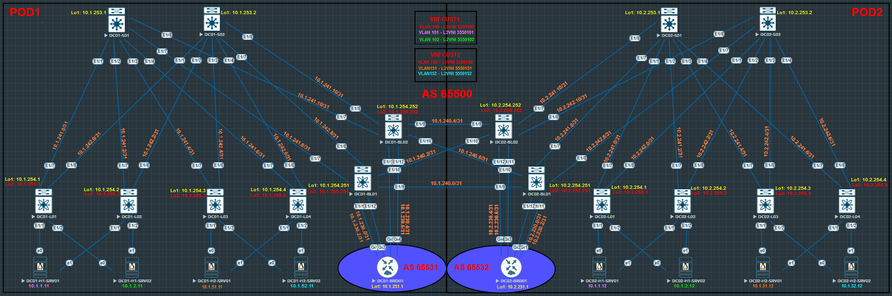

# Проектная работа
## Тема: "Построение фабрики VXLAN/EVPN для двух POD с использованием технологии Multi-Pod"

### **Цель:**

 - реализовать территориально распределённую сетевую инфраструктуру двух смежных холдингов в рамках двух ЦОД;
 - обеспеченить возможность миграции серверов как внутри, так и между локациями, без необходимости переконфигурирования сетевого стека;
 - обеспечить горизонтальное масштабирование сетевой инфраструктуры;
 - обеспечить отказоустойчое подключений серверов;
 - реализовать возможность маршрутизации между холдингами (для перимера взяты дае подсети для каждого).

### **План:**

 - разработка решения для построения отказоустойчивой и масштабируемой сетевой инфраструктуры;
 - проектирование адресного пространства Underlay и Overlay сетей;
 - построение топологии;
 - настройка коммутаторов и маршрутизаторов POD1;
 - настройка серверов POD1;
 - настройка коммутаторов и маршрутизаторов POD2;
 - настройка серверов POD2;
 - проверка работоспособности топологии.

### **Ход работы.**

1) **На устройствах выполнены следующие настройки (POD1-2):**
    
    - **Spines:**
        * p2p-адресация;
        * loopback1 -интерфейсы;
        * протокол IS-IS (из настроек убран BFD, т.к. с ним IS-IS не поднимается из-за ограничения виртуализации);
        * протокол iBGP (Route Reflector);
        * протокол BFD (из-за ограничений виртуализации сессии BFD не поднимаются).
    
    - **Leafs:**
        * p2p-адресация;
        * loopback1 интерфейсы;
        * loopback2 интерфейсы;
        * протокол IS-IS (из настроек убран BFD, т.к. с ним IS-IS не поднимается из-за ограничения виртуализации);
        * протокол iBGP;
        * протокол BFD (из-за ограничений виртуализации сессии BFD не поднимаются);
        * VLAN;
        * L2VNI;
        * VRF;
        * SVI;
        * L3VNI;
        * Anycast Gateway;
        * ESI LAG.
            
    - **Border Leafs** (для связи между POD'ами):
        * p2p-адресация;
        * loopback1 интерфейсы;
        * loopback2 интерфейсы;
        * протокол IS-IS (из настроек убран BFD, т.к. с ним IS-IS не поднимается из-за ограничения виртуализации);
        * протокол iBGP (Route Reflector);
        * протокол BFD (из-за ограничений виртуализации сессии BFD не поднимаются);
        * VLAN;
        * L2VNI;
        * VRF;
        * SVI;
        * L3VNI;
        * Anycast Gateway;
        * port-channel'ы в сторону пограничных маршрутизаторов;
        * протокол eBGP.

    - **Border Routers** (для маршрутизации между VRF'ами):
        * p2p-адресация;
        * loopback интерфейс;
        * port-channel'ы в сторону border leaf'ов;
        * протокол eBGP.

    - **Servers:**
        * агрегирование сетевых интерфейсов;
        * IP-адрес/маска;
        * шлюз по-умолчанию. 

2) **Адресное пространство.**

POD1

                                                                       
|    IP-подсеть      |      IP-адрес     |      Устройство     |     Интерфейс      |     Назначение     |     VLAN      |     VNI     |     VRF     |
|:------------------:|:-----------------:|:-------------------:|:------------------:|:------------------:|:-------------:|:-----------:|:-----------:|
| **10.1.230.0/31**  |         -         |          -          |         -          |         P2P        |       -       |      -      |      -      |
|                    |    10.1.230.0     |     DC01-BDR01      |      Po1.3001      |          -         |     3001      |      -      |      -      |
|                    |    10.1.230.1     |     DC01-BL01       |      Vlan3001      |          -         |     3001      |      -      |    CUST1    |
| **10.1.230.2/31**  |         -         |          -          |         -          |         P2P        |       -       |      -      |      -      |
|                    |    10.1.230.2     |     DC01-BDR01      |      Po1.3002      |          -         |     3002      |      -      |      -      |
|                    |    10.1.230.3     |     DC01-BL01       |      Vlan3002      |          -         |     3002      |      -      |    CUST1    |
| **10.1.230.4/31**  |         -         |          -          |         -          |         P2P        |       -       |      -      |      -      |
|                    |    10.1.230.4     |     DC01-BDR01      |      Po1.3003      |          -         |     3003      |      -      |      -      |
|                    |    10.1.230.5     |     DC01-BL02       |      Vlan3003      |          -         |     3003      |      -      |    CUST2    |
| **10.1.230.6/31**  |         -         |          -          |         -          |         P2P        |       -       |      -      |      -      |
|                    |    10.1.230.6     |     DC01-BDR01      |      Po1.3004      |          -         |     3004      |      -      |      -      |
|                    |    10.1.230.7     |     DC01-BL02       |      Vlan3004      |          -         |     3004      |      -      |    CUST2    |
| **10.1.240.0/31**  |         -         |          -          |         -          |         P2P        |       -       |      -      |      -      |
|                    |    10.1.240.0     |     DC01-BL01       |        E1/9        |          -         |       -       |      -      |      -      |
|                    |    10.1.240.1     |     DC02-BL01       |        E1/9        |          -         |       -       |      -      |      -      |
| **10.1.240.2/31**  |         -         |          -          |         -          |         P2P        |       -       |      -      |      -      |
|                    |    10.1.240.2     |     DC01-BL01       |        E1/10       |          -         |       -       |      -      |      -      |
|                    |    10.1.240.3     |     DC02-BL02       |        E1/10       |          -         |       -       |      -      |      -      |
| **10.1.240.4/31**  |         -         |          -          |         -          |         P2P        |       -       |      -      |      -      |
|                    |    10.1.240.4     |     DC01-BL02       |        E1/9        |          -         |       -       |      -      |      -      |
|                    |    10.1.240.5     |     DC02-BL02       |        E1/9        |          -         |       -       |      -      |      -      |
| **10.1.240.6/31**  |         -         |          -          |         -          |         P2P        |       -       |      -      |      -      |
|                    |    10.1.240.6     |     DC01-BL02       |        E1/10       |          -         |       -       |      -      |      -      |
|                    |    10.1.240.7     |     DC02-BL01       |        E1/10       |          -         |       -       |      -      |      -      |
| **10.1.241.0/31**  |         -         |          -          |          -         |         P2P        |       -       |      -      |      -      |
|                    |    10.1.241.0     |      DC01-S01       |        E1/1        |          -         |       -       |      -      |      -      |
|                    |    10.1.241.1     |      DC01-L01       |        E1/7        |          -         |       -       |      -      |      -      |
| **10.1.241.2/31**  |         -         |          -          |          -         |         P2P        |       -       |      -      |      -      |
|                    |    10.1.241.2     |      DC01-S01       |        E1/2        |          -         |       -       |      -      |      -      |
|                    |    10.1.241.3     |      DC01-L02       |        E1/7        |          -         |       -       |      -      |      -      |
| **10.1.241.4/31**  |         -         |          -          |          -         |         P2P        |       -       |      -      |      -      |
|                    |    10.1.241.4     |      DC01-S01       |        E1/3        |          -         |       -       |      -      |      -      |
|                    |    10.1.241.5     |      DC01-L03       |        E1/7        |          -         |       -       |      -      |      -      |
| **10.1.241.6/31**  |         -         |          -          |          -         |         P2P        |       -       |      -      |      -      |
|                    |    10.1.241.6     |      DC01-S01       |        E1/4        |          -         |       -       |      -      |      -      |
|                    |    10.1.241.7     |      DC01-L04       |        E1/7        |          -         |       -       |      -      |      -      |
| **10.1.241.8/31**  |         -         |          -          |          -         |         P2P        |       -       |      -      |      -      |
|                    |    10.1.241.8     |      DC01-S01       |        E1/7        |          -         |       -       |      -      |      -      |
|                    |    10.1.241.9     |      DC01-BL01      |        E1/7        |          -         |       -       |      -      |      -      |
| **10.1.241.10/31** |         -         |          -          |          -         |         P2P        |       -       |      -      |      -      |
|                    |    10.1.241.10    |      DC01-S01       |        E1/8        |          -         |       -       |      -      |      -      |
|                    |    10.1.241.11    |      DC01-BL02      |        E1/7        |          -         |       -       |      -      |      -      |
| **10.1.242.0/31**  |         -         |          -          |          -         |         P2P        |       -       |      -      |      -      |
|                    |    10.1.242.0     |      DC01-S02       |        E1/1        |          -         |       -       |      -      |      -      |
|                    |    10.1.242.1     |      DC01-L01       |        E1/8        |          -         |       -       |      -      |      -      |
| **10.1.242.2/31**  |         -         |          -          |          -         |         P2P        |       -       |      -      |      -      |
|                    |    10.1.242.2     |      DC01-S02       |        E1/2        |          -         |       -       |      -      |      -      |
|                    |    10.1.242.3     |      DC01-L02       |        E1/8        |          -         |       -       |      -      |      -      |
| **10.1.242.4/31**  |         -         |          -          |          -         |         P2P        |       -       |      -      |      -      |
|                    |    10.1.242.4     |      DC01-S02       |        E1/3        |          -         |       -       |      -      |      -      |
|                    |    10.1.242.5     |      DC01-L03       |        E1/8        |          -         |       -       |      -      |      -      |
| **10.1.242.6/31**  |         -         |          -          |          -         |         P2P        |       -       |      -      |      -      |
|                    |    10.1.242.6     |      DC01-S02       |        E1/4        |          -         |       -       |      -      |      -      |
|                    |    10.1.242.7     |      DC01-L04       |        E1/8        |          -         |       -       |      -      |      -      |
| **10.1.242.8/31**  |         -         |          -          |          -         |         P2P        |       -       |      -      |      -      |
|                    |    10.1.242.8     |      DC01-S02       |        E1/7        |          -         |       -       |      -      |      -      |
|                    |    10.1.242.9     |      DC01-BL01      |        E1/8        |          -         |       -       |      -      |      -      |
| **10.1.242.10/31** |         -         |          -          |          -         |         P2P        |       -       |      -      |      -      |
|                    |    10.1.242.10    |      DC01-S02       |        E1/8        |          -         |       -       |      -      |      -      |
|                    |    10.1.242.11    |      DC01-BL02      |        E1/8        |          -         |       -       |      -      |      -      |
| **10.1.251.1/32**  |         -         |          -          |         -          |       Loopback     |       -       |      -      |      -      |
|                    |    10.1.251.1     |     DC01-BRD01      |        Lo0         |          -         |       -       |      -      |      -      |
| **10.1.253.1/32**  |         -         |          -          |         -          |       Loopback     |       -       |      -      |      -      |
|                    |    10.1.253.1     |      DC01-S01       |        Lo1         |          -         |       -       |      -      |      -      |
| **10.1.253.2/32**  |         -         |          -          |         -          |       Loopback     |       -       |      -      |      -      |
|                    |    10.1.253.2     |      DC01-S02       |        Lo1         |          -         |       -       |      -      |      -      |
| **10.1.254.1/32**  |         -         |          -          |         -          |       Loopback     |       -       |      -      |      -      |
|                    |    10.1.254.1     |      DC01-L01       |        Lo1         |          -         |       -       |      -      |      -      |
| **10.1.254.2/32**  |         -         |          -          |         -          |       Loopback     |       -       |      -      |      -      |
|                    |    10.1.254.2     |      DC01-L02       |        Lo1         |          -         |       -       |      -      |      -      |
| **10.1.254.3/32**  |         -         |          -          |         -          |       Loopback     |       -       |      -      |      -      |
|                    |    10.1.254.3     |      DC01-L03       |        Lo1         |          -         |       -       |      -      |      -      |
| **10.1.254.4/32**  |         -         |          -          |         -          |       Loopback     |       -       |      -      |      -      |
|                    |    10.1.254.4     |      DC01-L04       |        Lo1         |          -         |       -       |      -      |      -      |
| **10.1.254.251/32**|         -         |          -          |         -          |       Loopback     |       -       |      -      |      -      |
|                    |    10.1.254.251   |      DC01-BL01      |        Lo1         |          -         |       -       |      -      |      -      |
| **10.1.254.252/32**|         -         |          -          |         -          |       Loopback     |       -       |      -      |      -      |
|                    |    10.1.254.252   |      DC01-BL02      |        Lo1         |          -         |       -       |      -      |      -      |
| **10.1.255.1/32**  |         -         |          -          |         -          |       Loopback     |       -       |      -      |      -      |
|                    |    10.1.255.1     |      DC01-L01       |        Lo2         |          -         |       -       |      -      |      -      |
| **10.1.255.2/32**  |         -         |          -          |         -          |       Loopback     |       -       |      -      |      -      |
|                    |    10.1.255.2     |      DC01-L02       |        Lo2         |          -         |       -       |      -      |      -      |
| **10.1.255.3/32**  |         -         |          -          |         -          |       Loopback     |       -       |      -      |      -      |
|                    |    10.1.255.3     |      DC01-L03       |        Lo2         |          -         |       -       |      -      |      -      |
| **10.1.255.4/32**  |         -         |          -          |         -          |       Loopback     |       -       |      -      |      -      |
|                    |    10.1.255.4     |      DC01-L04       |        Lo2         |          -         |       -       |      -      |      -      |
| **10.1.255.251/32**|         -         |          -          |         -          |       Loopback     |       -       |      -      |      -      |
|                    |    10.1.255.251   |      DC01-BL01      |        Lo2         |          -         |       -       |      -      |      -      |
| **10.1.255.252/32**|         -         |          -          |         -          |       Loopback     |       -       |      -      |      -      |
|                    |    10.1.255.252   |      DC01-BL02      |        Lo2         |          -         |       -       |      -      |      -      |
|          -         |         -         |          -          |         -          |          -         |       -       |      -      |      -      |
|          -         |         -         | DC01-L01-04,BL01-02 |         -          |        L3VNI       |      100      |   5550100   |    CUST1    |
|          -         |         -         |          -          |         -          |          -         |       -       |      -      |      -      |
|          -         |         -         |          -          |         -          |          -         |       -       |      -      |      -      |
|          -         |         -         | DC01-L01-04,BL01-02 |         -          |        L3VNI       |      150      |   5550150   |    CUST2    |
|          -         |         -         |          -          |         -          |          -         |       -       |      -      |
|  **10.1.1.0/24**   |         -         |          -          |         -          |       Network      |      101      |   5550101   |      -      |
|                    |    10.1.1.1       | DC01-L01-04,BL01-02 |      Vlan101       |       Gateway      |       -       |      -      |    CUST1    |
|                    |    10.1.1.11      |    DC01-H1-SRV01    |    e0-e1(bond0)    |          -         |       -       |      -      |      -      |
|  **10.1.2.0/24**   |         -         |          -          |         -          |       Network      |      102      |   5550102   |      -      |
|                    |    10.1.2.1       | DC01-L01-04,BL01-02 |      Vlan102       |       Gateway      |       -       |      -      |    CUST1    |
|                    |    10.1.2.11      |    DC01-H1-SRV02    |    e0-e1(bond0)    |          -         |       -       |      -      |      -      |
| **10.1.51.0/24**   |         -         |          -          |         -          |       Network      |      151      |   5550151   |      -      |
|                    |    10.1.51.1      | DC01-L01-04,BL01-02 |      Vlan151       |       Gateway      |       -       |      -      |    CUST2    |
|                    |    10.1.51.11     |    DC01-H2-SRV01    |    e0-e1(bond0)    |          -         |       -       |      -      |      -      |
| **10.1.52.0/24**   |         -         |          -          |         -          |       Network      |      152      |   5550152   |      -      |
|                    |    10.1.52.1      | DC01-L01-04,BL01-02 |      Vlan152       |       Gateway      |       -       |      -      |    CUST2    |
|                    |    10.1.52.11     |    DC01-H2-SRV02    |    e0-e1(bond0)    |          -         |       -       |      -      |      -      |

POD2

                                                                       
|    IP-подсеть      |      IP-адрес     |      Устройство     |     Интерфейс      |     Назначение     |     VLAN      |     VNI     |     VRF     |
|:------------------:|:-----------------:|:-------------------:|:------------------:|:------------------:|:-------------:|:-----------:|:-----------:|
| **10.2.230.0/31**  |         -         |          -          |         -          |         P2P        |       -       |      -      |      -      |
|                    |    10.2.230.0     |     DC02-BDR01      |      Po1.3005      |          -         |     3005      |      -      |      -      |
|                    |    10.2.230.1     |     DC02-BL01       |      Vlan3005      |          -         |     3005      |      -      |    CUST1    |
| **10.2.230.2/31**  |         -         |          -          |         -          |         P2P        |       -       |      -      |      -      |
|                    |    10.2.230.2     |     DC02-BDR01      |      Po1.3006      |          -         |     3006      |      -      |      -      |
|                    |    10.2.230.3     |     DC02-BL01       |      Vlan3006      |          -         |     3006      |      -      |    CUST1    |
| **10.2.230.4/31**  |         -         |          -          |         -          |         P2P        |       -       |      -      |      -      |
|                    |    10.2.230.4     |     DC02-BDR01      |      Po1.3007      |          -         |     3007      |      -      |      -      |
|                    |    10.2.230.5     |     DC02-BL02       |      Vlan3007      |          -         |     3007      |      -      |    CUST2    |
| **10.2.230.6/31**  |         -         |          -          |         -          |         P2P        |       -       |      -      |      -      |
|                    |    10.2.230.6     |     DC02-BDR01      |      Po1.3008      |          -         |     3008      |      -      |      -      |
|                    |    10.2.230.7     |     DC02-BL02       |      Vlan3008      |          -         |     3008      |      -      |    CUST2    |
| **10.1.240.0/31**  |         -         |          -          |         -          |         P2P        |       -       |      -      |      -      |
|                    |    10.1.240.0     |     DC01-BL01       |        E1/9        |          -         |       -       |      -      |      -      |
|                    |    10.1.240.1     |     DC02-BL01       |        E1/9        |          -         |       -       |      -      |      -      |
| **10.1.240.2/31**  |         -         |          -          |         -          |         P2P        |       -       |      -      |      -      |
|                    |    10.1.240.2     |     DC01-BL01       |        E1/10       |          -         |       -       |      -      |      -      |
|                    |    10.1.240.3     |     DC02-BL02       |        E1/10       |          -         |       -       |      -      |      -      |
| **10.1.240.4/31**  |         -         |          -          |         -          |         P2P        |       -       |      -      |      -      |
|                    |    10.1.240.4     |     DC01-BL02       |        E1/9        |          -         |       -       |      -      |      -      |
|                    |    10.1.240.5     |     DC02-BL02       |        E1/9        |          -         |       -       |      -      |      -      |
| **10.1.240.6/31**  |         -         |          -          |         -          |         P2P        |       -       |      -      |      -      |
|                    |    10.1.240.6     |     DC01-BL02       |        E1/10       |          -         |       -       |      -      |      -      |
|                    |    10.1.240.7     |     DC02-BL01       |        E1/10       |          -         |       -       |      -      |      -      |
| **10.2.241.0/31**  |         -         |          -          |          -         |         P2P        |       -       |      -      |      -      |
|                    |    10.2.241.0     |      DC02-S01       |        E1/1        |          -         |       -       |      -      |      -      |
|                    |    10.2.241.1     |      DC02-L01       |        E1/7        |          -         |       -       |      -      |      -      |
| **10.2.241.2/31**  |         -         |          -          |          -         |         P2P        |       -       |      -      |      -      |
|                    |    10.2.241.2     |      DC02-S01       |        E1/2        |          -         |       -       |      -      |      -      |
|                    |    10.2.241.3     |      DC02-L02       |        E1/7        |          -         |       -       |      -      |      -      |
| **10.2.241.4/31**  |         -         |          -          |          -         |         P2P        |       -       |      -      |      -      |
|                    |    10.2.241.4     |      DC02-S01       |        E1/3        |          -         |       -       |      -      |      -      |
|                    |    10.2.241.5     |      DC02-L03       |        E1/7        |          -         |       -       |      -      |      -      |
| **10.2.241.6/31**  |         -         |          -          |          -         |         P2P        |       -       |      -      |      -      |
|                    |    10.2.241.6     |      DC02-S01       |        E1/4        |          -         |       -       |      -      |      -      |
|                    |    10.2.241.7     |      DC02-L04       |        E1/7        |          -         |       -       |      -      |      -      |
| **10.2.241.8/31**  |         -         |          -          |          -         |         P2P        |       -       |      -      |      -      |
|                    |    10.2.241.8     |      DC02-S01       |        E1/7        |          -         |       -       |      -      |      -      |
|                    |    10.2.241.9     |      DC02-BL01      |        E1/7        |          -         |       -       |      -      |      -      |
| **10.2.241.10/31** |         -         |          -          |          -         |         P2P        |       -       |      -      |      -      |
|                    |    10.2.241.10    |      DC02-S01       |        E1/8        |          -         |       -       |      -      |      -      |
|                    |    10.2.241.11    |      DC02-BL02      |        E1/7        |          -         |       -       |      -      |      -      |
| **10.2.242.0/31**  |         -         |          -          |          -         |         P2P        |       -       |      -      |      -      |
|                    |    10.2.242.0     |      DC02-S02       |        E1/1        |          -         |       -       |      -      |      -      |
|                    |    10.2.242.1     |      DC02-L01       |        E1/8        |          -         |       -       |      -      |      -      |
| **10.2.242.2/31**  |         -         |          -          |          -         |         P2P        |       -       |      -      |      -      |
|                    |    10.2.242.2     |      DC02-S02       |        E1/2        |          -         |       -       |      -      |      -      |
|                    |    10.2.242.3     |      DC02-L02       |        E1/8        |          -         |       -       |      -      |      -      |
| **10.2.242.4/31**  |         -         |          -          |          -         |         P2P        |       -       |      -      |      -      |
|                    |    10.2.242.4     |      DC02-S02       |        E1/3        |          -         |       -       |      -      |      -      |
|                    |    10.2.242.5     |      DC02-L03       |        E1/8        |          -         |       -       |      -      |      -      |
| **10.2.242.6/31**  |         -         |          -          |          -         |         P2P        |       -       |      -      |      -      |
|                    |    10.2.242.6     |      DC02-S02       |        E1/4        |          -         |       -       |      -      |      -      |
|                    |    10.2.242.7     |      DC02-L04       |        E1/8        |          -         |       -       |      -      |      -      |
| **10.2.242.8/31**  |         -         |          -          |          -         |         P2P        |       -       |      -      |      -      |
|                    |    10.2.242.8     |      DC02-S02       |        E1/7        |          -         |       -       |      -      |      -      |
|                    |    10.2.242.9     |      DC02-BL01      |        E1/8        |          -         |       -       |      -      |      -      |
| **10.2.242.10/31** |         -         |          -          |          -         |         P2P        |       -       |      -      |      -      |
|                    |    10.2.242.10    |      DC02-S02       |        E1/8        |          -         |       -       |      -      |      -      |
|                    |    10.2.242.11    |      DC02-BL02      |        E1/8        |          -         |       -       |      -      |      -      |
| **10.2.251.1/32**  |         -         |          -          |         -          |       Loopback     |       -       |      -      |      -      |
|                    |    10.2.251.1     |     DC02-BRD01      |        Lo0         |          -         |       -       |      -      |      -      |
| **10.2.253.1/32**  |         -         |          -          |         -          |       Loopback     |       -       |      -      |      -      |
|                    |    10.2.253.1     |      DC02-S01       |        Lo1         |          -         |       -       |      -      |      -      |
| **10.2.253.2/32**  |         -         |          -          |         -          |       Loopback     |       -       |      -      |      -      |
|                    |    10.2.253.2     |      DC02-S02       |        Lo1         |          -         |       -       |      -      |      -      |
| **10.2.254.1/32**  |         -         |          -          |         -          |       Loopback     |       -       |      -      |      -      |
|                    |    10.2.254.1     |      DC02-L01       |        Lo1         |          -         |       -       |      -      |      -      |
| **10.2.254.2/32**  |         -         |          -          |         -          |       Loopback     |       -       |      -      |      -      |
|                    |    10.2.254.2     |      DC02-L02       |        Lo1         |          -         |       -       |      -      |      -      |
| **10.2.254.3/32**  |         -         |          -          |         -          |       Loopback     |       -       |      -      |      -      |
|                    |    10.2.254.3     |      DC02-L03       |        Lo1         |          -         |       -       |      -      |      -      |
| **10.2.254.4/32**  |         -         |          -          |         -          |       Loopback     |       -       |      -      |      -      |
|                    |    10.2.254.4     |      DC02-L04       |        Lo1         |          -         |       -       |      -      |      -      |
| **10.2.254.251/32**|         -         |          -          |         -          |       Loopback     |       -       |      -      |      -      |
|                    |    10.2.254.251   |      DC02-BL01      |        Lo1         |          -         |       -       |      -      |      -      |
| **10.2.254.252/32**|         -         |          -          |         -          |       Loopback     |       -       |      -      |      -      |
|                    |    10.2.254.252   |      DC02-BL02      |        Lo1         |          -         |       -       |      -      |      -      |
| **10.2.255.1/32**  |         -         |          -          |         -          |       Loopback     |       -       |      -      |      -      |
|                    |    10.2.255.1     |      DC02-L01       |        Lo2         |          -         |       -       |      -      |      -      |
| **10.2.255.2/32**  |         -         |          -          |         -          |       Loopback     |       -       |      -      |      -      |
|                    |    10.2.255.2     |      DC02-L02       |        Lo2         |          -         |       -       |      -      |      -      |
| **10.2.255.3/32**  |         -         |          -          |         -          |       Loopback     |       -       |      -      |      -      |
|                    |    10.2.255.3     |      DC02-L03       |        Lo2         |          -         |       -       |      -      |      -      |
| **10.2.255.4/32**  |         -         |          -          |         -          |       Loopback     |       -       |      -      |      -      |
|                    |    10.2.255.4     |      DC02-L04       |        Lo2         |          -         |       -       |      -      |      -      |
| **10.2.255.251/32**|         -         |          -          |         -          |       Loopback     |       -       |      -      |      -      |
|                    |    10.2.255.251   |      DC02-BL01      |        Lo2         |          -         |       -       |      -      |      -      |
| **10.2.255.252/32**|         -         |          -          |         -          |       Loopback     |       -       |      -      |      -      |
|                    |    10.2.255.252   |      DC02-BL02      |        Lo2         |          -         |       -       |      -      |      -      |
|          -         |         -         |          -          |         -          |          -         |       -       |      -      |      -      |
|          -         |         -         | DC02-L01-04,BL01-02 |         -          |        L3VNI       |      100      |   5550100   |    CUST1    |
|          -         |         -         |          -          |         -          |          -         |       -       |      -      |      -      |
|          -         |         -         |          -          |         -          |          -         |       -       |      -      |      -      |
|          -         |         -         | DC02-L01-04,BL01-02 |         -          |        L3VNI       |      150      |   5550150   |    CUST2    |
|          -         |         -         |          -          |         -          |          -         |       -       |      -      |
|  **10.1.1.0/24**   |         -         |          -          |         -          |       Network      |      101      |   5550101   |      -      |
|                    |    10.1.1.1       | DC02-L01-04,BL01-02 |      Vlan101       |       Gateway      |       -       |      -      |    CUST1    |
|                    |    10.1.1.12      |    DC02H1-SRV01     |    e0-e1(bond0)    |          -         |       -       |      -      |      -      |
|  **10.1.2.0/24**   |         -         |          -          |         -          |       Network      |      102      |   5550102   |      -      |
|                    |    10.1.2.1       | DC02-L01-04,BL01-02 |      Vlan102       |       Gateway      |       -       |      -      |    CUST1    |
|                    |    10.1.2.12      |    DC02-H1-SRV02    |    e0-e1(bond0)    |          -         |       -       |      -      |      -      |
| **10.1.51.0/24**   |         -         |          -          |         -          |       Network      |      151      |   5550151   |      -      |
|                    |    10.1.51.1      | DC02-L01-04,BL01-02 |      Vlan151       |       Gateway      |       -       |      -      |    CUST2    |
|                    |    10.1.51.12     |    DC02-H2-SRV01    |    e0-e1(bond0)    |          -         |       -       |      -      |      -      |
| **10.1.52.0/24**   |         -         |          -          |         -          |       Network      |      152      |   5550152   |      -      |
|                    |    10.1.52.1      | DC02-L01-04,BL01-02 |      Vlan152       |       Gateway      |       -       |      -      |    CUST2    |
|                    |    10.1.52.12     |    DC02-H2-SRV02    |    e0-e1(bond0)    |          -         |       -       |      -      |      -      |

3) **Топология сети:**

4) **Конфигурация устройств:**

|               **POD1**                |                **POD2**               |
|:-------------------------------------:|:-------------------------------------:|
| [DC01-L01](configs/DC01-L01.conf)     | [DC02-L01](configs/DC02-L01.conf)     |
| [DC01-L02](configs/DC01-L02.conf)     | [DC02-L02](configs/DC02-L02.conf)     |
| [DC01-L03](configs/DC01-L03.conf)     | [DC02-L03](configs/DC02-L03.conf)     | 
| [DC01-L04](configs/DC01-L04.conf )    | [DC02-L04](configs/DC02-L04.conf)     |
| [DC01-BL01](configs/DC01-BL01.conf)   | [DC02-BL01](configs/DC02-BL01.conf)   | 
| [DC01-BL02](configs/DC01-BL02.conf)   | [DC02-BL02](configs/DC02-BL02.conf)   | 
| [DC01-S01](configs/DC01-S01.conf)     | [DC02-S01](configs/DC02-S01.conf)     |
| [DC01-S02](configs/DC01-S02.conf)     | [DC02-S02](configs/DC02-S02.conf)     |
| [DC01-BRD01](configs/DC01-BRD01.conf) | [DC02-BRD01](configs/DC02-BRD01.conf) |