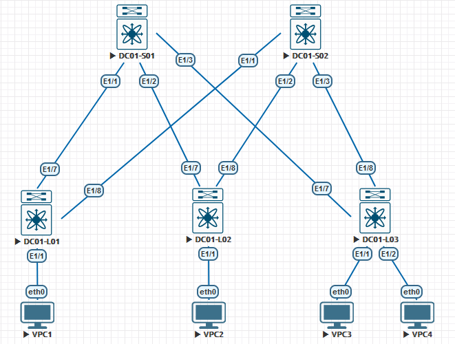

## **Проектирование адресного пространства**

### **Цель:**

  * cобрать схему CLOS;
  * распределить адресное пространство.

1. Схема CLOS:

2. Адресное пространство:

| Подсеть/диапазон |               Назначение             |            Примечание             |
| -----------------|:------------------------------------:| :--------------------------------:|
| 10.1.0.0/16      | Суммаризированная подсеть DC №1      |  10.x.0.0/16, где x - номер DC    |
| 10.1.0.0/17      | Сервисы                              |                                   |
| 10.1.128.0/20    | Управление гипервизорами             |                                   |
| 10.1.144.0/20    | IPMI                                 |                                   | 