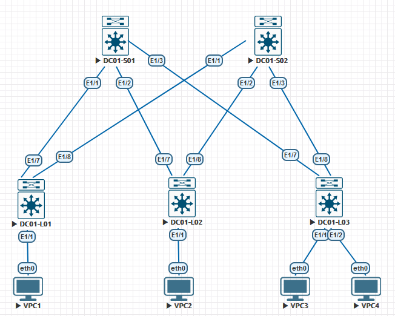

## **Проектирование адресного пространства**

### **Цель:**

  * cобрать схему CLOS;
  * распределить адресное пространство.

1. Схема CLOS:

2. Адресное пространство:

| IP-подсеть/IP-диапазон    |               Назначение               |                                       Примечание                                 |
|:-------------------------:|:--------------------------------------:|:--------------------------------------------------------------------------------:|
| **10.1.0.0/16**           | Суммаризированная подсеть DC №1        |  10.x.0.0/16, где x - номер DC                                                   |
| 10.1.0.0/17               | Сервисы                                |                                                                                  |
| 10.1.128.0/20             | Гипервизоры                            |                                                                                  |
| 10.1.144.0/20             | IPMI                                   |                                                                                  |
| 10.1.160.1 - 10.1.223.254 | Резерв                                 |                                                                                  |
| 10.1.224.0/24             | Управление сетевыми устройствами (OOB) |                                                                                  |
| 10.1.225.1 - 10.1.230.254 | Резерв                                 |                                                                                  |
| 10.1.231.0/24             | Резерв для P2P SuperSpines - Spines    | Разбита на /31, 10.1.23x.y/31, где x - номер SuperSpine, y - значение по порядку |
| 10.1.232.0/24             | Резерв для P2P SuperSpine2 - Spines    | Разбита на /31, 10.1.23x.y/31, где x - номер SuperSpine, y - значение по порядку |
| 10.1.233.1 - 10.1.240.254 | Резерв                                 |                                                                                  |
| 10.1.241.0/24             | P2P Spine1 - Leafs                     | Разбита на /31, 10.1.24x.y/31, где x - номер Spine, y - значение по порядку      |
| 10.1.242.0/24             | P2P Spine2 - Leafs                     | Разбита на /31, 10.1.24x.0/31, где x - номер Spine, y - значение по порядку      |
| 10.1.243.1 - 10.1.251.254 | Резерв                                 |                                                                                  |
| **10.1.252.0/22**         | Loopback                               |                                                                                  |
| 10.1.252.0/24             | Резер для Loopback1 SuperSpines        | Разбита на /32, 10.1.252.x/32, где x - номер SuperSpine                          |
| 10.1.253.0/24             | Loopback1 Spines                       | Разбита на /32, 10.1.253.x/32, где x - номер Spine                               |
| 10.1.254.0/24             | Loopback1 Leafs                        | Разбита на /32, 10.1.254.x/32, где x - номер Leaf                                |
| 10.1.255.0/24             | Loopback2 Leafs                        | Разбита на /32, 10.1.255.x/32, где x - номер Leaf                                |
